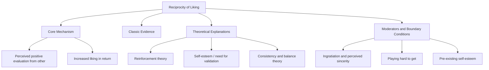
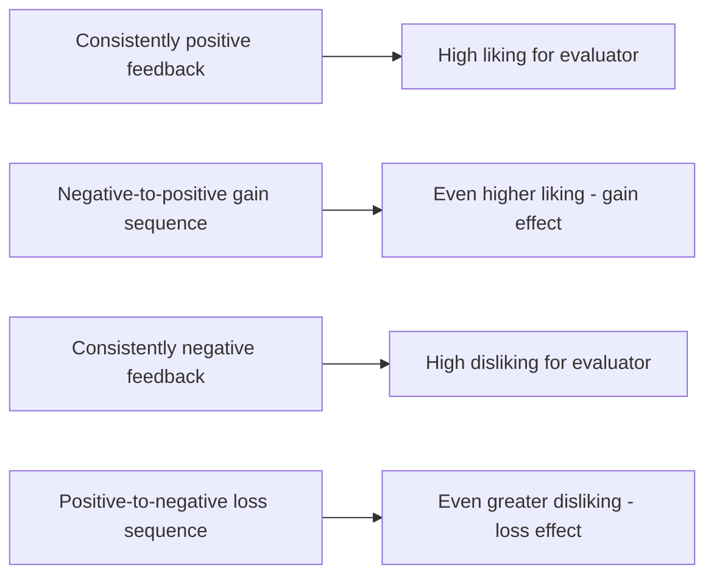

## Reciprocity of Liking

### Overview

Reciprocity of liking refers to the well-documented tendency for people to like others who indicate that they like them. This principle operates as one of the more consistently supported determinants of interpersonal attraction: knowing (or believing) that another person likes, admires, or approves of us tends to generate positive feelings toward that person in return, largely independent of that person's other qualities.

### Definition and Core Mechanism

**Definition**

Reciprocity of liking (also called the **reciprocal liking effect** or **reciprocity of attraction**) is the principle that people tend to develop positive feelings toward others who they believe hold positive feelings toward them. Learning that someone likes us functions as a powerful and largely automatic driver of liking that person back.

**Key Points**

- The effect operates through a fairly direct mechanism: perceiving positive evaluation from another person satisfies fundamental needs for social approval and validation, and the resulting positive affect becomes associated with the source of that approval.
- Unlike similarity or proximity, which operate somewhat indirectly (by increasing ease of interaction or validating one's worldview), reciprocity of liking is a more direct interpersonal signal — an explicit or implicit message of "I like you" — that tends to produce a comparatively strong and rapid attraction response.
- The effect applies both to **explicit** expressions of liking (a direct compliment or statement of interest) and to more **subtle nonverbal cues** (increased eye contact, smiling, attentive listening, mirroring body language).

### Classic and Foundational Evidence

**Key Points**

- Early experimental work on reciprocity of liking (e.g., studies building on Aronson and Linder's research in the 1960s) manipulated whether participants received positive, negative, or mixed evaluative feedback from a confederate or experimental partner and then measured the participant's liking for that person.
- **General finding:** Participants who received positive evaluations consistently reported higher liking for the evaluator than participants who received negative evaluations, establishing a basic reciprocity effect.
- **Gain-loss effect (Aronson & Linder, 1965):** A particularly influential refinement found that liking is not simply a function of the total amount of positive feedback received, but also of the **pattern** of feedback over time.
  - Evaluations that shifted from initially negative to increasingly positive (a "gain" sequence) produced **more** liking for the evaluator than evaluations that were consistently positive throughout.
  - Evaluations that shifted from initially positive to increasingly negative (a "loss" sequence) produced **more** disliking than evaluations that were consistently negative throughout.
  - [Inference] The gain-loss effect is a well-cited finding within this specific research tradition, though its replication robustness and the precise conditions under which the "gain" pattern out-performs consistent positivity have been discussed and qualified in some subsequent commentary, so it is best treated as an influential refinement of the basic reciprocity effect rather than an unconditionally guaranteed pattern in every context.

### Theoretical Explanations

**Key Points**

**1. Reinforcement-Affect Model**

- Consistent with Byrne's broader reinforcement-affect framework used to explain similarity-attraction effects, receiving positive evaluation is directly rewarding, and this reward becomes associated (via classical conditioning) with the person providing it, producing liking.

**2. Need for Self-Esteem and Validation**

- Being liked by another person serves a basic self-esteem and validation need; positive regard from others contributes to a person's sense of social worth and acceptance, making the source of that regard more attractive.
- [Inference] This explanation connects reciprocity of liking to broader sociometer theory (Leary and colleagues), which proposes that self-esteem functions psychologically as a gauge of one's perceived relational value to others — being liked raises this gauge, producing positive affect that becomes associated with the liker. This is a widely referenced theoretical connection in the literature rather than a claim that sociometer theory was originally developed specifically to explain reciprocity of liking.

**3. Balance and Consistency Theory**

- Heider's balance theory offers a cognitive-consistency-based explanation: if Person A believes Person B likes them, a state of psychological "imbalance" or discomfort can arise if Person A does not also like Person B; reciprocating liking restores cognitive balance in the perceived relationship structure.

**4. Uncertainty Reduction**

- Learning that another person likes us reduces uncertainty about how an interaction or potential relationship will unfold, making approach and further interaction feel psychologically safer and less risky — an explanation that connects reciprocity effects to broader uncertainty-reduction theories of relationship development.

### Moderators and Boundary Conditions

**Key Points**

**1. Perceived Sincerity and Ingratiation**

- The reciprocity of liking effect is substantially weakened, or can even reverse, when the positive evaluation is perceived as **insincere flattery** or **strategic ingratiation** (e.g., when the evaluator is suspected of having an ulterior motive, such as wanting a favor).
- [Inference] Research on ingratiation (e.g., work building on Edward Jones's ingratiation theory) suggests that when a target attributes praise to a manipulative or self-serving motive rather than genuine positive regard, the expected liking-boost from the compliment is diminished or eliminated, since the praise is no longer processed as a credible signal of authentic positive evaluation.

**2. Pre-Existing Self-Esteem**

- [Inference] Some research suggests that individuals with lower pre-existing self-esteem may show a stronger reciprocity-of-liking response to positive feedback (since the validation is more needed/salient), while individuals with high self-esteem may show comparatively more modest reactivity to a single instance of positive feedback, though findings on this specific self-esteem moderation are less uniformly consistent across studies than the basic reciprocity effect itself.

**3. "Playing Hard to Get" and Selectivity**

- Popular belief holds that appearing selectively interested (rather than uniformly liking everyone) increases one's own desirability — the "hard to get" phenomenon.
- [Inference] Experimental research on this specific idea (e.g., work following up on Walster and colleagues' original hard-to-get studies) has found mixed and generally weaker support than popular belief would suggest; some studies find that a person perceived as **selectively** interested in the specific target (liking this particular person while being comparatively harder to get with others in general) is more attractive than someone perceived as either uniformly easy or uniformly hard to get — suggesting selectivity toward the specific target, rather than generalized aloofness, may be the more relevant underlying factor, though this remains a more nuanced and less definitively settled area than the basic reciprocity-of-liking finding.

**4. Baseline Relationship Context**

- Reciprocity of liking effects tend to be most powerful in the early stages of relationship formation, when little other information is available; in established relationships, actual behavior and relationship history carry more weight than a single expression of liking or approval.

### Reciprocity of Liking vs. Related Constructs

| Construct | Core Distinction from Reciprocity of Liking |
| --- | --- |
| **Norm of reciprocity** (prosocial behavior) | Concerns returning favors/help; reciprocity of liking concerns returning positive *affect/evaluation*, not material exchange |
| **Similarity-attraction** | Similarity is inferred from shared attitudes; reciprocity of liking is a direct signal of the other's evaluation of *oneself* specifically |
| **Ingratiation** | Ingratiation is the deliberate strategic *attempt* to produce reciprocal liking; reciprocity of liking is the (often genuine) psychological *effect* that can result from sincere or perceived-sincere positive regard |
| **Self-fulfilling prophecy (attractiveness halo)** | Concerns behavior change from being perceived a certain way; reciprocity of liking concerns direct affective response to being liked |

### Practical Example

**Example**

Two coworkers meet for the first time at a work event. One coworker mentions, in an offhand and seemingly genuine way, that they had heard good things about the other's work and were looking forward to meeting them. All else being equal, the coworker who received this positive, apparently sincere remark is likely to develop warmer feelings toward the person who made it than toward a third coworker who made no such remark — illustrating reciprocity of liking operating from a brief, low-cost verbal signal of positive regard.

### Real-World and Applied Contexts

- **Sales and negotiation:** Reciprocity of liking (along with the related norm of reciprocity in exchange) is one of the mechanisms underlying Robert Cialdini's broader principles of persuasion, where genuine or apparent liking expressed toward a customer or negotiation counterpart can increase the counterpart's receptiveness and cooperation.
- **Networking and professional relationship-building:** Common professional advice to express genuine interest in and appreciation for colleagues or contacts draws directly on the reciprocity-of-liking principle, though its effectiveness depends heavily on perceived sincerity (per the ingratiation boundary condition above).
- **Online dating and early relationship formation:** [Inference] Some research and applied dating-industry commentary has linked expressed early interest (e.g., a match indicating strong interest via message or platform signal) to increased reciprocal interest from the recipient, consistent with the broader reciprocity-of-liking principle, though rigorous experimental isolation of this effect specifically within modern digital dating platforms (versus confounding factors like profile attractiveness or compatibility) is a less mature research base than the classic laboratory findings.
- **Therapeutic and counseling relationships:** Understanding reciprocity of liking has informed discussions of rapport-building in therapeutic and helping-profession relationships, where genuine expressions of positive regard (distinct from manipulative flattery) are considered supportive of a strong working alliance.
- **Customer service and hospitality training:** Training programs in hospitality and customer-facing roles often emphasize genuine warmth and personalized positive attention toward customers, drawing (at least implicitly) on the reciprocity-of-liking principle to improve customer satisfaction and loyalty.

### Summary Table

| Aspect | Description |
| --- | --- |
| Core principle | People tend to like those who like them |
| Key refinement | Gain-loss effect — increasing positive feedback over time can boost liking beyond consistently positive feedback |
| Key theorists | Aronson & Linder (gain-loss); Byrne (reinforcement-affect); Heider (balance theory) |
| Primary weakening condition | Perceived insincerity or ingratiation motive |
| "Hard to get" nuance | Selectivity toward the specific target may matter more than general aloofness |
| Strongest domain of effect | Early-stage relationship formation with limited other information |

**Related Topics**

- Proximity and the mere exposure effect
- Similarity and the matching hypothesis
- Physical attractiveness and the halo effect
- Norm of reciprocity and social responsibility norm (prosocial behavior)
- Heider's balance theory
- Sociometer theory (Leary)
- Ingratiation theory (Edward Jones)
- Self-disclosure and relationship escalation
- Cialdini's principles of persuasion