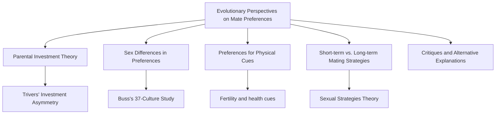
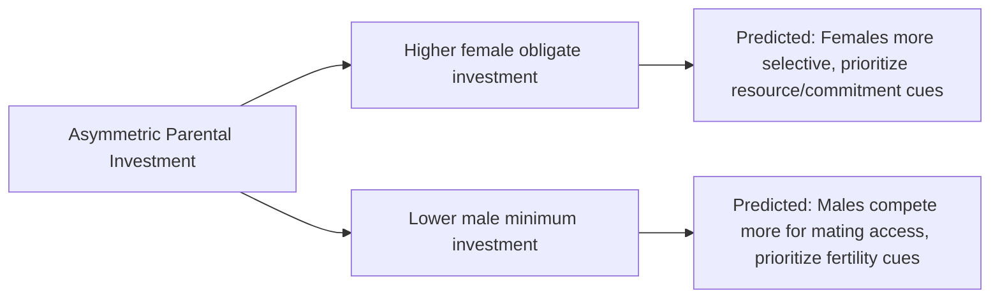

## Evolutionary Perspectives on Mate Preferences

### Overview

Evolutionary perspectives on mate preferences apply principles of evolutionary theory — particularly **sexual selection** and **parental investment theory** — to explain patterns in human romantic attraction and partner choice. Rather than treating attraction as arbitrary or purely culturally determined, this framework proposes that many mate preferences reflect psychological adaptations shaped by ancestral selection pressures related to reproductive success and offspring survival.

### Foundational Theory: Parental Investment

**Key Points**

- The theoretical foundation for evolutionary mate-preference research is **Robert Trivers's parental investment theory (1972)**, which proposes that the sex investing more in offspring (in terms of time, energy, and resources required for reproduction) will be more selective in choosing mates, while the sex investing less will compete more intensely for access to mates.
- In humans, **female obligate parental investment** is substantially higher than male minimum investment: pregnancy, childbirth, and (ancestrally) lactation represent a large, biologically mandatory female investment, whereas the minimum male biological investment can be limited to the act of conception.
- [Inference] This asymmetry is proposed by evolutionary psychologists as the foundational driver of a range of predicted sex-differentiated mate preferences discussed below; it is important to note this is a *theoretical starting premise* from which specific empirical predictions are derived and tested, not itself a directly observable psychological mechanism.

### Buss's Cross-Cultural Mate Preference Research

**Classic Study — David Buss (1989), 37-Culture Study**

- **Setup:** Surveyed over 10,000 participants across 37 cultures/countries on six continents regarding their preferences for various mate characteristics (resources, ambition, physical attractiveness, chastity, age, etc.).
- **Key reported findings:**
  - Women across most of the sampled cultures rated **financial resources/earning capacity** and **ambition/industriousness** as more important in a potential mate than men did.
  - Men across most of the sampled cultures rated **physical attractiveness** and relative **youth** as more important in a potential mate than women did.
  - Men, on average, preferred mates several years younger than themselves; this preference reportedly held with notable consistency across the cultures sampled.
- **Interpretation offered by Buss:** These patterns were interpreted as consistent with evolutionary predictions derived from parental investment theory — female preference for resource-holding/status cues linked to a mate's ability to invest in offspring, and male preference for youth/attractiveness linked to cues associated with fertility and reproductive value.

**Key Points**

- [Inference] Buss's study is one of the most widely cited pieces of evidence in evolutionary psychology's mate-preference literature and reported broadly consistent directional patterns (not identical magnitudes) across the sampled cultures; however, the study's cross-cultural sampling, methodology (self-report stated preferences), and interpretation have been subject to ongoing academic debate, including questions about whether the observed cross-cultural consistency reflects evolved psychological mechanisms, widely shared social/structural conditions (e.g., near-universal historical patterns of gendered economic access), or some combination — this interpretive debate is active rather than fully resolved in the field.

### Cues Associated with Fertility and Reproductive Value

**Key Points**

- Evolutionary theory predicts that male preference for youth and certain physical features reflects sensitivity to cues correlated (ancestrally) with female fertility and reproductive value, since female fertility is more steeply age-graded than male fertility across the reproductive lifespan.
- **Waist-to-hip ratio (WHR):** Research by Devendra Singh and others has proposed that a lower waist-to-hip ratio (a more pronounced hourglass figure) in women is cross-culturally associated with higher attractiveness ratings, theorized to serve as a cue related to health and fertility. [Inference] While WHR research is frequently cited in evolutionary mate-preference literature, the degree of cross-cultural universality of specific WHR preferences (versus preference for a particular WHR range being shaped by local ecology, nutrition status, and cultural exposure) has been contested in subsequent research, with some studies finding more cross-cultural variability in ideal WHR than originally proposed.
- **Facial and bodily symmetry, averageness:** As discussed in physical attractiveness research generally, symmetry and averageness are proposed as broadly cross-culturally preferred cues theorized to signal developmental stability and lower parasite/mutation load, connecting attractiveness research to evolutionary mate-preference theory.
- **Male-specific cues:** Evolutionary research has proposed that female preferences may place relatively more weight on cues associated with resource-acquisition potential, physical protection capacity (e.g., height, certain markers of physical dominance), and social status, consistent with the parental-investment-derived prediction that female mate choice weighs a partner's capacity to contribute resources to offspring.

### Short-Term vs. Long-Term Mating Strategies: Sexual Strategies Theory

**Key Points**

- **Sexual Strategies Theory (Buss & Schmitt, 1993)** extends parental investment theory by proposing that both men and women possess evolved psychological mechanisms for pursuing *both* short-term (casual/uncommitted) and long-term (committed/pair-bonded) mating strategies, with the relative priorities placed on different mate characteristics shifting depending on which mating context is being pursued.
- **Predicted pattern for short-term mating:** Both sexes are predicted to place a relatively higher premium on immediate physical attractiveness cues in short-term mating contexts, but men are theorized to show a comparatively larger increase in willingness to pursue short-term mating with reduced selectivity on other traits, consistent with lower minimum obligate investment.
- **Predicted pattern for long-term mating:** Preferences for traits indicating good long-term partner and parenting potential (kindness, dependability, emotional stability, resource stability) are predicted to become more heavily weighted for both sexes in long-term mating contexts relative to short-term contexts.
- [Inference] Sexual Strategies Theory is an influential extension within evolutionary psychology and has generated a substantial body of supporting survey and experimental research, though — as with Buss's cross-cultural preference research generally — the specific magnitude of predicted sex differences, and the degree to which they reflect evolved versus socially/structurally learned strategies, remains subject to ongoing empirical and theoretical debate within psychology.

### Comparative Summary Table

| Predicted Preference | Theorized Evolutionary Basis | Key Source |
| --- | --- | --- |
| Male preference for youth/attractiveness | Cues associated with female fertility/reproductive value | Buss (1989) |
| Female preference for resources/status/ambition | Cues associated with capacity to invest in offspring | Buss (1989); Trivers (1972) |
| Preference for symmetry/averageness (both sexes) | Signal of developmental stability, genetic quality | Various face-perception research |
| Low waist-to-hip ratio preference (male preference) | Proposed cue for female health/fertility | Singh and colleagues |
| Shift toward attractiveness weighting in short-term mating | Differing obligate investment across mating contexts | Buss & Schmitt (1993), Sexual Strategies Theory |
| Shift toward dependability/resource-stability in long-term mating | Long-term co-parenting investment requirements | Buss & Schmitt (1993) |

### Critiques and Alternative Explanations

**Key Points**

**1. Social Structural / Biosocial Role Theory**

- **Alice Eagly and Wendy Wood's social role theory / biosocial model** offers a major alternative explanation for the same cross-cultural sex-difference patterns Buss reported, proposing that observed sex differences in mate preferences (e.g., women valuing resources, men valuing youth/attractiveness) arise primarily from the **division of labor and differential access to economic and social power** between men and women across most historical human societies, rather than from evolved psychological mechanisms per se.
- Under this account, in societies with greater gender equality in economic opportunity and social status, sex differences in resource-preference and other mate-preference dimensions are predicted to shrink; some cross-national analyses have examined this "gender equality moderation" prediction, with mixed and debated findings regarding how strongly and consistently preference gaps narrow with increased societal gender equality. [Unverified — the specific direction and magnitude of this narrowing effect is contested between the evolutionary and social-structural theoretical camps, and I do not have a single settled meta-analytic figure to cite confidently without searching more recent literature]

**2. Methodological Critiques**

- Much of the classic evolutionary mate-preference research relies on **stated preferences** via self-report surveys, which may diverge from actual mate-choice behavior; some behavioral and speed-dating studies have found weaker or different patterns when examining actual choices rather than stated ideal preferences.
- Questions have also been raised about how well retrospective self-report of preferences captures the psychological processes actually operating "in the moment" during real mate-selection decisions.

**3. Underdetermination of Mechanism**

- A recurring critique across the evolutionary psychology mate-preference literature is that cross-cultural consistency in a preference pattern is compatible with multiple explanations (evolved psychological adaptation, widely shared social/economic structural conditions, or a combination), and behavioral consistency alone does not definitively establish an evolutionary genetic mechanism over cultural/structural transmission — this is a general epistemological limitation actively discussed within the field rather than a decisive refutation of the evolutionary account specifically.

### Practical Example

**Example**

In survey research following Buss's paradigm, when presented with a hypothetical dating profile, participants asked to rate the relative importance of "financial stability" versus "physical attractiveness" in a long-term partner have, in various studies, shown average sex-differentiated response patterns broadly consistent with the evolutionary predictions described above — though [Inference] individual variation within each sex is typically substantial, and the average sex difference, while statistically often significant in large cross-cultural samples, does not imply that any given individual man or woman will show the "typical" pattern for their sex.

### Real-World and Applied Contexts

- **Evolutionary psychology in relationship counseling and popular science:** Findings from this literature are frequently referenced (and sometimes oversimplified) in popular relationship advice and media discussions of dating and attraction, which has contributed to both public interest in and academic critique of how evolutionary mate-preference findings are communicated and applied outside the research context.
- **Online dating platform design:** [Inference] Some discussion in applied behavioral research has examined whether user behavior on dating platforms (e.g., messaging patterns by stated preferences) reflects patterns consistent with evolutionary mate-preference predictions, though isolating evolved preference from platform design effects and self-presentation dynamics is methodologically complex and represents an active, evolving research area.
- **Debates in gender and social policy discourse:** The evolutionary vs. social-structural explanatory debate over mate preferences intersects with broader academic and public discourse about the origins of sex differences in social behavior, making this an area where empirical findings are sometimes invoked in support of contested normative or political positions — a context in which the underlying empirical debate (evolutionary vs. social-structural explanation) should be treated as separate from any normative conclusions drawn from it.

**Related Topics**

- Physical attractiveness and the halo effect
- Similarity and the matching hypothesis
- Parental investment theory (Trivers)
- Sexual Strategies Theory (Buss & Schmitt)
- Social role theory (Eagly & Wood)
- Sex differences in psychology — nature vs. nurture debates
- Cross-cultural variation in helping (methodological parallels in cross-cultural psychology)
- Speed-dating and behavioral mate-choice research