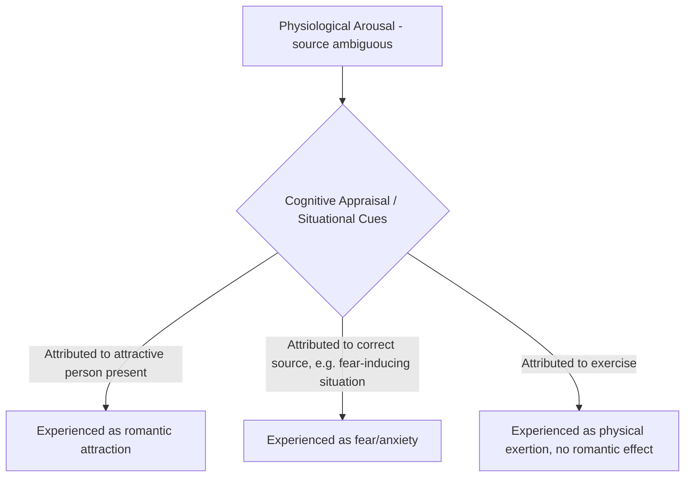

## Misattribution of Arousal in Attraction

### Definition

Misattribution of arousal in attraction is a phenomenon in which physiological arousal generated by one source (fear, exercise, excitement, stress) is incorrectly attributed to a different source — specifically, to romantic or sexual attraction toward another person present at the time of arousal. Because many distinct emotional and physiological states (fear, anger, excitement, sexual attraction) produce overlapping bodily sensations (increased heart rate, rapid breathing, sweating), individuals sometimes mislabel the *cause* of their arousal, and this mislabeling can generate an experience of romantic attraction that would not otherwise have occurred, or that is amplified beyond what the actual interpersonal context would independently produce.

### Theoretical Foundation: Schachter and Singer's Two-Factor Theory of Emotion

**Key Points**

- Misattribution of arousal is grounded in **Stanley Schachter and Jerome Singer's two-factor theory of emotion (1962)**, which proposes that emotional experience results from the combination of two components:
  1. **Physiological arousal** (a relatively undifferentiated bodily state of activation).
  2. **Cognitive label/appraisal** (an interpretation of *why* one is aroused, drawn from contextual and situational cues).
- Because physiological arousal is proposed to be largely similar across many different emotional states, the specific emotion a person consciously experiences depends heavily on how they cognitively interpret the *cause* of that arousal in a given context — the same bodily state can be labeled as fear, excitement, anger, or attraction depending on available situational cues.

### Classic Experimental Evidence

**Dutton & Aron (1974), "Capilano Suspension Bridge" Study**

- **Setup:** Male participants crossed either a high, wobbly, fear-inducing suspension bridge (Capilano Canyon Suspension Bridge in North Vancouver) or a low, stable, non-arousing bridge. On the other side, an attractive female confederate approached them, administered a brief survey, and offered her phone number in case they had questions about the study.
- **Key finding:** Men who had crossed the frightening, arousing bridge were significantly more likely to call the confederate afterward, and rated her as more attractive, compared to men who had crossed the low, non-arousing bridge.
- **Interpretation:** The fear-induced physiological arousal from the high bridge was, at least in part, misattributed by participants as romantic/sexual attraction to the confederate, rather than being correctly identified as fear related to the bridge crossing.
- [Inference] This study is one of the most frequently cited demonstrations of arousal misattribution in the social psychology literature; a control condition using a male confederate (rather than a female confederate approaching male participants) was also included in the original study and reportedly did not produce the same increased-attraction pattern, supporting the interpretation that the effect was specific to the potential romantic/attraction-relevant context rather than a generalized effect of arousal on any subsequent evaluative judgment.

**Related and Supporting Studies**

- **White, Fishbein & Rutstein (1981):** Found that participants who had engaged in physical exercise (producing genuine physiological arousal, e.g., elevated heart rate) rated an attractive confederate as more appealing than participants in a low-arousal condition, when the arousal from exercise had not yet fully dissipated and could plausibly be misattributed to the social context.
- [Inference] A broader body of related research across the following decades has examined arousal transfer and misattribution across various arousal sources (exercise, humor, mild stress, loud noise), generally supporting the underlying principle that ambiguous residual arousal can be reinterpreted according to available situational cues, though the specific magnitude of the misattribution effect varies by study design, arousal source, and the strength/clarity of competing explanatory cues present in each context.

### Boundary Conditions and Moderators

**Key Points**

**1. Availability of a Clear Alternative Explanation**

- The misattribution effect is strongest when the true source of arousal is **not salient or obvious** to the person at the time of the social encounter. If a person clearly and consciously attributes their arousal to its actual cause (e.g., explicitly telling themselves "my heart is racing because this bridge is terrifying"), the arousal is less likely to be misattributed to attraction toward a person present.
- [Inference] Some research designs have manipulated the salience of the true arousal source (e.g., informing participants in advance that a pill or exercise will produce specific bodily sensations) and found reduced misattribution effects when the true cause is made highly explicit, consistent with the idea that ambiguity about arousal's source is a necessary condition for the effect.

**2. Residual Arousal / Excitation Transfer**

- **Dolf Zillmann's excitation transfer theory** extends misattribution research by proposing that arousal from one source can persist and "transfer" to intensify a subsequent, unrelated emotional experience, even after the person is no longer consciously experiencing arousal from the original source, provided some residual physiological activation remains.
- This is distinguished from pure misattribution: excitation transfer does not necessarily require an incorrect *label* to be applied, but rather describes how leftover physiological arousal can amplify the intensity of whatever emotion is subsequently experienced, including attraction.

**3. Attractiveness of the Available Target**

- The misattribution/arousal-transfer effect on attraction specifically depends on there being a plausible attraction-relevant target present in the situational context; the same arousal, absent an available attractive other, would presumably be attributed to some other available cue (the bridge, the exercise, the stressor) rather than manifesting as romantic attraction at all.

### Comparative Summary Table

| Concept | Key Distinction | Key Source |
| --- | --- | --- |
| Two-factor theory of emotion | General theory: emotion = arousal + cognitive label | Schachter & Singer (1962) |
| Misattribution of arousal | Arousal from Source A incorrectly labeled as attraction to Person B | Dutton & Aron (1974) |
| Excitation transfer | Residual arousal intensifies a subsequent (correctly identified) emotion, not necessarily via mislabeling | Zillmann |
| Key boundary condition | Effect requires ambiguity about arousal's true source | Multiple replications |

### Practical Example

**Example**

A person goes on a first date that includes an intense, adrenaline-inducing activity — a rollercoaster ride or an escape room with a countdown timer — rather than a calm dinner. Some of the physiological arousal generated by the exciting/stressful activity itself may be misattributed to romantic attraction toward the date, potentially producing a stronger sense of chemistry or interest than a calmer, lower-arousal first date would generate with the same two people, independent of any actual difference in interpersonal compatibility.

### Real-World and Applied Contexts

- **Dating advice and date planning:** Popular relationship and dating advice frequently and explicitly draws on the misattribution-of-arousal principle, recommending that first dates include mildly thrilling or arousing activities (amusement parks, adventure activities, scary movies) on the premise that resulting arousal may be partially misattributed as attraction to one's date.
- **Marketing and advertising:** [Inference] Some marketing research and commentary has discussed using arousal-inducing content (exciting music, high-energy visuals) adjacent to product presentation on the theoretical premise that misattributed arousal could enhance positive evaluation of an associated product or brand, drawing conceptually on the same misattribution mechanism, though this specific commercial application is more an extrapolated use of the principle than a directly replicated finding within controlled misattribution-of-arousal research itself.
- **Understanding "adrenaline-fueled" relationship dynamics:** Clinical and relationship-counseling discussions sometimes reference misattribution of arousal to help explain why intensely stressful or crisis-driven shared circumstances (e.g., surviving a dangerous situation together, high-conflict relationship dynamics) can generate a subjective sense of strong romantic "chemistry" that may not correspond to genuine long-term compatibility once the arousing circumstances subside.
- **Public speaking, performance, and social anxiety contexts:** The underlying two-factor theory of emotion (of which misattribution is a specific application) has broader clinical applications in understanding how physiological arousal can be relabeled or reframed cognitively — a principle drawn on in some cognitive-behavioral approaches to anxiety, distinct from but conceptually related to the attraction-specific application discussed here.

**Related Topics**

- Physical attractiveness and the halo effect
- Reciprocity of liking
- Proximity and the mere exposure effect
- Schachter and Singer's two-factor theory of emotion
- Excitation transfer theory (Zillmann)
- Cognitive appraisal theories of emotion
- Passionate love vs. companionate love (Hatfield)
- Evolutionary perspectives on mate preferences