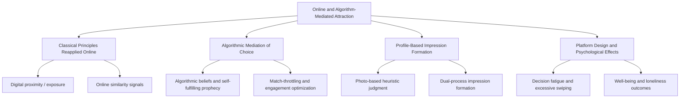
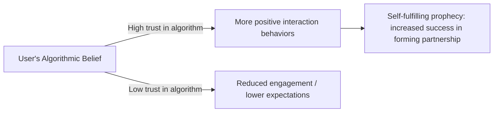

## Online and Algorithm-Mediated Attraction

### Overview

Online and algorithm-mediated attraction refers to how interpersonal attraction processes — traditionally studied in face-to-face contexts (proximity, similarity, physical attractiveness, reciprocity) — operate, transform, or are actively shaped by digital platforms, matching algorithms, and computer-mediated communication. This is a comparatively recent and still-developing subfield within interpersonal attraction research, extending classical theories into environments the original theories were not designed to describe.

### Reapplying Classical Attraction Principles to Digital Contexts

**Key Points**

- **Digital proximity/exposure:** Repeated exposure to a profile through an app's recommendation feed, or frequent messaging contact, can function analogously to physical proximity and the mere exposure effect, potentially increasing familiarity-based liking over repeated encounters. [Inference] Direct experimental extension of the classic mere-exposure paradigm to repeated algorithmic profile exposure is a newer and less thoroughly established research line than the foundational offline studies, so this connection is a reasonable theoretical extension rather than a fully confirmed direct replication.
- **Similarity signals:** Dating platforms often allow users to filter or view shared interests, values, and demographic characteristics explicitly, making similarity information immediately visible in a way rarely available in early face-to-face encounters — a study of shared-interest disclosure in dating-app profiles found that adding a specific sentence referencing shared interests increased reply rates and the likelihood of a sustained conversation compared to profiles without such content, consistent with the broader similarity-attraction literature's prediction that visible common ground increases interpersonal interest.
- **Physical attractiveness remains highly influential:** Photo-based impression formation on dating platforms has been studied through a **dual-process framework**, proposing that in the fast, swipe-based environment typical of many apps, users rely heavily on rapid heuristic judgment. Research using large multimodal models to analyze profile photos on a major heterosexual dating platform has examined this through two parallel evaluative pathways: an affective-aesthetic pathway (facial attractiveness) and a sociocultural-inferential pathway (inferred social, economic, and cultural capital from visual cues in a photo).

### Algorithmic Mediation and Beliefs

**Key Points**

- **Algorithmic beliefs:** A growing research line examines "algorithmic beliefs" — users' beliefs about the legitimacy, accuracy, and trustworthiness of a dating platform's matching algorithm — and how these beliefs relate to relational outcomes. Research applying a **self-fulfilling prophecy / expectation-effects framework** has proposed that believing in the legitimacy of a dating algorithm can encourage more positive interaction behaviors during online dating, potentially increasing an individual's likelihood of successfully forming a partnership through the platform.
- A more recent extension of this research found that among currently single, relationship-seeking online daters, stronger algorithmic beliefs were associated with lower online dating disappointment, though results regarding online dating excitement were mixed, suggesting algorithmic beliefs relate differently to different affective outcomes rather than uniformly improving or worsening user experience.
- **Match-throttling and engagement-optimization concerns:** Some research has examined how certain dating app business models may prioritize sustained user engagement and "match accumulation" over efficiently facilitating successful offline pairings, given that a platform's revenue model can incentivize continued app usage rather than rapid relationship formation and account closure. [Inference] This is a topic of ongoing investigation and critique within a body of applied and public-health-oriented research examining potential unintended psychological consequences of engagement-optimized dating app design, and the extent to which specific platforms actually engage in deliberate match-throttling is contested and platform-specific rather than a uniformly established industry-wide practice.

### Decision Fatigue and Excessive Swiping

**Key Points**

- Research on dating-app decision-making has examined the reciprocal relationships between **partner-choice FOMO** (fear of missing out on a potentially better match), **decision fatigue**, **excessive swiping**, and **trust in algorithms**, proposing these factors can interact and compound one another during extended app use.
- [Inference] This body of research suggests that having access to a very large pool of potential partners via continuous swiping — a structural feature distinct from offline dating contexts — may introduce distinctive psychological costs (choice overload, fatigue, reduced satisfaction with selections made) that are less prominent in the smaller, naturally bounded partner pools studied in classical offline attraction research, though the specific causal direction and strength of these relationships is still being actively investigated rather than fully established.

### Platform Design, Well-Being, and Gendered Outcomes

**Key Points**

- Research examining potential public health dimensions of dating-app algorithm design has investigated gender disparities in outcomes, addictive usage patterns, and the psychological effects of low match rates or algorithmic "throttling" — with some work specifically examining whether prevailing dating-app dynamics and algorithms may be associated with increased loneliness among certain user populations (the cited research specifically examined this question with respect to men's outcomes).
- [Inference] This applied public-health-oriented research is a relatively recent development within the broader online-attraction literature and reflects growing academic interest in the mental-health and well-being implications of algorithm-mediated dating and matching, an area of study that did not exist within the classical, pre-digital interpersonal attraction literature at all.

### Platform-Specific Sociality Models

**Key Points**

- Newer interest-based social and dating platforms have been studied using frameworks such as **mass customization**, examining how algorithmic mechanisms, personality assessments, and tag-based matching systems on a platform can shape both the formation of connections and broader patterns of social stratification among users.
- A study of one such interest-driven platform among a Chinese Generation Z user base found that the platform's algorithmic and tag-based design fostered emotional support and more fluid, exploratory self-presentation through virtual identities, while simultaneously contributing to the formation of exclusive social circles and what the researchers described as "algorithmic social cocoons" — illustrating that algorithm-mediated platforms can produce attraction and connection patterns with distinctive structural features (e.g., interest-based clustering, identity experimentation) not present in traditional offline attraction contexts.

### Bias and Fairness Considerations in Algorithm-Mediated Attraction

**Key Points**

- Research using conjoint-analysis methodology has examined how evaluators assess potential partners in relationship-decision contexts, including studies investigating how factors such as transgender identity intersect with desirability judgments and broader social/political attitudes in partner evaluation — reflecting a growing research interest in how bias, stigma, and discrimination can manifest within structured or algorithmically mediated partner-evaluation contexts.
- [Inference] This connects online/algorithmic attraction research to longstanding social-psychological work on prejudice, stereotyping, and intergroup attitudes, extending those frameworks into a context (structured digital partner evaluation) where evaluative criteria and their downstream effects can, in principle, be more directly observed and measured than in unstructured offline social contexts.

### Comparative Summary Table

| Classical Concept | Online/Algorithmic Extension | Key Distinguishing Feature |
| --- | --- | --- |
| Proximity / mere exposure | Repeated algorithmic profile exposure | Exposure frequency can be platform-controlled rather than physically incidental |
| Similarity-attraction | Explicit shared-interest disclosure in profiles/messages | Similarity information made deliberately visible rather than gradually discovered |
| Physical attractiveness / halo effect | Photo-based heuristic judgment (dual-process models) | Judgment compressed into rapid swipe-based decisions |
| Reciprocity of liking | Matching mechanics, "likes," algorithmic recommendation | Reciprocal interest partly mediated/signaled by platform mechanics |
| N/A (new construct) | Algorithmic beliefs and self-fulfilling prophecy effects | No offline equivalent; belief in a third-party algorithm's legitimacy |
| N/A (new construct) | Decision fatigue / choice overload from large partner pools | Offline partner pools are naturally bounded; online pools can be vast |

### Practical Example

**Example**

Two users on a dating platform are shown as a match after both indicated interest in hiking and independent films — an explicit similarity signal displayed by the app. Consistent with similarity-attraction research, this shared-interest cue increases the likelihood that either user replies to an opening message referencing that specific overlap, compared to a generic opening message with no shared-interest content, illustrating how a classical attraction principle (similarity) operates through a distinctly digital mechanism (algorithmically surfaced shared-attribute display).

### Real-World and Applied Contexts

- **Dating app product design:** Findings on algorithmic beliefs and engagement/well-being outcomes inform ongoing industry and academic discussion about platform design choices (match algorithms, engagement-optimization features, transparency about how matching works) and their downstream effects on user experience and relationship-formation success.
- **Public health and loneliness research:** Growing academic attention to potential links between dating-app design and loneliness or well-being outcomes reflects an emerging public-health-oriented extension of interpersonal attraction research into digital contexts.
- **Platform moderation and bias mitigation:** Research on bias in structured online partner evaluation (e.g., regarding transgender individuals or other marginalized groups) informs discussions about platform policy, algorithmic fairness, and anti-discrimination considerations in matching-system design.
- **Cross-cultural and platform-specific sociality:** Studies of region- and demographic-specific platforms (e.g., interest-based apps popular with particular generational or cultural user bases) highlight that algorithm-mediated attraction is not a single uniform phenomenon but varies meaningfully across platform design philosophies and cultural user bases.

**Related Topics**

- Proximity and the mere exposure effect
- Similarity and the matching hypothesis
- Physical attractiveness and the halo effect
- Reciprocity of liking
- Self-disclosure and relationship escalation
- Dual-process theories of social judgment
- Prejudice and bias in evaluative decision-making
- Loneliness and social well-being research