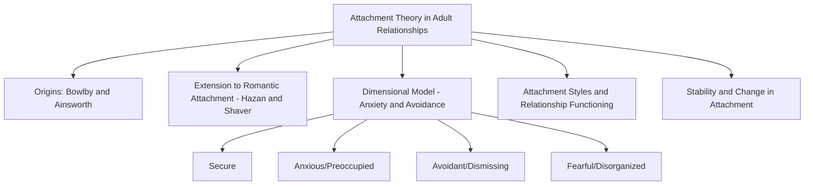
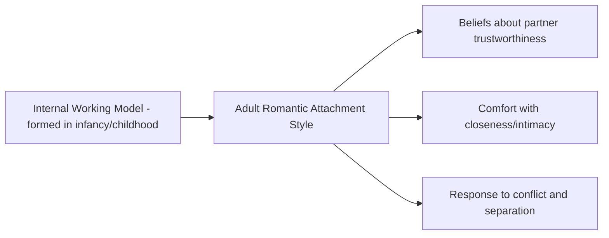
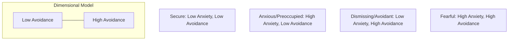

## Attachment Theory in Adult Relationships

### Overview

Attachment theory, originally developed to explain the emotional bond between infants and caregivers, has been extended into a major framework for understanding romantic and close relationships in adulthood. The core premise of this extension is that early attachment experiences shape internal working models of relationships that persist, with meaningful continuity and some malleability, into adult romantic bonding, influencing how individuals seek closeness, respond to intimacy, manage conflict, and cope with separation from romantic partners.

### Origins: Bowlby and Ainsworth

**Key Points**

- **John Bowlby's attachment theory (1969, 1973, 1980)** originally proposed that infants form an attachment bond with primary caregivers as an evolved behavioral system promoting proximity-seeking and protection, and that early caregiving experiences shape an **internal working model** — a cognitive-affective template of the self, others, and relationships — that guides expectations in future relationships.
- **Mary Ainsworth's "Strange Situation" procedure** empirically identified distinct infant attachment patterns based on how infants responded to separation from and reunion with a caregiver, classifying infants as **securely attached**, **anxious-ambivalent (resistant)**, or **avoidant**; a fourth category, **disorganized**, was added by later researchers (Main & Solomon).
- These infant classifications provided the conceptual foundation for later adult attachment research, though adult researchers developed distinct methods and measures rather than directly testing infants using the Strange Situation.

### Extension to Romantic Relationships: Hazan and Shaver

**Classic Study — Hazan & Shaver (1987)**

- **Key contribution:** Cindy Hazan and Phillip Shaver proposed that romantic love in adulthood could be conceptualized as an attachment process, and that the same three infant attachment categories identified by Ainsworth (secure, anxious, avoidant) could be meaningfully applied to adult romantic relationships.
- **Method:** Developed a self-report measure asking adults to identify which of three short descriptions (corresponding to secure, anxious, and avoidant relationship styles) best characterized their general approach to romantic relationships.
- **Key finding:** Distribution of adult attachment styles in the sampled population roughly paralleled the distribution of infant attachment classifications found in developmental research, and each adult attachment style was associated with characteristic patterns of romantic beliefs, relationship history, and experience of love (e.g., securely attached adults reported relationships characterized by trust and comfort with intimacy; anxiously attached adults reported preoccupation and fear of abandonment; avoidantly attached adults reported discomfort with closeness and difficulty trusting partners).

### The Dimensional Model: Attachment Anxiety and Avoidance

**Key Points**

- Contemporary adult attachment research has largely moved away from Hazan and Shaver's original three-category (categorical) model toward a **two-dimensional model**, most influentially developed by **Kelly Brennan, Catherine Clark, and Phillip Shaver (1998)** through the **Experiences in Close Relationships (ECR)** measure.
- The two continuous dimensions are:
  1. **Attachment anxiety:** The degree to which a person fears rejection or abandonment and seeks reassurance and validation from a partner; high scorers tend to be preoccupied with the relationship and hypervigilant to signs of partner disengagement.
  2. **Attachment avoidance:** The degree to which a person is uncomfortable with closeness, emotional intimacy, and dependence on a partner; high scorers tend to value independence and self-reliance and may withdraw during conflict or emotional intensity.
- Combining these two dimensions produces four theoretical quadrants, often mapped onto four adult attachment style labels (extending earlier four-category work by **Bartholomew and Horowitz, 1991**):

| Attachment Style | Anxiety | Avoidance | Characteristic Pattern |
| --- | --- | --- | --- |
| **Secure** | Low | Low | Comfortable with intimacy and independence; trusts partners |
| **Anxious/Preoccupied** | High | Low | Craves closeness; fears abandonment; seeks frequent reassurance |
| **Dismissing/Avoidant** | Low | High | Values self-sufficiency; minimizes emotional needs; distances from intimacy |
| **Fearful/Disorganized** | High | High | Desires closeness but distrusts and fears it; approach-avoidance conflict |

**Key Points**

- The dimensional approach is now generally preferred in research because it captures individual variation more precisely than discrete categories and avoids the assumption that attachment style is a single fixed "type" rather than a matter of degree along two underlying dimensions.
- [Inference] Most contemporary empirical attachment research uses continuous anxiety and avoidance scores (often from the ECR or its revised version, the ECR-R) rather than categorical classification, reflecting the field's general shift toward dimensional measurement, though categorical language ("secure," "anxious," "avoidant") remains common in both research communication and especially in popular and clinical discussion for interpretive convenience.

### Attachment Style and Relationship Functioning

**Key Points**

**1. Relationship Satisfaction and Stability**

- Securely attached individuals (low anxiety, low avoidance) consistently show, across a large body of research, higher relationship satisfaction, greater trust, more constructive conflict resolution, and greater relationship stability compared to insecurely attached individuals.
- Attachment anxiety is associated with heightened emotional reactivity to relationship threats, jealousy, and a tendency toward protest behaviors (e.g., excessive reassurance-seeking, difficulty self-soothing during partner unavailability).
- Attachment avoidance is associated with discomfort during emotionally intense interactions, tendency toward emotional and physical withdrawal during conflict (sometimes discussed in relationship research as a "demand-withdraw" dynamic when paired with an anxious partner), and lower self-reported reliance on partners for comfort.

**2. Conflict Behavior**

- [Inference] A substantial body of couples research has examined how attachment style predicts specific conflict behaviors — for example, anxiously attached individuals have been found in various studies to escalate conflict-related distress and seek proximity/reassurance more intensely during disagreements, while avoidantly attached individuals more often withdraw or deactivate emotional engagement, a pattern that can produce a self-reinforcing pursue-withdraw cycle when partners with these respective styles are paired, though the specific strength and universality of this pairing-based pattern varies across studies and relationship contexts.

**3. Caregiving and Support-Seeking**

- Attachment style predicts both how individuals seek support from romantic partners during distress and how they provide caregiving to a distressed partner; securely attached individuals tend to show more effective and responsive caregiving behavior, while insecure attachment (particularly avoidance) is associated with less attuned or less consistent caregiving responses.

**4. Sexual Attitudes and Behavior**

- [Inference] Some research has linked attachment style to distinct patterns in sexual attitudes and behavior within romantic relationships (e.g., anxious attachment linked to using sex for reassurance-seeking or fear of partner loss, avoidant attachment linked to more emotionally detached approaches to sexual intimacy), though this remains a more specialized subarea within the broader adult attachment literature with somewhat less consensus than the core findings on satisfaction and conflict behavior.

### Stability and Change in Adult Attachment

**Key Points**

- Adult attachment style shows **moderate rank-order stability** over time in longitudinal research — meaning attachment tendencies are meaningfully consistent for most individuals but are not entirely fixed.
- **Earned security:** Some individuals who report insecure childhood attachment experiences nonetheless develop secure adult attachment patterns, a phenomenon researchers have termed "earned security," often associated with subsequent corrective relational experiences (e.g., a stable, secure romantic partnership, or therapeutic intervention) that revise the internal working model over time.
- Attachment style can also vary somewhat by relationship context (an individual may show more secure functioning in one relationship and less secure functioning in another, sometimes discussed as the distinction between global/trait-like attachment orientation and relationship-specific attachment).
- [Inference] The relative influence of stable early-childhood-derived attachment tendencies versus relationship-specific and current-context factors on adult attachment behavior remains an active area of theoretical and empirical discussion, with most contemporary researchers favoring a model in which both relatively stable dispositional tendencies and more malleable relationship-specific experiences jointly shape adult attachment functioning, rather than treating adult attachment as either purely fixed from childhood or purely determined by current relationship context.

### Practical Example

**Example**

A person with high attachment anxiety notices their partner has been slower than usual to respond to text messages over a weekend. Rather than assuming a benign explanation (the partner is busy), the anxiously attached person may experience escalating worry about the relationship's stability, increase reassurance-seeking behavior (repeated messages, direct questions about the partner's feelings), and interpret ambiguous cues as evidence of impending rejection — a pattern consistent with attachment theory's prediction that anxious attachment involves heightened vigilance to relationship threat cues and difficulty self-soothing in the partner's temporary absence.

### Real-World and Applied Contexts

- **Couples therapy:** **Emotionally Focused Therapy (EFT)**, developed by Sue Johnson and colleagues, explicitly draws on adult attachment theory as its core theoretical foundation, framing relationship distress as arising from insecure attachment dynamics (e.g., pursue-withdraw cycles) and working to help partners develop more secure emotional bonding patterns.
- **Premarital and relationship education programs:** Some relationship-education curricula incorporate attachment-style assessment to help couples understand and communicate about differing needs for closeness and independence.
- **Individual and clinical psychology:** Attachment theory informs broader clinical understanding of interpersonal functioning beyond romantic relationships, including friendships, therapeutic relationships (the therapist-client bond itself has been studied through an attachment lens), and workplace relationships.
- **Parenting and intergenerational transmission research:** Adult attachment research connects to studies of intergenerational transmission of attachment patterns, examining how a parent's own adult attachment representations (often measured via the Adult Attachment Interview, a distinct instrument from the romantic-relationship self-report measures discussed above) relate to the attachment security their children develop.

### Summary Table

| Concept | Description | Key Source |
| --- | --- | --- |
| Internal working model | Cognitive-affective template guiding relationship expectations | Bowlby |
| Infant attachment categories | Secure, anxious-ambivalent, avoidant, disorganized | Ainsworth; Main & Solomon |
| Extension to romance | Adult romantic love conceptualized as an attachment process | Hazan & Shaver (1987) |
| Dimensional model | Continuous attachment anxiety and avoidance dimensions | Brennan, Clark & Shaver (1998) |
| Four-category model | Secure, Preoccupied, Dismissing, Fearful | Bartholomew & Horowitz (1991) |
| Applied clinical framework | Emotionally Focused Therapy | Sue Johnson |
| Change mechanism | "Earned security" via corrective relational experience | Adult attachment literature |

**Related Topics**

- Reciprocity of liking
- Self-disclosure and relationship escalation
- Passionate love vs. companionate love
- Equity theory and social exchange in relationships
- Conflict resolution and demand-withdraw patterns in couples
- Emotionally Focused Therapy (Sue Johnson)
- Intergenerational transmission of attachment
- Loneliness and social well-being research