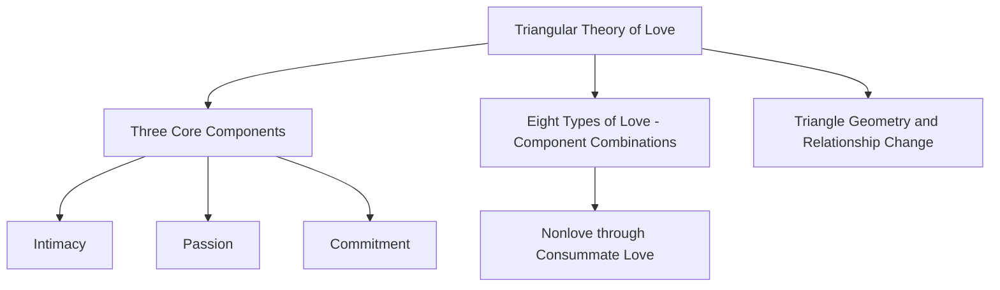
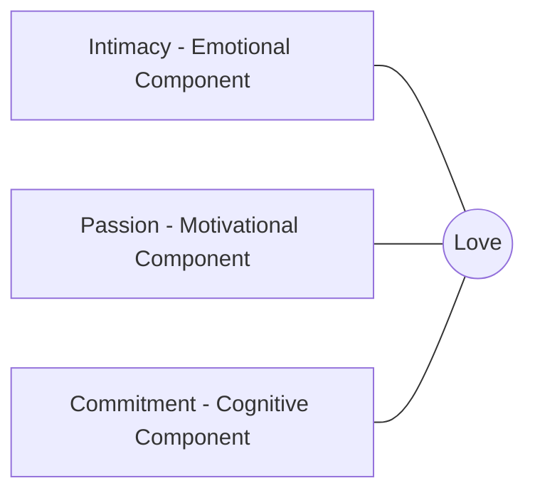
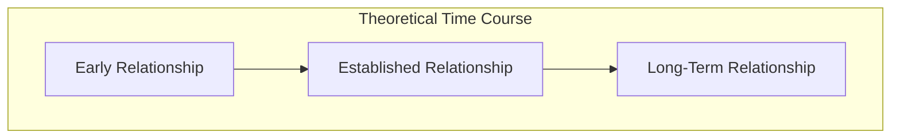
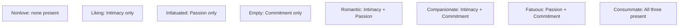

## Sternberg's Triangular Theory of Love

### Overview

Sternberg's triangular theory of love, proposed by psychologist **Robert Sternberg (1986)**, conceptualizes love as composed of three distinct components — intimacy, passion, and commitment — that combine in varying degrees and combinations to produce different experiential types of love. The theory is termed "triangular" because the three components can be represented as the vertices of a triangle, with the relative strength of each component determining the shape and size of the triangle for a given relationship at a given point in time.

### The Three Core Components

**Key Points**

**1. Intimacy**

- Defined by Sternberg as feelings of closeness, connectedness, and bondedness in a relationship, including warmth, mutual understanding, emotional support, and the sharing of personal thoughts and feelings.
- Intimacy is characterized as the **emotional** component of love, and Sternberg described it as developing relatively gradually and steadily over the course of a relationship, tending to increase with continued positive interaction and self-disclosure, though the rate of increase typically slows as a relationship matures.

**2. Passion**

- Defined as the drive that leads to romance, physical attraction, and sexual consummation, encompassing intense emotional and physiological arousal associated with being in love.
- Passion is characterized as the **motivational** component of love, and Sternberg proposed that it tends to develop very rapidly early in a relationship but is also prone to habituation — meaning passion often peaks relatively early and can decline or plateau over time, sometimes described as following a pattern conceptually similar to physiological/emotional adaptation processes.

**3. Commitment**

- Defined as having two aspects: a **short-term** decision to love a particular person, and a **long-term** decision to maintain that love and the relationship over time, including through difficulties.
- Commitment is characterized as the **cognitive** component of love, and Sternberg proposed it tends to increase gradually at first, then accelerates as the relationship becomes established, potentially leveling off or even declining if the relationship deteriorates.

**Proposed Developmental Trajectories Over Time**

[Inference] Sternberg's original theoretical writing proposed characteristic time-course patterns for each component (intimacy rising steadily then plateauing; passion rising quickly then often declining or stabilizing at a lower level; commitment rising gradually then accelerating), but these trajectories were presented as general theoretical patterns describing typical relationships rather than as universally fixed laws applying identically to every individual relationship — actual trajectories can vary considerably across specific relationships and individuals.

### The Eight Types of Love

Sternberg proposed that different combinations of the presence or absence of each of the three components (intimacy, passion, commitment) produce eight qualitatively distinct experiential types of love.

| Type of Love | Intimacy | Passion | Commitment | Description |
| --- | --- | --- | --- | --- |
| **Nonlove** | Absent | Absent | Absent | Casual, everyday social interactions lacking any of the three components |
| **Liking** | Present | Absent | Absent | Genuine closeness and warmth without passion or long-term commitment (characteristic of true friendship) |
| **Infatuated Love** | Absent | Present | Absent | Intense physical/emotional attraction without closeness or commitment ("love at first sight," often short-lived) |
| **Empty Love** | Absent | Absent | Present | Commitment to maintain a relationship without emotional closeness or passion (e.g., a stagnant long-term relationship, or in some cases, certain arranged relationships in their early stage) |
| **Romantic Love** | Present | Present | Absent | Emotional and physical bonding without long-term commitment |
| **Companionate Love** | Present | Absent | Present | Deep intimacy and commitment without passion (characteristic of long-term marriages where passion has faded, or close platonic-like life partnerships) |
| **Fatuous Love** | Absent | Present | Present | Commitment based on passion without the stabilizing foundation of intimacy (e.g., a whirlwind courtship leading rapidly to commitment, such as a very quick engagement) |
| **Consummate Love** | Present | Present | Present | The complete form combining all three components; theorized as the ideal, most complete form of romantic love |

**Key Points**

- Sternberg explicitly noted that **consummate love**, while representing the theoretical ideal, is also proposed to be difficult to sustain indefinitely — maintaining all three components at high levels simultaneously over the long term requires ongoing relational effort, since passion in particular tends toward habituation over time.
- The framework is intended to describe both **different relationships** (a person may have a companionate relationship with a longtime friend and a romantic relationship with a new partner) and **change within a single relationship over time** (a relationship might begin as infatuated love, develop into romantic love, and mature into consummate or companionate love over years).

### Geometric Representation and the "Triangle" Metaphor

**Key Points**

- Sternberg proposed that the three components could be visually represented as the vertices of a triangle, where:
  - The **size** of the triangle reflects the overall amount of love (larger triangle = more love overall, across all three components combined).
  - The **shape** of the triangle reflects the relative balance among the three components (an equilateral triangle suggests balanced intimacy, passion, and commitment; a skewed or lopsided triangle suggests one or two components dominate).
- Sternberg further distinguished between:
  - **Real triangles:** A person's actual current levels of the three components in a relationship.
  - **Ideal triangles:** A person's desired or idealized levels of the three components for that relationship.
  - [Inference] Sternberg's broader theoretical writing proposed that relationship satisfaction is related to the degree of correspondence between a person's real and ideal triangles (a smaller discrepancy between real and ideal being associated with greater satisfaction), a proposition that has received some empirical attention in subsequent relationship-satisfaction research, though it is a more specific and less universally tested extension of the core triangular framework compared to the widely cited three-component and eight-type structure itself.

### Practical Example

**Example**

A couple married for twenty-five years may report very high intimacy (deep mutual understanding built over decades) and high commitment (strong, stable decision to remain together), but comparatively lower passion than they experienced early in the relationship — a pattern the triangular theory would classify as predominantly **companionate love**, distinct from, but not necessarily lesser than, the **romantic** or **consummate** love that may have characterized earlier stages of the same relationship.

### Empirical Status and Critiques

**Key Points**

- [Inference] Sternberg's triangular theory has been highly influential in both academic relationship science and popular discussion of love, and subsequent research (including Sternberg's own later work developing the **Triangular Love Scale** to measure the three components) has generally found support for the basic three-component structure as psychometrically distinguishable; however, some psychometric research has questioned whether intimacy and commitment are as empirically distinct from one another as the theory proposes, given that measures of the two components sometimes show high intercorrelation in factor-analytic studies, suggesting the boundaries between components may be less crisp in practice than the theoretical model implies.
- The theory is primarily descriptive and taxonomic (categorizing types of love and their components) rather than deeply explanatory of the underlying causal or evolutionary mechanisms producing these components, distinguishing it from frameworks like attachment theory or evolutionary mate-preference theory, which are more oriented toward explaining *why* these patterns exist.
- The theory has also been discussed alongside other prominent love-typology frameworks (e.g., Hatfield's distinction between **passionate love** and **companionate love**, and Lee's earlier "colors of love" typology), with which it shares some conceptual overlap (Sternberg's romantic/companionate categories map loosely onto Hatfield's passionate/companionate distinction) while offering a more granular, combinatorial structure.

### Comparative Summary Table

| Aspect | Description |
| --- | --- |
| Proposed by | Robert Sternberg (1986) |
| Three components | Intimacy (emotional), Passion (motivational), Commitment (cognitive) |
| Number of love types | Eight, based on presence/absence combinations of the three components |
| Theoretical ideal | Consummate love (all three components present) |
| Key measurement tool | Triangular Love Scale (Sternberg) |
| Key critique | Empirical overlap between intimacy and commitment in some factor-analytic studies |
| Related frameworks | Hatfield's passionate/companionate love; Lee's colors of love typology |

**Related Topics**

- Attachment theory in adult relationships
- Passionate love vs. companionate love (Hatfield)
- Self-disclosure and relationship escalation
- Equity theory and social exchange in relationships
- Reciprocity of liking
- Lee's typology of love styles ("colors of love")
- Relationship satisfaction and longitudinal relationship trajectories