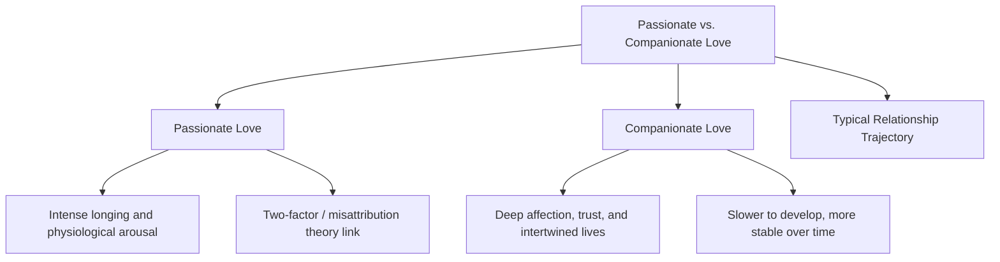
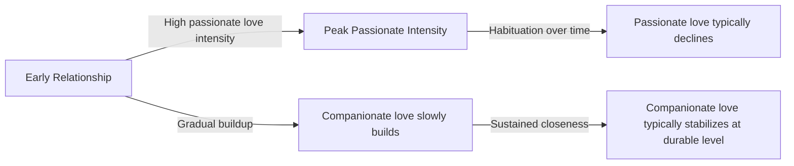

## Passionate Versus Companionate Love

### Overview

The distinction between passionate love and companionate love is a foundational typology in the psychology of close relationships, most closely associated with **Elaine Hatfield (Walster)**, proposing that romantic love is not a single unitary experience but instead encompasses (at least) two qualitatively distinct states with different phenomenological characteristics, physiological underpinnings, and typical time courses within a relationship.

### Passionate Love

**Definition**

Passionate love, as defined by Hatfield and colleagues, is a state of intense longing for union with another person, characterized by strong emotional and physiological arousal, preoccupation with the loved one, and a mix of euphoria (when the feeling is reciprocated) and anxiety or despair (when it is not).

**Key Points**

- **Physiological arousal component:** Passionate love is theorized to involve genuine physiological activation (elevated heart rate, heightened alertness, a subjective sense of intense emotional and even somatic engagement), connecting it conceptually to Schachter and Singer's two-factor theory of emotion and to research on misattribution of arousal, which proposes that ambiguous arousal from various sources can be cognitively labeled as passionate attraction under the right contextual conditions.
- **Cognitive preoccupation:** A hallmark feature is persistent, often intrusive, thinking about the loved one, alongside idealization of the partner and the relationship.
- **Emotional volatility:** Passionate love is associated with a wider emotional range than companionate love — capable of producing both extreme elation (during reciprocated closeness) and extreme distress (during separation, uncertainty, or rejection).
- **Time course:** Passionate love is generally theorized and found in relationship research to be most intense in the **early stages** of a romantic relationship and to naturally decline in intensity over time, a pattern often attributed to habituation of the intense physiological/emotional arousal component as the relationship becomes more familiar and predictable.
- **Measurement:** Hatfield and Susan Sprecher developed the **Passionate Love Scale**, a widely used self-report measure assessing cognitive, emotional, and behavioral indicators of passionate love intensity.

### Companionate Love

**Definition**

Companionate love, by contrast, is defined as a deeper, calmer affection and sense of connection felt for those with whom one's life is deeply intertwined, characterized by warmth, trust, mutual respect, and stable attachment, rather than intense arousal or longing.

**Key Points**

- **Lower physiological arousal:** Companionate love is generally described as involving substantially less intense physiological/emotional arousal compared to passionate love, being characterized instead by a stable, calm sense of closeness and security.
- **Gradual development:** Companionate love is theorized to build more slowly over time, typically developing through sustained positive interaction, self-disclosure, and shared experience, in contrast to passionate love's often rapid early emergence.
- **Greater temporal stability:** Once established, companionate love tends to be more stable and durable over the long term compared to passionate love's tendency toward habituation and decline, making it (per Hatfield's framework) more characteristic of long-term, established relationships such as long-term marriages.
- **Overlap with related constructs:** Companionate love shares substantial conceptual overlap with the **intimacy** and **commitment** components of Sternberg's triangular theory of love, and with the general construct of secure attachment bonding, since both frameworks describe stable, trust-based emotional connection as central features of mature long-term relationships.

### Comparative Summary Table

| Dimension | Passionate Love | Companionate Love |
| --- | --- | --- |
| Core experience | Intense longing, arousal, preoccupation | Deep affection, trust, calm closeness |
| Physiological arousal | High | Comparatively low |
| Emotional volatility | High (euphoria to despair) | Low (stable, calm) |
| Typical time course | Emerges rapidly, tends to decline with habituation | Builds gradually, tends to remain stable long-term |
| Associated theoretical link | Two-factor theory of emotion / misattribution of arousal | Sternberg's intimacy + commitment; secure attachment |
| Measurement tool | Passionate Love Scale (Hatfield & Sprecher) | Less standardized single scale; often assessed via intimacy/commitment or relationship-satisfaction measures |
| Typical relationship stage association | Early-stage, new relationships | Long-term, established relationships |

### Relationship Between the Two Types Over Time

**Key Points**

- Hatfield's framework proposes that most successful long-term romantic relationships involve a **transition or blending** from predominantly passionate love in the early stages toward a combination that increasingly incorporates companionate love as the relationship matures, rather than passionate love simply disappearing without replacement.
- [Inference] Whether a relationship is experienced as satisfying during this transition depends heavily on partners' expectations: relationship research and clinical/counseling literature commonly note that couples who expect passionate intensity to remain constant indefinitely may misinterpret its natural decline as a sign of relationship failure or lost compatibility, when it may instead reflect a normative developmental shift toward companionate love rather than a problem requiring intervention — though the specific rate and degree of this shift varies considerably across individual relationships.
- Some relationships retain meaningful elements of passionate love alongside companionate love well into long-term partnership (corresponding to Sternberg's **consummate love** category, which combines high intimacy, passion, and commitment), though sustaining high passionate intensity over very long time periods is generally considered less common than a shift toward companionate-dominant love.

### Relationship to Other Love Frameworks

| Framework | Corresponding Concepts |
| --- | --- |
| **Sternberg's Triangular Theory** | Passionate love ≈ high Passion component; Companionate love ≈ high Intimacy + Commitment, low Passion |
| **Attachment theory** | Companionate love overlaps conceptually with secure attachment bonding and stable proximity-seeking; passionate love's volatility has some conceptual parallels with anxious attachment's emotional intensity, though the two frameworks are theoretically distinct |
| **Two-factor theory of emotion** | Passionate love's arousal component is explained via cognitive labeling of physiological arousal in a romantic context |

### Practical Example

**Example**

A couple in the first few months of dating reports frequent, intense preoccupation with each other, difficulty concentrating on other tasks, and strong emotional highs and lows tied to the relationship's status — consistent with passionate love. Ten years into marriage, the same couple reports feeling deeply connected, trusting, and comfortable with one another, with far less intense emotional volatility but a strong, stable sense of partnership and shared life — consistent with a shift toward companionate love, without this shift necessarily indicating reduced relationship quality or satisfaction.

### Real-World and Applied Contexts

- **Couples counseling and relationship education:** Understanding the normative decline of passionate love intensity and the corresponding rise of companionate love is commonly used in relationship counseling to help partners recalibrate expectations about long-term relationship satisfaction, distinguishing a normal developmental transition from genuine relationship distress.
- **Marketing of relationship and wellness products:** [Inference] Popular relationship advice, media, and some commercial relationship-coaching content frequently reference the passionate/companionate distinction (often informally, without precise citation) to explain the "spark fading" phenomenon commonly reported by long-term couples, illustrating the concept's substantial penetration into popular psychological discourse beyond the academic literature.
- **Cross-cultural relationship research:** [Inference] Some cross-cultural research has examined whether the relative cultural valuation of passionate versus companionate love differs across societies (e.g., some research has explored whether cultures with more prevalent arranged-marriage traditions place relatively greater initial emphasis on companionate-love-building processes rather than pre-existing passionate attraction), though this is a more specialized comparative research area with less extensive direct experimental grounding than the foundational passionate/companionate distinction itself.
- **Clinical relationship assessment:** Distinguishing which type of love characterizes a couple's current relationship state can inform therapeutic approaches — for example, a relationship high in companionate love but very low in any remaining passionate connection might benefit from interventions aimed at novelty and shared excitement (informed by research on self-expansion and relationship novelty, which has been linked to renewed passionate feelings), whereas a relationship high in passionate intensity but lacking companionate foundations (paralleling Sternberg's "fatuous love") might benefit from interventions building deeper intimacy and communication.

**Related Topics**

- Sternberg's triangular theory of love
- Attachment theory in adult relationships
- Misattribution of arousal in attraction
- Self-disclosure and relationship escalation
- Equity theory and social exchange in relationships
- Self-expansion model of relationships (Aron & Aron)
- Relationship satisfaction and longitudinal trajectories