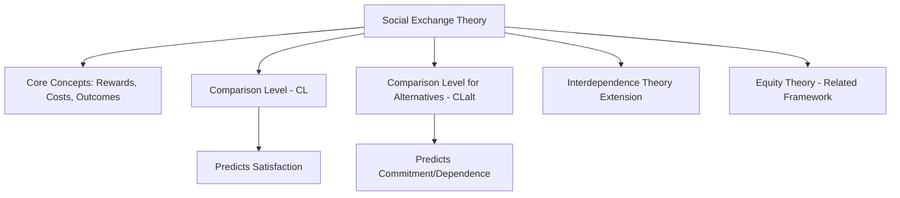
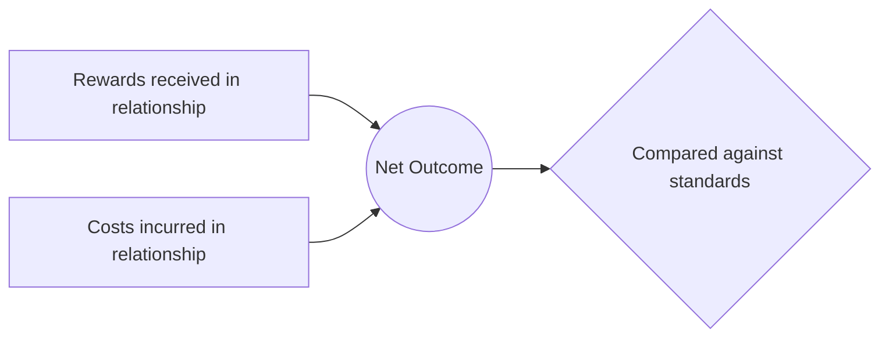
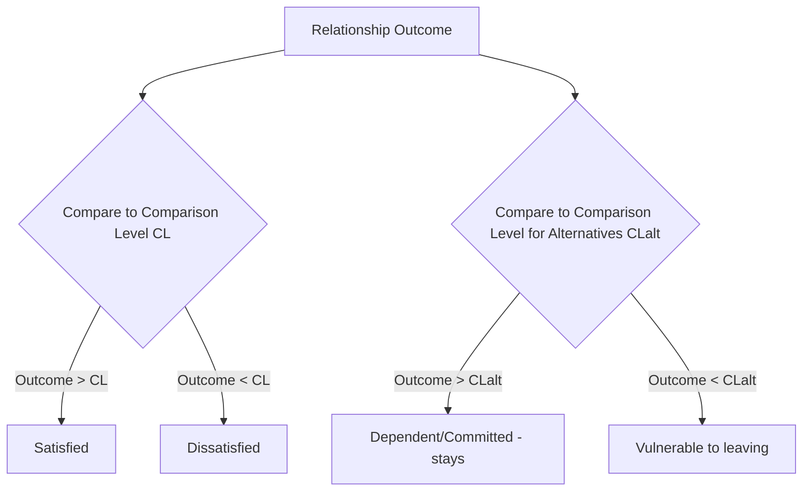

## Social Exchange Theory

### Overview

Social exchange theory is a major theoretical framework in relationship science proposing that interpersonal relationships are governed by a cost-benefit analysis process, in which individuals seek to maximize rewards and minimize costs in their interactions with others, and relationship satisfaction and stability depend on how favorably a relationship's outcomes compare to available standards of evaluation. Originally developed in sociology and behavioral psychology (Thibaut & Kelley; Homans), the framework has become foundational to social psychological research on close relationships.

### Foundational Concepts: Rewards, Costs, and Outcomes

**Key Points**

- **Rewards:** Any positive, pleasurable, or gratifying aspects of a relationship (companionship, emotional support, sexual intimacy, financial resources, enhanced self-esteem, shared activities).
- **Costs:** Any negative, unpleasant, or effortful aspects of a relationship (conflict, time investment, emotional labor, financial expense, opportunity costs of foregone alternatives).
- **Outcome:** The net value of a relationship, conceptually represented as:

$$\text{Outcome} = \text{Rewards} - \text{Costs}$$

- Social exchange theorists propose that individuals are motivated, largely though not necessarily entirely consciously, to seek relationships that maximize this outcome value.

### Comparison Level (CL): Predicting Satisfaction

**Definition**

The **comparison level (CL)**, a core concept from **Thibaut and Kelley's interdependence theory (1959)** — a major extension and formalization of social exchange principles specific to close relationships — is the standard against which a person evaluates the outcomes of a current relationship, based on what they believe they deserve or expect from relationships generally, informed by prior relationship experiences, observation of others' relationships, and cultural/social norms.

**Key Points**

- **Satisfaction is theorized to depend on the relationship between actual outcome and CL, not on outcome in isolation:**

$$\text{Satisfaction} \approx \text{Outcome} - \text{CL}$$

- If a relationship's outcome exceeds a person's CL, the relationship is experienced as satisfying, even if the absolute level of rewards is modest.
- If a relationship's outcome falls below a person's CL, the relationship is experienced as unsatisfying, even if the absolute level of rewards is objectively substantial, because it falls short of what the person believes they deserve or have come to expect.
- [Inference] This distinction is one of the theory's more important contributions, since it explains why individuals with similar objective relationship circumstances (e.g., similar levels of partner support, similar amounts of conflict) can report very different subjective satisfaction, depending on their personal comparison standard shaped by past experience and expectations.

### Comparison Level for Alternatives (CLalt): Predicting Dependence and Commitment

**Definition**

The **comparison level for alternatives (CLalt)** is the standard by which a person evaluates their current relationship's outcomes against the best outcomes they believe they could obtain in an alternative relationship or by being alone (not in a relationship at all).

**Key Points**

- CLalt is theorized to predict **dependence on and commitment to the relationship**, distinct from satisfaction, which is predicted by CL.
- A key theoretical insight of interdependence theory is that a person can remain highly committed to and dependent on a relationship they are **not** particularly satisfied with, if their perceived alternatives (CLalt) are sufficiently poor — meaning the relationship, while falling short of their broader expectations (CL), still exceeds what they believe they could obtain elsewhere.
- Conversely, a person can be relatively satisfied with a relationship (outcome exceeds CL) yet still be vulnerable to leaving if a perceived alternative exceeds the current relationship's outcome (outcome falls below CLalt).

**Practical implication of the CL/CLalt distinction:**

| Outcome vs. CL | Outcome vs. CLalt | Predicted State |
| --- | --- | --- |
| Above CL | Above CLalt | Satisfied and committed (most stable) |
| Above CL | Below CLalt | Satisfied but vulnerable to leaving for a better alternative |
| Below CL | Above CLalt | Dissatisfied but committed/dependent (stays despite dissatisfaction, since alternatives are worse) |
| Below CL | Below CLalt | Dissatisfied and likely to leave |

**Example**

A person in a relationship that provides only modest emotional support and frequent minor conflict might nonetheless remain highly committed if they believe available alternative partners (or being single) would provide even less support and more difficulty — illustrating the CLalt-driven "dissatisfied but committed" pattern, which helps explain why people sometimes remain in relationships that outside observers might judge as unsatisfying, since the theory predicts commitment tracks perceived alternatives, not satisfaction alone.

### Equity Theory: A Related and Extending Framework

**Key Points**

- **Equity theory** (Walster, Berscheid & Walster, and related work) extends basic social exchange principles by proposing that relationship satisfaction depends not merely on maximizing one's own individual outcome, but on the **perceived fairness or balance** of the ratio of rewards to costs (or more precisely, the ratio of outcomes to contributions/inputs) between oneself and one's partner.

$$\text{Equity} \approx \frac{\text{Partner A's Outcomes}}{\text{Partner A's Inputs}} = \frac{\text{Partner B's Outcomes}}{\text{Partner B's Inputs}}$$

- **Key prediction — both over-benefiting and under-benefiting can produce distress:** Equity theory notably predicts that a person who perceives themselves as receiving disproportionately *more* than they contribute relative to their partner (an "over-benefited" position) can experience discomfort or guilt, not just satisfaction, in addition to the more intuitive prediction that an "under-benefited" person (contributing more than they receive relative to the partner) experiences resentment or dissatisfaction.
- [Inference] This over-benefit distress prediction is one of equity theory's more distinctive and frequently cited contributions relative to simpler outcome-maximization models, though empirical support for the over-benefit discomfort prediction specifically has generally been found to be weaker and less consistent across studies than support for the under-benefit dissatisfaction prediction, suggesting asymmetry in how strongly each direction of inequity is actually experienced as distressing in practice.
- Equity theory is generally considered a specific extension and refinement of the broader social exchange framework, emphasizing comparative fairness between partners rather than absolute individual outcome maximization alone.

### Distinguishing Social Exchange, Interdependence Theory, and Equity Theory

| Framework | Core Focus | Key Distinguishing Concept |
| --- | --- | --- |
| **Social exchange theory (general)** | Individuals seek to maximize rewards, minimize costs | Basic reward-cost outcome calculation |
| **Interdependence theory (Thibaut & Kelley)** | Formalizes exchange principles specifically for close relationships | Comparison Level (satisfaction) and Comparison Level for Alternatives (commitment/dependence) |
| **Equity theory** | Fairness of the reward-cost ratio *between* partners | Both under-benefit and over-benefit can produce distress |

### Critiques and Boundary Conditions

**Key Points**

- **Communal vs. exchange relationships:** A significant critique and refinement, developed by **Margaret Clark and Judson Mills**, distinguishes **exchange relationships** (governed by explicit tit-for-tat reciprocity expectations, more typical of casual acquaintances or business relationships) from **communal relationships** (governed by mutual concern for the other's welfare without strict tit-for-tat accounting, more typical of close friendships, family, and romantic partnerships). This distinction suggests that overly literal application of quid-pro-quo exchange logic to close, communal relationships may not accurately capture how satisfied partners actually think about giving and receiving — and that explicitly "keeping score" in a close relationship can itself be a sign of relationship distress rather than healthy relational functioning.
- **Overly rational/economic framing:** Critics have argued that social exchange theory's economic cost-benefit framing may understate the role of genuinely other-oriented, non-calculating motivations in close relationships (connecting to broader debates about egoism versus genuine altruism, as discussed in prosocial behavior research), and that people in satisfying long-term relationships may not consciously engage in the kind of explicit cost-benefit tracking the theory implies.
- **Cultural variation:** [Inference] Some cross-cultural relationship research has questioned whether the individualist, self-interest-maximizing framing underlying classical social exchange theory translates equally well to more collectivist cultural contexts, where relational obligations and communal norms (as discussed in cross-cultural helping research) may operate somewhat differently than a strict individual-outcome-maximization model would predict, though this remains an area of ongoing comparative research rather than a fully resolved critique.

### Practical Example

**Example**

A person evaluating whether to remain in a long-term relationship might, according to interdependence theory, implicitly weigh two separate questions: "Is this relationship as good as I believe relationships generally should be?" (comparison level, predicting satisfaction) and "Is this relationship better than what I could realistically find elsewhere, or better than being single?" (comparison level for alternatives, predicting commitment). A person might answer "no" to the first question (feeling the relationship falls short of their expectations) while still answering "yes" to the second (believing their alternatives are worse), producing the theoretically predicted state of dissatisfied-but-committed relationship persistence.

### Real-World and Applied Contexts

- **Couples and relationship counseling:** Interdependence theory's CL/CLalt distinction is used in relationship counseling to help clients distinguish genuine relationship dissatisfaction from decisions driven primarily by perceived lack of viable alternatives, which can have different implications for whether and how to address relationship problems.
- **Domestic violence and relationship-leaving research:** [Inference] Social exchange and interdependence frameworks, particularly the CLalt concept, have been applied in research examining why individuals sometimes remain in objectively harmful relationships, proposing that perceived lack of viable alternatives (financial, social, or otherwise) can sustain commitment even in clearly dissatisfying or harmful circumstances — an application that requires care, since this is one contributing theoretical framework among several relevant to understanding such situations, and should not be treated as a complete or sufficient explanation on its own for complex situations involving abuse or coercion.
- **Workplace and organizational relationships:** Social exchange theory has been extensively applied outside romantic relationships to organizational psychology, explaining employee-employer relationships, organizational commitment, and perceived organizational support through the same reward-cost and fairness-based logic.
- **Equity-based fairness interventions:** Understanding equity theory's predictions has informed couples counseling approaches focused on addressing perceived imbalances in household labor, emotional labor, or financial contribution, which are common sources of relationship dissatisfaction linked to perceived inequity.

### Summary Table

| Concept | Predicts | Key Formula/Logic |
| --- | --- | --- |
| Outcome | Overall relationship value | Rewards − Costs |
| Comparison Level (CL) | Satisfaction | Outcome relative to what one believes one deserves |
| Comparison Level for Alternatives (CLalt) | Commitment/dependence | Outcome relative to best perceived alternative |
| Equity | Fairness-based satisfaction | Ratio of outcomes-to-inputs matched between partners |
| Communal vs. exchange norms | Type of relationship-appropriate giving | Communal: need-based; Exchange: reciprocity-based |

**Related Topics**

- Passionate versus companionate love
- Sternberg's triangular theory of love
- Attachment theory in adult relationships
- Norm of reciprocity and social responsibility norm
- Equity theory in workplace and organizational psychology
- Communal vs. exchange relationships (Clark & Mills)
- Relationship satisfaction and longitudinal trajectories
- Self-disclosure and relationship escalation