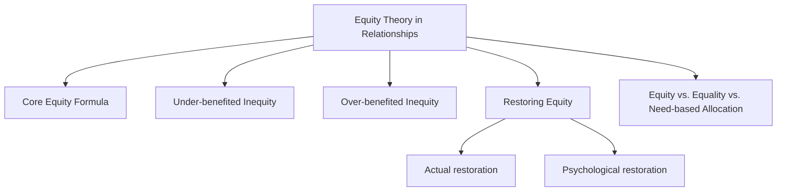
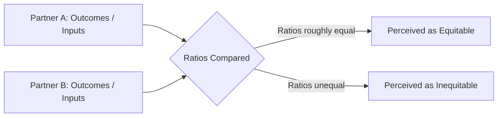
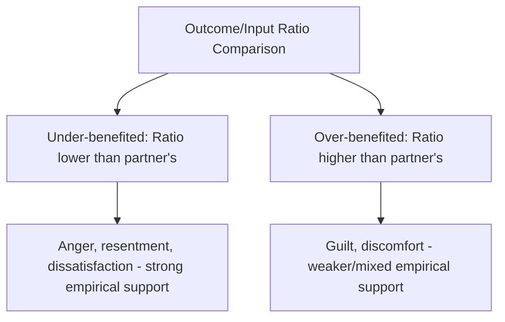
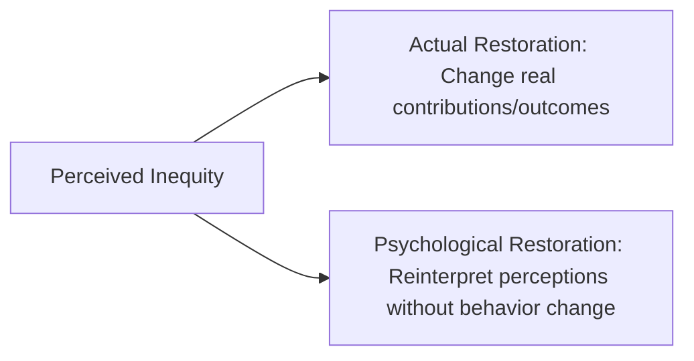

## Equity Theory in Relationships

### Overview

Equity theory is a framework in relationship science proposing that relationship satisfaction depends not simply on the absolute level of rewards a person receives, but on the **perceived fairness of the ratio between what each partner puts into the relationship (inputs) and what each partner gets out of it (outcomes)**, relative to their partner's ratio. Developed by **Elaine Walster (Hatfield), G. William Walster, and Ellen Berscheid**, equity theory extends and refines the broader social exchange framework by placing comparative fairness, rather than pure individual outcome maximization, at the center of relationship evaluation.

### The Core Equity Principle

**Definition**

Equity theory proposes that a relationship is perceived as equitable — and therefore most conducive to satisfaction — when each partner's ratio of outcomes to inputs is roughly equal to the other partner's ratio, rather than when the two partners' absolute outcomes or absolute inputs are equal to one another.

$$\frac{\text{Partner A's Outcomes}}{\text{Partner A's Inputs}} = \frac{\text{Partner B's Outcomes}}{\text{Partner B's Inputs}}$$

**Key Points**

- **Inputs** are what a person contributes to the relationship: effort, time, emotional labor, financial resources, physical attractiveness, status, or any other resource perceived as a contribution.
- **Outcomes** are what a person receives from the relationship: emotional support, companionship, financial benefit, sexual intimacy, and other rewards, net of relationship costs.
- Critically, equity is a **ratio comparison**, not an absolute-value comparison — two partners can have very different absolute levels of inputs and outcomes and still be in an equitable relationship, so long as their respective outcome-to-input ratios match.

### Two Forms of Inequity

Equity theory makes a notable and distinguishing prediction: inequity can be experienced from **either direction**, and both are theorized to produce psychological distress, though the nature of the distress differs.

**1. Under-benefited Inequity**

- Occurs when a person perceives their outcome-to-input ratio as **lower** than their partner's — they are contributing more relative to what they receive, compared to their partner's balance.
- Associated with feelings of **anger, resentment, and dissatisfaction**.
- This is the more intuitive and commonly discussed direction of inequity, and empirical research has generally found robust support for the prediction that under-benefited individuals report lower relationship satisfaction.

**2. Over-benefited Inequity**

- Occurs when a person perceives their outcome-to-input ratio as **higher** than their partner's — they are receiving more relative to what they contribute, compared to their partner's balance.
- Associated with feelings of **guilt and discomfort**, according to the theory's original formulation.
- [Inference] This over-benefit distress prediction is one of equity theory's most distinctive theoretical contributions, since it goes against a simpler "more rewards always equals more satisfaction" assumption; however, empirical support for the over-benefit discomfort prediction has generally been found to be weaker and less consistent across studies than support for under-benefit dissatisfaction, suggesting people may not experience being over-benefited as distressing to the same degree the original theory proposed, or that the discomfort is more easily minimized or rationalized than resentment from being under-benefited.

### Restoring Equity

**Key Points**

Equity theory proposes that individuals experiencing perceived inequity are motivated to restore balance, through either **actual** or **psychological** restoration.

**Actual restoration:**

- Changing real behavior to rebalance the outcome-to-input ratio — for example, an under-benefited partner might reduce their own contributions (doing less housework, offering less emotional support) to bring their input down in line with their outcomes, or might directly request greater contribution or reward from their partner.
- An over-benefited partner might increase their own contributions or reduce their outcomes to restore balance (e.g., taking on more responsibilities, or declining certain benefits).

**Psychological restoration:**

- Cognitively reinterpreting the situation to perceive it as more equitable than it actually is, without any actual behavioral change — for example, minimizing the perceived value of one's own inputs ("my contribution isn't really that significant anyway"), or reframing the partner's inputs as more substantial than initially perceived ("they contribute in ways I hadn't fully appreciated").
- [Inference] Psychological restoration is theorized as a lower-effort alternative to actual behavioral restoration, and may be more likely to occur when actual restoration is difficult, costly, or would threaten the relationship itself — this cost-based tradeoff between the two restoration strategies is a reasonable theoretical extension of the core equity framework rather than a separately, independently validated sub-principle with its own dedicated body of confirming studies.

### Equity vs. Equality vs. Need-Based Allocation

**Key Points**

It is important to distinguish equity from two related but conceptually distinct fairness principles that can also govern resource allocation in relationships:

| Allocation Principle | Core Logic | Typical Context |
| --- | --- | --- |
| **Equity** | Outcomes proportional to inputs/contributions | Often emphasized in more exchange-oriented or task-based relationship contexts |
| **Equality** | Outcomes distributed equally regardless of relative input | Often emphasized in relationships prioritizing harmony and solidarity over strict merit-tracking |
| **Need-based allocation** | Outcomes distributed according to who needs them most | Often emphasized in close, communal relationships — family, close friends, long-term romantic partners |

- [Inference] Some relationship research, building on the **communal vs. exchange relationship distinction** (Clark & Mills), suggests that strict equity/ratio-based accounting may be more characteristic of relationship *types* governed by exchange norms (casual or newer relationships), while close, communal relationships (established romantic partnerships, close family) may be better described by need-based allocation norms, where partners give according to need rather than strictly tracking proportional contribution — implying equity theory's applicability may itself be moderated by relationship type, a nuance recognized within the broader equity and social exchange literature rather than a challenge external to it.

### Perceived vs. Objective Equity

**Key Points**

- A crucial feature of equity theory is that it operates on **perceived** equity, not objectively measured or externally verifiable equity — two partners in the same relationship can have differing perceptions of whether the relationship is equitable, since each partner may weigh and value different inputs and outcomes differently.
- [Inference] Some research on household labor division, for instance, has found that partners' subjective perceptions of the fairness of labor division do not always align closely with more objective time-use measurements of actual labor contributed, illustrating that equity theory's predictive power operates through the subjective perception of fairness rather than through any external, objectively calculated balance.

### Practical Example

**Example**

In a dual-income couple, one partner works longer paid hours while the other manages the majority of household and childcare responsibilities. If both partners perceive their respective contributions as valuable and roughly proportional to what each receives from the relationship (companionship, shared financial security, mutual support), the relationship may be experienced as equitable despite the very different *kinds* of inputs each partner provides. If, however, one partner comes to feel their contribution (whether paid labor or household labor) is undervalued relative to what they receive compared to their partner's balance, resentment consistent with under-benefited inequity may develop — even if, by some external measure, contributions appear roughly balanced in total time or effort.

### Comparative Summary Table

| Concept | Description |
| --- | --- |
| Core principle | Outcome-to-input ratios should match between partners for equity |
| Under-benefited inequity | Lower ratio than partner; predicts anger, resentment, dissatisfaction (strong support) |
| Over-benefited inequity | Higher ratio than partner; predicts guilt, discomfort (weaker/mixed support) |
| Actual restoration | Behavioral change to rebalance real inputs/outcomes |
| Psychological restoration | Cognitive reinterpretation without behavioral change |
| Distinguishing feature vs. social exchange | Focus on comparative fairness between partners, not just individual outcome maximization |
| Key moderating distinction | Communal (need-based) vs. exchange (equity-based) relationship norms |

### Real-World and Applied Contexts

- **Couples counseling around household labor:** Equity theory is frequently applied in relationship counseling addressing disputes over division of household labor, childcare, and emotional labor, helping partners articulate and compare their respective perceived inputs and outcomes rather than relying on assumptions about fairness.
- **Workplace and organizational applications:** Equity theory was also independently influential in organizational psychology (via related work, sometimes attributed to J. Stacy Adams's parallel equity theory of workplace motivation), where perceived fairness of the effort-reward ratio relative to coworkers is used to explain employee motivation, satisfaction, and turnover — a close conceptual parallel to the relationship-focused version discussed here.
- **Long-term caregiving relationships:** Equity considerations are relevant in research on caregiving relationships (e.g., a spouse caring for a partner with a long-term illness), where a substantial and potentially long-lasting imbalance in inputs and outcomes can create emotional strain, informing counseling and support approaches for caregivers.
- **Premarital and relationship education:** Discussions of equity, alongside communal relationship norms, are sometimes incorporated into relationship education programs to help couples develop shared expectations about fairness and contribution before conflicts over perceived inequity arise.

**Related Topics**

- Social exchange theory
- Communal vs. exchange relationships (Clark & Mills)
- Norm of reciprocity and social responsibility norm
- Passionate versus companionate love
- Attachment theory in adult relationships
- Sternberg's triangular theory of love
- Relationship satisfaction and longitudinal trajectories
- Household labor division research