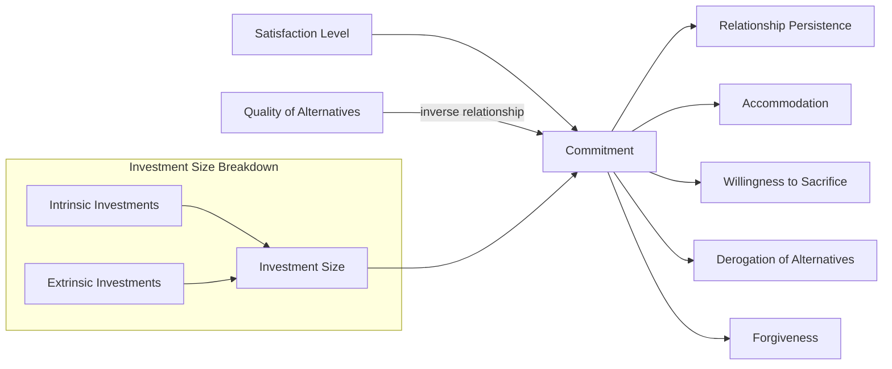

## Investment Model of Commitment

### Definition

The **Investment Model of Commitment** (Rusbult, 1980, 1983) is a theoretical framework predicting relationship commitment and persistence based on three independent factors: satisfaction level, quality of alternatives, and investment size. It extends interdependence theory (Kelley & Thibaut) by explicitly separating *satisfaction* (how good the relationship feels) from *commitment* (the intention and psychological attachment to remain), arguing that people can remain committed to relationships they find unsatisfying, and can leave relationships they find satisfying, depending on the other two factors.

### Historical and Theoretical Background

- Rooted in **interdependence theory** and social exchange principles (Thibaut & Kelley, 1959), which frame relationships in terms of costs, rewards, and comparison levels.
- Caryl Rusbult introduced the model in her 1980 doctoral work and formalized it in a series of papers through the 1980s–1990s, culminating in the widely used **Investment Model Scale** (Rusbult, Martz, & Agnew, 1998), a validated self-report measure still in common use in relationship research.
- The model was explicitly developed to explain a puzzling empirical pattern: why people (notably in abusive relationship research) often remain in low-satisfaction relationships — a question satisfaction-based models alone could not answer.

### The Three Core Components

1. **Satisfaction Level**: The degree to which a relationship fulfills a person's important needs, assessed relative to their **comparison level** (an internalized standard for what a relationship "should" provide, shaped by past experience and expectations). High reward-to-cost ratio relative to this standard produces high satisfaction.
2. **Quality of Alternatives**: The perceived desirability of the best available alternative to the current relationship — which may include another partner, being single, or investing more in friends/family/other pursuits — assessed relative to the **comparison level for alternatives**. Low perceived alternative quality (whether accurate or not) increases dependence on the current relationship.
3. **Investment Size**: The magnitude and importance of resources attached to the relationship that would be lost or diminished in value upon its dissolution. Investments are further divided into:
   - **Intrinsic investments**: Resources put directly into the relationship (time, emotional disclosure, effort, shared experiences).
   - **Extrinsic investments**: Resources originally external to the relationship that have become entangled with it (mutual friends, shared possessions, children, financial entanglement, social identity as a couple).

### Formal Model Structure

$$\text{Commitment} = f(\text{Satisfaction Level}) + f(\text{Quality of Alternatives, inverted}) + f(\text{Investment Size})$$

In prose: commitment increases as satisfaction increases, decreases as the quality of alternatives increases, and increases as investment size increases. Critically, the model proposes these three predictors have **largely independent, additive effects** — meaning a relationship can be low in satisfaction yet high in commitment if investments are large and alternatives are poor (or vice versa).

**Commitment**, in turn, is proposed as the most proximal and strongest predictor of relationship *persistence* — measured behaviorally through outcomes like staying versus leaving, accommodating a partner's negative behavior, or engaging in relationship-maintenance behaviors — with satisfaction, alternatives, and investment operating substantially through commitment rather than directly predicting persistence on their own.

### Key Empirical Findings

**Rusbult (1983) — Longitudinal Test**

A multi-wave study of dating couples found that increases in satisfaction and investment size, and decreases in alternative quality, predicted increased commitment over time, and commitment predicted whether the relationship persisted or dissolved at follow-up.

**Rusbult & Martz (1995) — Abusive Relationships**

Applied the model to women in shelters for domestic violence, finding that investment size and poor perceived alternatives (not merely satisfaction) predicted the likelihood of returning to an abusive partner — providing one of the model's most cited real-world validations, since satisfaction alone poorly explained staying behavior in this population.

**Le & Agnew (2003) — Meta-Analysis**

A meta-analysis across 52 studies and multiple countries found consistent support for all three predictors of commitment, with satisfaction typically showing the strongest independent association, followed by investment size and alternative quality — while confirming the model's cross-cultural and cross-relationship-type generalizability (dating, marital, and homosexual/heterosexual couples alike). [Note: relative predictor strength varies by sample and relationship stage; treat "satisfaction strongest" as a general pattern rather than a fixed ranking.]

### Downstream Behavioral Correlates of Commitment

The model has been extended to predict several relationship-maintenance mechanisms beyond simple persistence:

- **Accommodation**: Responding constructively (rather than destructively) to a partner's potentially relationship-threatening behavior; committed individuals show greater willingness to accommodate.
- **Willingness to sacrifice**: Forgoing immediate self-interest for the relationship's benefit.
- **Derogation of alternatives**: Committed individuals often perceptually devalue attractive alternative partners, a motivated-cognition process that protects the relationship from temptation (linked conceptually to motivated reasoning).
- **Positive illusions**: Idealizing the current partner relative to objective standards, correlated with commitment strength.
- **Forgiveness**: Higher commitment is associated with greater willingness to forgive partner transgressions.

### Distinguishing Related Concepts

| Concept | Focus | Relation to Investment Model |
| --- | --- | --- |
| Investment Model | Predicts commitment from satisfaction, alternatives, investment | Core framework |
| Interdependence Theory | General theory of outcomes in interdependent relationships | Theoretical parent framework |
| Social Exchange Theory | Costs/rewards drive relationship evaluation broadly | Shared conceptual ancestry |
| Sunk Cost Fallacy | Continuing investment due to past (irrecoverable) costs, even when irrational | Conceptually related to the investment component but distinct — the Investment Model treats investment as a legitimate, ongoing predictor of dependence, not necessarily an error |
| Attachment Theory | Internal working models shaping relational security and behavior | Complementary but separate framework; attachment style can moderate how investment/alternatives are perceived |

### Practical / Applied Examples

- **Premarital counseling**: Practitioners assess perceived alternatives and investment alongside satisfaction, since a couple reporting moderate satisfaction may still show strong long-term stability if investments (shared property, children, long tenure) are substantial.
- **Understanding relationship inertia**: Explains why couples with declining satisfaction (e.g., "empty shell" marriages) may persist for years — largely a function of high investment and/or low perceived alternatives rather than continued relational reward.
- **Domestic violence intervention design**: Programs informed by this model focus on improving survivors' perceived alternatives (housing, financial independence, social support) rather than solely addressing relationship satisfaction, since alternatives and investment are frequently the operative barriers to leaving.
- **Workplace and non-romantic applications**: The model has been adapted (with modification) to organizational commitment research, examining employee retention as a function of job satisfaction, quality of alternative employment, and sunk investments (tenure, benefits, relationships with colleagues).

### Boundary Conditions and Critiques

- **Cross-sectional vs. longitudinal evidence**: Much support comes from concurrent correlational data; while multiple longitudinal studies (e.g., Rusbult, 1983) support directional/causal interpretation, the balance of designs still leans correlational within the broader literature. [Inference: causal strength claims should be tempered accordingly for any single study not explicitly longitudinal/experimental.]
- **Measurement of "alternatives"**: Perceived alternative quality is subjective and can be distorted by commitment itself (via derogation of alternatives), raising questions about the directionality of the alternatives–commitment relationship — commitment may partly *cause* perceived alternatives to seem worse, not only the reverse.
- **Cultural variation**: While cross-cultural replications generally support the model, the relative weighting of components (e.g., extrinsic investments like family obligation) may vary across collectivist versus individualist cultural contexts. [Inference: the model's structure appears to generalize, but component weighting likely varies by cultural context; this is not fully settled across all populations studied.]
- **Does not fully address relationship quality/type distinctions**: The model was developed primarily on romantic dyads and may require adaptation (as with organizational commitment) for other relationship types.

### Diagram: Investment Model Structure

### Diagram: Satisfaction vs. Commitment Divergence (svg_diagram)

<svg xmlns="http://www.w3.org/2000/svg" viewBox="0 0 720 340" font-family="sans-serif">
<text x="360" y="26" text-anchor="middle" font-size="17" font-weight="bold" fill="#1a1a2e">Why Satisfaction ≠ Commitment (svg_diagram)</text>
<line x1="80" y1="290" x2="650" y2="290" stroke="#333" stroke-width="1.5" />
<line x1="80" y1="290" x2="80" y2="60" stroke="#333" stroke-width="1.5" />
<text x="365" y="318" text-anchor="middle" font-size="12" fill="#333">Satisfaction Level</text>
<text x="30" y="175" text-anchor="middle" font-size="12" fill="#333" transform="rotate(-90 30 175)">Commitment</text>
<rect x="120" y="100" width="220" height="150" rx="8" fill="#fdeaea" stroke="#ea4335" stroke-width="2" />
<text x="230" y="130" text-anchor="middle" font-size="13" font-weight="bold" fill="#7c1a1a">Low Satisfaction,</text>
<text x="230" y="148" text-anchor="middle" font-size="13" font-weight="bold" fill="#7c1a1a">High Commitment</text>
<text x="230" y="175" text-anchor="middle" font-size="11" fill="#333">High investment</text>
<text x="230" y="193" text-anchor="middle" font-size="11" fill="#333">(shared history, children,</text>
<text x="230" y="211" text-anchor="middle" font-size="11" fill="#333">finances) +</text>
<text x="230" y="229" text-anchor="middle" font-size="11" fill="#333">poor perceived alternatives</text>
<rect x="390" y="100" width="220" height="150" rx="8" fill="#e6f4ea" stroke="#34a853" stroke-width="2" />
<text x="500" y="130" text-anchor="middle" font-size="13" font-weight="bold" fill="#1e5e2e">High Satisfaction,</text>
<text x="500" y="148" text-anchor="middle" font-size="13" font-weight="bold" fill="#1e5e2e">Low Commitment</text>
<text x="500" y="175" text-anchor="middle" font-size="11" fill="#333">Low investment</text>
<text x="500" y="193" text-anchor="middle" font-size="11" fill="#333">(early-stage relationship) +</text>
<text x="500" y="211" text-anchor="middle" font-size="11" fill="#333">attractive alternatives</text>
<text x="500" y="229" text-anchor="middle" font-size="11" fill="#333">available</text>
</svg>

### Related Topics

- Interdependence theory (Thibaut & Kelley)
- Sunk cost fallacy and behavioral economics parallels
- Attachment theory and relational security
- Derogation of alternatives and motivated cognition in relationships
- Accommodation and the exit-voice-loyalty-neglect (EVLN) model
- Domestic violence and barriers to relationship exit
- Organizational commitment models (adapted investment frameworks)
- Comparison level and comparison level for alternatives (interdependence theory constructs)
- Relationship maintenance behaviors
- Triangular theory of love (Sternberg) — commitment as a component