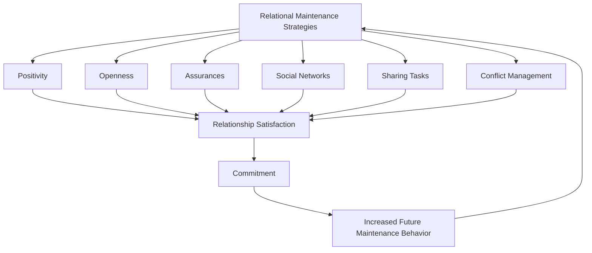

## Relationship Maintenance Strategies

### Definition

**Relationship maintenance strategies** refer to the behaviors and cognitive/communicative processes partners use to sustain, stabilize, or improve the quality and continuity of a relationship over time. The construct spans both deliberate, strategic communication behaviors and more automatic or routine relational behaviors that keep a relationship functioning at a desired state, and is studied across romantic, family, and friendship relationships (though most empirical work concentrates on romantic dyads).

### Historical and Theoretical Background

- Early work in interpersonal communication research (**Dindia & Baxter, 1987**) catalogued naturally occurring strategies partners use to maintain relationships, laying groundwork for typological approaches.
- **Stafford & Canary (1991)** developed the most widely used empirical typology and the associated **Relational Maintenance Behavior Scale**, identifying five core strategy dimensions still used as the field's standard framework.
- Maintenance research draws on **interdependence theory** and the **investment model** (Rusbult) for its motivational underpinnings, and on **equity theory** for understanding fairness perceptions in maintenance effort.
- **Rusbult's accommodation model** (via the Exit-Voice-Loyalty-Neglect / EVLN framework, Rusbult, Zembrodt, & Gunn, 1982) provides a complementary behavioral framework specifically addressing responses to partner transgressions, often integrated with maintenance research.

### The Stafford & Canary Five-Factor Typology

1. **Positivity**: Behaving in a cheerful, optimistic, and uncritical manner toward the partner; making interactions pleasant.
2. **Openness**: Direct disclosure and discussion of the relationship itself — talking about the state, feelings, and expectations within it.
3. **Assurances**: Statements or actions signaling commitment to the relationship's continuation and the partner's importance.
4. **Social Networks**: Relying on and maintaining relationships with shared friends, family, and mutual social connections that reinforce the couple bond.
5. **Sharing Tasks**: Performing routine responsibilities (household labor, joint duties) that keep shared functioning stable.

A later expansion (Stafford, Dainton, & Haas, 2000) added a sixth dimension, **Conflict Management** (constructive rather than destructive handling of disagreements), reflecting its centrality to maintenance outcomes.

### Complementary Behavioral Frameworks

**Exit-Voice-Loyalty-Neglect (EVLN) Model** (Rusbult, Zembrodt, & Gunn, 1982)

Categorizes responses to relationship dissatisfaction or partner transgressions along two dimensions — constructive/destructive and active/passive:

|  | Active | Passive |
| --- | --- | --- |
| **Constructive** | Voice (directly addressing the problem) | Loyalty (waiting/hoping it improves) |
| **Destructive** | Exit (ending or threatening to end) | Neglect (ignoring, allowing decline) |

**Accommodation** (Rusbult, Verette, Whitney, Slovik, & Lipkus, 1991)

The tendency to respond constructively (Voice/Loyalty) rather than destructively (Exit/Neglect) when a partner behaves badly. Accommodation is one of the most robust behavioral predictors of relationship satisfaction and commitment, and is itself predicted by commitment level (per the investment model).

**Michelangelo Phenomenon** (Drigotas, Rusbult, Wieselquist, & Whitton, 1999)

A partner-affirmation process in which one partner's behavior "sculpts" the other toward their **ideal self** — maintenance here operates through mutual growth facilitation rather than routine behavior, with partners who affirm each other's ideal selves showing higher relationship well-being.

### Key Empirical Findings

**Stafford & Canary (1991) — Original Validation**

Established that positivity and assurances were the strongest and most consistent predictors of relational satisfaction, commitment, and control mutuality (perceived balance of influence) across married and dating samples.

**Canary & Stafford (1992) — Equity and Maintenance**

Found that partners who perceived their relationship as equitable (fair balance of contributions) reported higher use of maintenance behaviors by both partners; under-benefited partners reported using *fewer* maintenance behaviors, consistent with equity theory predictions.

**Dainton & Aylor (2002) and subsequent CMC-era research**

Extended maintenance research into mediated/long-distance contexts, finding that technologically-mediated communication (calls, texts, and later social media) could support maintenance functions comparably to face-to-face contact under certain conditions, though qualitative richness of channel remained a relevant factor. [Inference: exact equivalence of mediated vs. in-person maintenance likely depends on relationship stage and communication quality, not channel alone.]

**Ogolsky & Bowers (2013) — Meta-Analysis**

A meta-analytic review confirmed positive associations between overall maintenance behavior use and relational satisfaction, commitment, and love across the literature, with assurances and positivity showing the most consistent effect sizes.

### Distinguishing Related Concepts

| Concept | Focus | Relation to Maintenance Strategies |
| --- | --- | --- |
| Relationship maintenance | Behaviors sustaining relationship quality/continuity | Core topic |
| Investment model | Predicts commitment from satisfaction/alternatives/investment | Provides motivational rationale for *why* maintenance occurs |
| Accommodation | Constructive response to partner transgressions | A specific maintenance-relevant behavior, narrower in scope |
| Equity theory | Fairness perception in exchange relationships | Explains conditions under which maintenance effort is reciprocated or withheld |
| Attachment theory | Internal working models of relational security | Moderates which maintenance strategies partners are inclined to use (e.g., anxious vs. avoidant patterns) |
| Conflict resolution styles | Specific communication tactics during disagreement | A component/subset often folded into broader maintenance typologies |

### Individual Differences and Moderators

- **Attachment style**: Securely attached individuals typically report more frequent and effective use of positivity, openness, and assurances; anxiously attached individuals may over-rely on assurance-seeking; avoidantly attached individuals may underuse openness and disclosure-based strategies.
- **Relationship stage**: Maintenance strategy emphasis shifts across relationship development — openness and assurance may be more salient early, while task-sharing and network integration become more central in long-term/cohabiting relationships.
- **Gender**: Some studies report modest average differences in strategy use (e.g., women reporting relatively higher use of positivity and openness in some samples), though effect sizes are generally small and inconsistent across studies/cultures. [Unverified/contested: gender-difference findings in this literature show meaningful heterogeneity and should not be treated as fixed patterns.]
- **Relationship type**: Married, dating, and long-distance relationships show different weighting of maintenance dimensions (e.g., social network maintenance may be more central for cohabiting/married couples with shared social circles).
- **Cultural context**: Collectivist vs. individualist cultural norms may shape the relative salience of network-oriented versus dyad-focused maintenance strategies. [Inference: cross-cultural maintenance research is comparatively limited, so this should be treated as a plausible but not fully established pattern.]

### Practical / Applied Examples

- **Couples therapy**: Interventions often explicitly target underused maintenance dimensions (e.g., coaching increased assurance-giving or structured "state of the relationship" conversations mapping onto openness).
- **Long-distance relationship coaching**: Practical guidance frequently centers on compensating for reduced face-to-face positivity/task-sharing opportunities through increased scheduled communication and explicit assurance behaviors.
- **Premarital and marital education programs**: Curricula frequently incorporate the five/six-factor typology directly, teaching couples to recognize and intentionally deploy underused strategies.
- **Workplace and non-romantic adaptation**: The typology has been adapted to study friendship maintenance and long-distance friendships, and even organizational relationship maintenance between coworkers or supervisor-subordinate pairs.

### Common Misconceptions

- Maintenance behaviors are **not** limited to grand romantic gestures; the empirical literature emphasizes mundane, routine behaviors (household tasks, small assurances, casual positivity) as the primary drivers of relational stability.
- High maintenance behavior use does **not** guarantee relationship satisfaction in isolation — equity perceptions and mutual reciprocity substantially condition whether maintenance efforts translate into positive relational outcomes.
- Constructive conflict handling (Voice) is **not** the same as avoiding conflict altogether; the EVLN model treats passive avoidance (Loyalty/Neglect) as distinct from, and often less effective than, active constructive engagement (Voice) for addressing genuine problems.
- Mediated communication (texting, social media) is **not** inherently inferior for maintenance purposes; its effectiveness depends on how it is used rather than the channel itself. [Inference: this is an area of active and evolving research, particularly as communication technology continues to change.]

### Diagram: Relationship Maintenance Strategy Model

### Diagram: EVLN Model of Responses to Relationship Problems (svg_diagram)

<svg xmlns="http://www.w3.org/2000/svg" viewBox="0 0 640 420" font-family="sans-serif">
<text x="320" y="26" text-anchor="middle" font-size="17" font-weight="bold" fill="#1a1a2e">Exit-Voice-Loyalty-Neglect Model (svg_diagram)</text>
<line x1="320" y1="60" x2="320" y2="380" stroke="#888" stroke-width="1" />
<line x1="80" y1="220" x2="560" y2="220" stroke="#888" stroke-width="1" />

<text x="130" y="75" text-anchor="middle" font-size="12" fill="#555">Active</text>

<text x="510" y="75" text-anchor="middle" font-size="12" fill="#555">Passive</text>

<text x="60" y="150" text-anchor="middle" font-size="12" fill="#555" transform="rotate(-90 60 150)">Constructive</text>

<text x="60" y="330" text-anchor="middle" font-size="12" fill="#555" transform="rotate(-90 60 330)">Destructive</text>

<rect x="90" y="90" width="200" height="120" rx="8" fill="#e6f4ea" stroke="#34a853" stroke-width="2" />
<text x="190" y="140" text-anchor="middle" font-size="14" font-weight="bold" fill="#1e5e2e">VOICE</text>
<text x="190" y="165" text-anchor="middle" font-size="11" fill="#333">Directly discussing and</text>
<text x="190" y="183" text-anchor="middle" font-size="11" fill="#333">addressing the problem</text>
<rect x="350" y="90" width="200" height="120" rx="8" fill="#e8f0fe" stroke="#4285f4" stroke-width="2" />
<text x="450" y="140" text-anchor="middle" font-size="14" font-weight="bold" fill="#1a3d7c">LOYALTY</text>
<text x="450" y="165" text-anchor="middle" font-size="11" fill="#333">Passively waiting and</text>
<text x="450" y="183" text-anchor="middle" font-size="11" fill="#333">hoping conditions improve</text>
<rect x="90" y="230" width="200" height="120" rx="8" fill="#fdeaea" stroke="#ea4335" stroke-width="2" />
<text x="190" y="280" text-anchor="middle" font-size="14" font-weight="bold" fill="#7c1a1a">EXIT</text>
<text x="190" y="305" text-anchor="middle" font-size="11" fill="#333">Ending or threatening</text>
<text x="190" y="323" text-anchor="middle" font-size="11" fill="#333">to end the relationship</text>
<rect x="350" y="230" width="200" height="120" rx="8" fill="#fce8e6" stroke="#c5221f" stroke-width="2" />
<text x="450" y="280" text-anchor="middle" font-size="14" font-weight="bold" fill="#7c1a1a">NEGLECT</text>
<text x="450" y="305" text-anchor="middle" font-size="11" fill="#333">Ignoring the problem,</text>
<text x="450" y="323" text-anchor="middle" font-size="11" fill="#333">allowing conditions to decline</text>
</svg>

### Related Topics

- Investment model of commitment
- Exit-Voice-Loyalty-Neglect (EVLN) model and accommodation
- Equity theory in close relationships
- Michelangelo phenomenon and partner affirmation
- Attachment theory and relational security
- Conflict resolution and communication accommodation
- Long-distance relationship maintenance in mediated communication
- Social exchange theory
- Relational dialectics theory
- Self-expansion model of romantic relationships