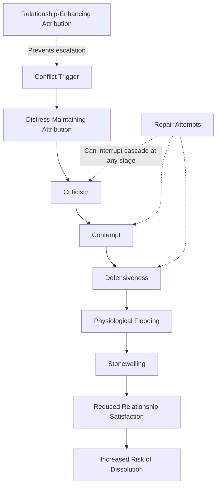

## Communication Patterns and Conflict Resolution

### Definition

**Communication patterns and conflict resolution** in close relationships refers to the recurring interactional sequences partners use when disagreements arise, and the empirically identified styles of engaging with (or avoiding) conflict that predict relational satisfaction, stability, and dissolution. This area integrates observational communication research, physiological/affective science, and longitudinal relationship outcome studies, most extensively developed through the work of **John Gottman** and colleagues, alongside complementary demand-withdraw and attribution-based frameworks.

### Historical and Theoretical Background

- **Gottman's observational research program** (beginning in the late 1970s, "Gottman Lab"/"Love Lab") used direct behavioral coding of couples' interactions (often combined with physiological measures like heart rate) to identify communication patterns that longitudinally predict divorce and relationship dissolution with notable accuracy in his samples.
- **Christensen & Heavey's demand-withdraw pattern** (1990s) built on earlier family systems and marital research to characterize a specific, gendered-in-tendency interaction cycle strongly linked to dissatisfaction.
- **Attribution theory applied to marriage** (Bradbury & Fincham, 1990) examined how partners' causal explanations for each other's behavior (distress-maintaining vs. relationship-enhancing attributions) shape conflict trajectories.
- These lines of research converge on a central finding: **how** couples communicate during conflict — not merely whether conflict occurs — is a stronger predictor of relational outcomes than conflict frequency itself.

### Gottman's Four Horsemen of the Apocalypse

A set of four specific negative communication behaviors identified through longitudinal observational coding as particularly corrosive to relationships, presented in an escalating cascade:

1. **Criticism**: Attacking a partner's character or personality rather than addressing a specific behavior ("You always..." / "You never..." framing directed at who the person *is*).
2. **Contempt**: Communicating disgust, disrespect, or superiority — including sarcasm, mockery, eye-rolling, and name-calling. Gottman's research identifies contempt as the single strongest predictor of relationship dissolution among the four.
3. **Defensiveness**: Responding to a perceived attack by deflecting responsibility, counter-complaining, or playing the victim rather than addressing the partner's concern.
4. **Stonewalling**: Withdrawing from the interaction — emotional and physical shutdown, minimal engagement, and avoidance of the conflict altogether, often following physiological flooding.

**Physiological Flooding**: A state of diffuse physiological arousal (elevated heart rate, cortisol) during conflict that impairs the capacity for effective communication and information processing, frequently preceding stonewalling behavior.

### Gottman's Antidotes to the Four Horsemen

| Horseman | Proposed Antidote |
| --- | --- |
| Criticism | Gentle start-up: raising an issue using "I" statements focused on a specific behavior and need, rather than global character attacks |
| Contempt | Building a culture of appreciation and respect; expressing fondness and admiration |
| Defensiveness | Taking (partial) responsibility for one's contribution to the problem |
| Stonewalling | Physiological self-soothing and structured breaks to de-escalate before re-engaging |

### The Demand-Withdraw Pattern

**Definition**: A cyclical interaction in which one partner (the demander) pursues discussion, criticism, or change-oriented pressure regarding an issue, while the other partner (the withdrawer) responds by disengaging, avoiding, or shutting down the conversation — which in turn intensifies the demanding partner's pursuit, creating a self-reinforcing negative cycle.

**Key findings** (Christensen & Heavey, 1990; Eldridge & Christensen, 2002):

- The pattern is one of the most robust and cross-culturally replicated predictors of concurrent and longitudinal marital dissatisfaction.
- A commonly observed (though not universal) gendered tendency in heterosexual couples finds women somewhat more likely to occupy the demand role and men the withdraw role, though this pattern is better explained by **who wants change in the relationship** (structural/role-based factors) than by gender per se — the demanding role tends to fall to whichever partner desires more change on a given issue. [Inference: the "who wants change" explanation is the field's dominant account, though gendered socialization likely also contributes to why demand roles distribute unevenly across many samples.]

### Attribution Processes in Conflict

**Distress-Maintaining Attributions**: Explaining a partner's negative behavior in terms of stable, global, internal causes ("He's always inconsiderate — that's just who he is") — associated with escalating conflict and lower satisfaction.

**Relationship-Enhancing Attributions**: Explaining a partner's negative behavior in terms of unstable, specific, external causes ("She's just having a stressful week at work") while attributing positive behavior to stable, internal causes — associated with more constructive conflict engagement and higher satisfaction.

Bradbury & Fincham's (1990) review established that these attributional styles function bidirectionally with satisfaction: dissatisfaction promotes distress-maintaining attributions, and distress-maintaining attributions further erode satisfaction, forming a **self-perpetuating cycle**.

### Additional Conflict Communication Constructs

- **Negative affect reciprocity**: The tendency for one partner's negative communication (e.g., criticism) to be immediately met with negative communication from the other, creating rapid escalation; the *strength* of this reciprocity pattern (not merely its presence) is a robust predictor of distress in Gottman's research.
- **Repair attempts**: Statements or behaviors (humor, affection, de-escalation cues) intended to interrupt escalating negativity during conflict; the capacity to make and *accept* repair attempts is a key predictor of stable relationships in Gottman's model.
- **The 5:1 ratio ("magic ratio")**: Gottman's research proposed that stable couples maintain a ratio of roughly five positive to one negative interaction during conflict discussions, though the specific numeric ratio has drawn methodological critique in subsequent years regarding its derivation and generalizability. [Contested/Unverified: several methodologists have raised concerns about the mathematical modeling underlying this specific ratio; treat the precise number with caution while the broader positive-to-negative balance concept remains influential.]

### Key Empirical Studies

**Gottman & Levenson (1992, 1999, 2000) — Longitudinal Predictive Studies**

A series of studies following couples over years found that observational coding of conflict interactions (presence of the Four Horsemen, physiological arousal patterns) predicted divorce with reported accuracy substantially above chance in Gottman's samples — though independent replication of the specific predictive accuracy figures has been more limited and is a point of ongoing methodological discussion in the field. [Unverified/contested: the widely cited high-accuracy prediction figures come primarily from the original research team's own samples; broader independent replication of the exact predictive percentages is more limited.]

**Christensen & Heavey (1990) — Demand-Withdraw Origins**

Experimentally manipulated which partner selected the discussion topic and found the demand-withdraw pattern shifted accordingly — supporting the "who wants change" structural explanation over a purely gender-based one.

**Bradbury & Fincham (1990) — Attribution Review**

Synthesized substantial evidence that attributional style operates as both a marker and a driver of marital distress, establishing attribution retraining as a viable therapeutic target.

### Distinguishing Related Concepts

| Concept | Focus | Relation to This Topic |
| --- | --- | --- |
| Four Horsemen | Specific toxic communication behaviors | Core negative pattern typology |
| Demand-Withdraw | Cyclical pursue/avoid interaction pattern | Distinct interaction structure, can co-occur with Four Horsemen behaviors |
| Attribution theory | Causal explanations for partner behavior | Cognitive layer underlying and shaping conflict communication |
| Investment model | Commitment based on satisfaction/alternatives/investment | Conflict communication quality is a major input into the satisfaction component |
| Accommodation (EVLN) | Constructive vs. destructive response to transgressions | Overlaps conceptually; accommodation is a broader response category, conflict communication patterns are specific tactics within it |

### Applied and Clinical Relevance

- **Gottman Method Couples Therapy**: A structured clinical intervention directly built on this research, targeting horsemen reduction, repair attempt training, and building the "sound relationship house" (a broader model incorporating friendship, shared meaning, and conflict management).
- **Premarital and psychoeducation programs** (e.g., PREP — Prevention and Relationship Enhancement Program): Incorporate demand-withdraw awareness and structured communication protocols (e.g., speaker-listener technique) to interrupt escalation cycles before marriage.
- **Attribution retraining interventions**: Cognitive-behavioral couple therapies often explicitly target distress-maintaining attributions, coaching partners toward more relationship-enhancing causal explanations.

### Common Misconceptions

- Conflict itself is **not** the primary predictor of relationship failure; the *manner* of conflict communication (contempt, stonewalling, escalating negative reciprocity) is the more consistently supported predictor across this literature.
- The demand-withdraw pattern is **not** simply a fixed gender difference; role assignment shifts based on who wants change on a given topic, and the pattern is observed (with role reversal) across genders and cultures.
- The "5:1 magic ratio" should **not** be treated as a precise, universally validated numeric threshold; while directionally influential in the field, the specific ratio has faced methodological scrutiny. [Contested]
- High predictive accuracy figures for divorce prediction are **not** uniformly replicated outside the original research program's samples and should be cited with appropriate caution regarding generalizability. [Unverified/contested]

### Diagram: Conflict Communication Cascade

### Diagram: Demand-Withdraw Cycle (svg_diagram)

<svg xmlns="http://www.w3.org/2000/svg" viewBox="0 0 640 340" font-family="sans-serif">
<text x="320" y="26" text-anchor="middle" font-size="17" font-weight="bold" fill="#1a1a2e">The Demand-Withdraw Cycle (svg_diagram)</text>
<ellipse cx="320" cy="180" rx="260" ry="120" fill="none" stroke="#888" stroke-width="1.5" stroke-dasharray="4,3" />
<rect x="80" y="90" width="200" height="90" rx="8" fill="#fdeaea" stroke="#ea4335" stroke-width="2" />
<text x="180" y="125" text-anchor="middle" font-size="14" font-weight="bold" fill="#7c1a1a">Partner A: Demands</text>
<text x="180" y="148" text-anchor="middle" font-size="11" fill="#333">Pursues discussion,</text>
<text x="180" y="164" text-anchor="middle" font-size="11" fill="#333">pressures for change</text>
<rect x="360" y="90" width="200" height="90" rx="8" fill="#e8f0fe" stroke="#4285f4" stroke-width="2" />
<text x="460" y="125" text-anchor="middle" font-size="14" font-weight="bold" fill="#1a3d7c">Partner B: Withdraws</text>
<text x="460" y="148" text-anchor="middle" font-size="11" fill="#333">Disengages, avoids,</text>
<text x="460" y="164" text-anchor="middle" font-size="11" fill="#333">shuts down conversation</text>
<path d="M 280 135 L 360 135" stroke="#333" stroke-width="2" marker-end="url(#arrow1)" />
<path d="M 360 165 L 280 165" stroke="#333" stroke-width="2" marker-end="url(#arrow1)" />
<text x="320" y="240" text-anchor="middle" font-size="12" fill="#555">Withdrawal → intensifies demanding</text>

<text x="320" y="258" text-anchor="middle" font-size="12" fill="#555">Demanding → intensifies withdrawal</text>

<text x="320" y="290" text-anchor="middle" font-size="12" font-style="italic" fill="#555">Self-reinforcing negative cycle</text>

</svg>

### Related Topics

- Gottman Method Couples Therapy and the Sound Relationship House model
- Attribution theory in close relationships (Bradbury & Fincham)
- Investment model of commitment
- Exit-Voice-Loyalty-Neglect (EVLN) model and accommodation
- Physiological flooding and emotion regulation in conflict
- Speaker-listener technique and structured communication protocols (PREP)
- Negative affect reciprocity
- Attachment theory and conflict behavior
- Relationship maintenance strategies
- Divorce prediction and longitudinal marital research methodology