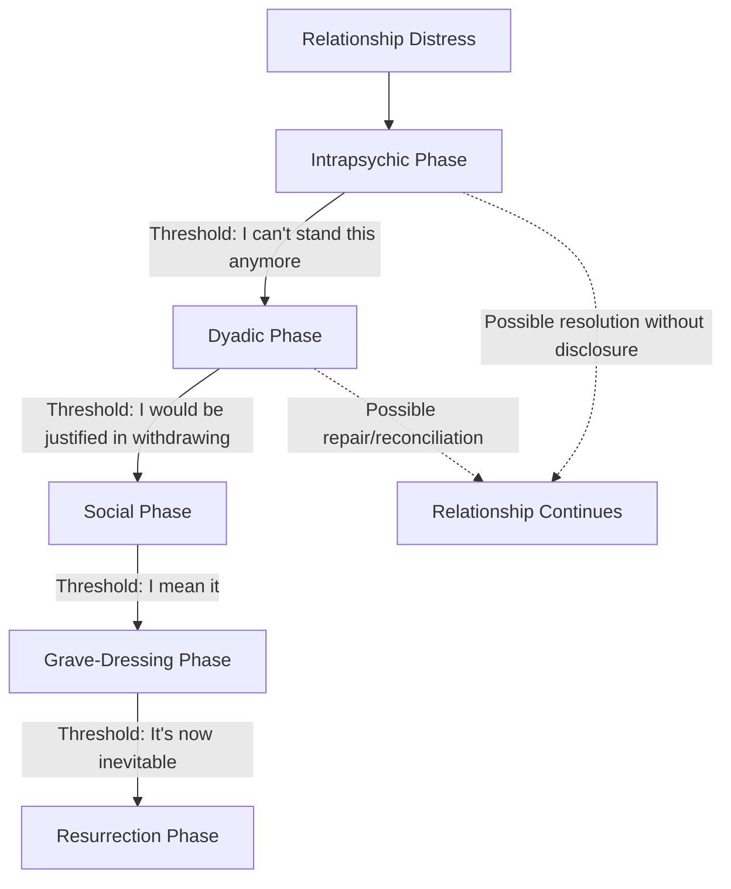

## Stages of Relationship Dissolution

### Definition

**Stages of relationship dissolution** refers to theoretical models describing the sequential (though not strictly linear) phases through which close relationships deteriorate and end, encompassing the intrapersonal cognitive/emotional processing, interpersonal communication, and social/public dimensions of breakup. The dominant framework in social psychology and interpersonal communication research is **Duck's phase model of relationship dissolution** (Steve Duck, 1982), later elaborated into a more detailed process model.

### Historical and Theoretical Background

- Early relational dissolution research emerged alongside broader interest in relationship development models (e.g., social penetration theory), prompting researchers to ask whether relationship *ending* follows a reverse-symmetrical or a distinct process from relationship *building*.
- **Steve Duck (1982)** proposed the first influential staged model, arguing dissolution is not a single event but a multi-phase process involving distinct cognitive and communicative work at each stage.
- Duck later refined the model with **Duck (2005)** and collaborative work (Rollie & Duck, 2006), reframing stages as **"phases"** to emphasize that movement between them is not strictly linear — couples can re-enter earlier phases, stall in a phase, or skip phases depending on relational and situational factors.
- Complementary work by **Lee (1984)** proposed a five-stage process model (dissatisfaction, exposure, negotiation, resolution, termination) emphasizing the negotiation process specifically, and research on **relational disengagement strategies** (Baxter, 1982) catalogued the specific communicative tactics used to exit relationships.

### Duck's Phase Model of Dissolution

Duck's model identifies four (later five, with the addition of a resurrection phase) sequential phases, each marked by a distinct **"threshold"** — a private cognitive tipping point that triggers movement into the next phase:

1. **Intrapsychic Phase**
   - **Threshold**: "I can't stand this anymore."
   - Private, internal dissatisfaction focused on evaluating the partner's behavior and the relationship's costs/rewards, without yet communicating this dissatisfaction to the partner.
   - Involves brooding, withdrawal of support, and internal weighing of whether to act.
2. **Dyadic Phase**
   - **Threshold**: "I would be justified in withdrawing."
   - The dissatisfaction is disclosed to the partner; confrontations, negotiations, and attempts to repair (or formally end) the relationship occur between the two partners directly.
   - Outcomes at this stage can include reconciliation, redefinition of the relationship, or movement toward dissolution.
3. **Social Phase**
   - **Threshold**: "I mean it."
   - The impending or actual breakup is made public to the couple's social network; partners seek support, mediation, or validation from friends and family, and begin negotiating how the breakup will be socially framed and managed (including disputes over shared social territory).
   - Publicizing the breakup often accelerates commitment to the decision, since retreating from a publicly announced breakup carries social costs.
4. **Grave-Dressing Phase**
   - **Threshold**: "It's now inevitable."
   - Partners construct a retrospective narrative or "account" of the relationship and its ending — a process of making sense of the relationship's history, assigning meaning/blame, and constructing a coherent public and personal story about what happened and why.
   - This phase is critical for identity management, as the account constructed shapes how each partner is perceived (and perceives themselves) going forward.
5. **Resurrection Phase** (added in later revisions, e.g., Duck, 2005)
   - Focuses on how individuals use the lessons and narrative constructed from the ended relationship to prepare for and enter future relationships — reframing the dissolution as informative for future relational functioning rather than solely a loss.

### Distinguishing Related Concepts

| Concept | Focus | Relation to Duck's Model |
| --- | --- | --- |
| Duck's Phase Model | Sequential phases of dissolution process | Core framework |
| Lee's Process Model | Five-stage negotiation-focused process (dissatisfaction → exposure → negotiation → resolution → termination) | Alternative/complementary staged model with similar structure but distinct emphasis on negotiation |
| Relational disengagement strategies (Baxter) | Specific communicative tactics for ending relationships (e.g., withdrawal, manipulation, direct discussion) | Describes *how* partners communicatively execute dissolution, often mapped onto Duck's dyadic/social phases |
| Investment model | Predicts commitment from satisfaction/alternatives/investment | Explains *why* a relationship reaches the intrapsychic phase's dissatisfaction threshold |
| Grief and loss models (e.g., Kübler-Ross) | General bereavement stages | Sometimes applied by analogy to post-breakup emotional recovery, but developed independently of relationship-specific dissolution theory |

### Baxter's Relational Disengagement Strategies

Complementary research (Baxter, 1982, 1985) identified distinct communicative strategies used within Duck's dyadic and social phases:

- **Direct vs. Indirect strategies**: Explicitly stating the desire to end the relationship versus withdrawing, becoming cold, or reducing contact without direct discussion.
- **Other-oriented vs. Self-oriented strategies**: Considering the partner's feelings (e.g., softening the message, offering justification) versus prioritizing one's own needs in how the breakup is delivered.
- **Unilateral vs. Bilateral approaches**: One partner making and communicating the decision alone versus a mutual, negotiated ending process.

Research generally finds that indirect and unilateral strategies (e.g., ghosting, gradual withdrawal) are associated with more negative emotional outcomes for the recipient compared to direct, other-oriented strategies, though this relationship is moderated by relationship length and context. [Inference: this is a consistent pattern across studies but effect sizes and moderators vary, so it should not be treated as a universal rule for all relationship types or cultures.]

### Key Empirical and Theoretical Contributions

**Duck (1982) — Original Phase Model**

Introduced the threshold concept and the four original phases, arguing dissolution is a gradual sense-making and communicative process rather than a discrete event, challenging simpler "on/off" models of relationship status.

**Vaughan (1986) — "Uncoupling"**

A qualitative sociological study describing an "initiator" and "partner" (non-initiator) asymmetry in the dissolution process, wherein one partner (the initiator) typically begins the intrapsychic and disengagement process well before the other partner becomes aware — a widely cited elaboration on the asymmetric awareness embedded in Duck's early phases.

**Sprecher, Zimmerman, & Abrahams (2010) and related breakup-strategy research**

Examined how specific disengagement strategies (direct talk, avoidance/withdrawal, manipulation, deescalation) relate to relationship characteristics and post-breakup adjustment, generally supporting the association between direct, considerate communication strategies and better outcomes for both parties.

### Applied Relevance and Practical Examples

- **Couples and individual therapy**: Clinicians use Duck's phase framework to help clients identify which phase a struggling relationship currently occupies (e.g., distinguishing purely intrapsychic dissatisfaction from an already-dyadic, disclosed crisis) to tailor intervention.
- **Understanding "ghosting" and modern digital disengagement**: Contemporary research on ghosting (abrupt, unexplained cessation of contact, often mediated by texting/social media) is frequently analyzed as an extreme indirect/unilateral disengagement strategy within Baxter's framework, associated with poorer outcomes for the recipient of the ghosting behavior. [Inference: ghosting-specific research is a newer and still-developing literature relative to the foundational dissolution models.]
- **Divorce mediation practice**: Awareness of the social phase's public-negotiation dynamics informs mediators' approach to managing how divorcing couples navigate shared social networks, disputes over mutual friends, and public narrative-framing.
- **Grief and post-breakup recovery support**: The grave-dressing and resurrection phases inform therapeutic approaches to helping individuals construct coherent, adaptive narratives about ended relationships rather than remaining stuck in blame or rumination.

### Common Misconceptions

- Duck's "phases" are **not** strictly linear or universally sequential; the model (particularly in its revised form) explicitly allows for recycling back to earlier phases, stalling, or partial progression without a full breakup occurring.
- Dissolution is **not** typically experienced symmetrically by both partners; asymmetric awareness (one partner further along in the internal process before disclosure) is a well-documented pattern (per Vaughan's initiator/partner distinction).
- The grave-dressing phase is **not** merely about assigning blame; it is better understood as an identity-management and sense-making process relevant to both partners' psychological adjustment and future relational functioning.
- Indirect dissolution strategies (like gradual withdrawal or ghosting) are **not** inherently "kinder" despite sometimes being chosen to avoid confrontation; research generally associates them with worse emotional outcomes for the recipient compared to direct approaches.

### Diagram: Duck's Phase Model of Relationship Dissolution

### Diagram: Asymmetry Between Initiator and Non-Initiator (svg_diagram)

<svg xmlns="http://www.w3.org/2000/svg" viewBox="0 0 700 320" font-family="sans-serif">
<text x="350" y="26" text-anchor="middle" font-size="17" font-weight="bold" fill="#1a1a2e">Initiator vs. Non-Initiator Timeline (svg_diagram)</text>
<line x1="60" y1="90" x2="640" y2="90" stroke="#34a853" stroke-width="3" />
<text x="60" y="75" font-size="12" font-weight="bold" fill="#1e5e2e">Initiator</text>
<circle cx="140" cy="90" r="6" fill="#34a853" />
<text x="140" y="115" text-anchor="middle" font-size="10" fill="#333">Intrapsychic</text>
<text x="140" y="128" text-anchor="middle" font-size="10" fill="#333">phase begins</text>
<circle cx="340" cy="90" r="6" fill="#34a853" />
<text x="340" y="115" text-anchor="middle" font-size="10" fill="#333">Disclosure</text>
<text x="340" y="128" text-anchor="middle" font-size="10" fill="#333">(dyadic begins)</text>
<circle cx="560" cy="90" r="6" fill="#34a853" />
<text x="560" y="115" text-anchor="middle" font-size="10" fill="#333">Grave-dressing /</text>
<text x="560" y="128" text-anchor="middle" font-size="10" fill="#333">resurrection</text>
<line x1="60" y1="220" x2="640" y2="220" stroke="#4285f4" stroke-width="3" />
<text x="60" y="205" font-size="12" font-weight="bold" fill="#1a3d7c">Non-Initiator</text>
<circle cx="340" cy="220" r="6" fill="#4285f4" />
<text x="340" y="245" text-anchor="middle" font-size="10" fill="#333">Becomes aware</text>
<text x="340" y="258" text-anchor="middle" font-size="10" fill="#333">(own intrapsychic</text>
<text x="340" y="271" text-anchor="middle" font-size="10" fill="#333">phase begins)</text>
<circle cx="560" cy="220" r="6" fill="#4285f4" />
<text x="560" y="245" text-anchor="middle" font-size="10" fill="#333">Own grave-dressing</text>
<text x="560" y="258" text-anchor="middle" font-size="10" fill="#333">begins later</text>
<line x1="140" y1="96" x2="140" y2="214" stroke="#999" stroke-width="1" stroke-dasharray="3,3" />
<text x="150" y="160" font-size="10" fill="#666">Gap in awareness</text>
</svg>

### Related Topics

- Investment model of commitment
- Relational disengagement strategies (Baxter)
- Uncoupling and the initiator/non-initiator asymmetry (Vaughan)
- Grief, loss, and post-relationship psychological adjustment
- Communication patterns and conflict resolution
- Ghosting and digitally-mediated relationship disengagement
- Social network involvement in relationship transitions
- Attribution theory and narrative construction after breakup
- Attachment theory and post-dissolution recovery
- Divorce mediation and family communication research