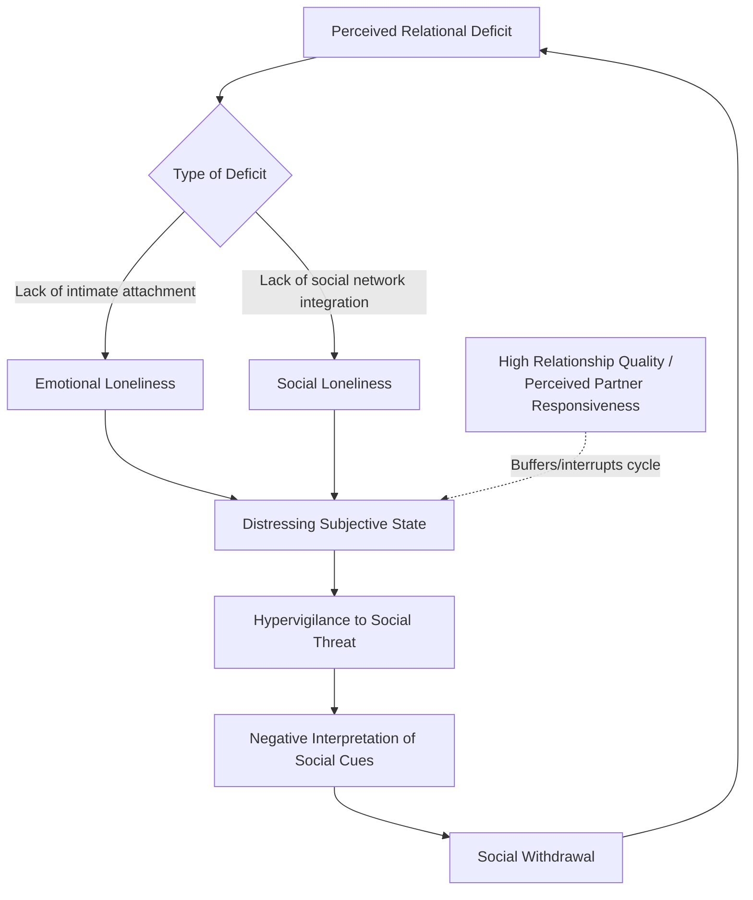

## Loneliness and Relationship Quality

### Definition

**Loneliness** is the subjective, distressing psychological experience arising from a perceived discrepancy between a person's desired and actual social relationships — in either quantity or, more critically, quality/intimacy of connection. It is distinguished from objective social isolation (an observable lack of social contacts) because a person can be surrounded by others and still feel lonely, or be objectively isolated without subjective distress. **Relationship quality** refers to evaluative dimensions of a specific close relationship (satisfaction, intimacy, support, trust, conflict) that, per this literature, predict loneliness largely independent of the sheer number of relationships a person has.

### Historical and Theoretical Background

- **Robert Weiss (1973)** provided the foundational theoretical distinction between two qualitatively different types of loneliness, arguing they arise from different relational deficits and are not interchangeable.
- **The UCLA Loneliness Scale** (Russell, Peplau, & Cutrona, 1980; revised 1996) became the field's dominant measurement instrument, operationalizing loneliness as a unidimensional but multiply-caused construct.
- **Cacioppo and colleagues' evolutionary/social neuroscience framework** (beginning in the 2000s) reframed loneliness as an aversive signal analogous to physical pain or hunger — a motivational state that evolved to prompt reconnective behavior, given the evolutionary costs of prolonged social isolation for a fundamentally social species.
- Loneliness research intersects heavily with **social support theory**, **attachment theory**, and **relationship quality literatures**, given consistent findings that relationship *quality* is generally a stronger predictor of loneliness than relationship *quantity*.

### Weiss's Typology: Emotional vs. Social Loneliness

1. **Emotional Loneliness**: Arises from the absence of a single, close, intimate attachment figure (e.g., a romantic partner or best friend) capable of providing deep emotional connection and a sense of being truly known — comparable in Weiss's framing to the distress of attachment separation.
2. **Social Loneliness**: Arises from the absence of a broader network of social ties, friendships, and community belonging that provide a sense of group membership, shared activity, and social integration.

This distinction implies that these two loneliness subtypes are not simply substitutable — having many acquaintances (social integration) does not necessarily resolve emotional loneliness stemming from lacking one deeply intimate bond, and vice versa. [Inference: while the conceptual distinction is well established theoretically, some measurement approaches treat loneliness as more unidimensional in practice, so the degree of empirical separability varies somewhat across studies.]

### Cacioppo's Evolutionary Theory of Loneliness

Proposes loneliness functions as an adaptive, aversive signal (analogous to physical pain) that:

- Motivates reconnective behavior by making social disconnection subjectively distressing.
- Historically increased survival by discouraging prolonged separation from protective social groups.
- Under chronic/prolonged conditions, however, becomes maladaptive — associated with a self-reinforcing **hypervigilance to social threat**, in which chronically lonely individuals show increased attentional bias toward negative social cues, interpret ambiguous social interactions more negatively, and subsequently withdraw further, perpetuating a **loneliness loop**.

### Relationship Quality vs. Quantity as Predictors of Loneliness

A consistent and central empirical finding across this literature: the **perceived quality** of close relationships (intimacy, responsiveness, trust, low conflict) predicts loneliness more strongly and consistently than the **number** of relationships or social contacts a person has.

- Individuals can report having numerous social contacts yet still experience significant loneliness if those relationships lack depth, mutual disclosure, or perceived responsiveness.
- Conversely, a small number of high-quality, intimate relationships can substantially buffer against loneliness even with a limited overall social network size.
- This supports a broader shift in the field away from purely quantitative measures of "social network size" toward quality-focused constructs like **perceived social support** and **relational intimacy**.

### Key Empirical Findings

**Cacioppo, Hawkley, and colleagues (multiple studies, 2000s–2010s)**

Longitudinal and cross-sectional research linked chronic loneliness to a range of physiological and health outcomes, including elevated cortisol, disrupted sleep, increased cardiovascular risk markers, and accelerated cognitive decline in older adults — framing loneliness as a distinct health risk factor independent of objective isolation. [Inference: while the association between chronic loneliness and these health outcomes is well documented, establishing precise causal mechanisms and directionality remains an active area of research, as health decline can also contribute to loneliness.]

**Holt-Lunstad, Smith, & Layton (2010) — Meta-Analysis**

A large-scale meta-analysis found that both objective social isolation and subjective loneliness were associated with increased mortality risk, with effect sizes for social connection deficits reported as comparable in magnitude to some well-established mortality risk factors — though the exact comparative ranking against specific risk factors (e.g., smoking) varies somewhat depending on which studies and effect-size metrics are used across different meta-analytic treatments. [Inference: the general "social connection matters substantially for mortality" conclusion is robust, but any specific numeric comparison to a named risk factor should be treated as approximate rather than a precise equivalence.]

**Reis, Clark, & Holmes (perceived partner responsiveness research)**

A substantial body of work on **perceived partner responsiveness** (feeling understood, validated, and cared for by a partner) demonstrates it as a core mechanism linking relationship quality to reduced loneliness and increased intimacy, distinct from mere relationship duration or contact frequency.

### Distinguishing Related Concepts

| Concept | Focus | Relation to Loneliness |
| --- | --- | --- |
| Loneliness | Subjective distress from perceived relational deficit | Core topic |
| Social isolation | Objective lack of social contacts/network size | Related but distinct — can occur without subjective loneliness, and vice versa |
| Perceived social support | Belief that support is available if needed | A protective factor strongly (inversely) associated with loneliness |
| Solitude | Chosen, often restorative time alone | Distinct from loneliness; solitude can be non-distressing or even beneficial when voluntary |
| Attachment insecurity | Internal working models of relational security | A dispositional vulnerability factor that can predispose individuals to chronic loneliness |
| Relationship satisfaction | Evaluative appraisal of a specific relationship | A proximal, quality-based predictor of (especially emotional) loneliness |

### Individual and Relational Moderators

- **Attachment style**: Anxious and avoidant attachment orientations are both associated with elevated loneliness risk, though through different pathways (anxious individuals may fear abandonment while over-monitoring relationship quality; avoidant individuals may suppress attachment needs while still experiencing unmet connection).
- **Perceived (vs. actual) support**: Perceived availability of support is generally a stronger predictor of well-being and reduced loneliness than support actually received or enacted, likely because perceived support reduces appraisal of stress without the potential costs (e.g., feeling burdensome) associated with received support.
- **Life transitions**: Loneliness risk is elevated during relationship transitions (divorce, bereavement, geographic relocation, retirement) and life stages with reduced social role structure.
- **Digital/social media use**: Research on social media and loneliness shows mixed and context-dependent findings — passive consumption is more consistently linked to increased loneliness in some studies, while active, relationally-engaged use may support connection, though this remains an evolving and debated area. [Unverified/contested: effect directions and sizes vary considerably by study design, platform, and usage pattern; broad claims that social media simply "causes" or "cures" loneliness are not well supported by the mixed evidence.]

### Applied and Clinical Relevance

- **Public health framing**: Following work like Holt-Lunstad's meta-analyses, several public health bodies (e.g., UK's "Loneliness Strategy," US Surgeon General's advisory on social connection) have explicitly framed loneliness as a population-level health risk warranting policy attention, alongside more traditional risk factors.
- **Clinical interventions**: Cognitive-behavioral approaches targeting the "hypervigilance to social threat" cycle (per Cacioppo's model) — helping lonely individuals recognize and correct negatively biased social cognition — have shown promise as a treatment mechanism distinct from simply increasing social contact opportunities.
- **Relationship counseling implications**: Given the quality-over-quantity finding, interventions aimed at reducing loneliness within an existing relationship often focus on building perceived partner responsiveness and emotional intimacy rather than solely increasing time spent together or number of shared activities.
- **Aging and elder care**: Loneliness research has substantially shaped elder-care program design, emphasizing quality companionship and intimate connection programs over purely activity-based social scheduling.

### Common Misconceptions

- Loneliness is **not** synonymous with being alone or having few social contacts; it is a subjective state that can occur regardless of objective social contact levels (and objectively isolated individuals are not necessarily lonely if the isolation is desired/voluntary).
- Increasing the sheer number of social contacts or activities does **not** reliably resolve loneliness if those relationships lack perceived quality, intimacy, or responsiveness — the literature consistently favors quality-focused interventions.
- Loneliness is **not** merely an unpleasant subjective state with no broader consequence; a substantial body of evidence links chronic loneliness to significant physical health risks, independent of objective isolation.
- Emotional and social loneliness are **not** interchangeable or resolved by the same relational input — a large friend network does not necessarily compensate for the absence of one deeply intimate bond, per Weiss's typology.

### Diagram: Loneliness Pathways and the Hypervigilance Loop

### Diagram: Quality vs. Quantity Model of Loneliness Risk (svg_diagram)

<svg xmlns="http://www.w3.org/2000/svg" viewBox="0 0 700 360" font-family="sans-serif">
<text x="350" y="26" text-anchor="middle" font-size="17" font-weight="bold" fill="#1a1a2e">Relationship Quality vs. Quantity (svg_diagram)</text>
<line x1="80" y1="310" x2="650" y2="310" stroke="#333" stroke-width="1.5" />
<line x1="80" y1="310" x2="80" y2="60" stroke="#333" stroke-width="1.5" />
<text x="365" y="335" text-anchor="middle" font-size="12" fill="#333">Number of Social Contacts</text>
<text x="35" y="185" text-anchor="middle" font-size="12" fill="#333" transform="rotate(-90 35 185)">Relationship Quality</text>
<rect x="110" y="90" width="220" height="130" rx="8" fill="#fdeaea" stroke="#ea4335" stroke-width="2" />
<text x="220" y="120" text-anchor="middle" font-size="13" font-weight="bold" fill="#7c1a1a">Many Contacts,</text>
<text x="220" y="138" text-anchor="middle" font-size="13" font-weight="bold" fill="#7c1a1a">Low Quality</text>
<text x="220" y="165" text-anchor="middle" font-size="11" fill="#333">High loneliness risk</text>
<text x="220" y="183" text-anchor="middle" font-size="11" fill="#333">despite large network</text>
<text x="220" y="201" text-anchor="middle" font-size="11" fill="#333">(shallow connections)</text>
<rect x="390" y="90" width="220" height="130" rx="8" fill="#e6f4ea" stroke="#34a853" stroke-width="2" />
<text x="500" y="120" text-anchor="middle" font-size="13" font-weight="bold" fill="#1e5e2e">Few Contacts,</text>
<text x="500" y="138" text-anchor="middle" font-size="13" font-weight="bold" fill="#1e5e2e">High Quality</text>
<text x="500" y="165" text-anchor="middle" font-size="11" fill="#333">Low loneliness risk</text>
<text x="500" y="183" text-anchor="middle" font-size="11" fill="#333">despite small network</text>
<text x="500" y="201" text-anchor="middle" font-size="11" fill="#333">(deep, responsive bonds)</text>
</svg>

### Related Topics

- Weiss's typology of emotional and social loneliness
- Cacioppo's evolutionary theory of social connection
- Perceived partner responsiveness (Reis & Clark)
- Attachment theory and relational security
- Social support theory (perceived vs. received support)
- Relationship maintenance strategies
- Investment model of commitment
- Health consequences of social isolation (Holt-Lunstad meta-analysis)
- Solitude and voluntary aloneness
- Social media use and connection/disconnection research