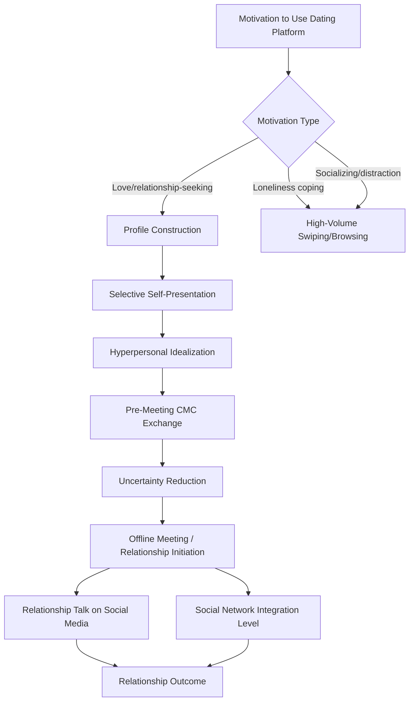

## Technology and Modern Relationship Formation

### Definition

**Technology and modern relationship formation** examines how digital communication platforms — online dating apps, social media, and computer-mediated communication (CMC) more broadly — shape the initiation, development, and maintenance of romantic relationships, and how these technologically mediated pathways compare to traditional offline relationship formation in process and outcome. This is a rapidly evolving applied subfield within relationship science, drawing on established theories (social penetration theory, uncertainty reduction theory, attachment theory) while generating new constructs specific to digital contexts.

### Historical and Theoretical Background

- Early CMC relationship research (1990s–2000s) was shaped by competing theoretical predictions: the **cues-filtered-out perspective** (reduced nonverbal cues impair relational development) versus **hyperpersonal model** (Walther, 1996), which proposed CMC can, under some conditions, accelerate intimacy and idealization *beyond* face-to-face rates due to selective self-presentation and optimized message construction.
- **Finkel, Eastwick, Karney, Reis, & Sprecher (2012)** produced an influential, comprehensive review of online dating from a psychological science lens, evaluating dating sites' claims (access, communication, and matching) against available evidence — concluding that access and communication benefits were better supported than sophisticated algorithmic matching claims.
- The rise of swipe-based mobile apps (Tinder, launched 2012, and successors) shifted the field's focus toward mobile-first, high-volume, rapid-judgment interaction formats, prompting new research on profile evaluation, motivations, and psychological correlates of app use.
- Pew Research Center's longitudinal survey work has tracked the mainstreaming of online dating in the U.S. population, documenting its shift from a stigmatized to a normative relationship-formation channel over roughly two decades.

### Core Theoretical Frameworks

**Hyperpersonal Model** (Walther, 1996)

Proposes CMC can produce more intense, sometimes idealized, relational impressions than face-to-face interaction due to four mechanisms: optimized selective self-presentation (senders can strategically edit disclosures), idealized receiver perception (receivers fill in gaps with positive assumptions), asynchronous channel management (time to craft messages), and behavioral confirmation (idealized impressions get reinforced through the interaction).

**Cues-Filtered-Out Perspective**

The earlier, competing view that reduced nonverbal and contextual cues in CMC impair relational depth and accuracy of impression formation relative to face-to-face communication — now generally considered too simplistic on its own, given hyperpersonal and subsequent findings, though still relevant for understanding specific limitations of low-cue channels.

**Uncertainty Reduction Theory** (Berger & Calabrese, 1975), applied to digital contexts

Individuals are motivated to reduce uncertainty about potential partners; digital platforms provide unique tools (extensive profiles, mutual friend visibility, pre-interaction social media browsing) that alter the traditional sequence and pace of uncertainty reduction compared to purely offline encounters.

**Mass Customization / Algorithmic Matching Frameworks**

Contemporary platforms (both traditional dating apps and newer interest-based social platforms) increasingly use algorithmic curation (personality tests, tag-based interest systems, behavioral data) to structure who users encounter, raising both efficiency and criticism regarding filter-bubble-like narrowing of exposure to dissimilar potential partners.

### Key Empirical Findings

**Finkel et al. (2012) — Foundational Review**

This influential psychological science review evaluated three purported benefits of online dating — access to more potential partners, communication before meeting, and matching algorithms — concluding that access and communication benefits had reasonable evidentiary support, while claims that proprietary matching algorithms could predict compatibility better than chance remained largely unsubstantiated by independent evidence available at the time.

**Self-Concept Clarity and Partner Evaluation** (Kubin, Kreitewolf, & Lydon, 2024)

Recent research on initial romantic partner evaluation found that individuals with high self-concept clarity have an easier time identifying which partners are a good match for them based on personality qualities, hobbies, interests, and values, suggesting self-knowledge functions as a precursor skill for effective partner selection in dating-app contexts. [Psychology Today](https://www.psychologytoday.com/us/blog/the-psychology-of-relationships/202405/the-science-of-online-dating)

**"Feeling Known" and Relationship Satisfaction** (Schroeder & Fishbach, 2024)

Analysis of dating profiles on platforms including Match and Coffee Meets Bagel found that most users describe wanting a partner who will listen to them and support them, but rarely mention their own capacity to fulfill that role for a partner — highlighting an asymmetry in self-presentation focus, alongside the broader finding that feeling known by a partner predicts relationship satisfaction. [Psychology Today](https://www.psychologytoday.com/us/blog/the-psychology-of-relationships/202405/the-science-of-online-dating)

**Online Dating and Marital Success** (Hu, Zhu, & Zhang, 2024 — replication study)

Analyzing Pew Research Center data (N = 2,787), this replication study found that meeting one's partner through online dating (versus offline) was marginally associated with experiencing less relationship success specifically among people in marital relationships, though this difference was not observed among those in nonmarital romantic relationships. The study further found that discussing one's relationship on social media moderated this link, such that the negative association between online-dating origin and marital success was present only among couples who did not discuss their relationship on social media. [Contested/Unverified: this finding is described by the authors as marginal and contradicts some earlier work (e.g., Cacioppo et al.) finding no disadvantage or even benefits for online-dating-initiated marriages; the literature on this specific question remains mixed.] [Sage Journals](https://journals.sagepub.com/doi/full/10.1089/cyber.2024.0136)[Sage Journals](https://journals.sagepub.com/doi/full/10.1089/cyber.2024.0136)

**Network Support and Relationship Origin**

Related work in this replication study noted that relationships beginning through online dating are often associated with lower involvement of social network members and greater social stigma, both factors linked to reduced network support for the relationship compared to offline-originated relationships — relevant given the well-established broader finding that social network support predicts relationship success. [Sage Journals](https://journals.sagepub.com/doi/full/10.1089/cyber.2024.0136)

**Loneliness, Anxiety, and Online Dating Use**

Research including Rinaldi et al. (2024) found that personal vulnerabilities such as dating anxiety and fear of rejection are associated with loneliness among individuals who use online dating, with these individual variations affecting both sexes comparably — more anxious or worried users reported feeling lonelier during online interaction. Separately, longer-standing research (Teppers et al., 2014; Bonsaksen et al., 2021) has documented a reciprocal relationship between loneliness and online dating use, wherein lonelier individuals are more likely to turn to online dating as a coping strategy for loneliness. [IJIP](https://ijip.in/wp-content/uploads/2025/04/18.01.037.20251302.pdf)[IJIP](https://ijip.in/wp-content/uploads/2025/04/18.01.037.20251302.pdf)

**Smartphone Addiction and Online Relationship Formation** (Khan et al., 2024)

Survey research found that increased online relationship-building was strongly correlated with higher levels of smartphone addiction, with online social connectedness partially mediating this association in young adult samples. [IJIP](https://ijip.in/wp-content/uploads/2025/04/18.01.037.20251302.pdf)

**Motivations for Dating App Use**

Recent comparative work (Menon, 2024) identified six primary motivations for dating app use: love, ease of communication, distraction, sexual experience, socializing, and a sixth category, with researchers cautioning that aggregate gendered trends in motivation should be interpreted with nuance, since individual motivations remain diverse and context-dependent rather than fitting simple binary patterns. [Frontiersin](https://public-pages-files-2025.frontiersin.org/journals/psychology/articles/10.3389/fpsyg.2025.1659760/pdf)[Frontiersin](https://public-pages-files-2025.frontiersin.org/journals/psychology/articles/10.3389/fpsyg.2025.1659760/pdf)

### Distinguishing Related Concepts

| Concept | Focus | Relation to Technology & Relationship Formation |
| --- | --- | --- |
| Hyperpersonal model | CMC's potential to intensify/idealize impressions | Core mechanism explaining accelerated intimacy in digital contexts |
| Social penetration theory | Gradual, layered self-disclosure in relationship development | Applied to examine whether digital disclosure follows the same depth/breadth progression as offline |
| Loneliness (Weiss's typology) | Subjective relational deficit | Bidirectionally linked to online dating use — as both a motivator for and, per mixed evidence, a possible outcome of app use patterns |
| Investment model of commitment | Satisfaction/alternatives/investment predicting commitment | Digital platforms may alter perceived alternative quality by expanding the visible partner pool |
| Problematic/compulsive app use | Addictive or distress-linked usage patterns | A distinct clinical-adjacent construct (e.g., PODAUS scale) separate from typical/functional app use |

### Platform-Specific and Emerging Patterns

- **Swipe-based, high-volume interaction formats**: Research on platforms like Tinder emphasizes rapid, visually-driven initial judgments, differing structurally from earlier, longer-profile-based dating sites and raising distinct questions about impression formation under time/attention constraints.
- **Interest-based and algorithmically curated platforms**: Newer platforms such as Soul (studied among Chinese Generation Z users) use algorithmic mechanisms, personality tests, and tag-based systems to facilitate interest-driven connections, though ethnographic research on this platform found it simultaneously reinforces cultural and economic stratification by creating exclusive circles and algorithmic social cocoons, prompting users to actively negotiate authenticity within platform constraints. [ResearchGate](https://www.researchgate.net/publication/251230695_Online_Dating_A_Critical_Analysis_From_the_Perspective_of_Psychological_Science)[ResearchGate](https://www.researchgate.net/publication/251230695_Online_Dating_A_Critical_Analysis_From_the_Perspective_of_Psychological_Science)
- **Relationship talk on social media (RToSM)**: Emerging as a distinct construct examining how couples' public discussion of their relationship on social media platforms relates to relationship outcomes and perceived legitimacy, particularly for relationships originating online.
- **Mating strategy expression in digital environments**: Evolutionary-psychology-informed research examines how theorized gender differences in short-term versus long-term mating strategies manifest in app profiles and preferences, though these propositions remain debated and context-dependent rather than fixed patterns. [Frontiersin](https://public-pages-files-2025.frontiersin.org/journals/psychology/articles/10.3389/fpsyg.2025.1659760/pdf)

### Applied and Clinical Relevance

- **Dating coaching and profile-optimization guidance**: Increasingly informed by findings on self-concept clarity and the "feeling known" gap, suggesting profile content emphasizing what one can *offer* a partner (not only what one seeks) may improve match quality.
- **Digital literacy and relationship education**: Given the documented association between compulsive app use and offline interpersonal difficulty, some relationship-education programs now incorporate guidance on healthy app-use boundaries alongside traditional relationship-skills content.
- **Clinical screening for loneliness-driven app use**: The reciprocal loneliness-app-use relationship informs clinicians working with clients who report using dating apps primarily as a loneliness-coping mechanism rather than intentional partner-seeking, which may warrant addressing the underlying loneliness directly.
- **Marriage and family therapy considerations**: Awareness of the potential network-support deficit for online-dating-originated relationships (particularly marriages) may inform therapeutic attention to building broader social integration for couples who met online.

### Common Misconceptions

- Online dating algorithms are **not** well-supported as capable of predicting long-term compatibility beyond chance based on available independent evidence; access and communication benefits are better substantiated than matching claims. [Unverified/contested: this remains an area where platform-specific proprietary claims often exceed what independent research has verified.]
- Meeting online is **not** uniformly associated with worse relationship outcomes; effects are marginal, differ by relationship type (marital vs. nonmarital), and are moderated by other factors like social media relationship disclosure. [Contested: findings across studies on this question are mixed and sometimes directly contradictory.]
- Loneliness and online dating use are **not** related in only one direction; loneliness can drive app use as a coping mechanism, and app-based interaction may not resolve — and in some patterns may coincide with — continued loneliness. [Inference: the exact causal architecture of this bidirectional relationship is still being clarified across study designs.]
- Gendered mating-strategy patterns observed in aggregate app data should **not** be treated as fixed, universal rules for individual behavior, given substantial documented within-gender variability.

### Diagram: Digital Relationship Formation Pathway

### Diagram: Hyperpersonal Model Mechanism (svg_diagram)

<svg xmlns="http://www.w3.org/2000/svg" viewBox="0 0 700 340" font-family="sans-serif">
<text x="350" y="26" text-anchor="middle" font-size="17" font-weight="bold" fill="#1a1a2e">Walther's Hyperpersonal Model (svg_diagram)</text>
<rect x="40" y="60" width="290" height="90" rx="8" fill="#e8f0fe" stroke="#4285f4" stroke-width="2" />
<text x="185" y="90" text-anchor="middle" font-size="13" font-weight="bold" fill="#1a3d7c">Sender: Optimized</text>
<text x="185" y="108" text-anchor="middle" font-size="13" font-weight="bold" fill="#1a3d7c">Self-Presentation</text>
<text x="185" y="132" text-anchor="middle" font-size="11" fill="#333">Strategic editing of disclosures</text>
<rect x="370" y="60" width="290" height="90" rx="8" fill="#e6f4ea" stroke="#34a853" stroke-width="2" />
<text x="515" y="90" text-anchor="middle" font-size="13" font-weight="bold" fill="#1e5e2e">Receiver: Idealized</text>
<text x="515" y="108" text-anchor="middle" font-size="13" font-weight="bold" fill="#1e5e2e">Perception</text>
<text x="515" y="132" text-anchor="middle" font-size="11" fill="#333">Fills gaps with positive assumptions</text>
<rect x="40" y="180" width="290" height="90" rx="8" fill="#fef7e0" stroke="#fbbc04" stroke-width="2" />
<text x="185" y="210" text-anchor="middle" font-size="13" font-weight="bold" fill="#8a6d00">Asynchronous Channel</text>
<text x="185" y="228" text-anchor="middle" font-size="13" font-weight="bold" fill="#8a6d00">Management</text>
<text x="185" y="252" text-anchor="middle" font-size="11" fill="#333">Time to craft ideal messages</text>
<rect x="370" y="180" width="290" height="90" rx="8" fill="#fce8e6" stroke="#c5221f" stroke-width="2" />
<text x="515" y="210" text-anchor="middle" font-size="13" font-weight="bold" fill="#7c1a1a">Behavioral</text>
<text x="515" y="228" text-anchor="middle" font-size="13" font-weight="bold" fill="#7c1a1a">Confirmation</text>
<text x="515" y="252" text-anchor="middle" font-size="11" fill="#333">Idealized impressions reinforced</text>

<text x="350" y="310" text-anchor="middle" font-size="13" font-weight="bold" fill="`#1a1a2e`">→ Intensified/idealized relational impression</text>

</svg>

### Related Topics

- Hyperpersonal model of computer-mediated communication (Walther)
- Uncertainty reduction theory
- Loneliness and relationship quality
- Social penetration theory and self-disclosure
- Investment model of commitment (perceived alternatives in expanded partner markets)
- Problematic/compulsive dating app use (PODAUS scale)
- Evolutionary mating strategies and mate preferences
- Social media relationship talk (RToSM) and public relationship disclosure
- Algorithmic matching and filter-bubble effects in partner selection
- Relationship maintenance strategies in digitally-initiated relationships