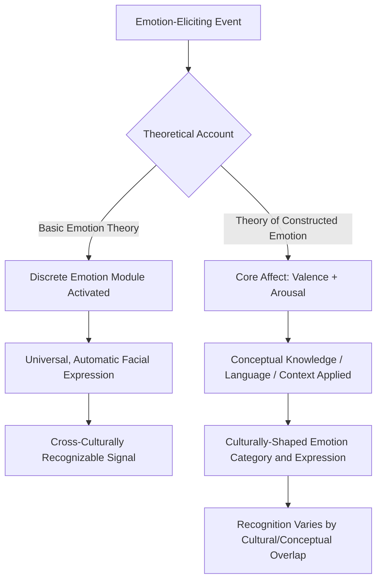

## Basic Emotion Theory and Universality Debates

### Definition

**Basic Emotion Theory (BET)** is the view that a small set of discrete emotions (commonly including fear, anger, disgust, sadness, happiness, and surprise) are biologically evolved, functionally distinct, and universally recognizable across human cultures via characteristic facial expressions. The **universality debate** concerns whether these emotion categories and their associated expressions are indeed pan-cultural and biologically hardwired, or whether they are substantially shaped, constructed, or modulated by language, culture, and context — a dispute that remains actively contested in contemporary affective science.

### Historical and Theoretical Background

- **Charles Darwin's "The Expression of the Emotions in Man and Animals" (1872)** is the foundational text proposing that emotional expressions are evolved, adaptive, and shared across species and human cultures, laying the conceptual groundwork for later basic emotion research.
- **Silvan Tomkins (1962–1963)** developed an early influential affect theory proposing a fixed set of innate affects, each linked to a distinct facial-expressive pattern, directly influencing his student Paul Ekman's subsequent research program.
- **Paul Ekman and Wallace Friesen's cross-cultural facial expression studies** (beginning in the late 1960s), most famously including fieldwork with the Fore people of Papua New Guinea (a visually and culturally isolated population), are the central empirical foundation of modern Basic Emotion Theory, reporting that participants could reliably match posed facial expressions to emotion-eliciting stories across widely disparate cultures.
- **Ekman's Facial Action Coding System (FACS)** (Ekman & Friesen, 1978) provided a standardized, anatomically-based system for measuring facial muscle movements, becoming a methodological cornerstone for subsequent emotion-expression research.
- Beginning in the 1990s–2000s, **constructionist and appraisal-based critiques** (notably from Lisa Feldman Barrett, James Russell, and colleagues) mounted an increasingly influential challenge to the classical universality claims, driving today's active theoretical division in the field.

### Core Tenets of Basic Emotion Theory

1. **Discreteness**: Emotions exist as a limited set of qualitatively distinct categories (not merely points on a continuous dimensional space), each with its own characteristic triggers, physiological signature, and behavioral output.
2. **Universality**: The basic emotion set and their associated facial expressions are common across all human cultures, reflecting a shared evolutionary and neurobiological origin rather than learned, culture-specific display conventions.
3. **Automaticity**: Basic emotions are triggered rapidly and largely automatically by relevant stimuli, with characteristic expressions emerging involuntarily.
4. **Distinct neural/physiological signatures**: Each basic emotion is proposed to correspond to a dedicated, at least partially distinguishable, physiological and neural pattern.
5. **Evolutionary function**: Each basic emotion is proposed to have arisen because it solved a specific recurrent adaptive problem (e.g., fear promotes threat avoidance, disgust promotes pathogen avoidance).

Ekman's commonly cited original list of six basic emotions: **happiness, sadness, fear, anger, surprise, and disgust** — later expanded in some of his work to include additional candidates (e.g., contempt), though the canonical six remain the most widely cited set in textbooks and teaching contexts.

### Key Empirical Studies Supporting Universality

**Ekman & Friesen (1971) — Fore Tribe Study**

Conducted with a preliterate, visually isolated population in Papua New Guinea with minimal prior exposure to Western media, this study found that participants could match posed facial expressions to emotion-eliciting stories at rates well above chance, and that their own posed expressions for these emotions were recognizable to Western observers — widely cited as strong evidence against a purely culture-specific/learned account of facial expression.

**Ekman, Sorenson, & Friesen (1969) — Cross-Cultural Judgment Studies**

Found substantial cross-cultural agreement in labeling posed facial expressions with the corresponding basic emotion category across multiple literate cultures, reinforcing universality claims alongside the isolated-population fieldwork.

**Izard (1971) — Independent Cross-Cultural Replication**

Conducted parallel cross-cultural facial expression recognition research broadly converging with Ekman's findings, lending independent support to universal recognition claims from a separately developed research program.

### Major Critiques and the Constructionist Challenge

**Barrett's Theory of Constructed Emotion** (Lisa Feldman Barrett, extensively developed 2000s–2010s)

Proposes that emotions are not discrete, hardwired categories but are constructed in the moment from more basic building blocks — core affect (a continuous state of valence and arousal) combined with conceptual knowledge and context, drawing on prior experience and language/culture-specific emotion concepts. Under this view, cultural variation in emotion concepts is not merely surface-level display variation but reflects genuinely different underlying emotional experiences and categorizations.

**Russell's Critique of Cross-Cultural Recognition Methodology**

James Russell raised influential methodological criticisms of classic universality studies, arguing that forced-choice response formats (where participants select from a small pre-specified list of emotion labels) may artificially inflate apparent cross-cultural agreement, since chance-level performance in such tasks is already substantially above zero and results may partly reflect experimental demand characteristics rather than genuine universal recognition.

**Gendron, Roberson, van der Vyver, & Barrett (2014) — Himba Study**

A study with the Himba, a relatively isolated population in Namibia, using a **free-labeling task** (rather than forced-choice) found substantially reduced cross-cultural agreement in matching facial expressions to specific discrete emotion categories, though broader dimensional agreement (e.g., positive vs. negative valence) was more consistently observed — cited as evidence that discrete-category universality may be weaker than classic studies suggested, while broader affective dimensions show more cross-cultural consistency.

**Meta-Analytic Reviews** (e.g., Nelson & Russell, and subsequent broader reviews)

Various meta-analytic and review efforts have found that cross-cultural facial expression recognition accuracy, while generally above chance, shows considerable variability across studies and cultural pairings, with recognition rates typically higher for expressions viewed by observers from cultures more similar to (or more exposed to) the expresser's culture — a pattern sometimes framed as evidence for an **"in-group advantage"** in emotion recognition, complicating a strictly universal, culture-independent account. [Contested: the overall body of evidence is generally read as showing that facial expressions carry substantial cross-cultural information, but the degree, mechanism, and precise universality of discrete categories versus broader dimensions remains actively disputed among researchers.]

### Distinguishing Related Theoretical Frameworks

| Framework | Core Claim | Position on Universality |
| --- | --- | --- |
| Basic Emotion Theory (Ekman, Izard, Tomkins) | Discrete, evolved emotion categories with universal expressions | Strong universality claim |
| Theory of Constructed Emotion (Barrett) | Emotions constructed from core affect + concepts + context | Emotion *concepts* and categorization are substantially culture/language-dependent |
| Dimensional models (e.g., Russell's Circumplex Model) | Emotions represented along continuous dimensions (valence, arousal) | Broader dimensional structure may be more universal than discrete category labels |
| Appraisal theories (e.g., Scherer's Component Process Model) | Emotions arise from cognitive appraisals of events along multiple dimensions | Appraisal *dimensions* may be more universal than resulting discrete emotion labels or expressions |
| Social constructionist views (e.g., some anthropological/cultural psychology accounts) | Emotions are primarily cultural products with limited biological universality | Strongest challenge to universal, biologically fixed emotion categories |

### Physiological/Autonomic Evidence and Its Limits

- Early work (e.g., Ekman, Levenson, & Friesen, 1983) reported some evidence of distinct autonomic nervous system (ANS) signatures associated with different posed basic emotions (e.g., differences in heart rate between anger and disgust).
- However, subsequent meta-analytic work (notably by **Siegel et al., 2018**, synthesizing decades of autonomic emotion research) found considerably weaker and less consistent evidence for discrete, emotion-specific ANS signatures than classic Basic Emotion Theory predicted, with substantial variability across studies and measures. [Unverified/contested: the existence of clean, one-to-one discrete physiological "fingerprints" for each basic emotion is not well supported by the aggregated evidence, though this does not settle the broader universality debate on its own, since BET proponents and critics dispute how central strict autonomic specificity is to the theory's core claims.]

### Applied and Clinical Relevance

- **Cross-cultural clinical psychology**: Awareness of universality debates informs clinicians working with culturally diverse populations to avoid over-relying on facial expression alone as a culturally invariant diagnostic cue for emotional states.
- **Affective computing and emotion-recognition AI**: Automated facial emotion recognition systems have historically been built substantially on Ekman-style discrete category and FACS-based frameworks; the constructionist critique has prompted increased caution in the field regarding claims that such systems detect "true" internal emotional states from facial movement alone, rather than culturally-conditioned expressive displays. [Inference: this is an active area of applied debate, with growing calls in the field for more context-sensitive emotion-recognition approaches given the contested universality evidence.]
- **Forensic and security applications**: Claims that facial "micro-expressions" can reliably reveal concealed emotions (popularized in some applied security/deception-detection contexts) draw directly on Basic Emotion Theory assumptions and have faced corresponding scientific scrutiny regarding their validity for real-world deception detection.
- **Cross-cultural communication training**: Corporate and diplomatic cross-cultural training programs sometimes incorporate universality research findings, though increasingly with caveats about in-group recognition advantages and cultural display rule variation (norms governing when/how emotions are appropriately expressed, distinct from the emotions themselves).

### Common Misconceptions

- Basic Emotion Theory and the constructionist view are **not** simply "right vs. wrong" in a settled sense; this remains a genuinely active and unresolved theoretical dispute within contemporary affective science, with substantial ongoing empirical work on both sides.
- Cross-cultural facial expression recognition studies showing above-chance accuracy do **not** by themselves prove strict universality of discrete emotion categories; methodological factors (forced-choice vs. free-labeling tasks) substantially affect apparent agreement levels, per Russell's critique.
- "Display rules" (culturally-specific norms about when and how to express emotion) are **not** the same as the underlying emotion itself; classic Basic Emotion Theory explicitly accommodates display rule variation while still maintaining the underlying emotion and its "true" expression are universal — this is a point often conflated in casual discussion of the debate.
- The existence of distinct facial expression *categories* in laboratory recognition tasks does **not** automatically imply distinct, one-to-one physiological "fingerprints" for each emotion; the autonomic specificity evidence is notably weaker and more inconsistent than the facial expression evidence. [Contested]

### Diagram: Basic Emotion Theory vs. Constructionist Model

### Diagram: Evidence Timeline in the Universality Debate (svg_diagram)

<svg xmlns="http://www.w3.org/2000/svg" viewBox="0 0 720 320" font-family="sans-serif">
<text x="360" y="26" text-anchor="middle" font-size="17" font-weight="bold" fill="#1a1a2e">Universality Debate: Key Evidence Timeline (svg_diagram)</text>
<line x1="60" y1="160" x2="660" y2="160" stroke="#333" stroke-width="2" />
<circle cx="120" cy="160" r="6" fill="#34a853" />
<text x="120" y="140" text-anchor="middle" font-size="11" fill="#1e5e2e">1872</text>
<text x="120" y="185" text-anchor="middle" font-size="10" fill="#333">Darwin's</text>
<text x="120" y="198" text-anchor="middle" font-size="10" fill="#333">evolutionary account</text>
<circle cx="260" cy="160" r="6" fill="#34a853" />
<text x="260" y="140" text-anchor="middle" font-size="11" fill="#1e5e2e">1971</text>
<text x="260" y="185" text-anchor="middle" font-size="10" fill="#333">Ekman's Fore</text>
<text x="260" y="198" text-anchor="middle" font-size="10" fill="#333">tribe study</text>
<circle cx="400" cy="160" r="6" fill="#34a853" />
<text x="400" y="140" text-anchor="middle" font-size="11" fill="#1e5e2e">1978</text>
<text x="400" y="185" text-anchor="middle" font-size="10" fill="#333">FACS</text>
<text x="400" y="198" text-anchor="middle" font-size="10" fill="#333">developed</text>
<circle cx="520" cy="160" r="6" fill="#ea4335" />
<text x="520" y="140" text-anchor="middle" font-size="11" fill="#7c1a1a">1990s–2000s</text>
<text x="520" y="185" text-anchor="middle" font-size="10" fill="#333">Barrett/Russell</text>
<text x="520" y="198" text-anchor="middle" font-size="10" fill="#333">constructionist critique</text>
<circle cx="620" cy="160" r="6" fill="#ea4335" />
<text x="620" y="140" text-anchor="middle" font-size="11" fill="#7c1a1a">2014</text>
<text x="620" y="185" text-anchor="middle" font-size="10" fill="#333">Himba free-</text>
<text x="620" y="198" text-anchor="middle" font-size="10" fill="#333">labeling study</text>

<text x="360" y="260" text-anchor="middle" font-size="12" font-style="italic" fill="#555">Green: supporting universality | Red: challenging strict universality</text>

</svg>

### Related Topics

- Darwin's evolutionary theory of emotional expression
- Facial Action Coding System (FACS) and its applications
- Theory of Constructed Emotion (Lisa Feldman Barrett)
- Dimensional models of emotion (Russell's Circumplex Model)
- Appraisal theories of emotion (Scherer, Lazarus)
- Display rules and cultural norms of emotional expression
- In-group advantage in emotion recognition
- Micro-expressions and deception detection controversies
- Affective computing and automated emotion recognition
- Cross-cultural psychology methodology (forced-choice vs. free-labeling paradigms)