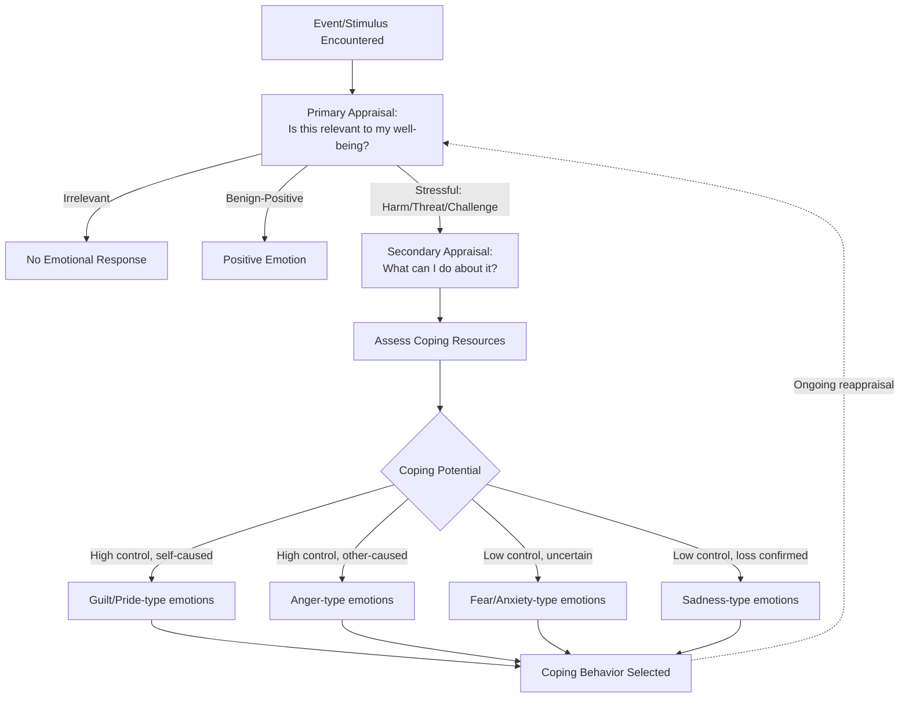

## Appraisal Theories of Emotion

### Definition

**Appraisal theories of emotion** propose that emotional responses arise not directly from events themselves but from an individual's subjective cognitive evaluation (**appraisal**) of the personal significance of those events — along dimensions such as goal relevance, goal congruence, agency/blame, and coping potential. Under this framework, the same objective event can produce different emotions in different people (or in the same person at different times) depending on how it is appraised, making appraisal theories fundamentally cognitive-mediational accounts of emotional elicitation.

### Historical and Theoretical Background

- **Magda Arnold (1960)** is generally credited with introducing the term "appraisal" into emotion theory, proposing that an automatic, intuitive evaluation of a situation's relevance to well-being precedes and determines the emotional response.
- **Richard Lazarus (1966, 1991)** substantially developed and popularized appraisal theory within psychology, introducing the influential distinction between **primary appraisal** (is this relevant/significant to me?) and **secondary appraisal** (what can I do about it?), and emphasizing emotion as arising from the person-environment relationship (transactional model) rather than the environment alone.
- **Klaus Scherer (1984 onward)** developed the most structurally elaborate and componential appraisal framework, the **Component Process Model (CPM)**, proposing a specific sequence of appraisal checks (stimulus evaluation checks) that unfold rapidly and can recursively update as new information becomes available.
- **Ira Roseman (1984, 1996)** developed an independent appraisal model specifying a structured set of appraisal dimensions predicted to map onto discrete differential emotions, contributing one of the field's most testable predictive frameworks.
- **Craig Smith & Phoebe Ellsworth (1985)** conducted influential empirical work directly mapping specific appraisal dimensions onto discrete emotional experiences, providing some of the strongest early quantitative support for appraisal-emotion linkages.

### Core Appraisal Dimensions

While specific models vary in their exact dimension sets, several core appraisal dimensions recur across major theories:

1. **Relevance/Novelty**: Is this event/stimulus significant enough to warrant further processing?
2. **Goal Congruence/Motive Consistency**: Does the event help or hinder one's goals and desires?
3. **Agency/Causal Attribution**: Who or what caused the event — self, other, or circumstance?
4. **Certainty**: How predictable or certain is the event and its implications?
5. **Coping Potential**: Does the individual have the resources or ability to deal with the event's demands (approach vs. avoid; problem-focused vs. emotion-focused coping potential)?
6. **Norm/Self Compatibility**: Does the event align with social norms, personal standards, or self-concept?

Distinct combinations or profiles across these dimensions are proposed to differentiate discrete emotional outcomes — for instance, an event appraised as goal-incongruent, caused by another person, and controllable tends to elicit anger, while the same goal-incongruent event appraised as caused by oneself and involving low coping potential may elicit shame or sadness instead.

### Lazarus's Transactional Model: Primary and Secondary Appraisal

**Primary Appraisal** addresses: "Is this happening relevant to my well-being?" Three possible primary appraisal outcomes:

- **Irrelevant**: No implication for personal well-being — no emotion generated.
- **Benign-positive**: Event is appraised as beneficial — positive emotion generated.
- **Stressful**: Event is appraised as harmful, threatening, or challenging — further evaluation proceeds.

**Secondary Appraisal** addresses: "What can I do about this?" — an evaluation of available coping resources and options, including:

- Which coping strategies are available (problem-focused vs. emotion-focused).
- The likelihood that a given strategy will achieve the desired outcome.
- Whether the person has the capacity to execute the needed response.

The interaction between primary and secondary appraisal outcomes determines both the specific emotion experienced and subsequent coping behavior, making Lazarus's model explicitly transactional — emotion emerges from the ongoing relationship between person and environment, not from either alone.

### Scherer's Component Process Model (CPM)

Proposes a sequence of **Stimulus Evaluation Checks (SECs)** that assess an event along a structured hierarchy, generally understood to unfold rapidly (often below conscious awareness) and to potentially recur/update as new information arrives:

1. **Relevance detection**: Novelty, intrinsic pleasantness, goal relevance.
2. **Implication assessment**: Causal attribution, goal/need conduciveness, urgency.
3. **Coping potential**: Control, power, and adjustment capacity.
4. **Normative significance**: Compatibility with internal standards and external social norms.

A distinguishing feature of the CPM is its emphasis on emotion as a **multi-component process** involving synchronized changes across cognitive appraisal, physiological arousal, motor expression, action tendencies, and subjective feeling — with the appraisal component functioning as the central driver that coordinates the others.

### Roseman's Appraisal Model

Proposes a structured set of appraisal dimensions (including motivational state — appetitive vs. aversive; situational state — motive-consistent vs. inconsistent; probability; agency; and control potential) combined in specific configurations predicted to map onto a defined set of discrete emotions, offering one of the more precisely falsifiable predictive structures in the appraisal literature, tested through structured vignette and recalled-emotion studies.

### Key Empirical Studies

**Smith & Ellsworth (1985) — Appraisal Dimension Mapping**

Asked participants to recall specific emotional experiences and rate them along multiple proposed appraisal dimensions, finding that distinct emotions occupied distinguishable positions within the multidimensional appraisal space (e.g., anger associated with other-agency and high control; fear associated with uncertainty and low control) — widely cited as strong quantitative support for appraisal-emotion differentiation.

**Scherer & Colleagues — Cross-Cultural GRID/Component Studies**

Cross-national studies using structured appraisal-rating instruments (e.g., the "GRID" instrument) have found substantial, though not perfect, cross-cultural consistency in the appraisal profiles associated with specific emotion words, suggesting appraisal structure may show more cross-cultural stability than some discrete facial-expression findings from the Basic Emotion Theory literature, though full cross-cultural equivalence remains debated. [Inference: this cross-cultural consistency finding is influential but the degree of universality claimed varies across specific studies and emotion categories examined.]

**Appraisal Reappraisal / Emotion Regulation Studies** (drawing on Gross's process model of emotion regulation)

A large applied literature demonstrates that deliberately altering the appraisal of an emotion-eliciting event (**cognitive reappraisal**) can causally shift the resulting emotional and physiological response — providing strong applied/experimental support for the causal role appraisal theories assign to cognitive evaluation in generating emotion, and forming the theoretical basis for reappraisal-based emotion regulation interventions.

### Distinguishing Related Theoretical Frameworks

| Framework | Core Claim | Relation to Appraisal Theory |
| --- | --- | --- |
| Appraisal theories (Lazarus, Scherer, Roseman) | Emotion arises from cognitive evaluation of event significance | Core topic |
| Basic Emotion Theory (Ekman) | Discrete, evolved emotion categories with universal facial expressions | Appraisal theories generally accept discrete emotion outcomes but attribute them to a cognitive-evaluative process rather than a purely automatic evolved module; the two are not fully incompatible but emphasize different causal mechanisms |
| Two-Factor Theory (Schachter & Singer, 1962) | Emotion = physiological arousal + cognitive labeling of that arousal | An important historical precursor emphasizing cognition's role, though appraisal theories generally propose a more elaborated, structured evaluative process rather than simple post-hoc arousal labeling |
| James-Lange Theory | Emotion follows from perception of bodily/physiological changes | A largely contrasting historical view; appraisal theories place cognition as prior to and causally generative of the emotional response, rather than the reverse |
| Constructionist theories (Barrett) | Emotions constructed from core affect + conceptual knowledge | Shares appraisal theory's emphasis on cognitive/conceptual contribution to emotion, though constructionist accounts generally reject discrete, dimension-driven categorical outcomes in favor of a more continuous construction process |

### Applied and Clinical Relevance

- **Cognitive-behavioral therapy (CBT)**: Directly grounded in appraisal theory's central premise — that maladaptive emotional responses (e.g., excessive anxiety, anger) can be modified by identifying and restructuring the underlying cognitive appraisals of triggering events, rather than targeting the events themselves.
- **Cognitive reappraisal as emotion regulation strategy**: A substantial applied literature (situated within Gross's process model of emotion regulation) demonstrates reappraisal training as an effective strategy for reducing negative affect and physiological stress responses, directly building on appraisal theory's causal claims.
- **Stress and coping research**: Lazarus's transactional model directly underlies much of stress and coping psychology (including the widely used **Ways of Coping** framework), informing clinical and occupational stress-management interventions.
- **Cross-cultural emotion research and translation**: Appraisal-dimension frameworks (e.g., the GRID instrument) are used to study emotion concepts across languages and cultures with a structured, dimension-based methodology, offering an alternative to facial-expression-based cross-cultural methods.
- **Human-computer interaction and affective computing**: Some computational emotion models incorporate appraisal-dimension frameworks (rather than purely discrete facial-expression classifiers) to simulate or infer emotional responses to events in interactive systems. [Inference: this is a growing but still-developing application area, and the fidelity of computational appraisal models to human cognitive processes remains an open research question.]

### Common Misconceptions

- Appraisal theory does **not** claim that emotional appraisal is always slow, deliberate, or consciously accessible; models like Scherer's CPM explicitly propose appraisal processes can occur rapidly and below conscious awareness.
- Appraisal theories are **not** simply the claim that "thoughts cause feelings" in a vague sense; they propose specific, structured dimensions (agency, coping potential, goal congruence, etc.) whose particular combinations are predicted to map onto specific discrete emotional outcomes, making the theory considerably more precise and testable than a general cognitive-mediation claim.
- Appraisal theory and Basic Emotion Theory are **not** entirely mutually exclusive; many appraisal theorists (e.g., Scherer) accept that certain emotion categories may have evolved, prototypical response patterns, while emphasizing that the *elicitation* of these patterns depends on cognitive appraisal of the situation rather than direct stimulus-response automaticity alone.
- Cognitive reappraisal's demonstrated effectiveness as an emotion regulation strategy does **not** by itself prove all specific appraisal-dimension models correct in their fine-grained structure; it supports the broader claim that cognitive evaluation causally shapes emotion, which is compatible with multiple specific appraisal frameworks.

### Diagram: Lazarus's Transactional Appraisal Model

### Diagram: Appraisal Dimension Space for Discrete Emotions (svg_diagram)

<svg xmlns="http://www.w3.org/2000/svg" viewBox="0 0 700 380" font-family="sans-serif">
<text x="350" y="26" text-anchor="middle" font-size="17" font-weight="bold" fill="#1a1a2e">Appraisal Dimensions Differentiating Emotions (svg_diagram)</text>
<line x1="100" y1="330" x2="620" y2="330" stroke="#333" stroke-width="1.5" />
<line x1="100" y1="330" x2="100" y2="70" stroke="#333" stroke-width="1.5" />
<text x="360" y="358" text-anchor="middle" font-size="12" fill="#333">Agency: Self ← → Other</text>
<text x="55" y="200" text-anchor="middle" font-size="12" fill="#333" transform="rotate(-90 55 200)">Control: Low ← → High</text>
<circle cx="480" cy="140" r="8" fill="#ea4335" />
<text x="480" y="120" text-anchor="middle" font-size="12" font-weight="bold" fill="#7c1a1a">Anger</text>
<text x="480" y="160" text-anchor="middle" font-size="10" fill="#555">(other-caused, controllable)</text>
<circle cx="220" cy="140" r="8" fill="#fbbc04" />
<text x="220" y="120" text-anchor="middle" font-size="12" font-weight="bold" fill="#8a6d00">Pride</text>
<text x="220" y="160" text-anchor="middle" font-size="10" fill="#555">(self-caused, controllable)</text>
<circle cx="220" cy="270" r="8" fill="#4285f4" />
<text x="220" y="250" text-anchor="middle" font-size="12" font-weight="bold" fill="#1a3d7c">Guilt/Shame</text>
<text x="220" y="290" text-anchor="middle" font-size="10" fill="#555">(self-caused, low control)</text>
<circle cx="480" cy="270" r="8" fill="#34a853" />
<text x="480" y="250" text-anchor="middle" font-size="12" font-weight="bold" fill="#1e5e2e">Fear/Sadness</text>
<text x="480" y="290" text-anchor="middle" font-size="10" fill="#555">(other/circumstance, low control)</text>
</svg>

### Related Topics

- Lazarus's transactional model and stress/coping theory
- Scherer's Component Process Model and Stimulus Evaluation Checks
- Roseman's structural appraisal model
- Cognitive reappraisal and Gross's process model of emotion regulation
- Basic emotion theory and universality debates
- Two-factor theory of emotion (Schachter & Singer)
- Theory of constructed emotion (Barrett)
- Cognitive-behavioral therapy foundations
- Cross-cultural appraisal research (GRID instrument)
- Ways of Coping framework (Folkman & Lazarus)