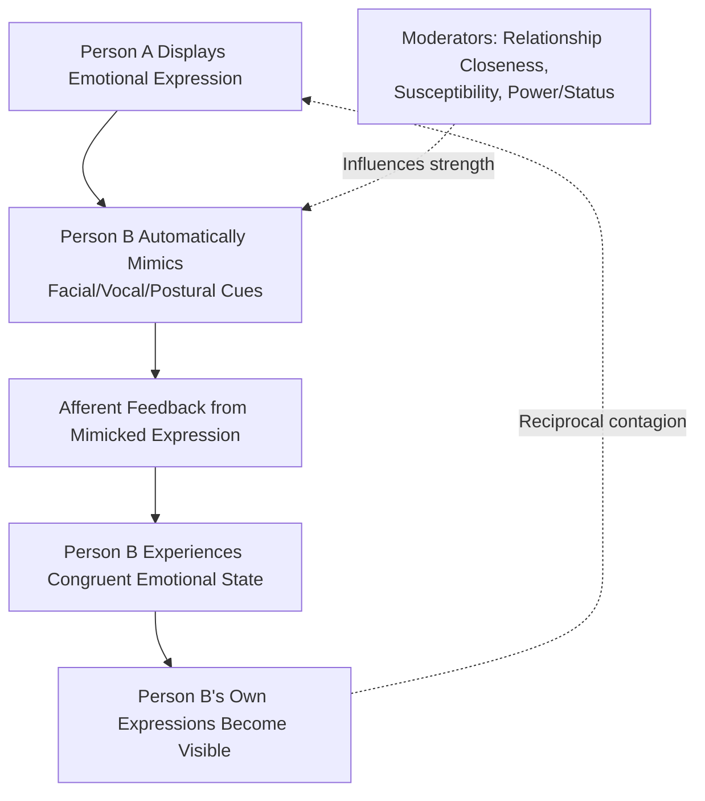

## Emotional Contagion

### Definition

**Emotional contagion** is the process by which one person's emotions and related behaviors directly trigger similar emotions and behaviors in other people, typically occurring automatically and outside conscious awareness through the synchronization of facial expressions, vocalizations, postures, and movements between interacting individuals. It is distinguished from more deliberate empathic processes by its primitive, largely automatic mechanism, though it is often considered a foundational building block for more complex empathic and social bonding processes.

### Historical and Theoretical Background

- Early observations of shared emotional/behavioral synchrony (e.g., crowd psychology, Le Bon's late 19th-century work on collective behavior) predate formal psychological theorizing but establish the phenomenon's long-recognized social significance.
- **Elaine Hatfield, John Cacioppo, and Richard Rapson (1993, 1994)** provided the foundational modern theoretical synthesis in their book *Emotional Contagion*, formalizing the construct and proposing the **Primitive Emotional Contagion** model as its core underlying mechanism.
- The theory draws heavily on earlier facial feedback research (e.g., work building on Darwin's and Tomkins's ideas about the functional link between facial expression and subjective emotional experience) and on mimicry research in developmental and social psychology.
- Subsequent extensions applied the construct to organizational behavior (mood contagion in workgroups and leadership), close relationships, crowd/collective behavior, and — more recently — computer-mediated and digital/social-media contexts.

### The Primitive Emotional Contagion Model (Hatfield, Cacioppo, & Rapson)

Proposes a three-step automatic process:

1. **Mimicry**: Individuals automatically and continuously mimic and synchronize their facial expressions, vocalizations, postures, and movements with those of people they interact with (a process related to but distinct from deliberate imitation).
2. **Feedback**: Via a facial-feedback-like mechanism, the physical act of mimicking another's expression produces afferent feedback that induces a congruent subjective emotional state in the mimicking individual.
3. **Contagion**: The result is that the mimicker comes to feel, to some degree, the emotion originally expressed by the other person — emotion "spreads" from one person to another without necessarily requiring conscious appraisal or interpretation of the situation.

This model positions emotional contagion as occurring largely outside awareness and largely independent of higher-order cognitive appraisal processes (distinguishing it conceptually from appraisal-based accounts of emotion elicitation), making it one of the more automatic, low-level mechanisms proposed in affective science.

### Distinguishing Related Concepts

| Concept | Focus | Relation to Emotional Contagion |
| --- | --- | --- |
| Emotional contagion | Automatic, largely unconscious transfer of emotional states via mimicry/feedback | Core topic |
| Empathy | Understanding and (often deliberately) sharing another's emotional/cognitive perspective | Broader, more cognitively elaborated construct; contagion is often considered a primitive precursor or component of empathic response, not identical to full empathy |
| Sympathy | Feeling concern *for* another's distress without necessarily sharing the same emotional state | Distinct — sympathy does not require the observer to actually experience the same emotion, unlike contagion |
| Mimicry (behavioral) | Automatic matching of another's motor behaviors/expressions | The proposed mechanistic first step of the contagion process, not the full phenomenon itself |
| Perspective-taking | Deliberate cognitive adoption of another's viewpoint | A more effortful, cognitively-mediated process, generally considered distinct from contagion's automaticity |
| Groupthink | Cohesion-driven suppression of dissenting views in decision-making groups | A related group-level phenomenon but focused on judgment/decision conformity rather than direct emotional state transfer |

### Key Empirical Studies

**Hatfield, Cacioppo, & Rapson (1993, 1994) — Foundational Theoretical Synthesis**

Compiled and organized substantial existing evidence (facial mimicry studies, physiological synchrony findings, naturalistic observation of interacting dyads) into the unified Primitive Emotional Contagion framework, establishing the construct's modern theoretical foundation.

**Facial Mimicry and Synchrony Studies**

A substantial body of research using facial electromyography (EMG) has found that individuals show rapid, largely automatic facial muscle activity congruent with observed emotional expressions in others (e.g., subtle zygomaticus/cheek muscle activation when viewing smiling faces), supporting the mimicry component of the model.

**Neumann & Strack (2000) — Vocal Emotional Contagion**

Demonstrated that listeners exposed to emotionally-toned speech (independent of semantic content) showed a mood shift congruent with the speaker's vocal emotional tone, extending contagion evidence beyond facial mimicry into the vocal/auditory domain.

**Barsade (2002) — Organizational "Ripple Effect" Study**

A widely cited experimental study using a managerial simulation with planted confederates trained to express either positive or negative mood found that group members' moods and subsequent cooperative/conflict behavior shifted in the direction of the confederate's expressed mood, supporting emotional contagion's relevance to organizational group dynamics.

**Kramer, Guillory, & Hancock (2014) — Facebook "Emotional Contagion" Experiment**

A large-scale, widely discussed (and controversial) field experiment manipulated the emotional valence of content in users' Facebook News Feeds and found that users exposed to reduced positive (or negative) content in their feeds subsequently produced slightly more negative (or positive) posts themselves — cited as evidence that emotional contagion effects can occur even without direct face-to-face interaction or nonverbal mimicry, through purely textual social media content exposure. This study also generated substantial ethical controversy regarding informed consent standards for large-scale behavioral experimentation on social media platforms, and is frequently discussed in research methodology and ethics contexts as much as in emotional contagion contexts specifically. [Note: the reported effect sizes in this study were quite small in absolute terms, a point often raised in subsequent methodological discussion of the study's real-world significance.]

### Applied and Real-World Manifestations

- **Leadership and organizational mood transfer**: Leaders' displayed emotional states have been found to propagate to subordinates and shape team affective climate, group cooperation, and even task performance, informing leadership development and management training that emphasizes leaders' emotional self-regulation given their outsized contagion influence on group mood.
- **Crowd behavior and collective emotional dynamics**: Emotional contagion is frequently invoked to help explain rapid affective synchronization in crowds (e.g., panic spread, collective euphoria at events), building on long-standing crowd psychology observations.
- **Customer service and frontline service industries**: Research on "emotional labor" and service interactions has examined how service workers' displayed emotions (whether genuine or surface-acted) can influence customer mood and satisfaction via contagion-like processes.
- **Close relationships and marital interaction**: Partners in long-term relationships have been observed to show physiological and emotional synchrony during interaction, with some research linking the degree of this synchrony to relationship quality and empathic accuracy.
- **Digital/social media contexts**: Beyond the Facebook study, ongoing research examines whether and how emotional contagion-like effects operate through text-based, algorithmically-curated online environments lacking the nonverbal cues classically proposed as the mechanism's basis. [Inference: the precise mechanism underlying contagion-like effects in purely textual/digital contexts — given the absence of facial/vocal mimicry pathways — remains an active area of theoretical development rather than a fully settled mechanistic account.]

### Individual Differences and Moderators

- **Susceptibility to emotional contagion**: Individual difference measures (e.g., the Emotional Contagion Scale, Doherty, 1997) find that people vary meaningfully in their tendency to "catch" others' emotions, with higher susceptibility associated with traits like higher empathic concern and emotional expressivity.
- **Relationship closeness**: Contagion effects tend to be stronger between individuals with closer relationships or greater interactional history, though contagion has also been documented between strangers, indicating relationship closeness is a moderator rather than a strict precondition.
- **Power and status asymmetries**: Some research suggests contagion may flow asymmetrically in hierarchical relationships, with higher-status individuals' emotional expressions exerting disproportionate influence on lower-status others' emotional states (relevant to the leadership/organizational contagion literature).
- **Cultural display norms**: Cultural variation in emotional expressiveness and display rules may modulate the visibility and intensity of contagion effects, since the process is proposed to rely substantially on observable expressive cues. [Inference: cross-cultural contagion research is comparatively less developed than the foundational Western-sample studies, so generalizability across cultural contexts warrants caution.]

### Clinical and Practical Relevance

- **Burnout and "compassion fatigue" in caregiving professions**: Emotional contagion is frequently invoked as a contributing mechanism in clinicians, therapists, and caregivers who repeatedly absorb clients'/patients' distress, informing occupational wellness and supervision practices in these fields.
- **Emotion regulation training for high-contagion-exposure roles**: Some professional training (e.g., for crisis responders, healthcare workers) incorporates awareness of contagion susceptibility alongside broader emotion regulation skill-building to mitigate excessive absorption of others' distress.
- **Team and organizational climate interventions**: Awareness of contagion effects informs organizational practices around meeting facilitation, leadership emotional display, and management of "toxic" mood spread within teams.
- **Marketing and advertising**: Practical application in advertising research examines how emotionally-expressive content (e.g., actors' displayed emotion in commercials) may induce congruent viewer mood via contagion-adjacent mechanisms, informing creative/emotional-appeal advertising strategy.

### Common Misconceptions

- Emotional contagion is **not** the same as empathy in the fuller, more commonly used sense of the term; it is a more primitive, largely automatic process that can occur without any deliberate perspective-taking or conscious recognition of the other person's emotional state.
- Emotional contagion does **not** require face-to-face interaction or direct nonverbal cues to occur, as demonstrated by vocal-only and even purely text-based (social media) contagion-like effects, though the underlying mechanism in non-facial-nonverbal contexts is less well specified than the classic mimicry-feedback model.
- The Facebook "emotional contagion" experiment's findings, while widely cited, involved quite small absolute effect sizes and generated substantial ethical debate regarding research consent standards — it should not be cited as demonstrating a large or simple causal effect without these important caveats.
- Emotional contagion is **not** an inherently negative phenomenon; it operates for positive emotional states (e.g., shared enthusiasm, joy) just as readily as for negative ones, and is generally considered a foundational, largely adaptive component of human social bonding rather than solely a vulnerability.

### Diagram: Primitive Emotional Contagion Process

### Diagram: Contagion Pathways Across Contexts (svg_diagram)

<svg xmlns="http://www.w3.org/2000/svg" viewBox="0 0 700 340" font-family="sans-serif">
<text x="350" y="26" text-anchor="middle" font-size="17" font-weight="bold" fill="#1a1a2e">Emotional Contagion Across Contexts (svg_diagram)</text>
<rect x="30" y="60" width="200" height="110" rx="8" fill="#e8f0fe" stroke="#4285f4" stroke-width="2" />
<text x="130" y="90" text-anchor="middle" font-size="13" font-weight="bold" fill="#1a3d7c">Face-to-Face</text>
<text x="130" y="115" text-anchor="middle" font-size="11" fill="#333">Facial/vocal/postural</text>
<text x="130" y="132" text-anchor="middle" font-size="11" fill="#333">mimicry-feedback</text>
<text x="130" y="150" text-anchor="middle" font-size="11" fill="#333">(classic mechanism)</text>
<rect x="250" y="60" width="200" height="110" rx="8" fill="#e6f4ea" stroke="#34a853" stroke-width="2" />
<text x="350" y="90" text-anchor="middle" font-size="13" font-weight="bold" fill="#1e5e2e">Organizational/Group</text>
<text x="350" y="115" text-anchor="middle" font-size="11" fill="#333">Leader/member mood</text>
<text x="350" y="132" text-anchor="middle" font-size="11" fill="#333">ripple effects</text>
<text x="350" y="150" text-anchor="middle" font-size="11" fill="#333">(Barsade, 2002)</text>
<rect x="470" y="60" width="200" height="110" rx="8" fill="#fef7e0" stroke="#fbbc04" stroke-width="2" />
<text x="570" y="90" text-anchor="middle" font-size="13" font-weight="bold" fill="#8a6d00">Digital/Social Media</text>
<text x="570" y="115" text-anchor="middle" font-size="11" fill="#333">Text-based content</text>
<text x="570" y="132" text-anchor="middle" font-size="11" fill="#333">exposure effects</text>
<text x="570" y="150" text-anchor="middle" font-size="11" fill="#333">(Kramer et al., 2014)</text>

<text x="350" y="210" text-anchor="middle" font-size="12" fill="#555">Mechanism clarity decreases left → right</text>

<text x="350" y="228" text-anchor="middle" font-size="12" fill="#555">as classic nonverbal mimicry pathways become less applicable</text>

</svg>

### Related Topics

- Empathy and empathic accuracy
- Facial mimicry and facial feedback hypothesis
- Barsade's organizational mood contagion research
- Kramer, Guillory, & Hancock's Facebook emotional contagion study and its ethical debates
- Groupthink and collective behavior
- Emotional labor and service industry research
- Leadership and emotional climate in organizations
- Physiological synchrony in close relationships
- Compassion fatigue and burnout in caregiving professions
- Crowd psychology and collective emotional dynamics