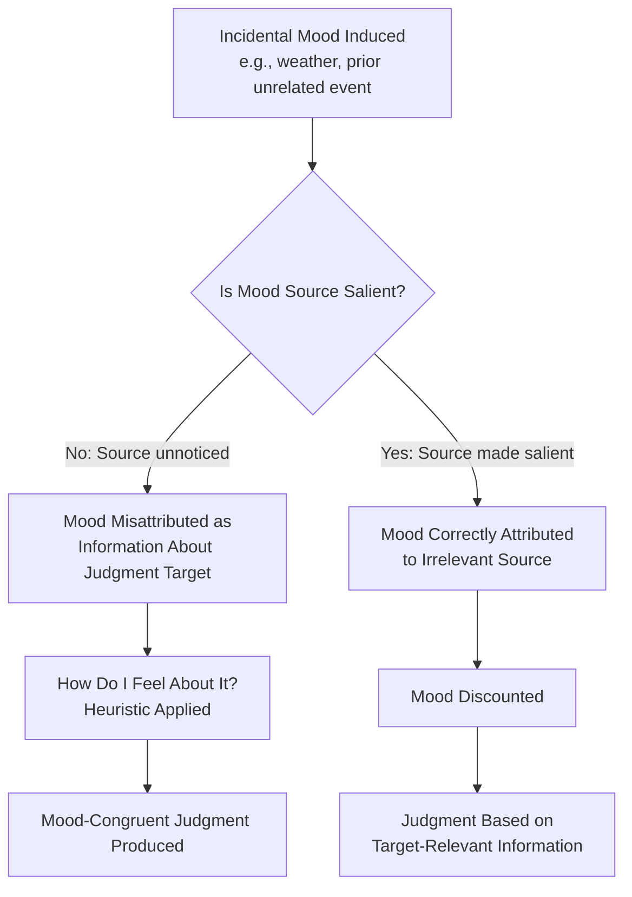

## Affect-as-Information and Mood-Congruent Judgment

### Definition

**Affect-as-information** is the theoretical proposal that people use their current subjective feelings as a direct source of information when making judgments and decisions, essentially asking themselves "how do I feel about this?" as a heuristic proxy for more effortful, systematic evaluation — even when the mood's actual source is unrelated to the judgment target. **Mood-congruent judgment** is the broader empirical pattern this theory helps explain: the tendency for people's evaluations, memories, and interpretations to align with the valence of their current mood state (more positive judgments/recall when in a positive mood, more negative when in a negative mood).

### Historical and Theoretical Background

- **Norbert Schwarz and Gerald Clore (1983, 1988)** developed the foundational **Affect-as-Information model**, building on earlier work regarding heuristic processing and building specifically on findings that incidental mood (mood caused by something unrelated to the judgment at hand, such as weather) nonetheless influenced unrelated evaluative judgments.
- The model was explicitly framed within the broader **heuristics and biases** tradition (Tversky & Kahneman) as a specific instance of substituting an accessible, easily-computed cue (current feeling) for a more effortful, target-relevant evaluation.
- **Gordon Bower's (1981) Associative Network Theory of mood and memory** provided a complementary cognitive-architecture account, proposing that mood functions as a node in an associative memory network, such that being in a given mood activates memories, thoughts, and associations congruent with that mood — offering a mechanistic explanation for mood-congruent recall distinct from, but often discussed alongside, the affect-as-information account of mood-congruent judgment.
- These frameworks emerged partly in response to and helped resolve the puzzle of how demonstrably *incidental*, judgment-irrelevant mood states (e.g., mood induced by weather, background music, or an unrelated prior event) could nonetheless systematically bias evaluative judgments in later, unrelated contexts.

### The Affect-as-Information Model (Schwarz & Clore)

Core proposition: rather than (or in addition to) systematically retrieving and weighing relevant features of a judgment target, people often use their immediately accessible affective state as a heuristic cue — asking implicitly, **"How do I feel about it?"** — and use the answer to inform their evaluative judgment, especially under conditions of limited motivation, cognitive resources, or time for more effortful processing.

Critically, this process is proposed to be particularly susceptible to **misattribution**: because people are not always accurately monitoring the true source of their current feeling, mood caused by an unrelated prior event (e.g., weather, an earlier interaction) can be mistakenly treated as informative about the current judgment target, biasing the judgment in the direction of the (irrelevant) mood's valence.

### Key Empirical Studies

**Schwarz & Clore (1983) — Weather and Life Satisfaction**

A foundational field study found that participants surveyed by phone reported significantly higher life satisfaction on sunny days compared to rainy days — but critically, this weather-mood effect on life satisfaction judgments was eliminated when participants' attention was first explicitly drawn to the current weather (e.g., by asking about it directly beforehand), supporting the misattribution mechanism: once the true (irrelevant) source of the mood was made salient, participants discounted it as uninformative for judging life satisfaction rather than mistakenly incorporating it into that judgment.

**Bower (1981) — Mood-Dependent Memory and Associative Network Theory**

Using hypnotically or naturally induced mood states, found that participants showed better recall for material learned in a mood congruent with their current state (**mood-congruent recall**) and, separately, sometimes showed better recall when their mood at retrieval matched their mood at encoding (**mood-state-dependent memory**) — providing an associative-network account for how mood systematically biases which memories and associations become accessible during judgment.

**Forgas's Affect Infusion Model (AIM)** (Joseph Forgas, 1995)

Extended and integrated affect-as-information with processing-style considerations, proposing that the degree to which mood "infuses" into judgment depends on the processing strategy employed for a given task — mood effects on judgment are proposed to be strongest under more open, constructive, substantive processing (requiring the person to generate rather than simply retrieve a judgment) and weakest under highly motivated, direct-access, or heavily-scripted processing where mood has little opportunity to inform the outcome. This model helped integrate earlier, sometimes conflicting findings regarding when mood does or does not substantially bias judgment.

**Clore & Schwarz's Later Refinements**

Subsequent theoretical work distinguished more precisely between the informational role of mood in evaluative judgments versus its role in other cognitive processes (e.g., processing style — positive mood associated with more heuristic/global processing, negative mood with more systematic/detail-oriented processing), broadening the theory's scope beyond simple valence-congruent evaluation.

### Mood and Processing Style: A Complementary Finding

Beyond direct valence-congruent judgment effects, a related and extensively studied finding holds that:

- **Positive mood** tends to be associated with more heuristic, top-down, categorical, and creative processing styles, plausibly because positive affect signals "the situation is safe/fine," reducing the perceived need for effortful vigilance.
- **Negative mood** tends to be associated with more systematic, bottom-up, detail-oriented processing, plausibly because negative affect signals "something is wrong," prompting more careful, analytic engagement with the situation.

This processing-style pattern (sometimes discussed under the "mood-as-input" or related affect-cognition frameworks) is conceptually related to, but analytically distinct from, the core valence-congruent evaluative judgment effect central to affect-as-information theory. [Inference: the precise boundary conditions distinguishing when mood shifts processing style versus directly biasing judgment content remain an area of ongoing theoretical refinement across these related but distinct literatures.]

### Distinguishing Related Concepts

| Concept | Focus | Relation to Affect-as-Information |
| --- | --- | --- |
| Affect-as-information (Schwarz & Clore) | Using current feeling as a heuristic judgment cue | Core topic |
| Mood-congruent judgment | The broader empirical pattern of mood-aligned evaluations | The phenomenon affect-as-information theory helps explain |
| Associative Network Theory (Bower) | Mood as an activating node in memory networks | A complementary memory-based mechanism, particularly relevant to mood-congruent recall specifically |
| Affect Infusion Model (Forgas) | Processing strategy determines degree of mood's influence on judgment | An integrative extension specifying *when* affect-as-information effects are strongest/weakest |
| Misattribution of arousal (Schachter-Singer tradition) | Mislabeling the source of physiological arousal | A related but distinct historical precursor concerning arousal source confusion generally, feeding into affect-as-information's misattribution mechanism specifically for mood/judgment |
| Mere exposure effect | Increased liking from repeated exposure | A separate affect-related bias, not built on the "how do I feel" heuristic mechanism |

### Applied and Real-World Examples

- **Consumer judgment and marketing**: Advertising and retail environment research applies affect-as-information findings by using ambient mood-inducing cues (music, scent, lighting) to influence product evaluation and purchase intent, based on the premise that incidental positive mood may be misattributed as positive feeling toward the product itself.
- **Survey methodology and measurement**: Awareness of weather- and context-induced mood effects on self-reported well-being and satisfaction measures informs survey design practices (e.g., controlling for or measuring incidental mood states, or explicitly directing attention to potential mood sources to reduce contamination of target judgments).
- **Legal and jury decision-making research**: Studies examining jurors' mood states (e.g., from courtroom conditions, case-irrelevant factors) draw on affect-as-information to explain potential mood-driven bias in verdict or sentencing judgments unrelated to case evidence.
- **Clinical mood-congruent cognition in depression research**: Mood-congruent memory and judgment effects are directly relevant to understanding cognitive patterns in depression, where persistent negative mood is associated with negatively biased judgment, self-evaluation, and memory recall — informing cognitive-behavioral therapeutic targets aimed at interrupting this self-reinforcing cycle.
- **Financial decision-making**: Behavioral finance research has examined whether incidental mood (e.g., from unrelated daily events or even weather) systematically influences investment-related judgments and risk tolerance, drawing directly on affect-as-information's misattribution logic. [Inference: while an active applied research area, the practical magnitude and robustness of mood effects specifically on high-stakes financial decisions varies across studies and is not uniformly established.]

### Boundary Conditions and Moderators

- **Attention to mood source**: As demonstrated in the foundational weather study, explicitly making the true (irrelevant) source of mood salient tends to eliminate or substantially reduce the mood's biasing influence on an unrelated judgment, since misattribution is disrupted once the source becomes apparent.
- **Processing motivation and resources**: Per the Affect Infusion Model, mood-as-information effects are generally stronger under low-motivation, low-cognitive-resource, or open/constructive processing conditions, and weaker when individuals are highly motivated to process systematically or when the judgment can be made via direct memory retrieval rather than being newly constructed.
- **Judgment relevance/directness**: Judgments requiring more constructive, generative evaluation (e.g., "how satisfied am I with my life overall?") are more susceptible to affect-as-information effects than narrowly factual or highly scripted judgments.
- **Individual differences**: Some research suggests trait-level differences in reliance on affective versus deliberative judgment strategies may moderate susceptibility, though this is a less extensively developed area relative to the situational/contextual moderators above. [Inference: individual-difference moderators are comparatively less established in the empirical literature than the situational moderators described above.]

### Common Misconceptions

- Affect-as-information does **not** claim mood always dominates judgment regardless of context; the effect is substantially moderated by processing conditions (per Forgas's Affect Infusion Model) and can be sharply reduced when the mood's true source is made salient.
- Mood-congruent judgment and mood-congruent memory (Bower's associative network account), while related and often co-occurring, are **not** identical mechanisms; affect-as-information centers on using current feeling as a direct evaluative cue, while associative network theory centers on mood-linked activation spreading through memory to bias what information is recalled and available for judgment.
- The weather-life-satisfaction effect does **not** imply people are simply "irrational" in a blanket sense; the misattribution mechanism reflects a generally efficient heuristic (using feeling as information) that produces bias specifically when the feeling's true source is uninformative for the judgment at hand and goes unnoticed.
- Positive mood promoting more heuristic processing and negative mood promoting more systematic processing should **not** be treated as implying negative mood is simply "better" for accuracy in all contexts; each processing style carries context-dependent costs and benefits (e.g., heuristic processing can support creativity, while systematic processing can slow decision-making unnecessarily in low-stakes contexts).

### Diagram: Affect-as-Information Process

### Diagram: Affect Infusion Model — When Mood Biases Judgment Most (svg_diagram)

<svg xmlns="http://www.w3.org/2000/svg" viewBox="0 0 700 340" font-family="sans-serif">
<text x="350" y="26" text-anchor="middle" font-size="17" font-weight="bold" fill="#1a1a2e">Forgas's Affect Infusion Model (svg_diagram)</text>
<line x1="80" y1="290" x2="640" y2="290" stroke="#333" stroke-width="1.5" />
<text x="360" y="315" text-anchor="middle" font-size="12" fill="#333">Processing Effort: Low → High</text>
<line x1="80" y1="290" x2="80" y2="60" stroke="#333" stroke-width="1.5" />
<text x="35" y="175" text-anchor="middle" font-size="12" fill="#333" transform="rotate(-90 35 175)">Mood Infusion Strength</text>
<path d="M 100 100 Q 250 250 400 260 Q 550 265 600 120" fill="none" stroke="#4285f4" stroke-width="3" />
<rect x="90" y="70" width="150" height="60" rx="6" fill="#fdeaea" stroke="#ea4335" stroke-width="1.5" />
<text x="165" y="92" text-anchor="middle" font-size="10" font-weight="bold" fill="#7c1a1a">Direct Access</text>
<text x="165" y="108" text-anchor="middle" font-size="9" fill="#333">Low mood infusion</text>
<text x="165" y="122" text-anchor="middle" font-size="9" fill="#333">(retrieve existing judgment)</text>
<rect x="325" y="220" width="150" height="60" rx="6" fill="#e6f4ea" stroke="#34a853" stroke-width="1.5" />
<text x="400" y="242" text-anchor="middle" font-size="10" font-weight="bold" fill="#1e5e2e">Heuristic/Substantive</text>
<text x="400" y="258" text-anchor="middle" font-size="9" fill="#333">High mood infusion</text>
<text x="400" y="272" text-anchor="middle" font-size="9" fill="#333">(constructive judgment)</text>
<rect x="460" y="70" width="150" height="60" rx="6" fill="#fdeaea" stroke="#ea4335" stroke-width="1.5" />
<text x="535" y="92" text-anchor="middle" font-size="10" font-weight="bold" fill="#7c1a1a">Motivated/Systematic</text>
<text x="535" y="108" text-anchor="middle" font-size="9" fill="#333">Low mood infusion</text>
<text x="535" y="122" text-anchor="middle" font-size="9" fill="#333">(high-stakes deliberation)</text>
</svg>

### Related Topics

- Heuristics and biases framework (Tversky & Kahneman)
- Associative Network Theory of mood and memory (Bower)
- Affect Infusion Model (Forgas)
- Mood-congruent memory and cognitive biases in depression
- Misattribution of arousal (Schachter-Singer two-factor theory)
- Emotional contagion
- Appraisal theories of emotion
- Consumer psychology and ambient mood marketing
- Survey methodology and mood-based measurement bias
- Emotion regulation and processing-style effects