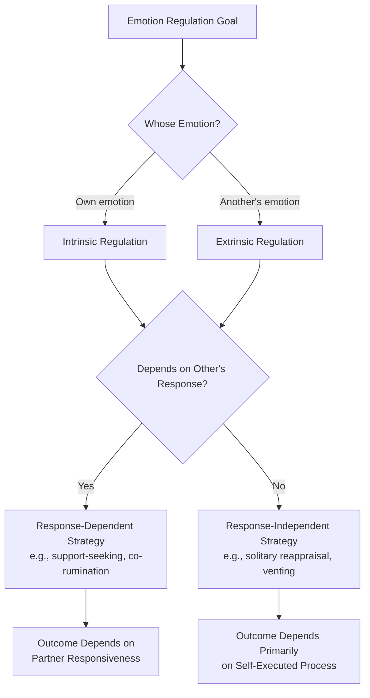

## Emotion Regulation in Social Contexts

### Definition

**Emotion regulation** refers to the processes by which individuals influence which emotions they have, when they have them, and how they experience and express these emotions. **Emotion regulation in social contexts** specifically examines how these regulatory processes operate within interpersonal and social settings — including regulation motivated by social/relational goals, regulation that occurs through interaction with others (rather than purely intrapersonally), and the distinctly social consequences of different regulation strategies for relationships, group functioning, and social perception.

### Historical and Theoretical Background

- **James Gross's Process Model of Emotion Regulation** (1998, 2015) is the dominant organizing framework in the field, conceptualizing emotion regulation as intervening at different points in the emotion-generation process (situation selection, situation modification, attentional deployment, cognitive change, response modulation).
- Early emotion regulation research emphasized largely intrapersonal (within-person) regulation; a substantial subsequent literature (particularly since the 2000s) has emphasized that much real-world emotion regulation is fundamentally **interpersonal** — occurring through, with, and for the benefit of relationships with others, not solely as a private, individual coping process.
- **Arlie Hochschild's concept of emotional labor** (1983, *The Managed Heart*) provided an influential early sociological framework for understanding regulation demanded by social/occupational roles, introducing the surface-acting/deep-acting distinction later widely adopted in organizational psychology.
- **James Gross and colleagues' later work on interpersonal emotion regulation** (e.g., Zaki & Williams, 2013) explicitly extended the process model to account for regulation that occurs *through* social interaction — either by seeking to change one's own emotions via others (intrinsic interpersonal regulation) or by acting to change another person's emotions (extrinsic interpersonal regulation).

### Gross's Process Model: Five Families of Regulation Strategies

Applied to social contexts, each family has distinctive interpersonal manifestations:

1. **Situation Selection**: Choosing to approach or avoid particular social situations or people based on their anticipated emotional impact (e.g., avoiding a particular social gathering, seeking out a supportive friend).
2. **Situation Modification**: Actively altering an ongoing social situation to change its emotional impact (e.g., changing the topic of conversation, physically leaving a tense interaction).
3. **Attentional Deployment**: Directing attention within a social situation (e.g., focusing on a supportive person in a room rather than a critical one; distraction during an uncomfortable social interaction).
4. **Cognitive Change**: Reappraising the meaning of a social event or another person's behavior (e.g., reinterpreting a partner's curt response as due to their stress rather than personal rejection) — closely linked to appraisal theory.
5. **Response Modulation**: Directly altering the expression or experience of emotion after it has already been generated (e.g., suppressing visible anger during a workplace conflict) — this family includes **expressive suppression**, one of the most extensively studied (and, per the evidence below, most socially costly) regulation strategies.

### Interpersonal Emotion Regulation Framework (Zaki & Williams, 2013)

Distinguishes regulation along two dimensions:

- **Intrinsic vs. Extrinsic**: Whether the goal is to regulate one's *own* emotions (intrinsic) or to regulate *another person's* emotions (extrinsic).
- **Response-dependent vs. Response-independent**: Whether the regulation strategy depends on receiving a specific response from another person (e.g., seeking comfort and needing the other person to actually provide it) or can be executed regardless of the other's response (e.g., simply venting without expecting a particular reaction).

This framework highlights that a substantial portion of everyday emotion regulation is not a solitary, internal process but is co-constructed through social interaction — for example, seeking social support explicitly involves another person's responsiveness as part of the regulatory mechanism itself, distinguishing it from purely intrapersonal strategies like solitary cognitive reappraisal.

### Key Empirical Findings

**Gross & John (2003) — Habitual Strategy Use and Social/Well-Being Outcomes**

A large individual-differences study found that habitual use of **cognitive reappraisal** was associated with better interpersonal functioning, greater social support, and higher well-being, while habitual use of **expressive suppression** was associated with worse interpersonal functioning, reduced closeness in relationships, and poorer well-being — establishing reappraisal as the generally more adaptive strategy across social outcomes in this foundational individual-differences research.

**Butler, Egloff, Wilhelm, Mitchell, Gross et al. (2003) — Suppression's Interpersonal Costs**

An experimental study directly manipulating suppression during dyadic conversation found that expressive suppression not only failed to reduce the physiological arousal of the suppressor but also increased the blood pressure of their *interaction partner* and reduced the partner's rapport and desire for future interaction — providing direct experimental evidence that suppression carries a real-time relational cost that extends to the interaction partner, not just the suppressor.

**English & John (2013) and related work on strategy-outcome specificity**

Refined the reappraisal-good/suppression-bad generalization by finding that the social costs of suppression and benefits of reappraisal are more consistently observed for *negative* emotions than positive ones, and that context (e.g., relationship closeness, cultural norms) moderates these associations, cautioning against an overly simplistic universal ranking of strategies. [Inference: while reappraisal is broadly favored across most contexts studied, the "reappraisal good, suppression bad" framing requires qualification by emotion valence and social context per this more nuanced body of subsequent work.]

**Zaki & Williams (2013) — Interpersonal Emotion Regulation Framework**

Synthesized evidence that social support-seeking, co-rumination, and other explicitly interpersonal regulation strategies operate via distinct mechanisms from intrapersonal strategies like solitary reappraisal, and that their effectiveness depends critically on the responsiveness and quality of the social partner's response — highlighting social context as not merely a backdrop but a constitutive component of the regulation process itself for these strategies.

### Emotional Labor: Regulation Demanded by Social/Occupational Roles

**Surface Acting**: Modifying outward emotional expression to meet role/situational display requirements without changing the underlying felt emotion (functionally similar to expressive suppression/masking) — consistently associated with greater emotional exhaustion and burnout in occupational research.

**Deep Acting**: Actively working to genuinely change one's internal emotional state to align with required displays (functionally similar to cognitive reappraisal applied to occupational contexts) — generally associated with more favorable well-being and performance outcomes than surface acting, though still carrying some regulatory effort costs.

This framework (Hochschild, 1983; subsequently extensively developed in organizational psychology, e.g., Grandey, 2000) has substantial applied relevance for service-industry, healthcare, and other emotionally-demanding occupational roles requiring sustained emotional display management.

### Distinguishing Related Concepts

| Concept | Focus | Relation to Social Emotion Regulation |
| --- | --- | --- |
| Gross's Process Model | Five-family intrapersonal regulation strategy framework | Foundational structure, extended into social contexts |
| Interpersonal Emotion Regulation (Zaki & Williams) | Regulation occurring through/for others | Explicit social extension of the process model |
| Emotional labor (Hochschild) | Regulation demanded by occupational/social roles | Applied, role-specific instance of response modulation and cognitive change strategies |
| Co-rumination | Excessive, repetitive discussion of problems/negative emotions with others | A specific interpersonal strategy that can paradoxically increase rather than reduce distress if unbalanced by problem-solving |
| Social support seeking | Turning to others for emotional or instrumental help | A response-dependent interpersonal regulation strategy per Zaki & Williams's framework |
| Emotional contagion | Automatic transfer of emotional states between people | A largely unintentional process, distinct from deliberate emotion regulation strategies, though it can complicate interpersonal regulation attempts (e.g., trying to calm someone while unconsciously absorbing their distress) |

### Cultural and Contextual Moderators

- **Individualist vs. collectivist cultural contexts**: Some research suggests the relative costs/benefits of suppression may differ across cultural contexts, with suppression potentially carrying smaller (though not necessarily absent) interpersonal costs in cultural contexts where emotional restraint is a more normatively expected and socially validated display style. [Inference: cross-cultural emotion regulation research is an active but still-developing area, and claims about cultural moderation of suppression's costs should be treated as an important qualification to, rather than a wholesale reversal of, the general Western-sample finding that suppression carries interpersonal costs.]
- **Relationship closeness**: The interpersonal costs of suppression and benefits of interpersonal regulation strategies (e.g., support-seeking) may be moderated by the closeness and history of the relationship in which regulation occurs.
- **Power and role asymmetries**: Occupational and social role demands (e.g., service worker requirements, gendered emotional display expectations) can constrain which regulation strategies are socially available or acceptable, independent of an individual's own preferred regulatory style.
- **Co-rumination's double-edged nature**: Research on co-rumination (particularly in adolescent friendship research, e.g., Rose, 2002) finds it is associated with both closer, higher-quality friendships *and* increased risk of depressive and anxious symptoms, illustrating that interpersonal regulation strategies can carry simultaneous relational benefits and psychological costs.

### Applied and Clinical Relevance

- **Couples and family therapy**: Interventions increasingly target dyadic and family-level emotion regulation patterns (e.g., helping partners co-regulate distress constructively) rather than treating emotion regulation as a purely individual therapeutic target.
- **Workplace wellness and burnout prevention**: Emotional labor research directly informs organizational interventions aimed at reducing surface-acting demands (e.g., through role redesign, training in deep-acting/reappraisal techniques) in emotionally demanding occupations like healthcare, customer service, and education.
- **Developmental and parenting interventions**: Research on **co-regulation** in parent-child relationships (caregivers helping regulate a child's emotional state before the child develops independent regulatory capacity) informs early childhood intervention and parenting support programs.
- **Social support training in mental health contexts**: Given evidence on the response-dependent nature of support-seeking as a regulation strategy, some interventions explicitly train both help-seekers and their social network members (e.g., partners, friends) in effective supportive responding to improve interpersonal regulation outcomes.

### Common Misconceptions

- Expressive suppression is **not** simply a "neutral" or cost-free strategy just because it doesn't require changing one's felt emotion; substantial direct experimental evidence shows it carries measurable costs to the suppressor's physiology and, notably, to interaction partners' physiological state and relational satisfaction.
- Emotion regulation in social contexts is **not** solely an individual, private process; a substantial portion of everyday regulation (support-seeking, co-rumination, interpersonal reappraisal assistance) is inherently interactive, depending on another person's responsiveness as part of the mechanism itself.
- "Reappraisal is good, suppression is bad" is **not** an unconditional rule; the relative costs and benefits of these strategies are moderated by emotion valence, cultural context, and relationship factors, per more recent refinements to the foundational Gross & John findings.
- Co-rumination and other support-seeking interpersonal strategies are **not** uniformly beneficial simply because they involve social connection; excessive or unbalanced co-rumination can paradoxically increase rather than reduce distress, illustrating that interpersonal regulation strategies carry their own distinct trade-offs.

### Diagram: Interpersonal Emotion Regulation Framework

### Diagram: Surface Acting vs. Deep Acting in Emotional Labor (svg_diagram)

<svg xmlns="http://www.w3.org/2000/svg" viewBox="0 0 700 320" font-family="sans-serif">
<text x="350" y="26" text-anchor="middle" font-size="17" font-weight="bold" fill="#1a1a2e">Emotional Labor: Two Regulatory Paths (svg_diagram)</text>
<rect x="40" y="60" width="290" height="220" rx="10" fill="#fdeaea" stroke="#ea4335" stroke-width="2" />
<text x="185" y="90" text-anchor="middle" font-size="14" font-weight="bold" fill="#7c1a1a">Surface Acting</text>
<text x="185" y="120" text-anchor="middle" font-size="11" fill="#333">Modify outward expression only</text>
<text x="185" y="140" text-anchor="middle" font-size="11" fill="#333">Felt emotion remains unchanged</text>
<text x="185" y="170" text-anchor="middle" font-size="11" fill="#333">→ Emotional dissonance</text>
<text x="185" y="192" text-anchor="middle" font-size="11" fill="#333">→ Higher exhaustion/burnout</text>
<text x="185" y="214" text-anchor="middle" font-size="11" fill="#333">→ Similar to expressive</text>
<text x="185" y="232" text-anchor="middle" font-size="11" fill="#333"> suppression mechanism</text>
<text x="185" y="256" text-anchor="middle" font-size="11" fill="#333">→ Detectable by others,</text>
<text x="185" y="274" text-anchor="middle" font-size="11" fill="#333"> can reduce rapport</text>
<rect x="370" y="60" width="290" height="220" rx="10" fill="#e6f4ea" stroke="#34a853" stroke-width="2" />
<text x="515" y="90" text-anchor="middle" font-size="14" font-weight="bold" fill="#1e5e2e">Deep Acting</text>
<text x="515" y="120" text-anchor="middle" font-size="11" fill="#333">Genuinely alter internal</text>
<text x="515" y="140" text-anchor="middle" font-size="11" fill="#333">emotional state</text>
<text x="515" y="170" text-anchor="middle" font-size="11" fill="#333">→ Reduced dissonance</text>
<text x="515" y="192" text-anchor="middle" font-size="11" fill="#333">→ Generally better well-being</text>
<text x="515" y="214" text-anchor="middle" font-size="11" fill="#333">→ Similar to cognitive</text>
<text x="515" y="232" text-anchor="middle" font-size="11" fill="#333"> reappraisal mechanism</text>
<text x="515" y="256" text-anchor="middle" font-size="11" fill="#333">→ Still carries some</text>
<text x="515" y="274" text-anchor="middle" font-size="11" fill="#333"> regulatory effort cost</text>
</svg>

### Related Topics

- Gross's Process Model of Emotion Regulation
- Interpersonal Emotion Regulation framework (Zaki & Williams)
- Emotional labor and surface/deep acting (Hochschild, Grandey)
- Appraisal theories of emotion (cognitive reappraisal mechanisms)
- Emotional contagion
- Co-rumination and adolescent friendship research
- Parent-child co-regulation and developmental emotion socialization
- Burnout and occupational well-being research
- Communication patterns and conflict resolution
- Cultural display rules and emotion norms