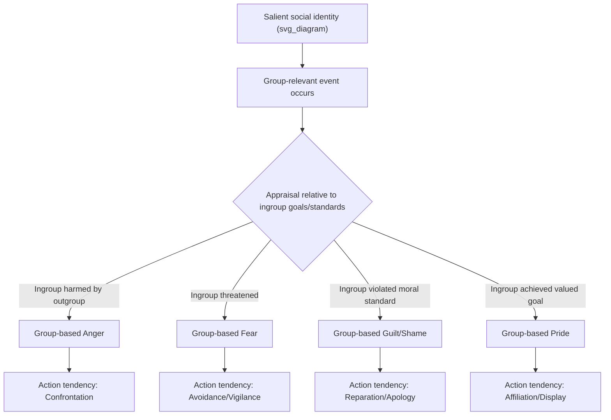

## Collective and Group-Based Emotion

### Definition and Conceptual Overview

Collective emotion refers to shared affective states experienced simultaneously by members of a group, often arising from a common event, symbol, or social identity. Group-based emotion is a related but distinct construct: emotions felt by individuals *not* because of what happens to them personally, but because of their membership in a social group, as described by Intergroup Emotions Theory (IET).

**Key Points**

- Collective emotion emphasizes synchronized, co-experienced affect (e.g., a crowd's fear during a stampede)
- Group-based emotion emphasizes identity-mediated affect (e.g., feeling guilt over one's nation's historical actions, even without personal involvement)
- Both differ from individual emotion in that the self-representation invoked is the collective "we," not the personal "I"
- Group-based emotions can be felt even when the individual was not physically present at the eliciting event

### Theoretical Foundations

#### Self-Categorization Theory (SCT) and Social Identity Theory (SIT)

Group-based emotions are grounded in the idea that the self exists on a continuum from personal identity to social identity (Turner et al.). When a particular group membership becomes psychologically salient, individuals appraise events through the lens of "us" rather than "me," and emotional responses follow group-relevant appraisals rather than personal ones.

$$P(\text{group-based emotion}) \propto f(\text{identification}, \text{salience}, \text{appraisal}_{\text{group}})$$

#### Intergroup Emotions Theory (IET)

Developed primarily by Smith, Mackie, and colleagues, IET extends appraisal theory to the group level. The core proposition: when social identity is salient, group members appraise events for their implications for the ingroup, generating discrete emotions (anger, fear, guilt, pride, shame) that in turn shape group-relevant action tendencies (e.g., anger → confrontation; fear → avoidance; guilt → reparative action).

**Key Points**

- Appraisal is the mediating mechanism: identical events can produce different group emotions depending on how they are appraised relative to group goals/standards
- Emotions predict intergroup action tendencies better than attitudes alone in several studies
- IET treats group emotions as functionally equivalent to individual emotions, just triggered by group-relevant appraisals

### Distinguishing Related Constructs

| Construct | Locus of Cause | Felt By | Example |
| --- | --- | --- | --- |
| Individual emotion | Personal event | Self | Fear after being mugged |
| Collective emotion | Shared event, co-present | Group as synchronized aggregate | Crowd panic at a concert |
| Group-based emotion | Ingroup's situation/history | Self via group identity | Shame over ancestors' actions |
| Emotional climate | Prolonged societal condition | Society/community over time | Post-disaster collective anxiety |
| Emotional culture | Norms about what to feel | Group members via socialization | Display rules for grief in mourning rituals |

### Mechanisms of Emotional Convergence

#### Emotional Contagion

Direct, often automatic transfer of affect between individuals via mimicry of facial expressions, vocal tone, and posture (Hatfield, Cacioppo, & Rapson's theory of primitive emotional contagion). This operates through low-level perception-action coupling and can occur without conscious awareness.

#### Social Appraisal

Individuals use others' emotional reactions as information when forming their own appraisal of an ambiguous situation (social referencing extended to adult group contexts). This is appraisal-mediated rather than purely mimetic.

#### Shared Reality and Common Identity

Repeated communication and co-experience of events builds a "shared reality" (Hardin & Higgins) that synchronizes how group members interpret and feel about events, reinforced through collective rituals, media, and symbolic communication.

### Discrete Group-Based Emotions

#### Group-Based Anger

Arises when the ingroup is appraised as illegitimately harmed, blocked, or disrespected by an outgroup. Strongly predicts collective action participation, protest, and confrontational intergroup behavior (van Zomeren, Spears, Fischer, & Leach's Social Identity Model of Collective Action, SIMCA).

#### Group-Based Guilt

Arises when the ingroup is appraised as responsible for an illegitimate harm done to an outgroup, and the ingroup's actions are seen as violating its own moral standards. Associated with support for reparations, apologies, and compensatory policies. Requires (a) categorization as ingroup member, (b) acceptance of ingroup responsibility, and (c) perceived illegitimacy of the harm.

#### Group-Based Shame

Distinct from guilt: shame focuses on a global negative evaluation of the group's identity/character rather than a specific illegitimate act. Often associated with withdrawal, defensiveness, or image-repair strategies rather than reparative action — a key point of divergence from guilt in behavioral consequences.

#### Group-Based Pride and Collective Efficacy

Positive appraisal of ingroup achievement or valued status; reinforces identification and can motivate continued collective engagement (e.g., sustained activism following a successful protest).

**Example**

A national sports team wins a championship. Fans who never played appraise the win as "our" achievement (group-based pride), while fans of a rival nation may appraise the same event as an ingroup status threat (group-based frustration or dejection), despite identical external event.

### Intergroup Emotion and Collective Action

Group-based emotions are central predictors in models of collective action:

- **SIMCA (van Zomeren et al., 2008):** Social identity → group-based anger + perceived efficacy + injustice appraisal → collective action intention
- **Group efficacy** functions as an emotional-cognitive hybrid: belief that the group can address the emotion-eliciting situation amplifies action tendencies tied to anger

$$\text{Collective Action Intention} = \beta_1(\text{Group Identification}) + \beta_2(\text{Group-Based Anger}) + \beta_3(\text{Perceived Group Efficacy}) + \varepsilon$$

[Inference] Exact coefficient weightings vary substantially across meta-analyses and cultural contexts, so this equation is illustrative of the theoretical structure rather than a fixed empirical formula.

### Collective Emotional Contagion in Crowds and Digital Contexts

#### Physical Crowds

Le Bon's early (and largely discredited in its strong form) "crowd mind" theory proposed a loss of individual rationality in crowds. Contemporary Elaborated Social Identity Model (ESIM; Reicher) reframes this: crowd behavior is not irrational deindividuation but rather the salience of a shared social identity that produces normatively coordinated (not chaotic) collective emotion and action.

#### Online and Networked Emotional Contagion

Digital platforms enable large-scale collective emotion via text and image sharing rather than face-to-face contagion cues. Documented in large-scale studies of emotional contagion through social media feeds, where exposure to emotionally valenced content shifts the affective tone of users' own subsequent posts.

**Key Points**

- Emotional contagion online lacks nonverbal cues but is amplified by network structure (virality, algorithmic curation)
- Moral-emotional language (words expressing moral judgment plus emotion) increases diffusion rate in social network studies of political content
- Collective emotion online can polarize faster than offline due to homophilic clustering

### Emotional Climate and Emotional Culture

- **Emotional climate**: A society- or community-level, temporally extended shared emotional state, often studied following collective trauma (wars, disasters, political crises). Distinct from momentary collective emotion in duration and diffuseness.
- **Emotional culture**: The socially transmitted norms, scripts, and display rules that specify which emotions are appropriate to express in which group contexts (e.g., collectivist vs. individualist differences in public grief display, per Matsumoto's display rule research).

### Measurement Approaches

| Method | What It Captures | Limitation |
| --- | --- | --- |
| Self-report group-emotion scales | Explicit felt intensity of group emotion | Social desirability bias |
| Physiological synchrony (GSR, HR) | Bodily co-regulation in co-present groups | Costly; lab-constrained |
| Facial action coding (FACS) in groups | Observable expressive contagion | Labor-intensive |
| Text-based sentiment/emotion analysis | Large-scale online collective affect | Construct validity concerns; sarcasm/context errors |
| Linguistic Inquiry and Word Count (LIWC) | Emotion word frequency in group discourse | Bag-of-words limitations |

[Unverified] Specific psychometric properties (reliability coefficients, factor structures) of any single group-emotion scale vary by study and should be checked against the original validation paper before use in research design.

### Applied Domains

- **Intergroup conflict resolution**: Interventions targeting group-based guilt/empathy to reduce prejudice and increase support for reconciliation
- **Political mobilization**: Campaigns strategically eliciting group-based anger or pride to drive turnout and donation behavior
- **Organizational behavior**: Team-level "emotional contagion" affecting group morale, decision quality, and burnout diffusion
- **Disaster and crisis response**: Collective emotional climate shaping post-disaster community resilience or prolonged collective anxiety
- **Marketing and branding**: Deliberate cultivation of group-based pride/belonging around brand communities

### Common Methodological and Conceptual Pitfalls

**Key Points**

- Conflating collective emotion (co-presence/synchrony) with group-based emotion (identity-mediated) leads to imprecise theoretical claims
- Failing to measure or manipulate identity salience makes it impossible to distinguish group-based emotion from mere personal emotion about a group-relevant topic
- Assuming homogeneity within a group; in reality, subgroup variation (e.g., high vs. low identifiers) produces markedly different emotional responses to the same event
- Overgeneralizing findings from Western, WEIRD (Western, Educated, Industrialized, Rich, Democratic) samples to collectivist cultural contexts, where group-self boundaries differ substantially

### Illustrative Model Summary

<svg xmlns="http://www.w3.org/2000/svg" viewBox="0 0 760 340">
<text x="380" y="24" text-anchor="middle" font-size="16" font-weight="bold" fill="#222">Group-Based Emotion Pathway (svg_diagram)</text>
<rect x="20" y="60" width="160" height="60" rx="8" fill="#dbe9ff" stroke="#3b6ea5" />
<text x="100" y="85" text-anchor="middle" font-size="12" fill="#1a1a1a">Social Identity</text>
<text x="100" y="101" text-anchor="middle" font-size="12" fill="#1a1a1a">Salience</text>
<rect x="230" y="60" width="160" height="60" rx="8" fill="#dbe9ff" stroke="#3b6ea5" />
<text x="310" y="85" text-anchor="middle" font-size="12" fill="#1a1a1a">Ingroup-Relevant</text>
<text x="310" y="101" text-anchor="middle" font-size="12" fill="#1a1a1a">Event Appraisal</text>
<rect x="440" y="60" width="160" height="60" rx="8" fill="#ffe6cc" stroke="#c97a2b" />
<text x="520" y="85" text-anchor="middle" font-size="12" fill="#1a1a1a">Discrete Group</text>
<text x="520" y="101" text-anchor="middle" font-size="12" fill="#1a1a1a">Emotion</text>
<rect x="650" y="60" width="90" height="60" rx="8" fill="#d9f2d9" stroke="#3a8a3a" />
<text x="695" y="90" text-anchor="middle" font-size="12" fill="#1a1a1a">Action</text>
<text x="695" y="105" text-anchor="middle" font-size="11" fill="#1a1a1a">Tendency</text>
<line x1="180" y1="90" x2="225" y2="90" stroke="#555" stroke-width="2" marker-end="url(#arrow)" />
<line x1="390" y1="90" x2="435" y2="90" stroke="#555" stroke-width="2" marker-end="url(#arrow)" />
<line x1="600" y1="90" x2="645" y2="90" stroke="#555" stroke-width="2" marker-end="url(#arrow)" />
<rect x="150" y="180" width="460" height="120" rx="10" fill="#fbfbfb" stroke="#999" />
<text x="380" y="202" text-anchor="middle" font-size="13" font-weight="bold" fill="#222">Moderators</text>
<text x="380" y="225" text-anchor="middle" font-size="12" fill="#1a1a1a">Degree of Identification</text>
<text x="380" y="245" text-anchor="middle" font-size="12" fill="#1a1a1a">Perceived Group Efficacy</text>
<text x="380" y="265" text-anchor="middle" font-size="12" fill="#1a1a1a">Legitimacy Perceptions</text>
<text x="380" y="285" text-anchor="middle" font-size="12" fill="#1a1a1a">Group Norms / Emotional Culture</text>
<line x1="380" y1="180" x2="380" y2="130" stroke="#999" stroke-width="1.5" stroke-dasharray="4,3" marker-end="url(#arrow)" />
</svg>

### Related Topics

- Intergroup Emotions Theory in depth (appraisal dimensions, moral emotions)
- Social Identity Theory and Self-Categorization Theory
- Collective action and the Social Identity Model of Collective Action (SIMCA)
- Emotional contagion mechanisms (mimicry, mirror neuron hypotheses, limitations of the mirror neuron account)
- Intergroup guilt, reparative behavior, and reconciliation interventions
- Crowd psychology: Le Bon, Elaborated Social Identity Model (ESIM)
- Digital/networked emotional contagion and computational social science methods
- Emotional climate following collective trauma and disaster psychology
- Cross-cultural variation in group-self construal (individualism/collectivism)
- Measurement instruments for group-based emotion (validated scales, sentiment analysis pipelines)