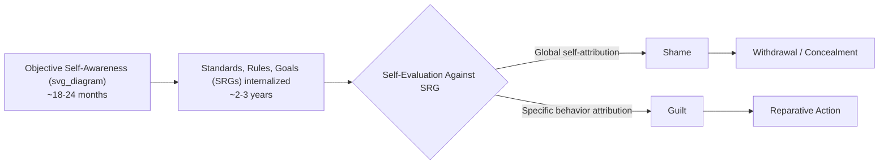

## Guilt and Shame as Social Emotions

### Definition and Classification

Guilt and shame are classified as "self-conscious" or "moral" emotions, distinguished from basic emotions (fear, anger, joy) by their requirement of self-reflective capacity, an internalized standard, and evaluation of the self against that standard (Tangney & Fischer's foundational framework). Both arise from social and moral transgressions but differ fundamentally in their attributional focus and behavioral consequences.

**Key Points**

- Both require self-awareness and the capacity for self-evaluation (typically emerging developmentally around 18–24 months, maturing further by age 3)
- Both are inherently social: they depend on internalized social/moral standards, even when no observer is present
- They are functionally distinct despite frequent co-occurrence and lay conflation

### The Guilt-Shame Distinction

#### The Behavior-Self Attributional Model (Lewis, 1971)

The most widely cited distinction locates guilt and shame on an attributional axis:

- **Guilt**: "I did a bad thing" — attribution to a specific *behavior*
- **Shame**: "I am a bad person" — attribution to the *global self*

| Dimension | Guilt | Shame |
| --- | --- | --- |
| Attribution | Specific behavior | Global self |
| Focus | "What I did" | "Who I am" |
| Core affect | Tension, remorse, regret | Painful self-scrutiny, exposure |
| Action tendency | Approach/reparation | Avoidance/withdrawal/hiding |
| Typical behavior | Apology, confession, restitution | Concealment, defensiveness, denial |
| Relation to empathy | Positively associated | Negatively or weakly associated |
| Relation to anger/aggression | Negatively associated (when adaptive) | Positively associated (via "humiliated fury") |

**Example**

A student cheats on an exam. Guilt manifests as "I shouldn't have done that; I need to tell the professor and make it right." Shame manifests as "I'm a fraud and a terrible student," followed by avoiding the professor and hiding the episode from peers, even after being caught.

### Functionalist and Evolutionary Accounts

#### Guilt as a Relationship-Regulation Mechanism

Baumeister, Stillwell, and Heatherton's interpersonal model frames guilt as evolved to protect and maintain valued relationships: it motivates reparative behavior that restores social bonds threatened by one's own transgression, and it redistributes emotional distress within relationships (making the transgressor, not only the victim, suffer).

#### Shame and the "Social Rank" / Threat-Avoidance Hypothesis

Evolutionary accounts (Gilbert; Fessler) treat shame as tied to social rank monitoring — a mechanism for detecting and responding to devaluation in the eyes of others, motivating appeasement or withdrawal to prevent further status loss or social exclusion. This links shame closely to social pain systems.

$$\text{Shame intensity} \propto f(\text{perceived devaluation by valued others}, \text{public exposure}, \text{centrality to identity})$$

[Inference] This functional form is a theoretical synthesis rather than a validated quantitative model; the literature specifies directional relationships, not a precise mathematical function.

### Public vs. Private Elicitation

A long-debated question is whether shame strictly requires an audience. Contemporary consensus (following Tangney's empirical work) holds that **both guilt and shame can be privately elicited** — an internalized "generalized other" or internalized moral standard can trigger either emotion without an actual observer present. However, shame is disproportionately amplified by actual or imagined public exposure, consistent with its social-rank function.

**Key Points**

- Private guilt/shame: triggered by violation of internalized standards alone
- Public guilt/shame: amplified by real or imagined audience awareness
- Shame is more strongly coupled to publicity than guilt, though neither is exclusively public or private

### Developmental Trajectory

Developmental research (Lewis; Stipek) shows guilt-proneness and shame-proneness are shaped substantially by parenting style: parents who use behavior-specific criticism ("that was a hurtful thing to do") tend to foster guilt-proneness, while parents who use global, character-based criticism ("you are a bad child") tend to foster shame-proneness.

### Cultural Variation

#### Guilt Cultures vs. Shame Cultures

Anthropological distinction (Benedict, 1946) contrasts societies emphasizing internalized guilt as the primary moral regulator (associated with individualist, Western contexts) versus societies emphasizing externally-oriented shame/honor as the primary regulator (associated with many collectivist and honor-based cultures). This dichotomy has been substantially critiqued and refined in contemporary cross-cultural psychology.

**Key Points**

- The strict guilt-culture/shame-culture binary is now considered oversimplified; most cultures use both emotions, differing in relative emphasis and elicitation contexts
- Collectivist cultures often show less sharp guilt-shame differentiation in language and less negative shame connotation than individualist cultures
- Some collectivist contexts treat shame as adaptive and relationship-preserving rather than purely maladaptive, contrasting with the predominantly negative framing in Western clinical literature

### Group-Based Guilt and Shame

Extending beyond personal transgression, guilt and shame can be experienced on behalf of one's ingroup (see also group-based emotion in Intergroup Emotions Theory).

- **Group-based guilt**: Requires (1) categorization as an ingroup member, (2) acceptance of ingroup responsibility for harm, (3) perceived illegitimacy of that harm. Associated with support for reparative policy, apology, and compensation.
- **Group-based shame**: Global negative evaluation of ingroup identity/character (e.g., "our nation is fundamentally flawed"). More associated with defensive strategies — denial, minimization, outgroup blame — than reparative action, mirroring the individual-level guilt/shame divergence.

**Example**

Descendants of a colonizing nation learning about historical atrocities may respond with group-based guilt (supporting reparations, acknowledging specific wrongs) or group-based shame (denying the severity of the history, distancing from national identity, or becoming defensive when the topic arises).

### Clinical and Adjustment Correlates

| Outcome | Guilt-Proneness | Shame-Proneness |
| --- | --- | --- |
| Depression | Weak/mixed association | Strong positive association |
| Anxiety | Weak/mixed association | Strong positive association |
| Empathy | Positive association | Negative/weak association |
| Externalized blame | Lower | Higher |
| Substance use relapse | Lower risk (when adaptive guilt) | Higher risk |
| Aggression | Lower (guilt typically inhibits aggression) | Higher (via "shame-rage" spiral) |

[Unverified] Effect sizes for these associations vary considerably across meta-analyses, populations (clinical vs. community samples), and measurement instruments (e.g., TOSCA vs. PFQ2); consult the specific source study before citing a precise effect size.

#### Maladaptive vs. Adaptive Guilt

Distinction matters clinically: adaptive guilt is proportionate, behavior-specific, and resolves through reparative action. Maladaptive or "chronic"/"existential" guilt is disproportionate, ruminative, and resistant to resolution (e.g., survivor guilt after trauma, which may not correspond to any actual transgression).

### Measurement Instruments

- **TOSCA (Test of Self-Conscious Affect)**: Scenario-based measure distinguishing guilt-proneness from shame-proneness via behavioral vs. global-self response options; widely used and translated across cultures
- **PFQ2 (Personal Feelings Questionnaire-2)**: Adjective checklist assessing shame and guilt via characteristic feeling states
- **GASP (Guilt and Shame Proneness scale)**: Distinguishes guilt/shame further by negative-behavior-evaluation (NBE) vs. negative-self-evaluation (NSE) subcomponents, refining the Lewis model empirically

### The Neurobiological Correlates (Brief)

Neuroimaging studies implicate overlapping but partially distinguishable networks: guilt is associated with activation in the anterior cingulate cortex and areas linked to interpersonal/moral cognition, while shame shows stronger involvement of regions associated with self-referential processing and social pain (e.g., subgenual/anterior cingulate regions, insula). [Speculation] Precise localization findings are inconsistent across studies due to small samples and heterogeneous induction paradigms (recall tasks vs. real-time transgression), so this should be treated as an emerging rather than settled area.

### Common Methodological and Conceptual Pitfalls

**Key Points**

- Conflating guilt and shame in casual usage obscures their opposite behavioral consequences (reparation vs. withdrawal) — critical in applied and clinical contexts
- Assuming shame is always maladaptive ignores its adaptive, relationship-preserving role in some cultural and interpersonal contexts
- Using global self-report items without scenario grounding (as opposed to instruments like TOSCA) risks conflating the two constructs due to shared negative valence
- Overextending Western guilt-culture/shame-culture typology without accounting for within-culture heterogeneity and updated cross-cultural evidence

### Related Topics

- Self-conscious emotions broadly (embarrassment, pride, hubristic vs. authentic pride)
- Lewis's cognitive-attributional theory of self-conscious emotions
- Group-based emotion and Intergroup Emotions Theory
- Moral emotions and moral development (Kohlberg, Haidt's Social Intuitionist Model)
- Shame-proneness and psychopathology (depression, social anxiety, PTSD)
- Cross-cultural psychology of honor, face, and collectivist self-construal
- Restorative justice and the role of guilt/shame in offender rehabilitation
- Attachment theory and parental socialization of self-conscious emotions