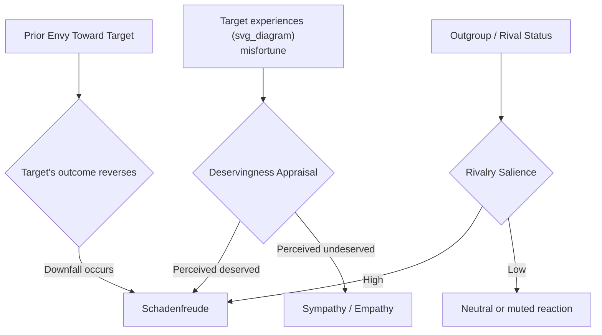

## Envy and Schadenfreude

### Definition and Classification

Envy and schadenfreude are social-comparison-based emotions arising from perceiving a discrepancy between one's own outcomes and another's outcomes. Both are classified within the broader family of "social emotions" that require a comparison target and are shaped by relative rather than absolute standing.

**Key Points**

- Envy: a negative, painful emotion arising from another's superior possession, quality, or achievement, combined with a desire to have it or to see it diminished
- Schadenfreude: pleasure derived from another person's misfortune, failure, or downfall
- Both are relational — they cannot occur without a social comparison target
- They are frequently linked sequentially: envy toward a target often predicts schadenfreude when that target later suffers a setback

### Envy: Core Structure

#### Benign vs. Malicious Envy

A key theoretical advance (van de Ven, Zeelenberg, & Pieters) subdivides envy into two functionally distinct subtypes, resolving earlier inconsistencies in the literature:

| Dimension | Benign Envy | Malicious Envy |
| --- | --- | --- |
| Core appraisal | Outcome seen as deserved | Outcome seen as undeserved |
| Motivational focus | Move the self up | Pull the other down |
| Action tendency | Self-improvement, emulation | Undermining, sabotage, hostility |
| Associated behavior | Increased effort, goal pursuit | Rumor-spreading, retaliation, schadenfreude upon target's failure |
| Underlying appraisal of control | High perceived control over improving own position | Low perceived control; unfairness attribution |
| Relation to hostility | Low | High |

**Example**

A colleague receives a prestigious promotion. Benign envy manifests as "I want to work harder to earn that too." Malicious envy manifests as "That promotion was unfair and undeserved; I hope they fail," potentially followed by subtle undermining behavior.

#### Appraisal Components of Envy

$$\text{Envy} = f(\text{upward comparison}, \text{perceived deservingness gap}, \text{domain relevance to self})$$

Smith and Kim's integrative review identifies domain relevance (the self-relevance of the comparison dimension) as a critical moderator: envy is more intense when the superior outcome concerns a domain central to one's own self-definition (e.g., a fellow academic's publication record envied more intensely by another academic than by a non-academic).

### Schadenfreude: Core Structure

#### The Deservingness and Justice Framework

Schadenfreude is most robustly predicted by perceptions of **deservingness** — misfortune befalling someone perceived to have earned it (via prior wrongdoing, hypocrisy, arrogance, or unfair advantage) generates markedly stronger pleasure than misfortune befalling someone perceived as undeserving of the setback (Feather's deservingness theory).

**Key Points**

- Deservingness is the single most consistently replicated predictor of schadenfreude intensity
- Envy toward the target beforehand amplifies subsequent schadenfreude when misfortune occurs (the "envy-schadenfreude" pathway; Smith et al.'s foundational studies)
- Perceived responsibility of the target for their own misfortune increases schadenfreude (contrasted with misfortune attributed to uncontrollable external causes, which tends to evoke sympathy instead)
- Intergroup schadenfreude (pleasure at a rival outgroup's misfortune) is amplified by strength of ingroup identification and history of intergroup rivalry or conflict

#### Three Documented Antecedent Pathways

1. **Envy-based pathway**: Prior envy toward a high-status or superior target predicts pleasure at their downfall
2. **Deservingness-based pathway**: Perceived justice being served (a "comeuppance" narrative) predicts pleasure independent of prior envy
3. **Intergroup rivalry pathway**: Outgroup misfortune (e.g., a rival sports team's loss, a competitor company's failure) predicts pleasure via social identity and competitive dynamics, intensified by rivalry salience

### Neuroscience and Physiological Correlates

Neuroimaging work (notably Takahashi et al.'s widely cited fMRI study) links envy to activation in the dorsal anterior cingulate cortex, a region also implicated in physical pain processing — supporting characterizations of intense envy as subjectively painful ("envy hurts"). Schadenfreude has been associated with activation in ventral striatal reward-related regions when viewing an envied target's misfortune, consistent with its characterization as pleasurable.

[Inference] These neural correlates should be interpreted as associative findings from specific experimental paradigms (often using hypothetical vignettes or minimal real-world stakes) rather than as definitive, generalizable neural "signatures" of the emotions; replication across diverse paradigms remains limited.

### Individual Difference Moderators

| Moderator | Effect on Envy | Effect on Schadenfreude |
| --- | --- | --- |
| Low self-esteem | Increases envy proneness | Increases schadenfreude toward superior others |
| High social comparison orientation | Increases envy frequency | Increases schadenfreude frequency |
| Narcissism | Mixed; grandiose narcissism linked to malicious envy | Increased, especially toward perceived rivals |
| Trait hostility | Predicts malicious over benign envy | Increases intensity |
| Strong ingroup identification | N/A (primarily individual-level) | Increases intergroup schadenfreude |

[Unverified] Specific correlation coefficients between these traits and envy/schadenfreude measures vary across studies and samples; treat directional patterns as more robust than any single reported magnitude.

### Envy and Schadenfreude at the Group Level

Both emotions extend to intergroup contexts, overlapping with group-based emotion frameworks (Intergroup Emotions Theory):

- **Group-based envy**: Ingroup members collectively envy an outgroup's superior resources or status, potentially fueling collective grievance narratives and support for redistributive or confrontational policy
- **Intergroup schadenfreude**: Documented extensively in sports fandom and political partisanship research — pleasure at a rival party's or team's failure correlates with strength of partisan/fan identification and is amplified by prior intergroup conflict or competition history

**Example**

Fans of a sports team report significantly elevated positive affect (schadenfreude) when observing a historic rival team's loss, even in matches where their own team was not competing — a pattern consistently replicated in fan-identity research and used as a paradigm case for intergroup schadenfreude.

### Distinguishing Envy from Related Constructs

| Construct | Distinguishing Feature |
| --- | --- |
| Envy | Wants what another has; may involve hostility (malicious) or motivation (benign) |
| Jealousy | Involves a triadic relationship; fear of losing something already possessed (e.g., a partner's attention) to a rival |
| Resentment | Broader sense of unfair treatment; not necessarily tied to a specific comparison target's possession |
| Admiration | Positive upward comparison without hostility or desire to possess; the socially "safe" counterpart to envy |

**Key Points**

- Envy and jealousy are frequently conflated in colloquial usage but are theoretically and empirically distinct (jealousy requires a three-party relational structure; envy requires only a two-party comparison)
- Schadenfreude is distinct from cruelty or sadism: sadism involves actively causing suffering for pleasure, whereas schadenfreude is a passive response to suffering that occurs independently

### Applied and Social Implications

- **Workplace dynamics**: Malicious envy is linked to counterproductive work behavior, sabotage, and reduced cooperation; benign envy is linked to increased performance motivation, making the distinction practically significant for organizational psychology
- **Social media**: Platforms amplifying curated upward social comparisons are associated with elevated envy (particularly in appearance and lifestyle domains), a major focus of contemporary social-comparison and well-being research
- **Political psychology**: Schadenfreude toward opposing political figures' scandals or failures is a robust predictor of partisan media consumption and sharing behavior
- **Consumer behavior**: Marketing leveraging aspirational comparison intentionally elicits benign-envy-adjacent responses to drive purchase motivation

### Common Methodological and Conceptual Pitfalls

**Key Points**

- Treating envy as a unitary construct without the benign/malicious distinction obscures opposite behavioral predictions (self-improvement vs. sabotage)
- Measuring schadenfreude via self-report alone risks social desirability suppression, since admitting pleasure at others' misfortune carries strong social stigma; some studies supplement with facial coding (e.g., Duchenne smile presence) or reaction-time/implicit measures
- Failing to control for deservingness perceptions when studying envy-schadenfreude links risks confounding the two distinct causal pathways
- Assuming schadenfreude is inherently pathological overlooks its normative, near-universal occurrence in mild forms and its documented links to justice-restoration motives rather than only malice

### Related Topics

- Social comparison theory (Festinger) and upward/downward comparison effects
- Group-based emotion and Intergroup Emotions Theory
- Deservingness and justice motive theory (Lerner's Just World Hypothesis)
- Jealousy in close relationships (romantic jealousy models)
- Narcissism and social-comparison-driven emotion
- Social media use and well-being (comparison-based envy research)
- Sports fandom and intergroup rivalry psychology
- Moral emotions and their behavioral action tendencies