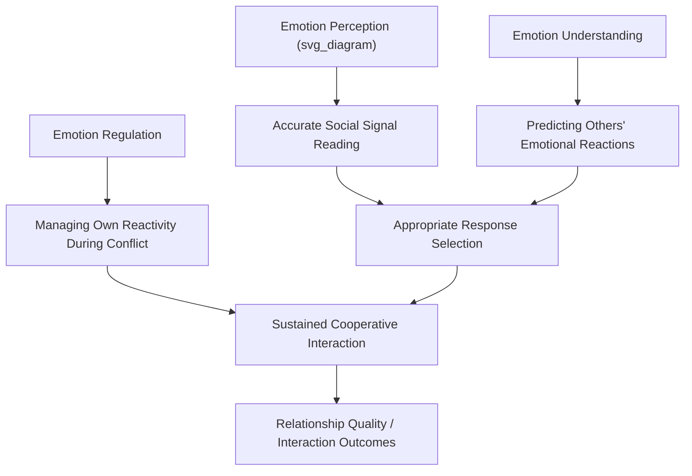

## Emotional Intelligence in Social Interaction

### Definition and Conceptual Scope

Emotional intelligence (EI) refers to the capacity to perceive, understand, regulate, and utilize emotional information — in oneself and others — to guide thinking and behavior, particularly within social interaction. The construct occupies contested theoretical territory, with competing "ability," "trait," and "mixed" models producing distinct operationalizations and measurement traditions.

**Key Points**

- EI is not a single unified construct across the literature; ability, trait, and mixed models differ substantially in scope and measurement
- Social interaction is the primary domain where EI's practical effects are studied (conflict resolution, leadership, relationship satisfaction, negotiation)
- EI correlates with but is empirically distinguishable from general cognitive intelligence (g) and personality traits (especially Big Five Agreeableness and low Neuroticism)

### Major Theoretical Models

#### Ability Model (Mayer & Salovey, 1997)

The foundational four-branch model treats EI as a genuine cognitive ability, measurable via performance-based (not self-report) tasks:

1. **Perceiving emotion**: Accurately identifying emotion in faces, voices, and other stimuli
2. **Using emotion to facilitate thought**: Leveraging emotional states to prioritize and direct cognitive processes
3. **Understanding emotion**: Comprehending emotional language, complex/mixed emotions, and emotional transitions
4. **Managing emotion**: Regulating one's own and others' emotions to achieve goals

$$\text{EI}_{\text{ability}} = w_1(\text{Perception}) + w_2(\text{Facilitation}) + w_3(\text{Understanding}) + w_4(\text{Management})$$

[Inference] The branches are theorized to form a developmental hierarchy (perception as most basic, management as most complex), but empirical support for strict hierarchical ordering is mixed across validation studies.

#### Trait Model (Petrides & Furnham)

Conceptualizes EI as a constellation of self-perceived emotional dispositions (e.g., emotion expression, emotion regulation, empathy, assertiveness) assessed via self-report, situated within the lower levels of personality hierarchies rather than as a cognitive ability. Explicitly measured with instruments like the TEIQue.

#### Mixed Models (Goleman, Bar-On)

Combine emotional abilities with broader social/behavioral competencies (motivation, social skills, optimism, stress tolerance) and personality-adjacent traits. Goleman's popularized framework — self-awareness, self-regulation, motivation, empathy, social skills — has strong public/organizational uptake but faces criticism for conceptual breadth and weaker psychometric rigor relative to the ability model.

**Key Points**

- Ability model: performance-based tests (right/wrong answers scored against expert or consensus criteria), e.g., MSCEIT
- Trait model: self-report questionnaires, e.g., TEIQue
- Mixed models: self-report or 360-degree instruments, e.g., EQ-i, ESCI
- The three approaches show only moderate intercorrelation, meaning "EI" measured one way often does not strongly predict "EI" measured another way

### EI Components Mapped to Social Interaction Processes

### Emotion Perception in Interaction

Accurate decoding of nonverbal emotional cues (facial expression, vocal prosody, body posture) is foundational to socially competent interaction. Deficits are linked to interpersonal misattunement; performance is commonly assessed via tasks like the Reading the Mind in the Eyes Test (RMET) or standardized facial-emotion recognition batteries.

**Key Points**

- High perceptual accuracy is associated with better first-impression formation and rapport-building
- Cultural display rules moderate perception accuracy; in-group advantage effects show higher accuracy for same-culture emotional expressions (Elfenbein & Ambady's cross-cultural meta-analysis)
- Perception deficits are studied clinically in relation to alexithymia and certain neurodevelopmental profiles, though EI frameworks describe population-level variation, not diagnostic categories

### Emotion Regulation and Interpersonal Emotion Regulation

Beyond regulating one's own emotions (intrapersonal regulation), socially relevant EI includes **interpersonal emotion regulation** — deliberately influencing another person's emotional state (e.g., soothing a distressed friend, de-escalating an angry colleague).

| Strategy Type | Example | Typical Social Outcome |
| --- | --- | --- |
| Cognitive reappraisal (self) | Reframing a criticism as constructive feedback | Reduced defensive reactivity |
| Expressive suppression (self) | Masking irritation during a negotiation | Can reduce transparency; may impair partner's trust over time |
| Perspective-taking (other-directed) | Considering why a colleague reacted harshly | Improved conflict resolution |
| Affect labeling (other-directed) | Naming a friend's emotion aloud ("you seem frustrated") | Reduced amygdala reactivity in the labeled person (documented in affect-labeling neuroimaging research) |
| Co-rumination (other-directed, maladaptive) | Dwelling repeatedly on a friend's problem without resolution | Short-term bonding but increased anxiety/depression risk over time |

[Unverified] Long-term relational outcomes of specific regulation strategies vary by relationship type (romantic, workplace, parent-child) and cultural context; broad directional findings are more reliable than precise effect-size estimates.

### EI and Empathy

Empathy functions as a core input to socially applied EI, encompassing both cognitive empathy (accurately inferring another's mental/emotional state — closely related to Theory of Mind) and affective empathy (vicariously sharing another's emotional state). High EI is generally associated with balanced engagement of both components; an overreliance on affective empathy without regulation is linked to empathic distress and burnout, particularly in caregiving professions.

### Applied Domains

#### Leadership and Organizational Behavior

EI (particularly emotion regulation and social skills components) is consistently linked in organizational psychology research to transformational leadership behaviors, team cohesion, and lower turnover, though effect sizes vary considerably depending on the EI measure used (self-report mixed-model instruments tend to show larger organizational correlations than ability-based measures, raising concerns about shared-method variance).

#### Negotiation and Conflict Resolution

Emotion perception and regulation abilities predict better outcomes in integrative (win-win) negotiation contexts by enabling accurate reading of counterpart interests/limits and controlled expression of strategic emotional displays (e.g., calibrated anger to signal firm limits without escalating conflict destructively).

#### Romantic and Close Relationships

EI correlates with relationship satisfaction largely via its association with constructive conflict communication patterns and accurate empathic accuracy (the ability to correctly infer a partner's thoughts/feelings during interaction, a well-studied construct in relationship science distinct from but related to trait EI).

#### Clinical and Developmental Applications

Social-emotional learning (SEL) programs in educational settings operationalize EI-adjacent competencies (self-awareness, relationship skills, responsible decision-making) with documented associations to reduced peer conflict and improved academic engagement in meta-analytic reviews (e.g., CASEL-aligned program evaluations).

### Measurement Instruments Summary

| Instrument | Model | Format | Scored Via |
| --- | --- | --- | --- |
| MSCEIT | Ability | Performance tasks | Expert/consensus scoring |
| TEIQue | Trait | Self-report | Likert self-ratings |
| EQ-i 2.0 | Mixed | Self-report | Likert self-ratings |
| ESCI | Mixed/competency | 360-degree/rater-based | Multi-rater aggregation |
| RMET | Perception subcomponent | Performance task | Correct/incorrect scoring |

**Key Points**

- Performance-based (ability) measures show weaker but more discriminant-valid correlations with cognitive intelligence
- Self-report (trait/mixed) measures show stronger correlations with personality traits and are more susceptible to social desirability bias and self-enhancement
- Method variance across instrument types is a persistent methodological confound in the EI literature

### Critiques and Controversies

**Key Points**

- Construct proliferation: the coexistence of ability, trait, and mixed models under a single umbrella term generates conceptual and measurement inconsistency across studies
- Incremental validity debate: critics (e.g., Locke) have questioned whether EI adds meaningful predictive power over established constructs (cognitive ability, Big Five personality) once those are statistically controlled; supporters point to meta-analytic evidence of incremental validity, particularly for ability-based EI in job performance prediction
- Popularization risk: mixed-model EI in particular has been commercially marketed with claims (e.g., "EI matters more than IQ for success") that outpace the more modest and qualified findings in the peer-reviewed literature
- Cultural generalizability: most instruments and norms were developed in Western, English-speaking contexts, raising validity concerns for cross-cultural application

[Speculation] The relative predictive superiority of ability vs. trait EI models for specific social outcomes (e.g., leadership emergence vs. relationship satisfaction) remains an active empirical debate rather than a settled finding, and conclusions should be treated as provisional pending further meta-analytic consolidation.

### Common Methodological and Conceptual Pitfalls

**Key Points**

- Treating "EI" as a single construct across studies using different models (ability vs. trait vs. mixed) produces non-comparable findings
- Relying solely on self-report EI measures in studies predicting self-reported social outcomes risks inflated correlations due to shared method variance and social desirability
- Assuming high EI uniformly predicts positive social outcomes ignores documented "dark side" uses (e.g., strategic emotional manipulation, emotional labor exploitation) associated particularly with high-EI individuals who also score high on manipulative personality traits
- Overgeneralizing organizational EI training program effectiveness; meta-analytic evidence for durable, transferable EI skill gains from short-term corporate training is more limited than commonly assumed in applied/consulting contexts

### Related Topics

- Theory of Mind and cognitive vs. affective empathy
- Interpersonal emotion regulation strategies and outcomes
- Emotional labor and surface/deep acting (Hochschild's framework)
- Social-emotional learning (SEL) program design and evaluation
- Alexithymia and emotion perception deficits
- Empathic accuracy in close relationships
- Group-based and collective emotion (contrast with individual-level EI)
- Leadership styles and emotion regulation in organizational contexts