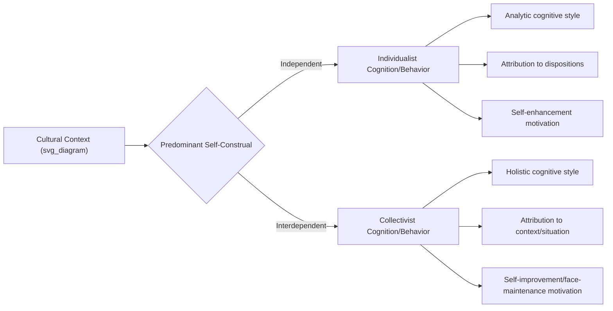

## Individualism versus Collectivism

### Definition and Conceptual Overview

Individualism-collectivism (I-C) is the most extensively studied dimension of cultural variation in social psychology, describing the relative degree to which a culture prioritizes individual autonomy, goals, and uniqueness versus group cohesion, interdependence, and collective goals. Originally formalized as a societal-level dimension by Hofstede in his cross-national organizational research, later elaborated as a psychological construct by Triandis and Markus & Kitayama.

**Key Points**

- Individualism: the self is construed as bounded, autonomous, and defined by internal attributes; personal goals take priority over group goals when they conflict
- Collectivism: the self is construed as fundamentally interconnected with others; group harmony and in-group goals take priority over personal goals when they conflict
- I-C operates at both the cultural/societal level (macro) and the individual psychological level (micro, often termed idiocentrism/allocentrism to distinguish from the cultural-level construct)
- Nearly all cultures contain both orientations to some degree; I-C is a matter of relative emphasis, not an absolute binary

### Theoretical Foundations

#### Hofstede's Cultural Dimensions Framework

Individualism-Collectivism was one of the original four dimensions identified in Hofstede's large-scale survey of IBM employees across dozens of countries, subsequently expanded and replicated. National IV (Individualism vs. Collectivism) scores remain among the most widely cited cross-national indices in comparative social science, with countries like the United States, Australia, and the UK scoring highly individualist, and countries like Guatemala, Ecuador, and Indonesia scoring highly collectivist.

[Unverified] Exact numerical index scores and country rankings have been updated across multiple editions of Hofstede's data; current values should be checked against the most recent published dataset rather than assumed static.

#### Markus and Kitayama's Self-Construal Theory (1991)

Reframed I-C at the psychological level via the concept of self-construal:

- **Independent self-construal**: The self is a distinct, autonomous entity; behavior is organized around expressing internal attributes, preferences, and rights, characteristic of individualist cultural contexts (predominantly Western)
- **Interdependent self-construal**: The self is fundamentally relational, defined through connections to others; behavior is organized around fitting in, maintaining harmony, and fulfilling role-based obligations, characteristic of many East Asian, African, and Latin American cultural contexts

$$\text{Self-Construal} = f(\text{cultural context}, \text{relational role salience}, \text{individual variation})$$

#### Triandis's Elaborated Model

Triandis distinguished **horizontal vs. vertical** variants crosscutting individualism-collectivism, producing a four-quadrant typology that refines the simple binary:

| Type | Core Value | Example Context |
| --- | --- | --- |
| Horizontal Individualism | Autonomy + equality | Scandinavian individualism |
| Vertical Individualism | Autonomy + status competition | US achievement-oriented individualism |
| Horizontal Collectivism | Interdependence + equality | Kibbutz communal societies |
| Vertical Collectivism | Interdependence + hierarchy | Traditional Confucian-influenced societies |

**Key Points**

- The horizontal/vertical distinction resolves apparent contradictions in the simple I-C binary (e.g., explaining why some collectivist cultures are also highly hierarchical while others emphasize egalitarian in-group relations)
- This refinement is critical for avoiding oversimplified cultural stereotyping in applied research

### Psychological and Behavioral Correlates

#### Cognitive Style

Nisbett and colleagues' extensive research on "analytic vs. holistic" cognition links individualist cultural contexts to analytic processing (focusing on objects independent of context, categorical reasoning) and collectivist contexts to holistic processing (attending to relationships between objects and their context, dialectical reasoning tolerant of contradiction).

#### Attribution Patterns

The Fundamental Attribution Error — the tendency to over-attribute others' behavior to dispositional traits while underweighting situational factors — shows a well-replicated cultural moderation: it is markedly stronger in individualist samples and attenuated (though not absent) in collectivist samples, which show greater attention to situational and contextual explanations for behavior.

#### Self-Enhancement vs. Self-Criticism

Individualist contexts show robust self-enhancement biases (viewing oneself as above average, better than peers). Collectivist contexts show more modest or even reversed patterns, with greater endorsement of self-critical and self-improvement-oriented evaluations, consistent with the interdependent self's emphasis on fitting harmoniously into the group rather than standing out.

[Inference] Some scholars argue self-enhancement is a human universal expressed through different culturally sanctioned channels (e.g., group-enhancement in collectivist contexts rather than absence of enhancement motives entirely) rather than a purely Western phenomenon; this remains a genuinely debated point rather than settled consensus.

#### Conformity and Social Influence

Classic conformity paradigms (Asch-style line-judgment tasks) show meta-analytically higher conformity rates in collectivist samples, consistent with greater weight placed on group consensus and harmony maintenance, though effect sizes are moderate and influenced by task type and specific in-group/out-group framing.

### In-Group/Out-Group Dynamics

**Key Points**

- Collectivist cultures show a sharper psychological distinction between in-group and out-group treatment (stronger in-group favoritism, less generalized trust toward strangers) compared to individualist cultures, which tend to show more generalized, context-independent norms of trust and fairness
- Individualist cultures apply relatively consistent behavioral norms regardless of relational closeness; collectivist cultures show norm-shifting based on the specific relational category (family, close friend, acquaintance, stranger) — a pattern documented extensively in cross-cultural fairness and trust-game research

### Measurement Approaches

| Instrument/Method | Level Assessed | Approach |
| --- | --- | --- |
| Hofstede's IBM-derived indices | Societal/national | Aggregated survey responses |
| Singelis Self-Construal Scale | Individual | Self-report independent/interdependent items |
| Triandis's INDCOL scale | Individual, with horizontal/vertical subscales | Self-report |
| Twenty Statements Test (TST) | Individual | Open-ended "Who am I?" responses coded for social vs. individual self-descriptors |
| Priming paradigms (e.g., pronoun circling task) | Individual, state-level | Experimental manipulation of momentary self-construal salience |

**Key Points**

- Priming studies demonstrate that self-construal can be experimentally activated within individuals regardless of cultural background, supporting the view that both orientations coexist within most people and cultures, with relative cultural emphasis shaping chronic accessibility
- TST responses reliably show individualist samples producing more trait-based self-descriptions ("I am ambitious") and collectivist samples producing more role/relationship-based self-descriptions ("I am a daughter," "I am a member of my community")

### Applied Domains

#### Consumer Behavior and Marketing

Advertising appeals differ systematically: individualist-market advertising emphasizes uniqueness, personal choice, and self-expression; collectivist-market advertising emphasizes family, belonging, and social harmony — a well-documented pattern in cross-cultural marketing research with direct commercial applications.

#### Organizational Behavior

Workplace practices (reward systems, feedback delivery, team structure) show documented effectiveness differences: individual-performance-based incentive systems align better with individualist workforces, while group-based incentives and harmony-preserving indirect feedback styles align better with collectivist workforces, informing multinational HR practice.

#### Clinical and Counseling Psychology

Therapeutic approaches emphasizing individual autonomy and self-actualization (common in Western clinical training) require cultural adaptation when applied in collectivist client populations, where family involvement, relational framing of problems, and harmony-preserving goals may be more clinically appropriate and effective.

#### Health Behavior

Collectivist cultural contexts show stronger family/community-based health decision-making and health behavior influenced by social/relational obligations; individualist contexts show stronger personal-autonomy-based health decision models — relevant to designing culturally appropriate public health interventions.

### Critiques and Methodological Concerns

**Key Points**

- The binary I-C framework has been critiqued for oversimplifying immense within-culture heterogeneity; individual variation within any given culture on I-C measures is often as large as between-culture variation
- Ecological fallacy risk: applying societal-level Hofstede scores to predict individual behavior can be misleading, since national aggregate scores do not necessarily describe any given individual within that nation
- Most foundational I-C research relies disproportionately on university student samples and a limited set of national comparisons (frequently US vs. East Asian countries), raising generalizability concerns for the broader global population
- Globalization, urbanization, and generational shifts are associated with documented within-country drift toward individualism over time in longitudinal cross-cultural studies, complicating static cultural characterizations
- The construct can be misused to support cultural stereotyping if applied uncritically to individuals rather than as a probabilistic, population-level tendency

### Illustrative Comparative Summary

<svg xmlns="http://www.w3.org/2000/svg" viewBox="0 0 760 300">
<text x="380" y="24" text-anchor="middle" font-size="16" font-weight="bold" fill="#222">Individualism vs. Collectivism: Core Contrasts (svg_diagram)</text>
<rect x="40" y="50" width="320" height="220" rx="10" fill="#eaf2ff" stroke="#3b6ea5" />
<text x="200" y="75" text-anchor="middle" font-size="14" font-weight="bold" fill="#1a1a1a">Individualism</text>
<text x="60" y="100" font-size="12" fill="#1a1a1a">• Independent self-construal</text>
<text x="60" y="122" font-size="12" fill="#1a1a1a">• Analytic cognitive style</text>
<text x="60" y="144" font-size="12" fill="#1a1a1a">• Dispositional attribution bias</text>
<text x="60" y="166" font-size="12" fill="#1a1a1a">• Self-enhancement motivation</text>
<text x="60" y="188" font-size="12" fill="#1a1a1a">• Consistent norms across relations</text>
<text x="60" y="210" font-size="12" fill="#1a1a1a">• Personal goals prioritized</text>
<text x="60" y="232" font-size="12" fill="#1a1a1a">• Lower baseline conformity</text>
<text x="60" y="254" font-size="12" fill="#1a1a1a">• e.g., US, Australia, UK (relative)</text>
<rect x="400" y="50" width="320" height="220" rx="10" fill="#fff0e0" stroke="#c97a2b" />
<text x="560" y="75" text-anchor="middle" font-size="14" font-weight="bold" fill="#1a1a1a">Collectivism</text>
<text x="420" y="100" font-size="12" fill="#1a1a1a">• Interdependent self-construal</text>
<text x="420" y="122" font-size="12" fill="#1a1a1a">• Holistic cognitive style</text>
<text x="420" y="144" font-size="12" fill="#1a1a1a">• Situational attribution weighting</text>
<text x="420" y="166" font-size="12" fill="#1a1a1a">• Self-improvement/face motivation</text>
<text x="420" y="188" font-size="12" fill="#1a1a1a">• Norms shift by relational closeness</text>
<text x="420" y="210" font-size="12" fill="#1a1a1a">• Group/in-group goals prioritized</text>
<text x="420" y="232" font-size="12" fill="#1a1a1a">• Higher baseline conformity</text>
<text x="420" y="254" font-size="12" fill="#1a1a1a">• e.g., Guatemala, Indonesia (relative)</text>
</svg>

### Related Topics

- Self-construal theory and independent/interdependent self
- Horizontal vs. vertical individualism-collectivism (Triandis)
- Analytic vs. holistic cognitive style (Nisbett)
- Fundamental Attribution Error and cross-cultural attribution research
- In-group favoritism and out-group trust across cultures
- Honor, face, and dignity cultures
- Cross-cultural psychology methodology and measurement equivalence
- Acculturation and bicultural identity
- Cultural priming and situational activation of self-construal