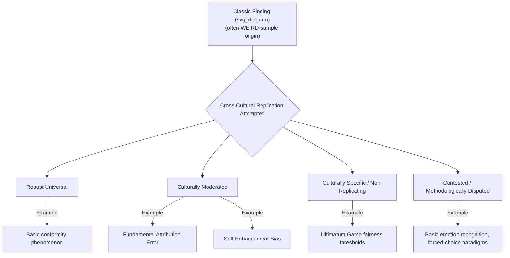

## Cross-Cultural Replications of Classic Findings

### Definition and Scope

Cross-cultural replication research systematically tests whether foundational social psychology findings — many originally established in Western, university-student samples — generalize across diverse cultural populations. This body of work is central to evaluating the universality versus cultural specificity of core social-psychological phenomena, and has become increasingly prominent amid the broader replication crisis and calls for greater sample diversity in psychological science.

**Key Points**

- Most "classic" social psychology findings were established using samples disproportionately drawn from WEIRD populations (Western, Educated, Industrialized, Rich, Democratic), as highlighted in Henrich, Heine, and Norenzayan's influential critique
- Cross-cultural replication serves two distinct functions: testing generalizability (does the effect exist elsewhere?) and testing boundary conditions (does the effect's magnitude or direction vary systematically with cultural dimensions like individualism-collectivism?)
- Findings from this literature fall into roughly three categories: robust cross-cultural universals, culturally moderated effects (present but varying in strength), and culturally specific/non-replicating effects

### The WEIRD Problem

Henrich, Heine, and Norenzayan's widely cited analysis demonstrated that WEIRD populations are frequently statistical outliers relative to global human variation across numerous psychological domains (visual perception, fairness judgments, cooperation, self-concept, moral reasoning), while comprising the overwhelming majority of published psychological research participants.

$$\text{Generalizability Risk} \propto \frac{\text{Reliance on WEIRD samples}}{\text{Documented cross-cultural variation in the domain}}$$

[Inference] This is a conceptual heuristic illustrating the core critique, not a formal quantitative index used in the literature.

### Case Studies: Classic Findings Under Cross-Cultural Replication

#### Fundamental Attribution Error

Original US-based findings (Ross; Jones & Harris) showing robust over-attribution of behavior to dispositions have been replicated with markedly **reduced effect sizes** in East Asian samples, where situational attribution is weighted more heavily (Miller's foundational cross-cultural attribution studies; Morris & Peng's physical-event attribution comparisons). Classified as a **culturally moderated** rather than universal or non-replicating effect.

#### Conformity (Asch Paradigm)

Meta-analytic reanalysis (Bond & Smith) of Asch-style line-judgment conformity studies across 17 countries found conformity rates were reliably higher in collectivist cultural contexts, though the basic phenomenon of conformity to group judgment replicated across virtually all tested cultures. Classified as a **robust universal with moderated magnitude**.

#### Self-Enhancement Bias

The robust Western finding that individuals rate themselves as better-than-average shows substantially attenuated or even reversed patterns in East Asian (particularly Japanese) samples, per Heine and colleagues' extensive research program. This finding itself became contested and refined (e.g., debates over whether the reduction reflects genuinely different self-evaluation motives or methodological/response-style artifacts), illustrating how cross-cultural replication debates can extend across decades. Classified as **culturally moderated, with an active secondary methodological debate**.

#### Ultimatum Game Fairness Norms

Henrich et al.'s cross-cultural behavioral economics fieldwork across small-scale societies found dramatically more cross-cultural variation in fairness offers and rejection thresholds than had been assumed from industrialized-society samples alone, with variation linked to features of local economic organization (market integration, payoffs to cooperation). Classified as **highly culturally variable**, challenging assumptions of a universal human fairness intuition of fixed magnitude.

#### Basic Emotion Recognition

Ekman's original cross-cultural facial expression recognition studies (including with visually isolated populations in Papua New Guinea) are frequently cited as supporting universal recognition of a small set of basic emotions. Later cross-cultural replications and reanalyses (e.g., work associated with Gendron, Barrett, and colleagues) have raised significant methodological critiques regarding forced-choice response formats artificially inflating apparent universality, with free-labeling paradigms showing substantially more cross-cultural variability. Classified as **contested — a canonical case of a "classic universal" finding facing serious cross-cultural replication challenges**.

### Methodological Challenges in Cross-Cultural Replication

#### Measurement Equivalence

For a cross-cultural comparison to be valid, an instrument must demonstrate equivalence across cultural groups at multiple levels:

| Level | Requirement | Failure Consequence |
| --- | --- | --- |
| Construct equivalence | The construct means the same thing across cultures | Comparing incomparable psychological phenomena |
| Functional equivalence | The construct serves the same psychological function | Superficially similar behavior, different underlying process |
| Metric/scalar equivalence | Response scale intervals/anchors are used comparably | Score differences reflect response style, not true differences |
| Item equivalence | Individual items translate and mean the same thing | Translation artifacts distort findings |

**Key Points**

- Response style differences (e.g., extreme response style vs. moderacy bias, acquiescence bias) vary systematically by culture and can produce spurious apparent differences in self-report data
- Back-translation and decentering procedures are standard but imperfect methodological safeguards against translation-based non-equivalence
- Failure to establish measurement equivalence is a leading explanation offered for some apparent "non-replications" that may instead reflect measurement artifacts rather than genuine psychological differences

#### Sampling and Generalizability Within Cultures

**Key Points**

- Cross-cultural studies frequently substitute a single national sample (often urban, educated) for an entire culture, reproducing within a new context the same WEIRD-sampling problem the field originally sought to correct
- Comparing two convenience samples (e.g., US students vs. Japanese students) cannot establish which specific cultural variable (individualism-collectivism, religiosity, economic development, linguistic structure) drives an observed difference without additional mediational or dimensional measurement
- The field increasingly favors large-scale, coordinated multi-site replication designs (e.g., initiatives modeled on the Many Labs and Psychological Science Accelerator frameworks) that sample many cultural/national contexts simultaneously with standardized protocols, improving causal interpretability over ad hoc two-culture comparisons

### The Replication Crisis Intersection

Cross-cultural replication work intersects with, but is conceptually distinct from, the broader psychological replication crisis (concerned primarily with direct replicability within a single population, often addressing p-hacking, publication bias, and underpowered original studies). Cross-cultural non-replication can reflect genuine cultural moderation (a theoretically meaningful finding) rather than a failure of the original finding's validity — a critical interpretive distinction.

$$\text{Non-replication} = \text{Genuine Cultural Moderation} \; \cup \; \text{Measurement Non-Equivalence} \; \cup \; \text{Original Finding Fragility}$$

[Inference] Disentangling these three explanations for any specific non-replication typically requires additional studies beyond the initial cross-cultural replication attempt (e.g., measurement invariance testing, moderation analysis using validated cultural-dimension scores); a single replication attempt rarely settles which explanation applies.

### Large-Scale Coordinated Replication Initiatives

- **Many Labs projects**: Multi-site replications of classic effects across many labs, including international sites, providing cross-cultural data as a byproduct of broader replication goals
- **Psychological Science Accelerator (PSA)**: A distributed network explicitly designed to enable large-scale, culturally diverse psychological data collection across many countries simultaneously, directly addressing the WEIRD sampling critique
- **World Values Survey / Hofstede-derived cross-national datasets**: Provide standardized cultural-dimension scores frequently used as moderator variables in secondary cross-cultural reanalyses of classic findings

**Key Points**

- Coordinated large-scale designs substantially improve statistical power and generalizability relative to isolated two-culture comparison studies common in earlier decades
- These initiatives have found that many classic effects show smaller but still statistically detectable effects across diverse samples, supporting a "moderated universal" pattern for a substantial subset of findings, though this varies considerably by specific phenomenon

### Applied and Field-Wide Implications

**Key Points**

- Findings failing cross-cultural replication have prompted major theoretical revisions rather than simple rejections (e.g., self-enhancement research shifting toward domain-specific and culturally-variable self-evaluation models rather than abandoning self-evaluation motivation research entirely)
- Journals and funding bodies increasingly require justification of sample diversity or explicit acknowledgment of generalizability limits, a direct response to the WEIRD critique's influence
- Textbook and curriculum design in social psychology has been reshaped to flag classic findings' cultural sample origins explicitly rather than presenting them as unqualified universal laws of human behavior

### Common Methodological and Conceptual Pitfalls

**Key Points**

- Treating a single cross-cultural replication (positive or negative) as definitive; robust conclusions require multiple independent replications and ideally coordinated multi-site designs
- Attributing any cross-cultural difference automatically to "culture" without ruling out measurement non-equivalence, translation artifacts, or sampling confounds
- Collapsing all non-Western samples into a single "collectivist" category, obscuring substantial cultural heterogeneity within regions (e.g., treating East Asian, South Asian, African, and Latin American cultural contexts as psychologically interchangeable)
- Assuming a finding's failure to replicate cross-culturally invalidates the original study, when it may instead reveal a previously unrecognized but theoretically meaningful boundary condition

### Related Topics

- WEIRD samples critique (Henrich, Heine, Norenzayan)
- Individualism versus collectivism as a moderating cultural dimension
- Measurement invariance and equivalence testing in cross-cultural research
- The broader psychological replication crisis (Open Science Collaboration, p-hacking, preregistration)
- Basic emotion universality debate (Ekman vs. constructionist accounts)
- Ultimatum Game and cross-cultural behavioral economics (Henrich et al.'s small-scale societies research)
- Large-scale coordinated replication infrastructure (Many Labs, Psychological Science Accelerator)
- Response style bias in cross-cultural self-report research