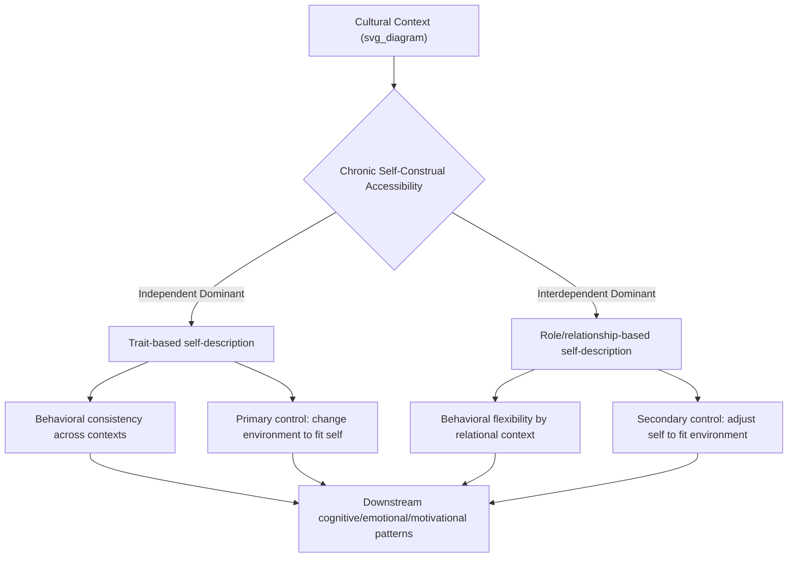

## Cultural Variation in Self-Construal

### Definition and Conceptual Overview

Self-construal refers to the cognitive representation of the self in relation to others — specifically, the degree to which the self is defined as a distinct, autonomous entity versus a fundamentally relational entity embedded in social connections. The construct was formalized by Markus and Kitayama (1991) as the psychological mechanism underlying broader individualism-collectivism cultural differences, shifting the field's focus from societal-level values to the cognitive architecture of the self.

**Key Points**

- Self-construal is the proposed *mediating psychological mechanism* through which cultural-level individualism-collectivism produces downstream differences in cognition, emotion, and motivation
- Two primary construals: independent (bounded, autonomous, defined by internal attributes) and interdependent (relational, defined by connection to and role within significant others)
- Self-construal is theorized to operate both as a chronic, culturally-shaped disposition and as a temporarily activatable cognitive state (demonstrated via priming paradigms)
- Most individuals possess both construals to varying degrees; cultural context shapes their relative chronic accessibility, not their exclusive presence

### The Independent Self-Construal

Characteristic of individualist cultural contexts (predominantly but not exclusively Western). The self is experienced as a unique, internally consistent entity whose boundaries are separate from others; behavior is organized around expressing one's own internal attributes (traits, abilities, preferences, feelings) and asserting these consistently across social contexts.

**Key Points**

- Self-descriptions emphasize stable traits: "I am outgoing," "I am ambitious"
- Behavioral consistency across situations and relational contexts is valued and expected
- Self-esteem derives substantially from expressing uniqueness and achieving personal goals
- Social behavior is oriented around influencing the environment to align with the self's internal states and preferences ("primary control")

### The Interdependent Self-Construal

Characteristic of collectivist cultural contexts (extensively documented in East Asian, though also African, Latin American, and Southern European contexts to varying degrees). The self is experienced as inherently connected to significant others; the self's boundaries are flexible and context-dependent, shifting according to the specific relational context.

**Key Points**

- Self-descriptions emphasize roles and relationships: "I am a daughter," "I am part of my community"
- Behavioral flexibility across relational contexts is normative and expected (rather than viewed as inconsistency)
- Self-esteem derives substantially from fulfilling relational obligations and maintaining group harmony
- Social behavior is oriented around adjusting the self to fit harmoniously with the social context ("secondary control")

### Downstream Psychological Consequences

#### Cognition

Self-construal is theorized to shape broader cognitive style beyond self-perception: independent construal is associated with analytic, context-independent categorization; interdependent construal is associated with holistic, relationally-embedded reasoning (Nisbett's cross-cultural cognition research program).

#### Emotion

Emotional experience differs systematically by construal type:

| Emotion Category | Independent Self-Construal | Interdependent Self-Construal |
| --- | --- | --- |
| Ego-focused emotions | More frequent/salient (pride, anger, frustration tied to personal goal blockage) | Less emphasized |
| Other-focused emotions | Less emphasized | More frequent/salient (empathy, shame, indebtedness tied to relational harmony) |
| Emotional expression norms | Encouraged, viewed as authentic self-expression | Regulated, viewed through impact on relational harmony |

[Inference] This ego-focused/other-focused emotion distinction (Kitayama, Markus, and colleagues) represents a well-cited theoretical framework, but the precise magnitude of cross-cultural emotional-experience differences varies across specific emotion-measurement studies and should not be treated as a fixed universal ratio.

#### Motivation

Achievement motivation differs in its relational framing: independent-construal contexts link achievement primarily to personal goal attainment and self-actualization; interdependent-construal contexts link achievement to fulfilling relational/familial obligations and bringing honor to one's group, even when the achievement behavior itself looks superficially similar across contexts.

#### Memory and Autobiographical Narrative

Cross-cultural autobiographical memory research finds independent-construal individuals produce earlier first memories and more self-focused, emotionally elaborated narrative memories; interdependent-construal individuals produce more socially-embedded and routine-based memories, consistent with construal-linked differences in what information is prioritized for self-relevant encoding.

### Measurement Approaches

| Instrument | Approach | Notes |
| --- | --- | --- |
| Singelis Self-Construal Scale (SCS) | Self-report, separate independent/interdependent subscales | Most widely used dedicated instrument; treats the two construals as orthogonal (not opposite ends of one dimension) |
| Twenty Statements Test (TST) | Open-ended "Who am I?" completions, content-coded | Widely used; codes responses into trait-based vs. social/role-based categories |
| Priming paradigms | Experimental state induction (e.g., pronoun-circling task using "I/me/mine" vs. "we/us/our"; Sumerian warrior prime story) | Demonstrates within-person malleability of construal activation |
| Implicit measures (e.g., relational IAT variants) | Reaction-time based | Less common; addresses self-report limitations |

**Key Points**

- Treating independent and interdependent construal as orthogonal (rather than as two poles of a single bipolar dimension) is a key methodological feature of the Singelis scale, reflecting theoretical claims that individuals can be high or low on both simultaneously
- Priming studies (notably Trafimow, Triandis, and Gao's early pronoun-circling work, and Gardner, Gabriel, and Lee's bicultural priming studies) provide experimental causal evidence that construal is not solely a fixed trait but a temporarily activatable cognitive state

### Bicultural and Within-Individual Variation

**Key Points**

- Bicultural individuals (e.g., immigrants, individuals raised across multiple cultural contexts) can hold both construals with context-dependent switching, documented extensively in "frame-switching" research (Hong, Morris, Chiu, and Benet-Martínez's foundational bicultural identity studies)
- Situational cues (language spoken, physical/cultural icons present, relational context) can trigger frame-switching between construals within the same bicultural individual, providing further causal evidence for the state-like malleability of self-construal
- Within any single culture, substantial individual variation in chronic self-construal exists; cultural-level "average" differences do not imply uniformity within a culture

### Regional and Subgroup Refinements

**Key Points**

- The simple East-West (Asia vs. West) framing of independent/interdependent construal has been refined by research documenting substantial variation within broadly "collectivist" regions (e.g., differences between Chinese, Japanese, and Korean self-construal patterns) and within broadly "individualist" regions (e.g., documented differences between US and Western European independence patterns)
- Social class has been proposed as an additional, partially independent moderator of self-construal within a single national culture (e.g., research associating working-class contexts with relatively more interdependent self-construal patterns even within individualist national cultures, and higher socioeconomic contexts with more independent patterns)
- Gender has also been examined as a within-culture moderator, with some research suggesting relational-interdependent self-construal patterns (distinct from the collective-interdependence construct) show gender-linked variation within individualist cultures

### Applied Implications

#### Clinical and Counseling Contexts

Therapeutic models built around independent-construal assumptions (autonomy-promoting, individual-focused goal-setting) may require adaptation for clients with predominantly interdependent self-construal, where family-inclusive treatment planning and relationally-framed goals may better align with the client's self-understanding and improve engagement.

#### Cross-Cultural Communication and Negotiation

Understanding a counterpart's likely self-construal orientation informs communication style: direct, individually-addressed persuasion appeals align with independent construal; relationally-framed, harmony-preserving, and indirect communication styles align better with interdependent construal, relevant to international business and diplomatic contexts.

#### Educational Psychology

Classroom practices emphasizing individual competition, self-directed learning, and personal achievement recognition align with independent-construal-promoting environments; those emphasizing group learning, collective achievement, and harmony-preserving feedback align with interdependent-construal-promoting environments — informing culturally responsive pedagogy design.

### Common Methodological and Conceptual Pitfalls

**Key Points**

- Treating self-construal as a fixed, immutable trait rather than acknowledging its demonstrated experimental malleability via priming risks overly static cultural characterizations
- Assuming national/cultural group membership deterministically predicts an individual's self-construal ignores substantial documented within-culture variation
- Using the TST or self-report scales without accounting for known cross-cultural response-style differences (e.g., moderacy bias) risks conflating genuine construal differences with measurement artifacts
- Collapsing the independent/interdependent framework onto a strict East-West binary obscures documented heterogeneity both within Asian cultural contexts and within Western cultural contexts (including social class and regional variation)

### Related Topics

- Individualism versus collectivism (societal-level construct self-construal is theorized to mediate)
- Analytic vs. holistic cognitive style (Nisbett)
- Bicultural identity and frame-switching
- Ego-focused vs. other-focused emotion (Kitayama & Markus)
- Cross-cultural replications of classic findings
- Social class as a cultural-psychological variable
- Autobiographical memory and cultural self-narrative construction
- Culturally responsive clinical and educational practice