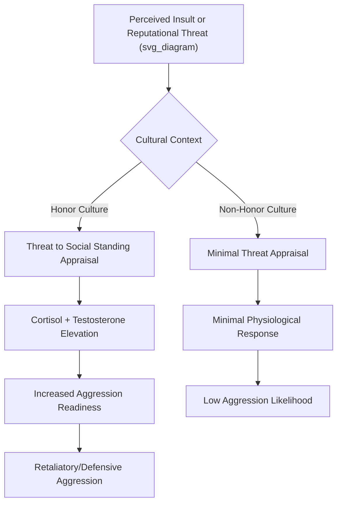

## Honor Cultures and Aggression

### Definition and Conceptual Overview

Honor culture theory describes a cultural syndrome in which individual and family reputation — particularly the reputation for strength, toughness, and willingness to retaliate against affronts — functions as a core determinant of social status and self-worth. Within this framework, aggression, especially in response to insults or threats to reputation, is normatively sanctioned or even socially required rather than uniformly condemned, distinguishing honor cultures from cultures organized primarily around dignity or face.

**Key Points**

- Honor is a form of social status contingent on external validation and must be actively defended against challenges, distinguishing it from dignity (inherent worth, not dependent on others' opinions) and face (status maintained through relational harmony and avoidance of embarrassment)
- Honor-based aggression is characteristically reactive/retaliatory (responding to perceived insult or threat) rather than purely instrumental or unprovoked
- The most extensively studied empirical case is the "culture of honor" in the southern and western United States, developed principally through the research program of Richard Nisbett and Dov Cohen
- Honor culture dynamics have also been documented and studied in Mediterranean, Middle Eastern, Latin American, and South Asian contexts, though with culturally specific variations

### Theoretical Origins: The Herding Economy Hypothesis

Nisbett and Cohen's foundational account traces honor culture emergence to historical subsistence economics: herding economies (in which wealth — livestock — is inherently vulnerable to theft and cannot be protected by centralized authority in sparsely governed frontier regions) are theorized to select for a cultural norm of credible, visible willingness to retaliate violently against theft or insult, as a deterrent strategy in the absence of reliable formal law enforcement.

$$\text{Honor Norm Strength} \propto f(\text{historical herding economy prevalence}, \text{weak centralized law enforcement}, \text{resource vulnerability})$$

[Inference] This is the theorized historical-causal mechanism as articulated by Nisbett and Cohen; it is a well-cited explanatory framework but represents a historical-evolutionary hypothesis rather than a directly tested causal experiment, and alternative or supplementary explanations (e.g., broader frontier settlement patterns, historical settlement by specific ethnic groups) have been discussed in subsequent scholarship.

### Empirical Demonstrations: The Culture of Honor Research Program

#### Laboratory Insult Paradigm

Cohen, Nisbett, Bowdle, and Schwarz's classic experimental paradigm had male participants from northern versus southern US states bumped and insulted by a confederate in a hallway. Findings showed southern participants exhibited significantly larger increases in cortisol (stress hormone) and testosterone (aggression-linked hormone) following the insult, along with greater behavioral and cognitive readiness for aggression, compared to northern participants who showed minimal physiological or behavioral response.

**Key Points**

- The physiological response pattern (elevated cortisol + testosterone) is interpreted as reflecting genuine psychological threat to social standing, not merely irritation
- Southern participants in the studies were also more likely to complete an ambiguous story stem with violent content following the insult condition, and showed greater willingness to physically block a confederate's path (a symbolic dominance-assertion behavior) in follow-up trials
- Northern participants showed comparable baseline levels of general agreeableness and politeness, indicating the difference was specific to insult-triggered reactivity rather than a general disposition difference

#### Archival and Legal System Studies

Nisbett and Cohen's broader research program documented that southern US states show elevated rates of argument-based homicide (interpersonal conflicts escalating to lethal violence) relative to northern states, while showing no corresponding elevation — and in some analyses lower rates — of felony-related (instrumental) homicide, supporting the specificity of the honor-culture effect to reputation-defense contexts rather than generalized violence proneness.

**Key Points**

- Southern states historically showed greater public/legal support for defensive violence in scenarios involving protection of home, family, or reputation (reflected in legislative patterns such as expanded castle doctrine and "stand your ground" laws, which Nisbett and Cohen's later work and subsequent scholars have linked to underlying honor-culture normative structures)
- This argument-homicide/felony-homicide dissociation is considered a key piece of evidence distinguishing honor culture from a simple "more violent culture" characterization

### Honor, Masculinity, and Gender Dynamics

Honor culture norms are strongly gendered in most documented contexts: male honor is characteristically tied to toughness, willingness to retaliate, and protection of family/property, while female honor (particularly in Mediterranean, Middle Eastern, and South Asian honor-culture variants) is frequently tied to sexual propriety and modesty, with male family members bearing responsibility for defending female relatives' reputations.

**Key Points**

- This gendered structure links honor culture research to the study of intimate partner violence and, in extreme documented cases, so-called "honor killings" — lethal violence against a family member (disproportionately women) perceived to have brought shame upon family honor, studied extensively within family violence and cross-cultural criminology literatures
- [Unverified] The prevalence and precise cultural distribution of honor-based intimate partner violence and honor killing vary substantially across specific studies and regions and should be sourced from dedicated, current epidemiological and criminological literature rather than assumed from general honor-culture theory alone
- Precarious manhood theory (Vandello & Bosson) provides a complementary psychological account, proposing that masculine status is culturally constructed as more effortfully earned and more easily lost than femininity, predicting heightened defensive aggression specifically among men whose masculine status has been challenged — a pattern found to interact with honor-culture endorsement

### Honor Culture and Third-Party Judgment

Beyond direct aggression, honor culture norms shape how observers evaluate aggressive responses to insult: experimental vignette studies find that participants from honor-culture backgrounds rate retaliatory aggression following an insult as more socially justified, and rate a person who fails to retaliate as more subject to social derogation (perceived as weak), compared to participants from non-honor-culture backgrounds who show the reverse pattern or no differential judgment.

**Key Points**

- This third-party legitimization effect helps explain the self-perpetuating nature of honor norms: social approval/disapproval reinforces individual retaliatory behavior independent of direct personal insult experience
- Jury and legal-system decision research has examined whether honor-culture background influences juror evaluations of self-defense and provocation-based legal claims, an active area of applied legal-psychological research

### Distinguishing Honor, Dignity, and Face Cultures

| Cultural Type | Basis of Self-Worth | Response to Insult | Representative Contexts (documented in literature) |
| --- | --- | --- | --- |
| Honor culture | External reputation, contingent on toughness/retaliation capacity | Active retaliation expected/sanctioned | Southern/Western US, Mediterranean, parts of Middle East/South Asia |
| Dignity culture | Inherent, stable worth independent of others' views | Insults can be ignored or handled through formal/legal channels | Northern US, Northern Europe |
| Face culture | Relational harmony and social appropriateness | Insults managed indirectly to preserve mutual harmony, avoidance of direct confrontation | Many East Asian contexts |

[Inference] This tripartite typology (Leung & Cohen's extension of the honor-dignity distinction to include face cultures) is a widely cited theoretical framework, but real-world cultures frequently show blended or context-dependent patterns rather than falling cleanly into a single category.

### Cross-National and Subnational Extensions

Beyond the original US regional research, honor-culture frameworks and associated aggression patterns have been examined in:

- Mediterranean and Southern European contexts (Spain, Italy, Greece), linked historically to similar herding/pastoral economic origins
- Latin American contexts, with documented links between honor-culture endorsement (particularly machismo-linked constructs) and intimate partner violence risk
- South Asian and Middle Eastern contexts, with distinct emphasis on family/collective (rather than purely individual) honor and its gendered dimensions

**Key Points**

- Cross-national honor-culture research faces the same measurement-equivalence and sampling challenges documented broadly in cross-cultural replication literature; findings from one honor-culture context should not be uncritically generalized to structurally different honor-culture contexts
- [Speculation] The degree to which contemporary honor-culture aggression patterns persist versus attenuate under urbanization and modern policing remains an active empirical question with mixed findings across specific regional studies, rather than a settled trend in either direction

### Applied and Policy Implications

- **Legal policy**: Research linking honor-culture regional prevalence to public support for expansive self-defense laws (castle doctrine, stand-your-ground statutes) has informed policy debate and legal-psychological research on how such laws are applied
- **Violence prevention programming**: Intervention programs addressing honor-linked intimate partner violence and youth violence (e.g., in schools within historically honor-culture-prevalent regions) have incorporated honor-culture theory to design culturally tailored conflict-resolution and norm-shifting interventions
- **Organizational and workplace conflict**: Some applied research has extended honor-culture insight to workplace conflict management, examining whether employees from honor-culture backgrounds respond differently to perceived disrespect or status challenges in organizational settings

### Common Methodological and Conceptual Pitfalls

**Key Points**

- Treating "honor culture" as synonymous with "violent culture" overlooks the key empirical specificity: honor-culture elevated violence concentrates in reputation-defense/argument-based contexts, not generalized or instrumental violence
- Assuming uniform honor-culture endorsement across all individuals within a historically honor-culture-associated region ignores substantial documented within-region individual variation
- Applying US-derived (Nisbett & Cohen) findings directly to non-US honor-culture contexts without accounting for distinct historical, religious, and gender-normative structures risks oversimplification
- Overlooking the gendered asymmetry in how honor culture theory has been applied (extensive focus on male reputation-defense aggression in the original US research program vs. distinct literatures on female-honor-linked violence in other regional contexts) can produce an incomplete picture if either literature is treated as representative of the whole phenomenon

### Related Topics

- Precarious manhood theory (Vandello & Bosson)
- Individualism versus collectivism as a broader cultural-dimension framework
- Intimate partner violence and honor-based violence, cross-cultural criminology
- Aggression theory: reactive vs. proactive/instrumental aggression models
- Cross-cultural replications of classic findings (methodological parallels)
- Testosterone, cortisol, and social status threat research
- Legal psychology: self-defense law and juror decision-making
- Frontier settlement history and cultural-evolutionary explanations of norm emergence