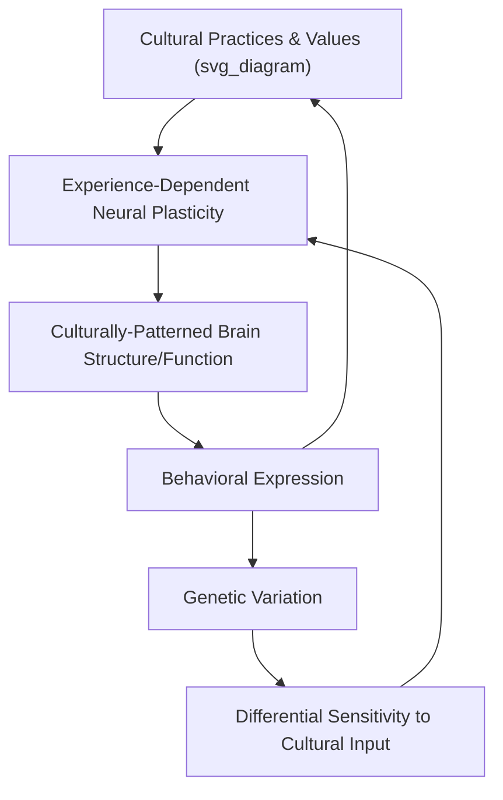

## Cultural Neuroscience Approaches

### Definition and Conceptual Scope

Cultural neuroscience is an interdisciplinary field examining how culturally patterned experience shapes neural structure and function, and reciprocally, how neurobiological mechanisms (genetic variation, neural plasticity) constrain or enable the transmission and expression of cultural values and practices. The field is explicitly bidirectional in its causal framing, distinguishing it from earlier approaches that treated culture and biology as separate, non-interacting explanatory levels.

**Key Points**

- Cultural neuroscience integrates methods and theory from cultural psychology, cognitive neuroscience, and behavioral genetics
- The field's central bidirectional claim: culture shapes brain function/structure via experience-dependent plasticity, and neurobiological variation (genetic and otherwise) shapes the transmission and adoption of cultural practices
- Chiao and colleagues' foundational theoretical work formalized much of the field's core framework and terminology
- The field emerged substantially in the 2000s–2010s as neuroimaging methods became more widely accessible for cross-cultural comparative research

### Theoretical Framework: The Culture-Gene-Brain-Behavior Loop

$$\text{Culture} \leftrightarrow \text{Brain Structure/Function} \leftrightarrow \text{Gene Expression/Variation} \leftrightarrow \text{Behavior} \leftrightarrow \text{Culture}$$

This recursive model proposes that cultural practices and values are transmitted intergenerationally partly through their effects on neural development, while genetic variation (e.g., in neurotransmitter-related genes) can influence the relative ease with which certain cultural values are adopted or expressed within a population, which in turn shapes which cultural practices persist and spread.

[Inference] This loop is a theoretical organizing framework proposed to guide research design and integration across levels of analysis; it is not itself a single tested causal model, and specific causal arrows within the loop have varying degrees of direct empirical support.

### Methodological Toolkit

| Method | What It Measures | Application in Cultural Neuroscience |
| --- | --- | --- |
| fMRI (functional MRI) | Blood-oxygen-level-dependent (BOLD) neural activation | Cross-cultural comparison of activation patterns during self-referential, social, or perceptual tasks |
| EEG/ERP | Millisecond-scale electrical brain activity | Cross-cultural comparison of attention and processing speed for culturally salient stimuli |
| Structural MRI / DTI | Gray matter volume, white matter connectivity | Examining culturally-linked differences in brain structure (more limited literature, methodologically demanding) |
| Genetic/genotyping methods | Allelic variation (e.g., serotonin transporter gene, oxytocin receptor gene polymorphisms) | Gene-by-culture interaction studies |
| Psychophysiological measures | Cortisol, testosterone, cardiovascular reactivity | Complementary biological measures alongside or instead of neuroimaging |

**Key Points**

- fMRI dominates the field's empirical literature but carries substantial methodological cost and access limitations, contributing to persistent sample-size and cross-national infrastructure constraints
- Gene-by-culture interaction designs typically compare how a specific genetic polymorphism predicts different behavioral/psychological outcomes depending on cultural context, testing whether genetic effects are culturally moderated rather than fixed

### Key Empirical Domains

#### Self-Referential Processing

Neuroimaging studies (notably work associated with Zhu, Han, and colleagues) have examined whether the medial prefrontal cortex (MPFC), a region robustly associated with self-referential processing in Western samples, shows different activation patterns when individuals from interdependent-self-construal cultural backgrounds process self-relevant versus close-other-relevant (e.g., mother-relevant) information. Findings have suggested overlapping MPFC engagement for self and close-other judgments in some Chinese samples, contrasted with more clearly self-specific activation in Western samples — interpreted as neural evidence consistent with interdependent self-construal theory.

**Key Points**

- This line of research is frequently cited as a paradigmatic example of cultural neuroscience's value-add: providing convergent neurobiological evidence for a psychological construct (self-construal) previously supported mainly by behavioral and self-report methods
- [Unverified] Specific activation-overlap findings and their replication status vary across follow-up studies and depend heavily on task design (e.g., trait-adjective judgment paradigms vs. other self-referential tasks); consult current meta-analytic or systematic review sources for the state of replication before citing specific findings as settled

#### Social Pain and Rejection Sensitivity

Cross-cultural neuroimaging work has examined whether neural regions associated with social pain (e.g., anterior cingulate cortex, anterior insula — regions overlapping with physical pain processing networks) show culturally-moderated sensitivity to social exclusion or rejection paradigms (e.g., Cyberball-type exclusion tasks), consistent with behavioral findings that interdependent-construal individuals show heightened sensitivity to relational threat.

#### Emotion Regulation

Cultural neuroscience research has examined cross-cultural differences in the neural correlates of emotion regulation strategies (e.g., reappraisal), motivated by behavioral findings that emotion regulation goals and strategies (e.g., emphasis on emotional suppression for harmony maintenance) differ across individualist and collectivist cultural contexts.

#### Attention and Perception

Building on Nisbett's behavioral analytic/holistic cognitive style findings, cultural neuroscience studies have examined whether culturally-linked attentional differences (e.g., attention to focal objects vs. contextual/background information) are reflected in corresponding differences in visual processing regions' activation patterns during scene perception tasks.

### Gene-by-Culture Interaction Research

A distinctive contribution of cultural neuroscience is testing whether known genetic polymorphisms interact with cultural context to predict psychological outcomes, rather than assuming fixed, culture-independent genetic effects.

**Example**

Research examining serotonin transporter gene (5-HTTLPR) polymorphisms — previously linked in Western samples to differential sensitivity to environmental stress — has been extended to test whether the same genetic variant interacts differently with collectivistic cultural norms, on the logic that a genotype linked to heightened environmental/social sensitivity might be adaptive (and thus differentially prevalent or differently expressed) in cultural contexts placing greater demands on social attunement.

[Speculation] Gene-by-culture interaction findings in this literature are frequently based on modest sample sizes typical of candidate-gene research broadly, a research approach that has faced substantial replication challenges across behavioral genetics generally; specific gene-by-culture findings should be treated with particular caution pending large-sample replication, consistent with broader concerns about candidate-gene study reliability in psychological science.

### Distinctive Contributions to the Broader Cross-Cultural Literature

**Key Points**

- Provides convergent, multi-method evidence for psychological constructs (self-construal, holistic cognition, culturally-moderated emotion regulation) previously supported primarily by behavioral and self-report data
- Tests genuinely bidirectional causal claims (culture shaping biology, biology constraining cultural transmission) that purely behavioral cross-cultural research cannot directly address
- Offers a biological plausibility check on cultural-psychological theories, potentially identifying which proposed cultural differences have detectable neurobiological correlates versus which may be primarily measurement or response-style artifacts

### Methodological and Interpretive Challenges

**Key Points**

- **Reverse inference risk**: inferring a specific psychological state or construct from observed brain activation alone (e.g., "MPFC activation means self-referential processing occurred") is a well-documented logical limitation across cognitive neuroscience broadly, and applies directly to cultural neuroscience interpretations
- **Small, non-representative samples**: neuroimaging's cost and infrastructure requirements mean cross-cultural neuroimaging studies frequently rely on small, convenience samples (often university students in a small number of countries with MRI access), reproducing a narrower version of the broader WEIRD sampling problem
- **Confounding cultural and genetic-population variation**: when comparing genetically and culturally distinct national populations (e.g., US vs. China), it is difficult to fully disentangle culturally-driven neural differences from population-genetic differences unrelated to cultural experience, a significant design challenge requiring careful interpretation
- **Publication and interpretation bias toward difference-finding**: as in cross-cultural psychology broadly, studies finding cultural neural differences may be more readily published and cited than null-finding studies, risking an inflated impression of the field's overall discovered variability
- **Candidate-gene methodology limitations**: gene-by-culture interaction studies inherit the broader replication concerns associated with candidate-gene approaches in behavioral genetics

### Applied and Interdisciplinary Connections

- **Clinical neuroscience**: informs culturally-sensitive interpretation of neuroimaging biomarkers in psychiatric research, cautioning against assuming neural biomarkers validated in one cultural population generalize directly to others
- **Developmental neuroscience**: intersects with research on how early cultural/parenting practices shape neural development trajectories relevant to self-construal and emotion regulation
- **Public health and global mental health**: informs debates about the cultural generalizability of neurobiologically-informed mental health interventions and diagnostic frameworks
- **Cross-cultural replication methodology**: cultural neuroscience findings are subject to the same replication and measurement-equivalence concerns documented in the broader cross-cultural replication literature, and increasingly researchers call for applying similar large-scale, multi-site coordinated designs to neuroimaging-based cultural comparisons

### Common Methodological and Conceptual Pitfalls

**Key Points**

- Overinterpreting a single cross-cultural neuroimaging finding as definitively confirming a psychological theory, given small samples typical of the field and the reverse-inference limitations of neuroimaging generally
- Treating national/ethnic group membership as a clean proxy for "culture" in genetic or neural comparison studies, when population-genetic and cultural variation are confounded and difficult to separate with typical two-nation comparison designs
- Assuming gene-by-culture interaction findings from candidate-gene studies are as robust as findings from larger genome-wide association designs, given the broader field's documented replication concerns with candidate-gene approaches
- Neglecting within-culture neural variation by focusing exclusively on between-culture group-averaged comparisons, which can obscure substantial individual variation within any studied cultural group

### Related Topics

- Cultural variation in self-construal (the psychological construct most extensively studied via cultural neuroscience methods)
- Analytic vs. holistic cognitive style (Nisbett) and its neural correlates
- Gene-by-environment interaction research and candidate-gene replication debates
- Cross-cultural replications of classic findings (parallel methodological concerns)
- Reverse inference problems in cognitive neuroscience
- Social pain and neural overlap with physical pain processing
- WEIRD sample critique as applied to neuroimaging research infrastructure
- Emotion regulation strategies and their cross-cultural neural correlates