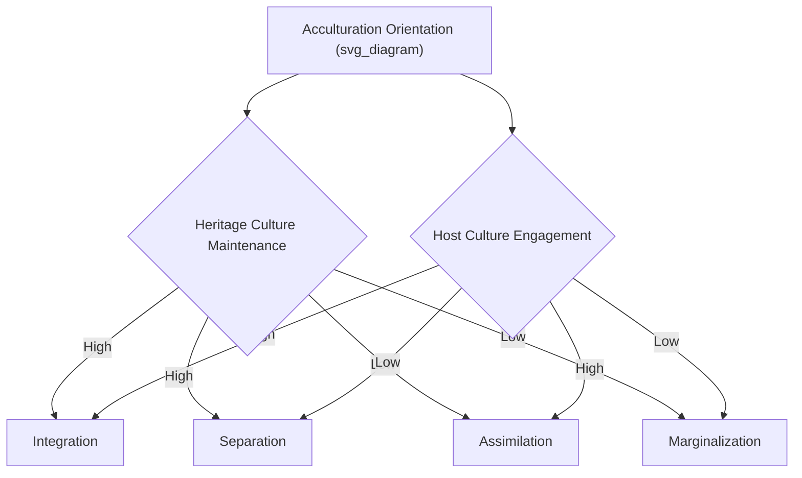

## Acculturation and Cultural Identity

### Definition and Conceptual Scope

Acculturation refers to the psychological and cultural changes that occur when individuals or groups from one cultural background come into sustained contact with a different cultural context, most commonly studied in the context of immigration, but also relevant to indigenous populations, refugees, sojourners, and international students. Cultural identity refers to the individual's sense of belonging to and identification with one or more cultural groups, which is dynamically shaped by and shapes the acculturation process.

**Key Points**

- Acculturation is a two-way process in principle (both the non-dominant group and the dominant/host society can change), though most psychological research has focused on changes within the non-dominant/minority group
- Cultural identity is not a fixed trait but a dynamic, context-sensitive construct that can involve holding multiple cultural identities simultaneously (biculturalism/multiculturalism)
- The field distinguishes psychological acculturation (individual-level attitude, value, and behavior change) from sociocultural adaptation (behavioral competence in the new cultural context) and psychological adaptation (subjective well-being/mental health outcomes)

### Berry's Fourfold Acculturation Model

The most widely cited and applied framework (John Berry) conceptualizes acculturation along two orthogonal dimensions: the degree to which an individual maintains their heritage culture and identity, and the degree to which they seek engagement with the new/dominant culture. Crossing these dimensions yields four acculturation strategies.

| Strategy | Heritage Culture Maintenance | Host Culture Engagement | Description |
| --- | --- | --- | --- |
| Integration | High | High | Maintains heritage identity while actively engaging with host culture; most consistently associated with positive psychological outcomes |
| Assimilation | Low | High | Adopts host culture, relinquishes heritage culture |
| Separation | High | Low | Maintains heritage culture, avoids engagement with host culture |
| Marginalization | Low | Low | Rejects or loses connection to both heritage and host cultures; most consistently associated with negative psychological outcomes |

**Key Points**

- Meta-analytic research (Berry and colleagues' large cross-national studies, including the International Comparative Study of Ethnocultural Youth) consistently finds integration associated with the best psychological and sociocultural adaptation outcomes, and marginalization with the worst
- The model has been critiqued for treating heritage/host engagement as fully independent dimensions and for insufficiently accounting for the host society's role (receiving-society attitudes strongly constrain which acculturation strategies are practically available to a given individual, regardless of personal preference)
- Acculturation orientation can differ by domain (e.g., an individual might integrate in language/food domains while maintaining separation in religious/family-value domains), a nuance the basic fourfold model does not capture without further elaboration

### Bidimensional vs. Unidimensional Models

Early acculturation models (pre-Berry) treated acculturation as unidimensional — a linear continuum from heritage culture identification to host culture identification, implying that gaining host-culture identification necessarily meant losing heritage-culture identification. Berry's bidimensional model was a significant theoretical advance precisely because it allows for simultaneous high identification with both cultures (biculturalism), which unidimensional models structurally could not represent.

$$\text{Unidimensional: } \text{Identity} = \alpha(\text{Heritage}) + (1-\alpha)(\text{Host})$$

$$\text{Bidimensional: } \text{Heritage Identification and Host Identification measured independently, non-zero-sum}$$

### Biculturalism and Identity Integration

#### Bicultural Identity Integration (BII)

Benet-Martínez and colleagues' construct describes individual differences in how bicultural individuals subjectively experience the relationship between their two cultural identities, independent of their acculturation strategy per se.

- **High BII**: The two cultural identities are experienced as compatible and integrated ("I am simultaneously and comfortably both")
- **Low BII**: The two cultural identities are experienced as oppositional or conflicting ("I feel caught between two cultures")

**Key Points**

- BII is distinct from simply possessing bicultural competence; two individuals with equally strong heritage and host cultural knowledge/skills can differ substantially in whether they experience those identities as harmonious or conflicted
- High-BII individuals show more fluid "frame-switching" between cultural mindsets in response to situational cues (extending Hong, Morris, Chiu, and Benet-Martínez's foundational bicultural priming research); low-BII individuals show more contrastive or oppositional responses to the same cultural priming cues
- High BII is generally associated with better psychological adjustment outcomes compared to low BII, though the relationship between BII and specific well-being outcomes varies across studies and populations

### Stages and Trajectories of Acculturation

While acculturation is not universally staged in a fixed linear sequence, several models describe common experiential patterns, particularly in sojourner/immigrant adjustment research:

1. **Honeymoon phase**: Initial excitement and positive engagement with the new culture
2. **Culture shock/crisis phase**: Disorientation, frustration, and heightened awareness of cultural differences and communication difficulties
3. **Adjustment/recovery phase**: Gradual development of coping strategies and increasing cultural competence
4. **Adaptation/mastery phase**: Relatively stable functioning and comfort within the new cultural context

[Inference] This U-curve or W-curve staged model (originating with Lysgaard's early sojourner research) is a widely referenced heuristic in applied and popular treatments of acculturation, but empirical support for a universal, clearly staged sequence is mixed; substantial individual variation exists in trajectory shape, timing, and whether distinct "stages" are empirically separable at all.

### Acculturative Stress

Acculturative stress refers to the psychological distress arising from the demands of navigating cultural transition, distinguished from general life stress by its specific link to cross-cultural adaptation demands (language barriers, discrimination experiences, loss of social support networks, intergenerational conflict, identity uncertainty).

**Key Points**

- Acculturative stress is elevated by perceived discrimination, large cultural distance between heritage and host cultures, involuntary migration circumstances (e.g., refugee status vs. voluntary migration), and lack of social support
- Acculturative stress is buffered by social support (both co-ethnic community support and host-society support), higher acculturation strategy flexibility (integration orientation), and stronger bicultural identity integration
- Refugee populations face documented additional acculturative stress dimensions related to pre-migration trauma exposure, which interacts with but is conceptually distinct from acculturation-specific stress

### Generational Differences and Intergenerational Dynamics

**Key Points**

- First-generation immigrants (born abroad, migrated as adults) typically show stronger heritage-culture maintenance and slower host-culture acquisition compared to second-generation individuals (born in host country to immigrant parents)
- The "1.5 generation" (migrated as children) shows distinctive patterns, often achieving high host-culture competence (particularly language) while maintaining substantial heritage-culture connection, frequently associated with relatively high BII
- Intergenerational acculturation gaps — differing acculturation strategies/paces between immigrant parents and their children — are a well-documented source of family conflict and are linked in the literature to elevated adolescent psychological distress when the gap is large and unaddressed
- The "segmented assimilation" framework (Portes & Zhou) in sociology extends generational acculturation analysis by proposing that the trajectory and outcomes of assimilation differ systematically depending on which segment of the host society (e.g., socioeconomic stratum, racialized group) an immigrant group's children are absorbed into, rather than assuming a single universal assimilation pathway

### Ethnic Identity Development

Distinct from but related to acculturation, ethnic identity development describes the process by which individuals from minority ethnic backgrounds come to understand and value their ethnic group membership, most influentially modeled by Phinney's stage-based framework (unexamined ethnic identity → ethnic identity search/moratorium → achieved ethnic identity), adapting Erikson's and Marcia's general identity development frameworks to the ethnic-identity domain specifically.

**Key Points**

- Achieved ethnic identity (a secure, actively explored sense of ethnic belonging) is consistently associated with better psychological well-being and serves as a documented buffer against the negative effects of perceived discrimination
- Ethnic identity development and acculturation strategy are related but empirically distinguishable constructs; an individual can have a strong achieved ethnic identity while pursuing an integration, separation, or even assimilation acculturation strategy in specific behavioral domains

### Measurement Approaches

| Instrument | Construct Assessed | Approach |
| --- | --- | --- |
| Acculturation Rating Scale for Mexican Americans (ARSMA-II) and similar group-specific scales | Bidimensional heritage/host orientation | Self-report, population-specific |
| Vancouver Index of Acculturation (VIA) | Bidimensional heritage/mainstream identification | Self-report, general/adaptable across groups |
| Bicultural Identity Integration Scale (BIIS) | Blendedness vs. conflict between cultural identities | Self-report |
| Multigroup Ethnic Identity Measure (MEIM) | Ethnic identity achievement/exploration/commitment | Self-report, based on Phinney's model |
| Acculturative Stress scales (e.g., SAFE scale) | Domain-specific acculturative stress | Self-report |

[Unverified] Psychometric properties and cross-population validity vary across these instruments and specific translated/adapted versions; consult the specific validation literature for the population under study rather than assuming universal applicability of any single scale.

### Applied Domains

- **Clinical psychology**: Culturally-adapted mental health interventions increasingly incorporate acculturation strategy and stress assessment into case conceptualization, particularly for immigrant and refugee client populations
- **Educational psychology**: School-based interventions addressing immigrant/refugee student adjustment draw on acculturation and ethnic identity development research to design culturally responsive support programs
- **Organizational psychology**: Expatriate adjustment research (a sojourner-focused subfield) applies acculturation frameworks to predict international assignment success and cross-cultural workplace adaptation
- **Public health**: Acculturation level has been examined as a moderator of health behavior change (diet, substance use patterns) among immigrant populations, informing culturally tailored health interventions

### Common Methodological and Conceptual Pitfalls

**Key Points**

- Treating acculturation strategy as solely an individual choice, without accounting for the receiving society's role in constraining which strategies are practically available (e.g., discrimination and exclusionary policy can block integration or assimilation regardless of individual preference)
- Using a single global acculturation score when acculturation is domain-specific (language, values, food, religion, social relationships can each show different heritage/host orientations within the same individual)
- Assuming a fixed linear or staged acculturation trajectory when substantial individual and contextual variation in pacing, direction, and reversibility is well documented
- Conflating acculturation strategy with ethnic identity development; these are related but empirically and conceptually distinguishable constructs requiring separate assessment
- Applying acculturation frameworks developed primarily in voluntary-migration contexts uncritically to forced-migration/refugee populations, where distinct stressors (trauma exposure, involuntary departure) require additional theoretical and clinical consideration

### Related Topics

- Individualism versus collectivism (heritage/host cultural value frameworks acculturation research often draws on)
- Cultural variation in self-construal and bicultural frame-switching
- Ethnic identity development (Phinney's model, Erikson/Marcia identity theory foundations)
- Discrimination, stigma, and minority stress research
- Segmented assimilation theory (Portes & Zhou) in sociology
- Refugee mental health and trauma-informed care
- Cross-cultural replications of classic findings (measurement equivalence parallels)
- Intergroup contact theory and its application to acculturating populations