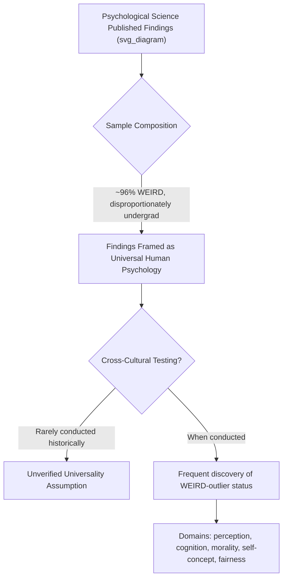

## The WEIRD Samples Problem

### Definition and Origin

The WEIRD samples problem refers to the methodological and theoretical concern that the empirical foundation of psychological science, including social psychology, has been built overwhelmingly on participants drawn from Western, Educated, Industrialized, Rich, and Democratic societies — populations that are demonstrably statistical outliers across numerous psychological and behavioral domains relative to global human variation, yet whose findings are routinely generalized as universal features of "human" psychology.

**Key Points**

- The acronym and its foundational critique were formalized by Joseph Henrich, Steven Heine, and Ara Norenzayan in their influential 2010 target article, though concerns about sample narrowness predate this specific framing
- Roughly 96% of subjects in a major sample of top-tier psychology journal publications analyzed by Henrich, Heine, and Norenzayan were drawn from Western industrialized countries, and a substantial proportion were undergraduate psychology students specifically — a narrow slice even within those societies
- WEIRD status is best understood as a spectrum/set of overlapping demographic and institutional characteristics rather than a strict binary category
- The critique applies with particular force to findings claimed as human universals without cross-cultural validation

### Documented Domains of WEIRD Outlier Status

Henrich, Heine, and Norenzayan's original analysis, and substantial subsequent literature, document WEIRD populations as outliers across multiple independent psychological domains:

| Domain | WEIRD Pattern | Broader Global Pattern |
| --- | --- | --- |
| Visual perception | Susceptible to certain geometric illusions (e.g., Müller-Lyer illusion) | Reduced or absent susceptibility in some non-industrialized, non-"carpentered" environments |
| Fairness/cooperation (economic games) | Relatively high offers in Ultimatum Game; consistent cross-task fairness norms | Substantially more cross-cultural variation, linked to market integration and religious/institutional context |
| Self-concept | Self-enhancement bias; trait-based self-description | Attenuated/reversed self-enhancement; role-based self-description in many contexts |
| Moral reasoning | Individual-rights-focused, intention-based moral judgment | Greater weight on outcome, community, and purity-based moral considerations in some cultural contexts |
| Spatial cognition | Egocentric (left/right, front/back) spatial reference frames | Allocentric (cardinal direction-based) spatial reference frames common in some cultures |
| Analytic reasoning | Categorical, rule-based reasoning; analytic cognitive style | Holistic, relational, context-embedded reasoning common in many East Asian and other contexts |

**Key Points**

- These findings span perceptual, cognitive, social, and moral domains, indicating the WEIRD outlier pattern is not confined to superficial or narrowly "cultural" content but extends to seemingly basic cognitive and perceptual processes previously assumed to be universal
- The consistency of WEIRD-outlier findings across such varied domains is the central evidentiary basis for treating this as a systemic methodological problem rather than a set of isolated anomalies

### Underlying Causes of WEIRD Sample Dominance

**Key Points**

- **Institutional convenience**: University-affiliated researchers have immediate, low-cost access to undergraduate student participant pools, creating strong structural incentive toward WEIRD (and specifically student) samples
- **Funding and infrastructure concentration**: Well-resourced psychology research institutions, granting bodies, and journals are disproportionately located in Western industrialized nations
- **Publication and career incentive structures**: Historically, cross-cultural data collection has been more costly, slower, and logistically complex, creating disincentives for researchers operating under standard publication-pace expectations
- **Historical disciplinary assumptions**: Mid-20th-century psychology's behaviorist and early cognitive traditions often implicitly assumed basic psychological processes were universal and biologically hardwired, reducing perceived need for cross-cultural verification at the time

### Consequences for Theory and Practice

#### Theoretical Consequences

Findings established in WEIRD samples but presented without qualification as general "human" psychological principles risk two distinct errors: **false universality claims** (assuming a WEIRD-specific pattern applies to all humans) and, conversely, **obscured genuine universals** (failing to test whether a finding is actually a true human universal because cross-cultural replication was never attempted, leaving genuine universality unconfirmed rather than disconfirmed).

$$\text{Theoretical Risk} = P(\text{False Universality Claim}) + P(\text{Undetected Genuine Universal, Miscategorized as WEIRD-Specific})$$

[Inference] This dual-error framing clarifies that the WEIRD critique is not simply "WEIRD findings are wrong" but rather "WEIRD-only findings carry unknown generalizability status in either direction" — a subtler and more defensible position than a blanket dismissal of WEIRD-sample research.

#### Applied and Clinical Consequences

- Mental health diagnostic frameworks and intervention models developed and validated primarily in WEIRD contexts may show reduced validity or require substantial adaptation when applied in non-WEIRD populations (a major concern in global mental health research)
- Educational and organizational interventions (e.g., motivation, feedback, and incentive-structure research) developed in WEIRD samples require cross-cultural validation before assumed applicability in non-WEIRD organizational or educational contexts
- Public health and behavioral-economics-informed policy interventions ("nudges") validated in WEIRD samples show documented cases of substantially different or null effects when tested in non-WEIRD populations

### The Field's Response: Structural and Methodological Reforms

#### Large-Scale Coordinated Cross-Cultural Data Collection

The **Psychological Science Accelerator (PSA)**, founded explicitly in response to generalizability concerns including the WEIRD critique, coordinates large-scale, standardized, multi-site data collection across dozens to hundreds of research sites internationally, substantially expanding sample diversity relative to single-lab studies.

#### Journal and Funding Policy Changes

**Key Points**

- Several major journals have introduced explicit requirements or strong encouragement for authors to report and justify sample demographic composition and discuss generalizability limits
- Some funding bodies have increased support for cross-cultural and Global South-based psychological research infrastructure, partly in response to the WEIRD critique's influence
- Editorial and reviewer practices increasingly flag unqualified universal-psychology claims based on single-population (particularly single-country undergraduate) samples

#### Methodological Innovations

- Increased use of behavioral economic games, implicit measures, and physiological/neural measures alongside self-report, partly to reduce reliance on culturally-loaded verbal/self-report instruments
- Growing emphasis on measurement invariance testing before cross-cultural score comparison, addressing concerns that apparent "WEIRD outlier" patterns could sometimes reflect measurement non-equivalence rather than genuine psychological difference
- Expansion of small-scale society and non-industrialized population fieldwork (building on Henrich's own behavioral economics fieldwork tradition) to test findings in genuinely divergent subsistence and social-organization contexts, not merely other industrialized nations

### Distinguishing WEIRD Critique from Related Concerns

| Concern | Focus | Relationship to WEIRD Critique |
| --- | --- | --- |
| WEIRD samples problem | Narrow *population* sampling (national/cultural/educational/economic background) | Core focus |
| Replication crisis | Statistical/methodological rigor (power, p-hacking, preregistration) within *any* sample | Related but distinct; a WEIRD-sample study can independently suffer or not suffer from replication-crisis-type issues |
| WEIRD-adjacent demographic narrowness | Narrow sampling *within* WEIRD societies (e.g., overreliance on undergraduate students even within a single WEIRD country) | Overlapping but analytically separable — the "student sample" problem exists even absent cross-national WEIRD concerns |

**Key Points**

- These are related but conceptually distinct methodological concerns; a study can be non-WEIRD in national sampling but still suffer from other generalizability limits (e.g., a single non-Western urban sample is not automatically globally representative)
- Cross-cultural non-replication (see cross-cultural replication literature) can result from genuine WEIRD-outlier status, from general replication-crisis-type fragility, or from measurement non-equivalence — disentangling these requires careful additional analysis beyond a single failed replication

### Critiques and Nuances of the WEIRD Framework Itself

**Key Points**

- The WEIRD acronym, while a useful heuristic, has been critiqued for implying a false homogeneity within "WEIRD" societies themselves, which contain substantial internal cultural, socioeconomic, and regional variation
- Similarly, "non-WEIRD" is not a homogeneous residual category; collapsing all non-WEIRD populations together risks a new oversimplification analogous to the original problem, given immense heterogeneity across non-WEIRD cultural contexts
- [Speculation] Some scholars have noted that increased attention to the WEIRD critique risks a superficial "diversity checkbox" response (adding a small non-WEIRD comparison sample without deeper theoretical engagement with why cultural context might matter), rather than the deeper methodological and theoretical integration the original critique called for; the degree to which this concern reflects genuine widespread practice versus an anticipated risk is not fully settled empirically

### Applied Implications for Research Design

**Key Points**

- Researchers are increasingly expected to explicitly justify sample choice and discuss generalizability boundaries rather than presenting single-population findings as unqualified general psychological principles
- Cross-cultural replication is increasingly treated as a standard component of establishing a finding's robustness, alongside direct replication and preregistration, rather than an optional extension
- Meta-scientific tools (e.g., systematic tracking of sample demographics across published literature) are used to monitor field-wide progress in addressing WEIRD sample dominance over time

### Common Methodological and Conceptual Pitfalls

**Key Points**

- Treating the WEIRD critique as implying WEIRD-sample findings are simply "wrong" rather than "of uncertain generalizability," which mischaracterizes the actual epistemic claim
- Adding a single non-WEIRD comparison sample as a superficial gesture toward addressing the critique without deeper theoretical engagement with why and how cultural context might moderate the phenomenon under study
- Treating "non-WEIRD" populations as a homogeneous category, reproducing a parallel oversimplification to the one the WEIRD critique originally targeted
- Assuming coordinated large-scale replication initiatives (e.g., PSA) have fully resolved the sampling problem field-wide, when substantial structural incentives toward convenience WEIRD sampling remain in much of the discipline's day-to-day research practice

### Related Topics

- Cross-cultural replications of classic findings (direct empirical application of the WEIRD critique)
- Individualism versus collectivism and cultural variation in self-construal
- Measurement equivalence and invariance testing methodology
- The broader psychological replication crisis and open-science reforms
- Psychological Science Accelerator and large-scale coordinated replication design
- Global mental health and cross-cultural clinical psychology
- Behavioral economics fieldwork in small-scale societies (Henrich's Ultimatum Game research)
- Ecological and external validity in psychological research design