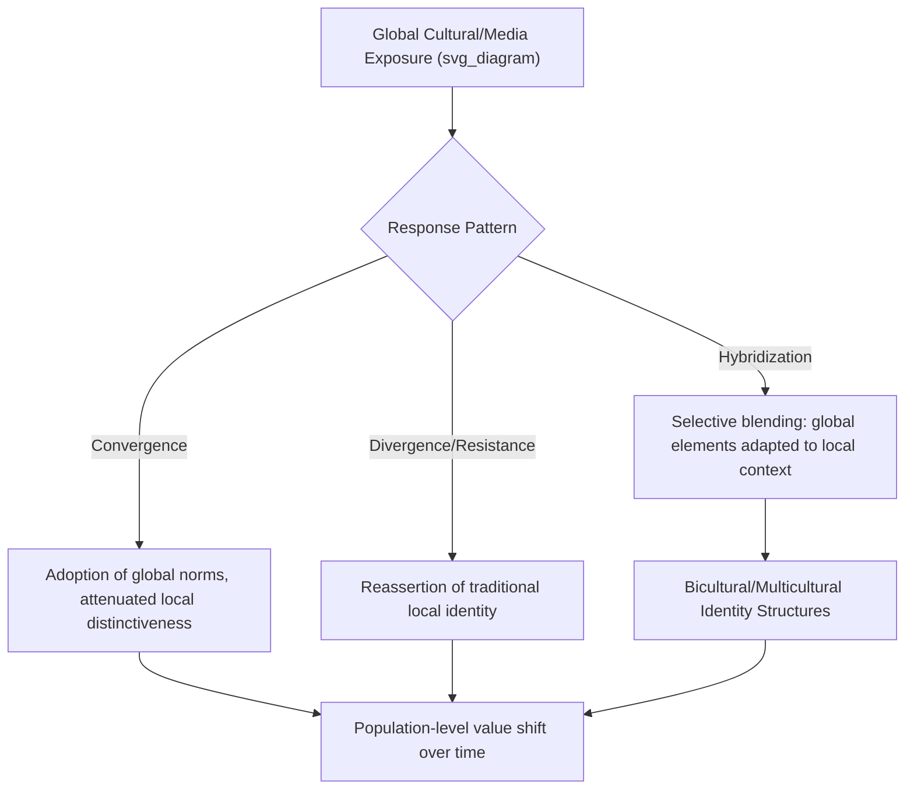

## Globalization and Cultural Change

### Definition and Conceptual Scope

Globalization refers to the accelerating worldwide interconnection of economies, communication systems, media, migration flows, and institutions, and its psychological study examines how this interconnection produces measurable shifts in cultural values, self-construal, identity structures, and social-psychological processes over time. This is distinct from acculturation (individual-level adaptation following direct intercultural contact/migration) in that globalization effects can occur at a population level even absent direct migration, through mediated exposure (media, internet, trade, institutional contact).

**Key Points**

- Globalization-linked cultural change is studied both as macro-level societal value shift (tracked via large cross-national survey programs) and as psychological process (individual exposure to multiple cultural frames, identity negotiation)
- A central empirical question is whether globalization produces cultural convergence (homogenization toward a shared, often Western-influenced global culture) or cultural divergence/hybridization (retention of distinct local identities alongside selective adoption of global elements)
- The field draws on social psychology, cross-cultural psychology, sociology, and communication studies, making it a genuinely interdisciplinary domain

### Convergence, Divergence, and Hybridization: Three Competing Models

#### Convergence Hypothesis

Proposes that globalization drives cultures toward increasing similarity, primarily through exposure to dominant (often Western/American) media, consumer culture, and institutional models (market economics, educational structures), predicting gradual attenuation of cross-cultural psychological differences (e.g., individualism-collectivism) over time.

#### Divergence/Resistance Hypothesis

Proposes that globalization can provoke a defensive reassertion of local cultural identity and traditional values, particularly among groups perceiving globalization as a threat to cultural distinctiveness — consistent with social identity theory's prediction that identity threat increases in-group identification and boundary-maintenance behavior.

#### Hybridization/Glocalization Model

The most widely supported contemporary framework proposes that globalization typically produces **selective hybridization** rather than pure convergence or pure resistance: global cultural elements are locally adapted, reinterpreted, and blended with existing cultural practices, producing novel hybrid forms rather than simple homogenization or rejection.

**Key Points**

- Empirical evidence across large cross-national datasets most consistently supports hybridization as the dominant pattern, though convergence effects are documented for some specific value domains (e.g., gender-role attitudes, economic individualism) while divergence/resistance is documented in others (e.g., religious and family-value domains in some regions)
- The relative strength of convergence, divergence, or hybridization appears to vary by cultural domain, region, and generational cohort, indicating no single model fully accounts for the pattern across all contexts

### Large-Scale Cross-National Value Tracking

#### World Values Survey (WVS) and Inglehart-Welzel Cultural Map

The WVS, a long-running large-scale cross-national survey program, has tracked value shifts across dozens of countries over multiple decades, providing the primary empirical evidence base for globalization-linked value change research. Inglehart's modernization/postmaterialism theory, derived substantially from WVS data, proposes that as societies achieve economic development and existential security, cultural values shift along two primary axes: traditional vs. secular-rational values, and survival vs. self-expression values.

**Key Points**

- The Inglehart-Welzel Cultural Map is among the most widely cited empirical tools for visualizing cross-national value positioning and tracking value trajectories over time
- Modernization theory proposes that economic development is a primary driver of value shift toward secular-rational and self-expression values, though the theory explicitly allows for path-dependent, culturally-specific trajectories rather than a single universal convergence path (countries with different starting cultural/religious traditions follow roughly parallel but distinctly-positioned trajectories)
- [Unverified] The precise magnitude and consistency of value-shift trends vary considerably by specific country, decade, and value domain examined; broad directional patterns documented across WVS waves are more robust than any single country-specific trend line taken in isolation

### Media and Digital Globalization

#### Traditional Media Exposure Effects

Cross-cultural research (including longitudinal studies examining television's introduction to previously low-media-exposure communities) has documented measurable shifts in body image standards, gender-role attitudes, and individualistic value endorsement following increased exposure to Western-produced media content, providing some of the more direct causal-leaning evidence for globalization's psychological impact.

#### Internet and Social Media Globalization

**Key Points**

- Internet and social media access dramatically accelerate the pace and reach of cross-cultural exposure relative to traditional broadcast media, exposing users to a wider and more interactive range of global cultural content
- Social media platforms have been examined both as convergence-promoting (shared global platforms, memes, and trends) and hybridization-promoting (local content creation and remixing of global trends within local cultural frameworks) mechanisms simultaneously
- [Speculation] The net long-term psychological effect of social-media-driven globalization on cultural value convergence versus hybridization is an actively developing research question, given the relative recency of near-universal social media penetration and the methodological difficulty of establishing clean causal designs at this scale

### Bicultural and Global Identity Formation

Globalization-linked cultural exposure, distinct from migration-based acculturation, has given rise to research on **global identity** — a sense of belonging to a broader "global culture" or identifying as a "global citizen," studied particularly among internationally mobile populations, urban youth with high media/internet exposure, and individuals in highly globalized economic sectors.

**Key Points**

- Global identity is theorized and measured (e.g., via constructs like Arnett's globalization-linked identity research) as potentially coexisting with, rather than replacing, local/national cultural identity — consistent with the broader bicultural identity integration framework applied at a societal-exposure rather than migration-based level
- Global identity endorsement has been associated in some studies with more cosmopolitan attitudes (openness to cultural diversity, reduced intergroup bias toward distant outgroups) though causal direction (globalization exposure causing cosmopolitan attitudes, vs. already-cosmopolitan individuals selecting into greater globalization exposure) remains difficult to fully disentangle in correlational designs

### Generational and Cohort Effects

**Key Points**

- Younger cohorts in many rapidly globalizing societies show measurably different value profiles than older cohorts within the same national culture, a pattern consistent with both cohort-replacement mechanisms (younger generations socialized under different, more globalized conditions) and life-stage effects (values shifting with age regardless of cohort) — distinguishing these requires longitudinal rather than cross-sectional design
- Urban-rural and socioeconomic-status divides frequently moderate globalization-linked cultural change within a single country, with urban, higher-SES, more internet-connected populations typically showing more pronounced value shift, producing increased within-country cultural heterogeneity as a documented byproduct of uneven globalization exposure

### Globalization Effects on Core Social-Psychological Constructs

| Construct | Documented Globalization-Linked Pattern |
| --- | --- |
| Individualism-collectivism | Mixed evidence of gradual individualism increase in some historically collectivist rapidly-globalizing societies (e.g., documented shifts in some East Asian urban youth samples), though not uniform or complete convergence with Western individualism levels |
| Self-construal | Some evidence of increased independent self-construal accessibility in high-globalization-exposure urban youth, alongside continued interdependent construal maintenance in family/relational domains (consistent with hybridization rather than replacement) |
| Consumer identity and materialism | Well-documented increase in materialistic value endorsement associated with market-economy globalization exposure across diverse cultural contexts |
| Gender-role attitudes | Relatively consistent trend toward more egalitarian gender-role attitudes associated with globalization/modernization exposure across most tracked regions in WVS data, among the more convergence-consistent findings in the literature |
| Religiosity | Highly variable; secularization trends documented in some globalizing contexts, religious resurgence/reassertion documented in others, consistent with divergence/resistance dynamics in this particular value domain |

[Inference] This table synthesizes directional patterns reported across the cross-national value-change literature; specific effect magnitudes and consistency vary substantially by country and time period and should be verified against current WVS or equivalent primary data for any specific claim.

### Applied and Policy Implications

- **International business and organizational psychology**: Globalization-linked value shift research informs cross-cultural management practice, particularly regarding generational differences in workplace expectations within globalizing economies
- **Public health**: Globalization-linked dietary and lifestyle value shifts (associated with Western media/consumer exposure) are studied as contributors to changing disease burden patterns in rapidly globalizing regions
- **Education policy**: Understanding generational value divergence within globalizing societies informs curriculum and pedagogical design debates balancing traditional cultural transmission and globally-oriented skill development
- **Intergroup relations and immigration policy**: Global identity and cosmopolitan-attitude research informs policy debate around social cohesion in increasingly globally-connected and migration-receiving societies

### Common Methodological and Conceptual Pitfalls

**Key Points**

- Treating globalization-linked cultural change as a simple, uniform "Westernization" process overlooks well-documented hybridization dynamics and domain-specific divergence patterns
- Relying on cross-sectional country comparisons to infer change over time, when only genuinely longitudinal or multi-wave designs (e.g., successive WVS waves within the same countries) can properly distinguish cohort-replacement, life-stage, and period effects
- Assuming globalization exposure is uniform within a country, when urban-rural and socioeconomic divides produce substantial within-country heterogeneity in actual globalization exposure and resulting cultural change
- Conflating globalization-linked cultural change with migration-based acculturation; while related, these involve distinct exposure mechanisms (mediated/institutional exposure vs. direct intercultural contact) and are studied with partially distinct theoretical frameworks
- Overstating causal claims from correlational cross-national survey data regarding the specific mechanisms (media exposure, economic development, migration, digital connectivity) actually driving observed value shifts, given the difficulty of experimentally isolating these interlinked processes at a societal scale

### Related Topics

- Individualism versus collectivism (the primary value dimension tracked in globalization-linked change research)
- Acculturation and cultural identity (individual-level, contact-based parallel process)
- World Values Survey and Inglehart-Welzel modernization theory
- Bicultural Identity Integration and global/cosmopolitan identity research
- Cross-cultural replications of classic findings (relevance to tracking change over time)
- Media effects research and cultivation theory
- Intergroup contact theory and cosmopolitan attitude formation
- Generational cohort methodology (cross-sectional vs. longitudinal design)