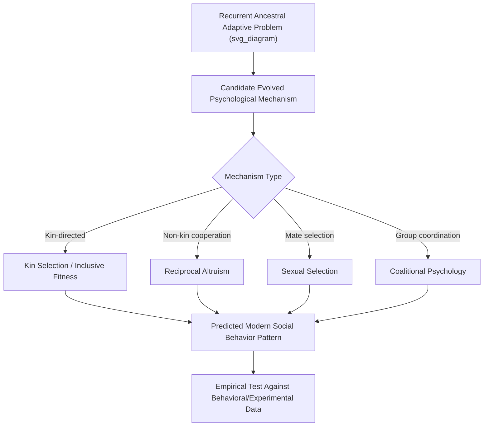

## Evolutionary Theory Applied to Social Behavior

### Definition and Conceptual Scope

Evolutionary social psychology applies principles of evolutionary biology — natural selection, sexual selection, kin selection, and reciprocal altruism — to explain the origins and functions of human social behavior, cognition, and emotion. The core theoretical premise is that recurrent adaptive problems faced by ancestral humans (survival, mating, parenting, cooperation, status competition, coalition formation) shaped psychological mechanisms that persist in modern humans, even when the modern environment differs substantially from the ancestral environment in which those mechanisms evolved.

**Key Points**

- The field is distinguished from other evolutionary approaches to psychology (e.g., behavioral genetics, comparative ethology) by its specific focus on domain-specific, functionally-specialized psychological mechanisms rather than general-purpose learning or a single unified drive
- The "Environment of Evolutionary Adaptedness" (EEA) concept — the ancestral environment(s) in which a given psychological mechanism is theorized to have evolved — is central but also among the field's most contested constructs
- Evolutionary social psychology generates testable, often counterintuitive predictions about social behavior, distinguishing it from purely post-hoc evolutionary narrative, though the field has faced sustained methodological critique regarding falsifiability and adaptationist reasoning

### Core Theoretical Mechanisms

#### Natural Selection and Adaptation

The foundational Darwinian mechanism: heritable traits that enhance reproductive success relative to alternatives increase in frequency across generations. Evolutionary social psychology treats many social-psychological mechanisms (not just physical traits) as candidate adaptations shaped by this process.

#### Kin Selection and Inclusive Fitness

Hamilton's inclusive fitness theory proposes that natural selection favors behaviors that promote the reproductive success of genetic relatives, weighted by degree of genetic relatedness, not only an individual's own direct reproduction. Formalized in **Hamilton's Rule**:

$$rB > C$$

Where $r$ is the coefficient of genetic relatedness between actor and recipient, $B$ is the fitness benefit to the recipient, and $C$ is the fitness cost to the actor. An altruistic behavior is predicted to be favored by selection when the relatedness-weighted benefit exceeds the cost to the actor.

**Key Points**

- Kin selection is the primary evolutionary explanation offered for nepotistic altruism (favoring genetic relatives) documented across human social behavior, including resource allocation, helping behavior, and conflict-resolution patterns
- Predicts systematically graded altruism as a function of genetic relatedness (e.g., parent-child > sibling > cousin), a pattern with substantial cross-cultural behavioral support

#### Reciprocal Altruism

Trivers's theory explains cooperation between non-relatives via the fitness benefits of reciprocal exchange over repeated interactions, requiring the evolution of accompanying psychological mechanisms: the capacity to recognize individuals, remember past exchanges, detect cheating, and generate emotional responses (gratitude, moral outrage, guilt) that regulate reciprocal exchange.

#### Sexual Selection

Darwin's complementary selective mechanism explains traits that enhance mating success specifically, even at some cost to survival, operating through two sub-mechanisms: intersexual selection (mate choice/preference) and intrasexual selection (competition among same-sex individuals for mating access). Extensively applied in evolutionary social psychology to explain documented sex-differentiated patterns in mate preferences, jealousy, and status-striving behavior.

### Parental Investment Theory

Trivers's parental investment theory extends sexual selection theory by proposing that the sex investing more in offspring (typically, though not universally across species, females due to gestation/lactation costs) will be more selective in mate choice, while the less-investing sex will compete more intensely for mating access — generating a widely cited framework for predicting sex-differentiated mating psychology.

**Key Points**

- Applied extensively in evolutionary social psychology to generate predictions about mate preference criteria (e.g., documented cross-cultural patterns in preferences for resource-acquisition potential vs. reproductive-value cues), though the specificity and universality of these predicted sex differences remain actively debated
- [Unverified] The magnitude and cross-cultural consistency of specific mate-preference sex differences derived from parental investment theory vary across studies and have been subject to methodological critique (e.g., regarding self-report vs. behavioral measurement, and whether findings reflect evolved preference vs. socially/economically structured constraint); current meta-analytic sources should be consulted rather than assuming settled consensus on specific effect sizes

### Coalitional Psychology and Intergroup Behavior

Evolutionary accounts propose that ancestral humans faced recurrent adaptive problems involving coalition formation, intergroup competition, and resource/territorial conflict, theorized to have shaped psychological mechanisms underlying modern ingroup favoritism, outgroup wariness, and rapid coalitional categorization (documented experimentally in minimal-group paradigm research, which evolutionary psychologists have interpreted as evidence of an evolved, easily-triggered coalitional psychology).

**Key Points**

- This framework is theorized to connect to and provide an evolutionary account for social identity theory and intergroup bias findings established independently within mainstream social psychology
- Evolutionary coalitional accounts have been extended to explain documented patterns in stereotyping, prejudice, and the specific content of intergroup threat perceptions (e.g., differential threat appraisal associated with perceived physical vs. economic vs. value-based outgroup threat)

### Status, Dominance, and Prestige Hierarchies

Evolutionary social psychology distinguishes two theorized distinct pathways to social status, based substantially on Henrich and Gil-White's dual-strategy model:

| Pathway | Mechanism | Associated Behavior | Associated Emotion |
| --- | --- | --- | --- |
| Dominance | Coercion, intimidation, resource control | Aggression, threat display | Fear-based deference from others |
| Prestige | Voluntary deference based on skill/knowledge value | Skill demonstration, generosity, teaching | Respect/admiration-based deference from others |

**Key Points**

- The dominance-prestige distinction is proposed as a human-specific or human-elaborated status-acquisition duality (dominance pathways being more phylogenetically ancient and shared with other primate species, prestige being proposed as more distinctively elaborated in humans, linked to cumulative cultural transmission needs)
- This framework has been applied to explain documented patterns in leadership emergence, workplace status dynamics, and social media influence/status-seeking behavior in contemporary applied research

### Evolutionary Approaches to Emotion

Many discrete emotions studied within social psychology (envy, jealousy, guilt, shame, disgust, anger) are given explicit functional evolutionary accounts within this framework, treating emotions as evolved solutions to recurrent adaptive problems (e.g., jealousy as a mate-guarding mechanism responding to paternity uncertainty or partner-investment-loss threat; disgust as a pathogen-avoidance mechanism extended to social/moral domains via the "behavioral immune system" concept).

[Inference] These functional emotion accounts are influential organizing frameworks within evolutionary social psychology, but the degree to which each specific emotion's proposed evolutionary function is empirically established (versus a plausible but not yet decisively tested hypothesis) varies considerably across the specific emotions studied.

### Methodological Approaches

| Method | Application |
| --- | --- |
| Cross-cultural comparison | Testing whether a proposed evolved mechanism shows the predicted pattern across diverse cultural contexts (a key test of universality claims) |
| Comparative/phylogenetic research | Examining whether related mechanisms exist in non-human primates or other species, supporting deep evolutionary origin claims |
| Experimental hypothesis testing | Deriving specific, falsifiable behavioral predictions from evolutionary theory and testing them via standard experimental social-psychology methods |
| Behavioral genetics | Examining heritability of proposed evolved traits/dispositions |
| Life-history and demographic analysis | Testing predictions about how environmental harshness/unpredictability shape reproductive and social strategies (life history theory applications) |

### Major Critiques and Controversies

**Key Points**

- **"Just-so story" critique**: A longstanding methodological criticism (associated notably with Gould and Lewontin's broader critique of adaptationism) argues that evolutionary explanations can be constructed post-hoc to fit nearly any observed behavior pattern, risking unfalsifiable narrative rather than genuinely predictive science; proponents respond that rigorous evolutionary social psychology derives specific, falsifiable, *a priori* predictions rather than post-hoc explanation, though the discipline's actual practice varies in how well it meets this standard
- **EEA specification problem**: Critics note that the "Environment of Evolutionary Adaptedness" is often invoked without precise archaeological or paleoanthropological specification, creating risk of circular reasoning (inferring the EEA from the trait one is trying to explain, then using that inferred EEA to explain the trait)
- **Nature-nurture false dichotomy risk**: Critics argue some popularized evolutionary psychology work has understated developmental plasticity and gene-environment interaction, implying overly fixed/deterministic behavioral outcomes; contemporary evolutionary social psychology increasingly explicitly incorporates developmental plasticity and conditional/facultative adaptation models rather than fixed-trait determinism
- **Sex-difference overgeneralization concerns**: Critics (including feminist psychology and some cross-cultural researchers) have challenged the universality and magnitude of some widely publicized evolutionary sex-difference findings (particularly in mate-preference research), citing measurement, sampling (WEIRD sample concerns apply here as elsewhere), and alternative social-structural explanations (e.g., social role theory) for similar behavioral patterns
- **Reductionism concerns**: Some critics argue evolutionary explanations, even when empirically supported, risk being treated as more complete or foundational explanations than proximate social/cultural/situational explanations, when a fuller account typically requires both ultimate (evolutionary) and proximate (situational, cultural, developmental) levels of explanation operating in tandem (Tinbergen's four-questions framework is frequently invoked to formalize this multi-level requirement)

### Relationship to Mainstream Social Psychology

**Key Points**

- Evolutionary social psychology is generally framed as complementary to, rather than a replacement for, situational and cultural explanations within mainstream social psychology — providing an "ultimate" (why did this psychological mechanism evolve) level of explanation alongside "proximate" (how does this mechanism operate given current situational/cultural input) explanations studied by mainstream social-cognitive and cultural social psychology
- Areas of productive integration include intergroup bias (evolutionary coalitional psychology + social identity theory), mate selection and relationship psychology, status and hierarchy research, and emotion research (functional evolutionary accounts + appraisal-theory proximate mechanisms)
- Tension persists in the field regarding the appropriate weight given to evolved-mechanism explanations versus cultural/social-structural explanations for the same observed behavioral pattern, particularly for sex-differentiated behaviors, reflecting a genuine and ongoing theoretical debate rather than a fully resolved division of labor

### Common Methodological and Conceptual Pitfalls

**Key Points**

- Constructing post-hoc evolutionary narratives for observed behavior without deriving independently falsifiable, *a priori* predictions, reproducing the "just-so story" critique the field has worked to address
- Treating evolved-mechanism explanations as mutually exclusive with, rather than complementary to, cultural and situational explanations for the same behavior (conflating ultimate and proximate levels of explanation, contrary to Tinbergen's framework)
- Assuming a proposed evolved mechanism must be universal and invariant across all cultural contexts, when many evolutionary models explicitly predict facultative, condition-dependent expression rather than fixed universal behavior
- Overgeneralizing findings from WEIRD samples (a concern applying with particular force to some influential mate-preference and sex-difference studies) as evidence of species-typical evolved psychology without adequate cross-cultural replication
- Invoking the EEA imprecisely or circularly, inferring ancestral conditions from the very trait the EEA is meant to explain

### Related Topics

- Parental investment theory and mate preference research
- Dominance vs. prestige status pathways (Henrich & Gil-White)
- Coalitional psychology and social identity theory integration
- Kin selection, inclusive fitness, and Hamilton's Rule
- Reciprocal altruism and cheater-detection cognition
- Tinbergen's four questions (ultimate vs. proximate explanation levels)
- Life history theory and environmental harshness/unpredictability effects
- Cross-cultural replications of classic findings (relevance to universality testing)
- Envy, jealousy, and schadenfreude (evolutionary functional accounts)