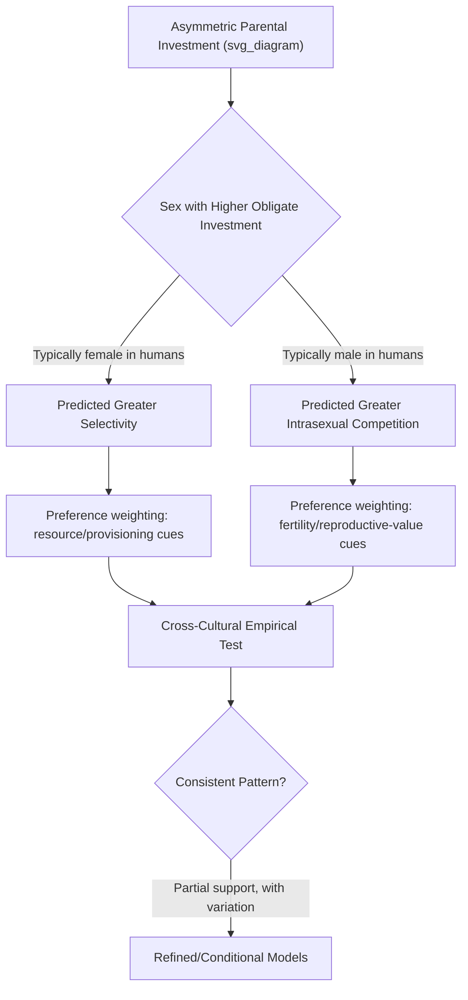

## Sexual Selection and Mate Preferences

### Definition and Theoretical Foundation

Sexual selection, distinguished by Darwin from natural selection, is the evolutionary process by which traits increase in frequency because they enhance mating success rather than (or in addition to) survival, operating through two distinguishable sub-mechanisms: intersexual selection (differential mate choice/preference) and intrasexual selection (competition among members of one sex for mating access to the other). Applied to human social behavior, sexual selection theory generates predictions about the psychological mechanisms underlying mate preference, attraction, and mating-relevant competitive behavior.

**Key Points**

- Intersexual selection concerns the evolved preferences that shape which traits are found attractive in a potential mate
- Intrasexual selection concerns the evolved traits and strategies that enhance an individual's competitive success in accessing mates, often producing exaggerated traits or behaviors used in same-sex competition
- Both mechanisms are theorized to operate simultaneously and can produce correlated evolutionary outcomes (a trait preferred by mate choice can also become a target of intrasexual competitive display)

### Parental Investment Theory as the Core Explanatory Framework

Trivers's parental investment theory provides the dominant theoretical account structuring most evolutionary mate-preference research: the sex that invests more heavily in offspring production and care (time, energy, physiological resources) is predicted to be more selective/discriminating in mate choice, while the less-investing sex is predicted to compete more intensely for mating access to the more selective sex.

$$\text{Selectivity in Mate Choice} \propto \text{Relative Parental Investment}$$

**Key Points**

- In humans, female obligate investment (gestation, lactation) is substantially higher than minimum male obligate investment, generating the central asymmetric prediction structuring much of the field's research: women theorized to show greater selectivity, particularly for resource-acquisition-relevant cues; men theorized to show relatively greater emphasis on cues associated with fertility/reproductive value
- This is a *relative*, population-level probabilistic prediction, not a claim that individual investment or preference patterns are fixed or uniform; substantial within-sex variation is expected and documented
- The theory explicitly allows for context-dependent, facultative variation (e.g., predictions shift under conditions of biparental care, paternal investment variability, or resource scarcity), distinguishing sophisticated applications of the theory from oversimplified fixed-trait characterizations

### Documented Cross-Cultural Mate Preference Patterns

Buss's large-scale 37-culture study remains the most extensively cited cross-cultural mate preference dataset in the field, examining preference rankings across dozens of countries for a standardized set of mate-preference criteria.

| Preference Dimension | Reported Pattern | Theoretical Interpretation |
| --- | --- | --- |
| Resource acquisition potential (financial prospects, ambition, social status) | Reported as more highly valued by women than men across most sampled cultures | Interpreted as reflecting selection for cues associated with offspring provisioning capacity |
| Physical attractiveness and youth-linked cues | Reported as more highly valued by men than women across most sampled cultures | Interpreted as reflecting selection for cues associated with fertility/reproductive value |
| Chastity/fidelity assurance | Showed substantial cross-cultural variation in reported importance | Interpreted in relation to paternity-certainty concerns, but cultural variation itself flagged as theoretically important |
| Kindness and intelligence | Reported as highly valued by both sexes across nearly all sampled cultures | Interpreted as reflecting shared selection pressures for cooperative, effective long-term partners and parents |

[Unverified] The magnitude, consistency, and even direction of some specific reported sex differences (particularly resource-preference and attractiveness-preference gaps) have been subject to ongoing empirical debate, methodological critique, and partially divergent findings across subsequent replication and re-analysis efforts; current meta-analytic and replication literature should be consulted rather than treating the original 37-culture findings as a final, unrevised consensus.

### Physical Attractiveness Cues and Their Proposed Evolutionary Basis

#### Facial and Bodily Symmetry

Bilateral symmetry is theorized and empirically studied as a signal of developmental stability (resistance to environmental/genetic perturbation during development), with documented associations between rated attractiveness and measured facial/bodily symmetry across multiple studies, though effect sizes and the underlying developmental-stability interpretation remain subjects of ongoing methodological discussion.

#### Waist-to-Hip Ratio (WHR)

Singh's influential research proposed a specific WHR range (commonly cited around 0.7 in women) as a cross-culturally preferred attractiveness cue, theorized to signal fertility-relevant fat distribution and health status independent of overall body weight. Subsequent cross-cultural replication has found more variation in the specific preferred ratio across cultures and greater interaction with body-mass preferences than the original strong universal-preference claim suggested.

#### Facial Averageness and Masculinity/Femininity

Research has examined preferences for facial averageness (proposed to signal genetic diversity/heterozygosity and developmental stability) and sexually dimorphic facial features (masculinity in male faces, femininity in female faces), with documented but context-dependent preference patterns — notably, preference for facial masculinity in potential male partners has been found in some studies to vary with menstrual cycle phase and relationship context (short-term vs. long-term mating context), an active and somewhat contested area of the literature.

[Speculation] The menstrual-cycle-linked mate-preference-shift literature (sometimes termed the "ovulatory shift hypothesis") has faced significant replication challenges in subsequent larger and more rigorously designed studies, with some meta-analytic work finding substantially smaller or inconsistent effects compared to earlier influential studies; this should be treated as a genuinely contested area rather than an established finding.

### Short-Term versus Long-Term Mating Strategies

Buss and Schmitt's Sexual Strategies Theory proposes that humans possess evolved psychological mechanisms for pursuing both short-term (low-investment, more sexually-focused) and long-term (high-investment, pair-bonding-focused) mating strategies, with predicted sex-differentiated preference shifts depending on which strategy is contextually activated.

**Key Points**

- Long-term mating context is theorized to elevate the importance of cues associated with parenting investment potential, relationship commitment indicators, and compatibility for both sexes, narrowing (though not eliminating) some sex-differentiated preference gaps observed in short-term mating contexts
- Short-term mating context is theorized to elevate the relative importance of immediate physical attractiveness cues, with some research suggesting men show a more pronounced short-term/long-term preference shift than women, consistent with parental investment asymmetry predictions, though this remains an area of active empirical refinement
- Strategic Pluralism Theory (Gangestad & Simpson) extends this framework by proposing that mating strategy deployment is conditionally responsive to individual and ecological factors (e.g., pathogen prevalence, operational sex ratio, resource availability) rather than fixed, adding an explicitly facultative dimension to sexual strategy theorizing

### Intrasexual Competition

Beyond mate-choice preference, sexual selection theory generates predictions about intrasexual competitive behavior — traits and strategies used to outcompete same-sex rivals for mating access.

**Key Points**

- Male intrasexual competition research has examined status-striving, risk-taking behavior, and physical aggression/dominance display as theorized outcomes of sexual selection favoring traits that historically enhanced male mating access, particularly under conditions of resource/mate competition
- Female intrasexual competition research, a comparatively newer but growing area, has examined indirect competitive strategies (e.g., self-promotion via appearance enhancement, competitor derogation) as theorized outcomes of selection on female intrasexual competitive tactics, distinct from but complementary to male-focused intrasexual competition research
- Both lines of research connect to but are analytically distinguishable from status/dominance-hierarchy research more broadly within evolutionary social psychology

### Critiques and Alternative Explanations

#### Social Role Theory Alternative

Eagly and Wood's social role theory offers a prominent alternative (not purely evolutionary) explanation for documented sex-differentiated mate preferences, proposing that such differences arise substantially from socially structured division of labor and associated gender-role socialization (e.g., historical economic dependency structures shaping resource-preference patterns) rather than, or in addition to, evolved psychological mechanisms. This represents a genuine and unresolved theoretical tension within the broader literature rather than a settled dispute.

#### Methodological Critiques

**Key Points**

- Self-report mate-preference surveys (the dominant methodology in much of this literature, including the foundational 37-culture study) may not accurately predict actual mate-choice behavior; behavioral and speed-dating/dating-app-based studies have sometimes found smaller or different sex-differentiated patterns than self-report preference-ranking studies, an important methodological caveat
- WEIRD sample and broader sampling concerns apply to this literature as elsewhere in psychology; while the 37-culture study was notable for its unusually broad sampling relative to typical psychology research, later scholars have noted the sampled cultures were not equally weighted toward non-industrialized, non-market-integrated societies, limiting the strength of universality claims
- Cross-national economic gender-equality variation has been examined as a potential moderator of sex-differentiated resource-preference gaps, with some studies (e.g., examining the relationship between national gender-equality indices and preference-gap magnitude) finding evidence consistent with social-structural moderation, complicating a purely evolved-and-fixed interpretation

### Integration: Evolved Mechanism and Socially Structured Expression

**Key Points**

- Contemporary, more sophisticated treatments in the field increasingly frame evolved mate-preference mechanisms and social-structural/cultural explanations as potentially complementary rather than strictly competing: an evolved preference mechanism could be facultatively responsive to socially structured input (resource distribution, gender norms, economic structure) rather than expressed identically regardless of context
- This integrative framing parallels Tinbergen's broader ultimate/proximate explanatory distinction discussed within evolutionary theory applied to social behavior generally, treating evolved mechanism and socially/culturally structured proximate expression as compatible levels of explanation rather than mutually exclusive accounts
- [Inference] The degree to which this integrative framing has been fully adopted across the field's empirical practice, versus continued treatment of evolutionary and social-structural explanations as competing hypotheses to be adjudicated by a single "winning" study, varies considerably across specific research programs and remains an area of genuine ongoing theoretical development rather than full consensus

### Common Methodological and Conceptual Pitfalls

**Key Points**

- Treating self-report mate-preference ranking data as directly equivalent to actual mate-choice behavior, when documented discrepancies between stated preference and revealed behavioral choice exist in the literature
- Presenting sex-differentiated mate-preference findings as fixed, universal, and evolutionarily fixed without acknowledging documented cross-cultural variation in preference magnitude and the plausible role of social-structural moderators
- Overgeneralizing from the original 37-culture study or other influential early studies without incorporating subsequent replication, methodological critique, and refinement (particularly regarding the ovulatory shift hypothesis and WHR universality claims)
- Framing evolutionary and social role theory explanations as strictly mutually exclusive, when contemporary theoretical work increasingly treats them as operating at complementary explanatory levels
- Assuming any single study (however large or influential) settles a mate-preference question definitively, given the field's ongoing methodological refinement and documented replication challenges in several specific subareas

### Related Topics

- Evolutionary theory applied to social behavior (broader theoretical framework)
- Parental investment theory and Trivers's foundational model
- Sexual Strategies Theory and Strategic Pluralism Theory
- Dominance vs. prestige status pathways and intrasexual competition
- Social role theory (Eagly & Wood) as an alternative/complementary explanation
- Cross-cultural replications of classic findings (methodological parallels)
- Ovulatory shift hypothesis and its replication status
- WEIRD samples problem as applied to mate-preference research