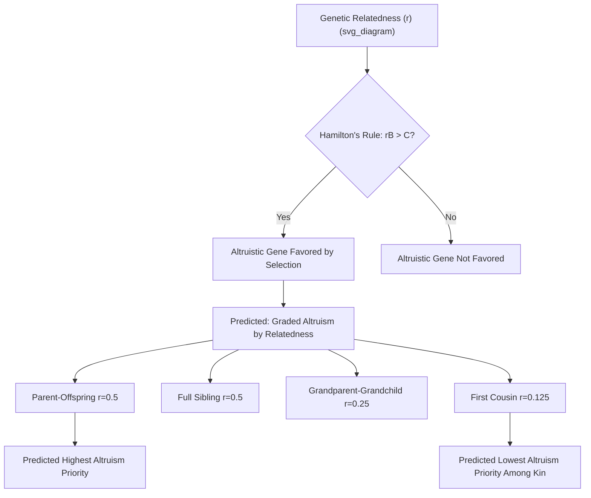

## Kin Selection and Inclusive Fitness

### Definition and Theoretical Foundation

Kin selection is the evolutionary process by which genes influencing social behavior increase in frequency because they enhance the reproductive success of genetically related individuals, not only the actor's own direct offspring. Inclusive fitness, the broader conceptual framework within which kin selection operates, was formalized by W.D. Hamilton (1964) as the sum of an individual's direct fitness (own reproductive success) and indirect fitness (reproductive success of genetic relatives attributable to the individual's own actions, weighted by relatedness).

**Key Points**

- Inclusive fitness theory resolved a major theoretical puzzle facing classical Darwinian theory: how apparently self-sacrificing (altruistic) behavior could evolve via natural selection, which was traditionally understood to favor traits maximizing an individual's own direct reproduction
- The theory reframes the unit of selective advantage from the individual organism to the gene, since a gene promoting relative-directed altruism can increase in frequency across a population even when it reduces the altruistic individual's own direct reproductive output, provided the gene copy is shared with the beneficiary at a sufficient rate
- Kin selection is one of several major evolutionary mechanisms (alongside reciprocal altruism, sexual selection, and group-level selection debates) invoked in evolutionary social psychology to explain human social/cooperative behavior

### Hamilton's Rule

The formal mathematical condition under which a gene for altruistic behavior is predicted to be favored by natural selection:

$$rB > C$$

Where:

- $r$ = coefficient of genetic relatedness between the actor performing the altruistic behavior and the recipient
- $B$ = fitness benefit conferred to the recipient
- $C$ = fitness cost incurred by the actor

**Key Points**

- Relatedness ($r$) is calculated based on the probability that a given gene copy in the actor is also present in the recipient due to shared descent (e.g., $r = 0.5$ for full siblings or parent-offspring pairs in diploid organisms like humans, $r = 0.25$ for half-siblings or grandparent-grandchild pairs, $r = 0.125$ for first cousins)
- The rule generates a clear, quantitative, falsifiable prediction: altruism toward more closely related individuals should require a lower benefit-to-cost ratio to be favored by selection than altruism toward more distantly related individuals
- Hamilton's Rule applies at the level of gene frequency change across generations; it is a population-genetic formalization, not a claim about the conscious motivation or psychological calculation of the organism performing the behavior

### Direct versus Indirect Fitness

$$\text{Inclusive Fitness} = \text{Direct Fitness (own offspring)} + \sum_{i} r_i \times (\text{fitness effect on relative } i \text{ attributable to actor's behavior})$$

**Key Points**

- Direct fitness captures an individual's reproductive success through their own offspring
- Indirect fitness captures the relatedness-weighted reproductive benefit an individual confers on genetic relatives through helping behavior, resource sharing, or other relative-directed assistance
- This reformulation clarifies that natural selection, properly understood at the gene level, favors *inclusive* fitness maximization, not narrowly defined individual reproductive maximization — a foundational conceptual correction that resolved the evolutionary "problem of altruism"

### Empirical Applications to Human Social Behavior

#### Nepotism and Resource Allocation

Cross-cultural and historical research on resource allocation, inheritance patterns, helping behavior, and caregiving has documented broadly kin-selection-consistent patterns: individuals tend to allocate resources, assistance, and caregiving effort preferentially toward more closely related kin, with allocation intensity generally declining as genetic relatedness decreases.

**Example**

Classic studies of grandparental investment (e.g., research associated with Euler and colleagues) have documented that grandparental caregiving investment often shows patterns consistent with paternity-uncertainty-adjusted relatedness predictions: maternal grandmothers (whose relatedness to grandchildren is not subject to paternity uncertainty at any generational link) often show documented patterns of relatively higher average investment compared to paternal grandfathers (whose relatedness involves two paternity-uncertainty links), a finding frequently cited as consistent with kin-selection-informed predictions incorporating paternity confidence.

#### Sibling Relationships and Conflict

Kin selection theory, combined with parent-offspring conflict theory (Trivers's related extension), has been applied to explain both cooperative and competitive dynamics within sibling relationships: siblings are predicted to cooperate more than unrelated individuals (consistent with $r=0.5$ relatedness) but are also predicted to experience genuine conflict over shared parental resources, since each sibling's relatedness to themselves ($r=1$) exceeds their relatedness to a sibling ($r=0.5$), creating a predictable, non-zero level of competitive interest even between close kin.

#### Alarm Calling and Vigilance Behavior

While much of the original empirical grounding for kin selection theory derives from non-human animal research (e.g., alarm-calling behavior in ground squirrels and other social mammals, where individuals emit predator-warning calls at personal risk primarily when genetically related individuals are nearby), evolutionary social psychology has drawn on this cross-species evidentiary base as a comparative foundation supporting the broader applicability of inclusive fitness theory to human vigilance and protective behavior toward kin.

### Kin Recognition Mechanisms

A key subsidiary research question concerns *how* organisms (including humans) actually detect or estimate relatedness, since kin selection requires some proximate mechanism for differentially directing altruism toward kin rather than requiring literal genetic assessment.

| Proposed Kin Recognition Cue | Mechanism | Human Application |
| --- | --- | --- |
| Co-residence duration in childhood | Association between shared early-life proximity and inferred relatedness | Proposed basis for the Westermarck effect (reduced sexual attraction toward those raised in close childhood proximity, theorized as an incest-avoidance mechanism) |
| Maternal perinatal association | Direct observation of birth events | Theorized to support high-confidence maternal kin recognition |
| Phenotype matching | Comparison of physical/olfactory similarity to self or known kin | Proposed but more contested mechanism in humans, with more robust evidence in some non-human species |
| Contextual/social cues | Cultural and familial labeling, social learning of kinship categories | Human kinship terminology and social categorization systems proposed to supplement or partially substitute for purely biological cue-based recognition |

**Key Points**

- The Westermarck effect is among the most extensively studied human kin-recognition-linked phenomena, with supporting evidence from Israeli kibbutz studies (reduced marriage/intermarriage rates among unrelated children raised together in communal child-rearing settings) and Taiwanese "minor marriage" arranged childhood-cohabitation studies
- [Unverified] The relative contribution of purely biological/perceptual kin-recognition cues versus culturally-transmitted kinship categorization in shaping human kin-directed behavior remains an area of ongoing research and is not fully resolved; humans plausibly rely on a combination of cue types that may vary by context and relationship type

### Paternity Uncertainty and Its Theoretical Implications

**Key Points**

- Because paternity (unlike maternity, historically) could not be directly observed with certainty prior to modern genetic testing, evolutionary theory predicts systematically lower average confidence in paternal versus maternal genetic relatedness, generating a documented set of predictions applied across evolutionary social psychology (e.g., predicted differences in paternal vs. maternal grandparental investment discussed above, predicted patterns in paternal investment more broadly, and connections to jealousy research examining male mate-guarding behavior as a response to paternity-uncertainty-linked fitness risk)
- These paternity-uncertainty-linked predictions represent one of the more distinctive and empirically productive extensions of basic kin selection theory to human-specific social psychology, given the particular salience of paternity uncertainty in a species with internal female fertilization and extended biparental/extended-family investment

### Distinguishing Kin Selection from Related but Distinct Concepts

| Concept | Core Mechanism | Distinguishing Feature |
| --- | --- | --- |
| Kin selection | Genetic relatedness-weighted altruism | Applies specifically to genetically related individuals |
| Reciprocal altruism | Repeated exchange with expectation of future return | Applies to non-relatives; relies on recognition, memory, and cheater-detection rather than relatedness |
| Group selection | Selection operating at the level of groups rather than individuals/genes | Historically controversial mechanism, distinct from and largely superseded by kin selection/inclusive fitness as the dominant explanation for most documented altruism, though debates about multilevel selection persist in evolutionary biology |
| Mutualism | Simultaneous mutual benefit to both parties in a single interaction | Does not require relatedness or delayed reciprocity; benefit is immediate and bidirectional |

**Key Points**

- Group selection was historically proposed (particularly in mid-20th-century evolutionary biology) as an alternative explanation for altruistic behavior, but faced substantial theoretical critique (notably from Williams and later Dawkins) regarding its mathematical plausibility relative to individual/gene-level selection under most realistic biological conditions
- Kin selection and reciprocal altruism are often presented as complementary rather than competing explanations for human cooperative behavior, since humans show extensive cooperation with both kin and non-kin, plausibly reflecting the operation of both mechanisms (and additional mechanisms such as reputation-based indirect reciprocity) across different relationship contexts

### Applications Beyond Direct Altruism

- **In-group/coalitional psychology**: Some evolutionary theorists have proposed that kin-selection-shaped psychological mechanisms for detecting and favoring genetic relatedness may have been evolutionarily co-opted or extended to broader in-group favoritism and coalitional psychology, though this extension is more speculative and debated than core kin-directed altruism findings
- **Family conflict and inheritance psychology**: Applied research on inheritance disputes, stepfamily dynamics, and differential treatment of biological versus step-relations has drawn on kin selection theory, with documented patterns of relatively reduced parental investment in stepchildren compared to biological children in some studies (connecting to the broader "Cinderella effect" literature on differential child-maltreatment risk, itself a contested and ethically sensitive area of evolutionary family research)
- **Cooperative breeding and alloparenting**: Kin selection theory informs research on human alloparental care (caregiving by individuals other than the biological parents, notably grandmothers), connecting to broader anthropological theorizing about the evolution of human cooperative breeding systems (e.g., the "grandmother hypothesis" for human female post-reproductive longevity)

### Common Methodological and Conceptual Pitfalls

**Key Points**

- Treating Hamilton's Rule as a claim about conscious psychological calculation ("organisms consciously compute relatedness coefficients") rather than a population-genetic description of which genetically-influenced behavioral dispositions are favored by selection over evolutionary time — the rule operates at the level of gene-frequency change, not moment-to-moment individual cognition
- Assuming kin-selected altruism requires or implies literal, accurate genetic relatedness assessment, when proximate kin-recognition mechanisms (co-residence cues, social/cultural kinship categorization) are known to be imperfect proxies that can be fooled or vary in accuracy
- Conflating kin selection with group selection, which are distinct mechanisms with different theoretical histories and different levels of empirical/theoretical support in contemporary evolutionary biology
- Overextending kin selection theory to explain all forms of human cooperation, when substantial human cooperative behavior (toward non-relatives, strangers, and even future/unknown individuals) requires additional explanatory mechanisms (reciprocal altruism, indirect reciprocity/reputation, cultural group selection debates) beyond kin selection alone
- Applying paternity-uncertainty and stepfamily-investment research (e.g., "Cinderella effect" findings) without appropriate methodological and ethical caution, given the sensitivity and contested replication status of some specific findings in this subarea

### Related Topics

- Evolutionary theory applied to social behavior (broader theoretical framework)
- Reciprocal altruism and cheater-detection psychology
- Parental investment theory and paternity uncertainty
- The Westermarck effect and incest-avoidance mechanisms
- Grandmother hypothesis and human cooperative breeding
- Coalitional psychology and in-group favoritism (extension debates)
- Group selection controversy in evolutionary biology
- Sexual selection and mate preferences (paternity-uncertainty connections)