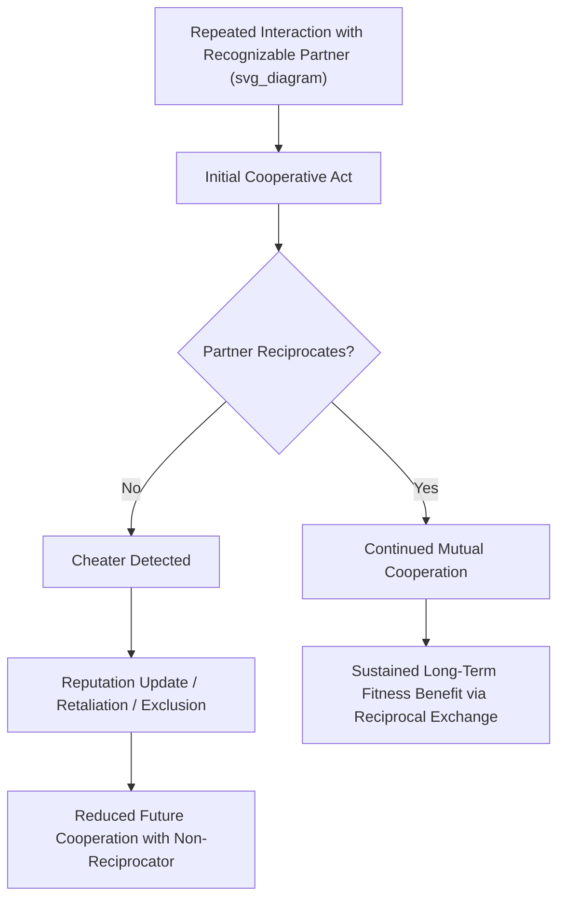

## Reciprocal Altruism and Cooperation

### Definition and Theoretical Foundation

Reciprocal altruism, formalized by Robert Trivers (1971), is the evolutionary mechanism explaining cooperation between genetically unrelated individuals through the fitness benefits of repeated reciprocal exchange over time. Unlike kin selection, which explains altruism toward genetic relatives via relatedness-weighted fitness benefits, reciprocal altruism explains helping behavior directed at non-relatives by proposing that short-term costs to the helper are offset by expected future benefits when the recipient reciprocates.

**Key Points**

- Reciprocal altruism requires the evolution of accompanying psychological infrastructure not needed for simple kin-directed altruism: individual recognition, memory for past exchanges, an internal accounting/tracking system for costs and benefits given and received, and mechanisms for detecting and responding to cheaters (those who accept help but fail to reciprocate)
- The theory predicts that reciprocal cooperation is evolutionarily stable only under specific conditions: repeated interaction between the same individuals (or a functional equivalent, such as reputation transfer), sufficiently low cost relative to benefit for the helping act, and the capacity to identify and exclude or punish non-reciprocators
- Trivers explicitly proposed that reciprocal altruism theory could explain aspects of human moral emotion (gratitude, guilt, moral outrage, friendship) as evolved psychological mechanisms regulating reciprocal exchange, extending the theory well beyond simple behavioral prediction into affective and moral psychology

### Formal Conditions for Evolutionary Stability

$$\text{Reciprocal Altruism Favored When: } B_{\text{future}} \times P(\text{reciprocation}) > C_{\text{present}}$$

Where $B_{\text{future}}$ is the discounted future benefit of reciprocation, $P(\text{reciprocation})$ is the probability the partner will actually reciprocate, and $C_{\text{present}}$ is the immediate cost of the altruistic act.

[Inference] This formalization captures the core logical structure of reciprocal altruism theory as commonly presented in the literature; the precise mathematical treatment varies across specific game-theoretic models (e.g., iterated Prisoner's Dilemma formalizations), and this equation should be read as an illustrative simplification rather than a single canonical formula used uniformly across the field.

### Game-Theoretic Foundations: The Iterated Prisoner's Dilemma

Reciprocal altruism theory is closely tied to game-theoretic modeling, particularly the iterated (repeated) Prisoner's Dilemma, which formalizes the tension between short-term incentive to defect (not reciprocate) and long-term benefit of sustained mutual cooperation.

| Strategy | Rule | Outcome in Tournament Simulations |
| --- | --- | --- |
| Always Defect | Never cooperate | Poor long-term payoff against reciprocating strategies |
| Always Cooperate | Always cooperate regardless of partner behavior | Exploitable by defectors; poor payoff against non-reciprocators |
| Tit-for-Tat | Cooperate first, then mirror partner's previous move | Highly successful in Axelrod's classic computer tournament simulations |
| Tit-for-Tat with forgiveness | Mirror partner's previous move but periodically forgive defection | Often outperforms strict Tit-for-Tat in noisy/error-prone environments |

**Key Points**

- Robert Axelrod's foundational computer tournament research demonstrated that Tit-for-Tat — a simple strategy combining initial cooperation, reciprocity, and clear retaliation against defection — consistently outperformed more complex strategies across repeated rounds against diverse competing strategies, providing influential (though simulation-based rather than directly biological) support for reciprocal cooperation's evolutionary viability
- Subsequent refinements (e.g., "Generous Tit-for-Tat," "Win-Stay-Lose-Shift") demonstrated that strategies incorporating occasional forgiveness of defection often outperform strict Tit-for-Tat under conditions of noise or perceptual error, a refinement relevant to modeling real-world reciprocal cooperation where miscommunication or accidental non-reciprocation can occur

### Cheater Detection

A central prediction and research focus within reciprocal altruism theory is that evolved cooperative psychology should include specialized mechanisms for detecting individuals who accept benefits without reciprocating (cheaters), since unchecked cheating would undermine the fitness advantage of reciprocal cooperation.

**Key Points**

- Cosmides and Tooby's social contract theory and associated Wason Selection Task research proposed and found evidence for a domain-specific cheater-detection reasoning mechanism, demonstrating that human logical reasoning performance improves substantially when abstract conditional-logic problems are reframed as social contract/cheating-detection scenarios, compared to otherwise logically equivalent abstract or non-social framings
- This finding has been interpreted as evidence for evolved, domain-specific reasoning modules rather than a single general-purpose logical reasoning capacity, a claim that has generated substantial debate within cognitive science regarding modularity versus domain-general reasoning accounts
- [Unverified] The precise interpretation of the Wason Selection Task cheater-detection findings (specialized evolved module vs. alternative explanations involving general reasoning enhanced by concrete/familiar content) remains debated in cognitive psychology and should not be treated as fully settled

### Direct versus Indirect Reciprocity

| Type | Mechanism | Requirement |
| --- | --- | --- |
| Direct reciprocity | Repeated pairwise exchange between the same two individuals | Requires repeated direct interaction and individual recognition |
| Indirect reciprocity | Reputation-based cooperation; helping others based on their reputation for cooperative behavior with third parties | Requires reputation tracking, gossip/information transmission, and reputational memory across a social network |

**Key Points**

- Indirect reciprocity, formalized substantially by Nowak and Sigmund, extends reciprocal altruism theory to explain cooperation even in one-shot or infrequent interactions, provided reputational information can be transmitted through a social network — a mechanism theorized to be particularly important for explaining large-scale human cooperation beyond small, repeated-interaction groups
- Indirect reciprocity theory connects reciprocal altruism to the broader study of gossip, reputation management, and social monitoring as evolved human social-cognitive capacities, an active area of integration between evolutionary and mainstream social psychology

### Empirical Applications to Human Social Behavior

#### Friendship and Social Bonding

Reciprocal altruism theory has been applied to explain the psychology of human friendship, proposing that friendship functions partly as a long-term reciprocal cooperation relationship, with associated psychological mechanisms (trust-building, tracking of relationship "banking" of favors, emotional attachment) serving to stabilize sustained reciprocal exchange over time.

#### Moral Emotions as Reciprocity-Regulating Mechanisms

- **Gratitude**: Theorized as an evolved emotion motivating reciprocation after receiving benefit, reinforcing the reciprocal exchange relationship
- **Guilt**: Theorized as an evolved emotion motivating reparative action after failing to reciprocate or after harming a cooperative partner, functioning to repair and preserve the relationship (connecting directly to guilt's documented relationship-preservation function discussed in guilt/shame research)
- **Moral outrage/anger**: Theorized as an evolved emotion motivating punishment or relationship termination in response to detected cheating or non-reciprocation by a partner

**Key Points**

- This functional-emotion framework integrates reciprocal altruism theory directly with mainstream emotion research on guilt, gratitude, and moral anger, illustrating a productive point of connection between evolutionary and social-psychological approaches to emotion
- [Inference] While these functional accounts are influential and theoretically coherent, the degree to which each specific emotion's proposed reciprocity-regulating function has been decisively empirically established (versus remaining a plausible, generative hypothesis) varies across the specific emotions and studies involved

#### Economic Game Behavior

Behavioral economics paradigms (Trust Game, Public Goods Game, Ultimatum Game) have been used extensively to test reciprocal altruism and cooperation predictions experimentally, examining conditional cooperation patterns, punishment of non-cooperators (costly punishment paradigms), and the role of reputation in sustaining cooperative behavior across single-shot and repeated-interaction experimental designs.

**Key Points**

- Costly punishment research (willingness to incur personal cost to punish non-cooperators, even absent direct personal benefit) has been examined as a possible extension of reciprocal cooperation psychology into "altruistic punishment," a phenomenon that has generated its own substantial and partially separate theoretical literature regarding its evolutionary origins (including debates about whether it requires group-selection-type explanations or can be explained via reputation/indirect reciprocity alone)
- Cross-cultural behavioral economics fieldwork (notably Henrich and colleagues' cross-cultural Ultimatum Game and Public Goods Game research) has documented substantial cross-cultural variation in cooperative and punishment behavior, linked to factors such as market integration and community size/social structure — directly connecting reciprocal altruism/cooperation research to the broader cross-cultural replication and WEIRD samples literatures

### Large-Scale Human Cooperation: Beyond Basic Reciprocal Altruism

**Key Points**

- Human cooperation at the scale of large, often anonymous societies (taxation compliance, large-group collective action, cooperation with genuine strangers in modern economies) substantially exceeds what basic direct reciprocal altruism alone would predict, motivating extended theoretical accounts
- Proposed extending mechanisms include indirect reciprocity/reputation systems, cultural group selection theory (proposing that culturally-transmitted cooperative norms and institutions can be favored by a form of selection operating on cultural groups, distinct from genetic group selection), and the role of formal institutions (law, religion, reputation-tracking technology) as culturally-evolved solutions extending cooperative capacity beyond what evolved individual psychology alone would support in small-scale ancestral contexts
- This remains an active and only partially resolved area of theoretical integration between evolutionary psychology, cultural evolution theory, and behavioral economics

### Distinguishing Reciprocal Altruism from Related Mechanisms

| Mechanism | Relatedness Required? | Repeated Interaction Required? | Primary Distinguishing Feature |
| --- | --- | --- | --- |
| Kin selection | Yes | No | Relatedness-weighted benefit, single interactions sufficient |
| Direct reciprocal altruism | No | Yes (direct, repeated) | Requires individual recognition and memory of past exchange |
| Indirect reciprocity | No | No (but requires reputation transmission) | Cooperation based on third-party reputational information |
| Mutualism | No | No | Immediate, simultaneous mutual benefit; no delay or trust requirement |

### Critiques and Open Questions

**Key Points**

- The applicability of strict iterated-game-theoretic models (like Tit-for-Tat) to real human social cognition has been questioned, since human cooperative psychology appears substantially more complex and emotion-mediated than the relatively simple strategy-matching logic of formal game-theoretic models
- The cheater-detection module claim (Cosmides & Tooby) remains genuinely contested within cognitive science regarding whether it reflects a truly domain-specific evolved module versus a more general reasoning capacity that performs better with concrete, familiar, socially-structured content
- The relationship between reciprocal altruism theory and the broader, more recent literature on cultural group selection and large-scale institutional cooperation remains an active area of theoretical development rather than a fully integrated, settled framework
- As with other evolutionary social psychology domains, much of the experimental economic-game evidence base has historically relied on WEIRD samples, with cross-cultural fieldwork (e.g., Henrich et al.) revealing substantially more behavioral variation than early single-population studies suggested, cautioning against premature universality claims

### Common Methodological and Conceptual Pitfalls

**Key Points**

- Treating simple game-theoretic strategy models (Tit-for-Tat and variants) as literal descriptions of human cognitive processing rather than as simplified formal tools illustrating the logical conditions under which reciprocal cooperation can be evolutionarily stable
- Assuming the cheater-detection module hypothesis is definitively established, when the domain-specific-module interpretation of Wason Selection Task findings remains actively debated against domain-general reasoning alternatives
- Applying basic direct reciprocal altruism theory without qualification to explain large-scale, often anonymous modern human cooperation, when this scale of cooperation plausibly requires additional mechanisms (indirect reciprocity, cultural institutions, cultural group selection) beyond the original theory's scope
- Overgeneralizing findings from single-population or WEIRD-sample economic game studies to claims about universal human cooperative psychology, given documented substantial cross-cultural behavioral variation in this domain

### Related Topics

- Evolutionary theory applied to social behavior (broader theoretical framework)
- Kin selection and inclusive fitness (contrasting relatedness-based altruism mechanism)
- Guilt and shame as social emotions (functional connection to reciprocity regulation)
- Cross-cultural replications of classic findings (economic game cross-cultural variation)
- The WEIRD samples problem (applies directly to behavioral economics literature)
- Cultural group selection and large-scale cooperation theory
- Indirect reciprocity, reputation, and gossip as social-cognitive mechanisms
- Costly/altruistic punishment research in behavioral economics