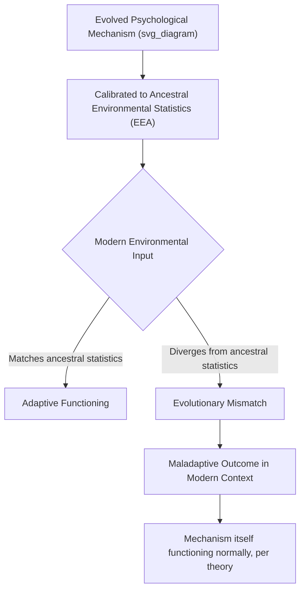

## Evolutionary Mismatch in Modern Environments

### Definition and Theoretical Foundation

Evolutionary mismatch (also termed "mismatch theory" or evolutionary discordance) refers to the phenomenon whereby psychological and physiological mechanisms that evolved as adaptive solutions to recurrent problems in ancestral environments produce maladaptive or dysfunctional outcomes when expressed in modern environments that differ substantially from the conditions under which those mechanisms evolved. The concept rests on the premise that natural selection shapes organisms to fit the statistical regularities of their evolutionary past, not their present circumstances, and that the pace of cultural and technological change in recent human history has vastly outstripped the pace of genetic evolutionary change.

**Key Points**

- Mismatch theory does not claim evolved mechanisms are inherently "broken"; rather, it proposes they are functioning as designed but are being triggered by, or applied to, inputs and contexts that differ systematically from ancestral conditions
- The "Environment of Evolutionary Adaptedness" (EEA) concept is central here, referring to the statistical composite of ancestral conditions under which a given mechanism evolved, distinguished from any single historical environment or time period
- Mismatch theory generates a distinctive class of predictions: that certain modern maladaptive outcomes (obesity, certain anxiety patterns, addiction, some social/political dysfunctions) may be best explained not as design flaws but as normal, "well-functioning" evolved mechanisms operating in evolutionarily novel contexts

### Formal Conceptual Structure

$$\text{Mismatch Severity} \propto \left| \text{Modern Environmental Input} - \text{Ancestral Environmental Input (EEA)} \right|$$

[Inference] This is a conceptual heuristic capturing the theory's core logic (greater divergence from ancestral conditions predicts greater mismatch-related dysfunction), not a validated quantitative formula used to generate precise numerical predictions in the empirical literature.

### Documented and Proposed Domains of Mismatch

#### Nutrition and Food Preference

The most widely cited and empirically grounded mismatch example: evolved preferences for calorie-dense foods (high sugar, fat, salt), theorized to have been adaptive in ancestral environments characterized by caloric scarcity and unpredictability, are proposed to produce maladaptive overconsumption in modern environments characterized by abundant, inexpensive, highly palatable processed food availability — a mismatch account frequently invoked in obesity and public health research.

**Key Points**

- This is among the more empirically supported and widely accepted mismatch applications, given clear documentation of both the ancestral food-scarcity context (via archaeological/paleoanthropological and contemporary hunter-gatherer comparative evidence) and the specific, measurable dietary-environment changes associated with industrialized food systems
- The mismatch framing has been applied in public health nutrition research to inform intervention design, though translating the theoretical account into effective behavioral intervention has proven complex, since the mismatch account explains *why* the preference exists without automatically specifying effective countermeasures

#### Social Comparison and Digital Media

Evolved social comparison psychology, theorized to have been calibrated to ancestral small-group contexts (in which an individual's realistic comparison set consisted of perhaps dozens to a few hundred known individuals), is proposed to produce mismatch-related dysfunction when applied to modern social media environments, which expose individuals to a vastly larger, algorithmically curated, and systematically upward-skewed comparison set (curated "highlight reel" content from thousands of loosely connected others).

**Key Points**

- This mismatch account is frequently invoked to explain documented associations between heavy social media use and elevated social comparison, envy, and reduced well-being, connecting directly to broader social comparison theory and envy research
- [Speculation] While the mismatch framing is theoretically plausible and widely cited in popular and some academic discussion of social media effects, direct causal evidence isolating "evolutionary mismatch" specifically (as opposed to other proposed mechanisms, such as algorithmic design features or simple time-displacement effects) as the operative causal pathway remains limited; this application should be treated as a generative theoretical framework rather than a decisively established causal account

#### Threat Detection and Anxiety

Evolved threat-detection systems (e.g., specific/preferential fear learning toward ancestrally-relevant threats such as snakes, spiders, and heights, well documented in fear-conditioning research) are theorized to be mismatched to modern threat landscapes, which are increasingly dominated by statistically more dangerous but evolutionarily novel threats (motor vehicle accidents, chronic disease risk, financial/economic threats) that do not reliably trigger the same evolved rapid-threat-detection and avoidance responses.

**Key Points**

- This asymmetry — disproportionate fear of ancestrally-salient but statistically rare modern threats (e.g., snake/spider phobias) alongside relative underreaction to statistically larger but evolutionarily novel modern risks (e.g., routine driving risk) — is a well-documented empirical pattern in risk-perception research, frequently explained via mismatch theory
- Some researchers extend this framework to modern anxiety and stress-response patterns more broadly, proposing that chronic modern stressors (financial pressure, work-related social evaluation threat) may chronically activate acute-threat-response physiological systems (e.g., cortisol/HPA-axis activation) that evolved for intermittent, acute ancestral threats, producing mismatch-related chronic stress pathology — though this broader extension is more theoretically speculative than the specific fear-conditioning findings

#### Social Group Size and Coalitional Psychology

Dunbar's Number — the proposed cognitive limit (commonly cited around 150, though estimates vary) on the number of stable social relationships an individual can maintain, derived from comparative primate neocortex-size research — has been applied within mismatch theory to propose that modern social environments (large organizations, cities, expansive online social networks) exceed the group-size parameters to which evolved human social cognition is calibrated, potentially contributing to documented patterns of reduced social cohesion, anonymity-linked behavior, and difficulty maintaining meaningful large-scale social coordination.

[Unverified] The precise numerical estimate of Dunbar's Number, its methodological derivation, and its direct applicability to specific modern social-dysfunction outcomes remain subjects of ongoing debate and refinement in the literature; the general mismatch logic (evolved social cognition calibrated to smaller ancestral group sizes) is more broadly accepted than any single specific numerical claim.

#### Reward Systems and Addiction

Evolved reward-system psychology (dopaminergic reinforcement mechanisms that evolved to reinforce adaptive behaviors such as eating, social bonding, and reproduction) is theorized to be mismatched to modern environments containing evolutionarily novel, highly potent artificial reward stimuli (processed foods, addictive substances, engineered digital/gaming reward-feedback loops, social media notification systems), proposed to produce supra-normal reward-system activation that ancestral selection pressures did not calibrate the system to resist.

**Key Points**

- This mismatch framing is widely invoked in addiction research and behavioral addiction studies (including research on gambling, gaming, and social media "engagement" design), connecting evolutionary mismatch theory directly to applied clinical and technology-design domains
- Technology design critique drawing on this framework (e.g., discussions of "persuasive design" and engineered engagement features) represents a significant applied extension of mismatch theory into contemporary public discourse about digital wellbeing and technology policy

### Methodological Challenges in Testing Mismatch Claims

**Key Points**

- **EEA specification difficulty**: Precisely characterizing the relevant ancestral environmental statistics for any given psychological mechanism requires archaeological, paleoanthropological, and comparative primatological evidence that is often incomplete or subject to ongoing scientific revision, creating genuine uncertainty in establishing the mismatch baseline against which "divergence" is measured
- **Circularity risk**: As with broader evolutionary psychology methodology, there is a risk of inferring the EEA baseline from the very modern outcome the theory is meant to explain, rather than independently establishing ancestral conditions and then deriving falsifiable predictions — a methodological concern requiring careful research design to avoid
- **Distinguishing mismatch from simple maladaptation or non-evolutionary causation**: Not every modern dysfunction with a plausible mismatch narrative necessarily has mismatch as its actual primary cause; alternative explanations (direct environmental toxicity, purely cultural/social causation unrelated to evolved mechanisms, individual pathology) must be considered and ruled out or weighted appropriately rather than assuming mismatch by default
- **Testability and falsifiability**: The strongest mismatch applications (e.g., nutrition/obesity) involve independently well-documented ancestral conditions and clear, measurable modern environmental change; weaker or more speculative applications (e.g., some social media and technology-design extensions) involve more inferential leaps and are correspondingly less rigorously testable in their current form

### Relationship to Broader Evolutionary Social Psychology Critiques

**Key Points**

- Evolutionary mismatch theory inherits and is subject to the same general critiques applied to evolutionary social psychology broadly (the "just-so story" critique, EEA-specification circularity concerns, adaptationist-reasoning caution associated with Gould and Lewontin's broader critique), with particular acuteness given the theory's reliance on precise characterization of ancestral conditions
- The theory is generally treated by careful practitioners as a generative heuristic for identifying candidate explanations worth empirical investigation, rather than a general-purpose explanatory tool applicable to any observed modern dysfunction without independent supporting evidence
- Mismatch theory intersects productively with public health, behavioral economics ("nudge" theory, which implicitly draws on some mismatch-adjacent logic regarding evolved decision-making heuristics interacting with modern choice architectures), and technology/design ethics, representing one of evolutionary social psychology's more direct applied/policy-relevant theoretical extensions

### Applied and Policy Implications

- **Public health nutrition policy**: Mismatch-informed obesity and dietary intervention research has influenced discussion of food environment regulation (e.g., policy debates around processed food marketing, school nutrition standards) grounded partly in mismatch-theoretic reasoning about evolved food preference calibration
- **Technology and platform design ethics**: Mismatch theory has been invoked in public and academic discourse regarding the ethical design of persuasive/addictive digital technologies, informing debates about platform accountability and digital wellbeing design standards
- **Clinical psychology and anxiety treatment**: Mismatch-informed accounts of preferential/prepared fear learning have informed exposure-therapy and anxiety-treatment research regarding which fears are more readily acquired and more resistant to extinction, with clinical relevance for treatment approach selection
- **Urban planning and social design**: Some applied work has drawn on Dunbar's-Number-adjacent mismatch reasoning to inform community design and organizational structure recommendations aimed at supporting meaningful social cohesion at scales more consistent with evolved social-cognitive capacity

### Common Methodological and Conceptual Pitfalls

**Key Points**

- Invoking mismatch theory as a default explanation for any modern dysfunction without independently establishing both the relevant ancestral baseline and the specific measurable modern environmental divergence, risking unfalsifiable post-hoc narrative construction
- Treating mismatch theory as implying evolved mechanisms are simply "wrong" or in need of being overridden, when the theory's proper framing is that the mechanisms are functioning as designed but are receiving evolutionarily novel input — a framing with different practical and ethical implications for intervention design
- Assuming precise, uncontested knowledge of ancestral environmental conditions (the EEA) when paleoanthropological and archaeological evidence for many specific claims remains incomplete, provisional, or actively debated within relevant source disciplines
- Applying mismatch theory to less-well-evidenced domains (e.g., some social media and technology applications) with the same confidence level as more rigorously established applications (e.g., nutrition/obesity), without adequately distinguishing the differing evidentiary strength across specific mismatch claims
- Overlooking that cultural evolution and rapid social/technological adaptation can, in some cases, generate compensatory behavioral or institutional responses to mismatch conditions, meaning mismatch effects are not necessarily fixed or permanently unaddressable through non-genetic means

### Related Topics

- Evolutionary theory applied to social behavior (broader theoretical framework)
- Environment of Evolutionary Adaptedness (EEA) and its specification challenges
- Globalization and cultural change (rapid environmental change relevant to mismatch)
- Envy, jealousy, and schadenfreude (social comparison mismatch applications)
- Reciprocal altruism and cooperation (large-scale modern cooperation as a mismatch-adjacent puzzle)
- Dunbar's Number and evolved social group-size cognition
- Behavioral addiction and reward-system research
- Public health and nutrition policy informed by evolutionary theory