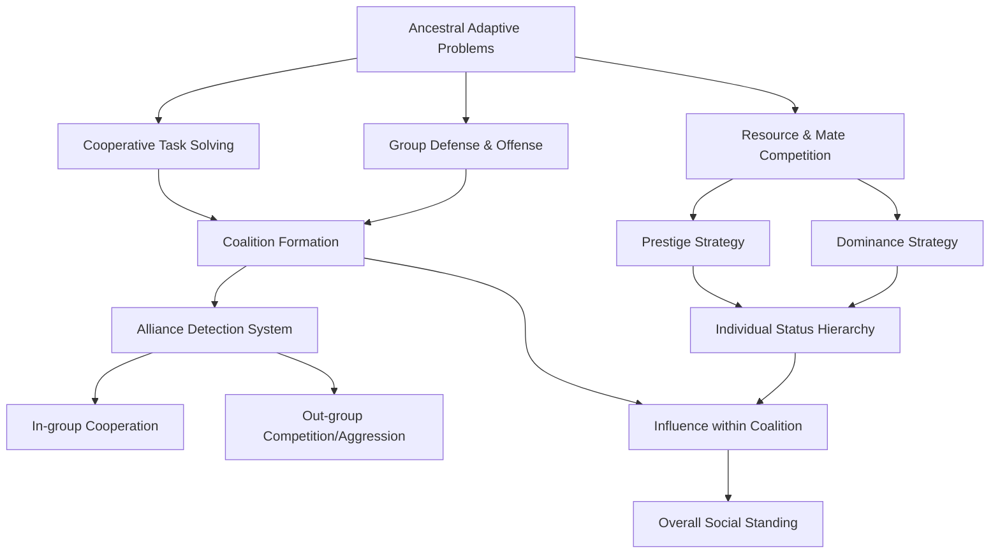

## Status, Dominance, and Coalition Psychology

### Overview

Status, dominance, and coalition psychology examines the evolved cognitive and motivational systems that govern how humans navigate social hierarchies, compete for resources and mates, and form cooperative alliances. These systems are treated by evolutionary social psychologists as adaptations shaped by recurrent challenges in ancestral environments: securing rank within a group, avoiding costly physical conflict, and leveraging group membership to achieve goals unattainable alone.

### Foundational Distinctions

#### Dominance vs. Prestige

Evolutionary psychologists distinguish two separate routes to high status, each with distinct psychological signatures.

- **Dominance**: Status acquired through the induction of fear, intimidation, or the credible threat of force or resource withdrawal. It relies on coercive power.
- **Prestige**: Status freely conferred by others in exchange for access to valued skills, knowledge, or wisdom. It relies on voluntary deference.

**Key Points**

- Dominance is phylogenetically older and shared with many non-human primate hierarchies.
- Prestige is argued to be a derived, possibly human-specific strategy tied to cultural transmission and cumulative culture.
- Both strategies can coexist within the same individual or group and are not mutually exclusive.
- Nonverbal displays differ: dominance is signaled via expansive posture, direct gaze, and lowered vocal pitch; prestige is signaled via being copied, consulted, and given unsolicited attention.

**Example**

A tribal leader who maintains authority through violent reprisal exemplifies dominance; a master craftsperson whom others voluntarily imitate and seek advice from exemplifies prestige.

#### The Dual Strategies Model

Henrich and Gil-White's dual strategies theory formalizes this distinction, proposing that both routes solve the adaptive problem of status allocation but differ in their underlying mechanics: dominance operates through asymmetries in the capacity to inflict costs, whereas prestige operates through asymmetries in the capacity to confer benefits (via information or skill).

### Status as an Evolved Motivational System

#### Why Status Matters Reproductively

Status correlated with differential access to resources, mates, and reproductive success across ancestral environments, particularly for males in most documented societies, though status effects on female reproductive outcomes are also observed, often mediated differently (e.g., via resource security or offspring survival rather than direct mating access).

**Key Points**

- Status-seeking is proposed as a near-universal human motive, not a culturally contingent preference.
- Sensitivity to relative rank appears early in development and cross-culturally, suggesting a canalized rather than purely learned motivational system.
- Status anxiety and status-related emotions (pride, shame, envy, admiration) function as internal regulators that adjust behavior based on perceived rank.

#### The Status Detection System

[Inference] Researchers propose that humans possess evolved cognitive mechanisms for rapidly assessing relative status from minimal cues (posture, speech patterns, resource displays, group deference patterns), though the precise computational architecture of this system remains an active area of modeling rather than settled fact.

### Dominance Psychology

#### Physical Formidability and Social Rank

A body of research links perceived physical formidability (upper body strength, height, vocal pitch) to self-assessed entitlement to social influence and to third-party judgments of who "should" prevail in a conflict of interest.

**Key Points**

- Studies using strength measures (e.g., bicep circumference, grip strength) find associations with support for status-relevant attitudes, including endorsement of one's own entitlement to resources.
- This is theorized as a residue of ancestral conflict resolution, where physical formidability predicted the likely outcome of direct confrontation.
- [Unverified] The generalizability of these findings across all cultural and economic contexts is contested, and effect sizes in some replications are modest.

#### Dominance Displays and Signals

Nonverbal dominance signaling follows a recognizable cross-species pattern: postural expansion, direct or sustained eye contact, vocal pitch lowering, and space occupation. Submission displays are the behavioral mirror: postural contraction, gaze aversion, and vocal pitch raising.

**Example**

In negotiation research, participants adopting expansive ("power") postures before a high-stakes interaction reported feeling more powerful and were rated by observers as more dominant, although [Unverified] downstream hormonal claims from early power-posing research (e.g., testosterone/cortisol shifts) failed to replicate in several subsequent studies and should be treated cautiously.

#### Testosterone and the Challenge Hypothesis

The challenge hypothesis, originally developed in avian behavioral endocrinology and extended to humans, proposes that testosterone rises in anticipation of and following status contests, particularly competitive wins, and that this rise facilitates continued status-seeking and mating effort.

**Key Points**

- Winner effects: testosterone often rises further in winners of competitive encounters relative to losers.
- [Inference] The behavioral consequence of these hormonal shifts is theorized to be increased confidence and readiness for further competition, though causal pathways from hormone to behavior in humans are difficult to isolate experimentally.
- Base testosterone levels correlate with dominance-related behaviors in some but not all studies; findings are moderated by social context, dominance-versus-prestige orientation, and individual differences.

### Coalition Psychology

#### The Adaptive Logic of Coalitions

Coalitional psychology addresses how humans form, maintain, and mentally represent group alliances. Ancestral survival and reproductive success depended heavily on the ability to recruit allies, since individual formidability alone was rarely sufficient against organized group threats.

**Key Points**

- Coalitions solve problems individuals cannot solve alone: collective defense, resource acquisition, mate guarding, and punishment of defectors.
- Coalition size and cohesion historically substituted for individual physical strength as a determinant of competitive success.
- Humans appear to possess a specialized cognitive system for rapidly encoding social alliance structure — who is aligned with whom.

#### Automatic Coalition Categorization

Experimental work using the "who said what" memory-confusion paradigm demonstrates that people spontaneously encode coalitional alliance (e.g., team membership signaled by shirt color or debate position) as a categorization dimension comparable in strength to race or sex, and that this encoding can be reduced when race no longer tracks coalition.

**Key Points**

- This finding is used to argue that race-based categorization in humans may be a byproduct of a more general, evolved alliance-detection system rather than an adaptation specifically "for" detecting race.
- Coalitional cues that reliably predicted alliance in the current social environment (shared markers, coordinated behavior, shared enemies) can override or attenuate default categorization by more visible but less socially predictive cues.
- [Inference] This suggests coalition-tracking mechanisms are highly sensitive to real-time social information rather than fixed to superficial phenotypic markers, though the boundary conditions of this malleability are still being mapped.

#### Markers of Coalition Membership

Coalitions are typically signaled and reinforced through:

- Shared dialect, slang, or linguistic style
- Synchronized behavior (music, ritual, movement) that increases perceived bond strength
- Costly signals of commitment (rituals, sacrifices, visible markers) that deter free-riders and signal genuine loyalty
- Explicit or implicit third-party recognition of "who belongs"

#### Coalitional Aggression

Evolutionary models propose that intergroup aggression follows a different logic than interindividual aggression, because coalitional conflict allows numerical advantage to substitute for individual risk, changing the cost-benefit calculus of initiating violence.

**Key Points**

- The "imbalance of power" hypothesis (drawn from both primatology and anthropology) suggests coalitions are more willing to initiate lethal aggression when they can achieve a decisive numerical or tactical advantage, minimizing individual risk.
- This is proposed to explain patterns of raiding in small-scale societies, where attacks are disproportionately carried out against isolated or outnumbered targets.
- [Unverified] The extent to which modern human intergroup conflict directly reflects these ancestral dynamics versus being substantially reshaped by institutional, economic, and technological factors is a matter of ongoing debate among evolutionary anthropologists and political scientists.

### Sex Differences in Status and Coalition Strategies

**Key Points**

- Male status competition has been more heavily studied in relation to physical dominance hierarchies and coalitional aggression, consistent with sexual selection theory predicting greater variance in male reproductive success historically.
- Female status competition is documented as frequently operating through indirect aggression (reputational and relational strategies) and through mate-guarding-relevant social comparison, particularly around attractiveness.
- [Inference] These patterns are typically explained via parental investment theory and differing ancestral payoff structures for male versus female competitive strategies, though critics note substantial cross-cultural variability and caution against overgeneralizing from Western samples.
- Coalition formation strategies also show documented sex differences: male coalitions in many studied societies tend to be larger and more hierarchically structured, while female alliances are often smaller and based on dyadic reciprocity — though exceptions are well documented and this is not a strict universal.

### Integrating Status and Coalition Psychology

Status and coalition systems interact bidirectionally: individual status within a coalition affects influence over group decisions, while coalition membership affects an individual's overall status relative to out-group members and non-aligned individuals.

### Diagram: Dominance vs. Prestige Signaling (svg_diagram)

<svg xmlns="http://www.w3.org/2000/svg" viewBox="0 0 760 360">
<text x="380" y="30" text-anchor="middle" font-size="18" font-weight="bold" fill="#222">Dominance vs. Prestige Status Routes (svg_diagram)</text>
<rect x="40" y="70" width="300" height="240" rx="10" fill="#fbeaea" stroke="#c0392b" stroke-width="2" />
<text x="190" y="100" text-anchor="middle" font-size="16" font-weight="bold" fill="#c0392b">Dominance</text>
<text x="190" y="130" text-anchor="middle" font-size="13" fill="#333">Mechanism: Coercion / Threat</text>
<text x="190" y="155" text-anchor="middle" font-size="13" fill="#333">Signal: Expansive posture,</text>
<text x="190" y="173" text-anchor="middle" font-size="13" fill="#333">direct gaze, low pitch</text>
<text x="190" y="200" text-anchor="middle" font-size="13" fill="#333">Deference type: Fear-based</text>
<text x="190" y="225" text-anchor="middle" font-size="13" fill="#333">Stability: Contested,</text>
<text x="190" y="243" text-anchor="middle" font-size="13" fill="#333">requires ongoing enforcement</text>
<text x="190" y="270" text-anchor="middle" font-size="13" fill="#333">Phylogenetic origin:</text>
<text x="190" y="288" text-anchor="middle" font-size="13" fill="#333">Shared with primates</text>
<rect x="420" y="70" width="300" height="240" rx="10" fill="#eaf3fb" stroke="#2471a3" stroke-width="2" />
<text x="570" y="100" text-anchor="middle" font-size="16" font-weight="bold" fill="#2471a3">Prestige</text>
<text x="570" y="130" text-anchor="middle" font-size="13" fill="#333">Mechanism: Skill / Knowledge</text>
<text x="570" y="155" text-anchor="middle" font-size="13" fill="#333">Signal: Being copied,</text>
<text x="570" y="173" text-anchor="middle" font-size="13" fill="#333">consulted, attended to</text>
<text x="570" y="200" text-anchor="middle" font-size="13" fill="#333">Deference type: Voluntary</text>
<text x="570" y="225" text-anchor="middle" font-size="13" fill="#333">Stability: Freely granted,</text>
<text x="570" y="243" text-anchor="middle" font-size="13" fill="#333">can be withdrawn without cost</text>
<text x="570" y="270" text-anchor="middle" font-size="13" fill="#333">Phylogenetic origin:</text>
<text x="570" y="288" text-anchor="middle" font-size="13" fill="#333">Possibly human-derived</text>
<line x1="340" y1="190" x2="420" y2="190" stroke="#555" stroke-width="2" marker-end="url(#arrow)" />
<text x="380" y="180" text-anchor="middle" font-size="11" fill="#555">Both grant</text>
<text x="380" y="215" text-anchor="middle" font-size="11" fill="#555">social rank</text>
</svg>

### Common Methodological Approaches

**Key Points**

- Cross-cultural ethnographic comparison (small-scale societies vs. industrialized populations) to test universality claims.
- Hormonal assays (testosterone, cortisol) paired with competitive or status-relevant tasks.
- Implicit categorization paradigms (e.g., memory-confusion "who said what" tasks) to probe automatic coalition encoding.
- Vignette and rating studies assessing perceived dominance/prestige from photographs, voice recordings, or behavioral descriptions.
- Minimal group paradigms to isolate coalition formation from pre-existing social categories such as race or ethnicity.

### Critiques and Open Debates

**Key Points**

- [Speculation] Some critics argue that the dominance/prestige dichotomy may oversimplify a more continuous or multidimensional status space, though this remains a theoretical position rather than an established finding.
- The universality of physical-formidability-to-entitlement links is debated, with some cross-cultural replications showing weaker or null effects outside the original sampled populations.
- Power-posing and some early testosterone-behavior findings have faced replication difficulties, underscoring the need to treat specific hormonal or postural claims with appropriate caution even while the broader dominance/prestige framework remains influential.
- Ecological validity concerns: laboratory status manipulations (e.g., brief competitive games) may not fully capture the stakes and duration of ancestral or real-world status competition.

### Conclusion

Status, dominance, and coalition psychology together form a core pillar of evolutionary social psychology, explaining hierarchical and group-based social behavior as solutions to recurrent ancestral problems: securing rank via coercion or earned respect, and forming alliances to achieve outcomes unreachable alone. The dominance-prestige distinction and coalitional psychology framework have generated substantial empirical support, though specific mechanistic claims (hormonal pathways, postural effects) require continued scrutiny given mixed replication outcomes.

**Related Topics**

- Parental investment theory and sexual selection
- Costly signaling theory and honest signals
- Minimal group paradigm and social identity theory
- In-group/out-group bias and intergroup threat theory
- Reputation management and indirect reciprocity
- Testosterone, cortisol, and the biosocial model of status
- Cross-cultural variation in hierarchy (egalitarian vs. stratified societies)
- Ostracism and social exclusion psychology
- Leadership emergence and followership psychology
- Warfare and coalitional aggression in small-scale societies