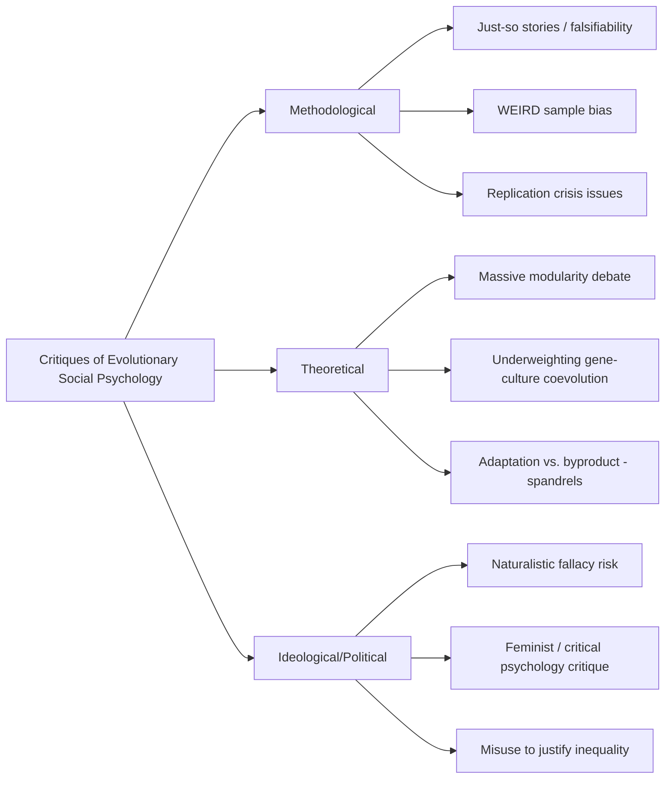

## Critiques of Evolutionary Social Psychology

### Overview

Evolutionary social psychology (ESP), including its parent framework evolutionary psychology (EP), has faced sustained methodological, theoretical, and philosophical criticism since its emergence in the late 20th century. These critiques span concerns about falsifiability, methodological rigor, ideological consequences, and the specific evidentiary basis of the framework's central constructs. Understanding these critiques is necessary for a balanced assessment of the field's claims.

### The "Just-So Story" Critique

#### Core Argument

The most enduring critique, associated with Stephen Jay Gould and Richard Lewontin's broader critique of adaptationism, holds that evolutionary explanations of psychological traits are often post hoc narratives constructed to fit an observed behavior, rather than predictions derived from independently testable theory.

**Key Points**

- A "just-so story" refers to a plausible-sounding adaptive explanation invented after the fact, named after Rudyard Kipling's fictional origin tales.
- Critics argue that because almost any behavior can be given a plausible adaptive rationale, the explanatory framework risks unfalsifiability: whatever behavior is observed, a story can be constructed to explain why it would have been adaptive.
- Proponents respond that this critique applies to poorly conducted evolutionary psychology, not to the method in principle, and that well-designed studies generate a priori, falsifiable predictions before data collection (e.g., predicting a specific cross-cultural pattern in advance).

**Example**

A critic might argue that if men were found to prefer taller women rather than shorter women, an alternative adaptive story could just as easily be constructed post hoc, illustrating the flexibility concern.

#### The Falsifiability Problem

[Inference] Philosophers of science who apply Popperian falsifiability criteria to ESP claims often note that the discipline's core assumption — that a trait exists because it was adaptive in the ancestral environment — is difficult to test directly, since the ancestral environment (the Environment of Evolutionary Adaptedness, or EEA) cannot be directly observed and must be reconstructed from indirect evidence (archaeology, comparative primatology, hunter-gatherer analogy).

**Key Points**

- The EEA is not a single time and place but a statistical composite of selection pressures across the Pleistocene, making precise reconstruction inherently difficult.
- Critics argue this indeterminacy allows considerable latitude in which ancestral pressures are invoked to explain a given modern trait.
- Defenders argue that convergent evidence across cross-species comparison, cross-cultural universality, and physiological mechanisms can constrain hypotheses even without direct EEA observation.

### Methodological Critiques

#### WEIRD Sample Bias

A substantial portion of evolutionary social psychology research has relied on samples from Western, Educated, Industrialized, Rich, and Democratic (WEIRD) populations, predominantly undergraduate students, despite the field's claims of universality.

**Key Points**

- Henrich, Heine, and Norenzayan's influential 2010 analysis argued that WEIRD populations are frequent outliers on numerous psychological and behavioral dimensions rather than representative humans.
- This creates a tension for a discipline whose core claims are about species-typical, universal human psychology, since generalizing from a narrow, atypical sample undermines universality claims.
- Some cross-cultural evolutionary psychology research (e.g., studies of mate preferences across dozens of countries) has attempted to address this, though sampling remains uneven across world regions, and non-WEIRD samples are still underrepresented relative to global population diversity.

#### Publication Bias and the Replication Crisis

Evolutionary social psychology has not been immune to the broader replication crisis affecting social psychology, and several prominent findings associated with or adjacent to the field have faced replication difficulties.

**Key Points**

- Power posing and some associated hormonal claims (testosterone/cortisol shifts from postural manipulation) failed to replicate in multiple subsequent studies with larger samples.
- Some ovulatory cycle shift findings (claims that women's mate preferences, voting behavior, or clothing choices shift across the menstrual cycle) have shown inconsistent replication and have been criticized for small sample sizes, flexible analytic choices, and inconsistent operationalization of fertility windows across studies.
- [Unverified] The proportion of the field's overall literature affected by these issues, versus the proportion representing robust, replicated findings, is difficult to quantify precisely and varies significantly by specific research subdomain.
- Critics argue that evolutionary framing can sometimes lend unwarranted authority to otherwise weak findings, because an adaptive narrative can make a marginal effect feel more theoretically grounded than the statistical evidence supports.

#### Reverse Inference and Adaptationist Assumptions

Critics, including some evolutionary biologists, argue that ESP research sometimes assumes a trait is an adaptation and then searches for confirming evidence, rather than rigorously testing adaptation against alternative explanations (byproduct, genetic drift, cultural transmission, or domain-general learning mechanisms).

**Key Points**

- Gould and Lewontin's "spandrels" critique (drawing an architectural analogy) argued that some traits are non-adaptive byproducts of other adaptations or of developmental/structural constraints, not independently selected features.
- Distinguishing a true adaptation from a byproduct or exaptation requires specific evidentiary standards (e.g., evidence of special design, cross-species comparison, heritability data) that critics argue are inconsistently applied across the ESP literature.
- Defenders of the field (e.g., Tooby and Cosmides) have proposed formal criteria for identifying adaptations, arguing that rigorous application of these criteria distinguishes legitimate evolutionary psychology from the loosely reasoned criticisms it is sometimes associated with.

### Theoretical and Conceptual Critiques

#### The Massive Modularity Debate

Evolutionary psychology, particularly the Tooby and Cosmides tradition, has proposed that the mind consists largely of numerous domain-specific cognitive modules, each shaped by selection to solve a particular ancestral adaptive problem. This "massive modularity" thesis is contested.

**Key Points**

- Critics, including some cognitive scientists, argue for greater emphasis on domain-general learning mechanisms, arguing the modularity thesis overstates specialization and understates the brain's plasticity and general-purpose reasoning capacity.
- [Speculation] Some critics further suggest that the modularity framework is difficult to falsify because module boundaries can be redrawn to accommodate new findings, though this specific claim remains a point of ongoing philosophical dispute rather than a settled conclusion.
- Proponents counter that neuroscientific and developmental evidence (e.g., double dissociations, domain-specific deficits following brain injury, early-emerging domain-specific biases in infants) supports at least moderate modularity, even if "massive" modularity in its strongest form remains debated.

#### Gene-Culture Coevolution and Underestimating Plasticity

Critics argue that some evolutionary psychology work underweights the role of cultural transmission, learning, and phenotypic plasticity relative to genetically canalized psychological mechanisms.

**Key Points**

- Gene-culture coevolution theorists (e.g., Boyd and Richerson) argue that culture itself is a powerful, fast-acting evolutionary force that can override or substantially modify genetically inherited predispositions within a few generations.
- Critics contend that some ESP explanations treat behavior as more "hardwired" than warranted, given the demonstrated cross-cultural variability in many domains ESP predicts should show uniformity.
- [Inference] This tension is partially reconciled by researchers who frame evolved mechanisms as facultative and context-sensitive (producing different outputs depending on environmental input) rather than rigidly fixed, though disagreement remains about how much cross-cultural variability this framing can plausibly accommodate before losing explanatory force.

### Ideological and Political Critiques

#### Naturalistic Fallacy Concerns

A recurring concern is that evolutionary explanations of behaviors such as male aggression, status competition, or sex differences in mating strategies can be misused to justify or naturalize existing social inequalities or behaviors as inevitable or morally acceptable.

**Key Points**

- The naturalistic fallacy refers to the invalid inference that because a trait is natural or evolved, it is therefore good, justified, or unchangeable.
- Critics have raised concern that some popularized (not necessarily academic) interpretations of ESP findings have been used to rationalize gender inequality, sexual coercion, or discriminatory social policy.
- Mainstream evolutionary psychologists explicitly reject this inference, stating that identifying an evolved predisposition says nothing about its moral status or about whether it should be culturally constrained, and that describing a tendency is not equivalent to endorsing it.

#### Feminist and Critical Psychology Critiques

Feminist psychologists and critical psychologists have critiqued specific ESP research programs, particularly around sex differences in mating psychology and aggression, arguing that some studies embed unexamined cultural assumptions about gender roles into their hypotheses and interpretations.

**Key Points**

- Critics argue that some parental investment theory-derived predictions (e.g., about female choosiness or male promiscuity) can reflect and reinforce, rather than neutrally describe, contemporary gender stereotypes.
- Concerns have also been raised about how findings on sex differences are selectively popularized in media, often stripped of the nuance, effect-size caveats, and within-sex variability present in the original research.
- [Unverified] Whether these critiques identify a systemic flaw in the theoretical framework itself versus a problem of selective research emphasis, popularization, and methodology within specific studies is actively debated between evolutionary psychologists and their critics, without clear field-wide resolution.

### Alternative Frameworks Offered by Critics

**Key Points**

- **Social role theory** (Eagly and Wood) proposes that many observed sex differences arise primarily from the distribution of men and women into different social roles across history (shaped by physical sex differences interacting with subsistence technology and social structure) rather than from directly selected psychological dispositions.
- **Biosocial construction models** attempt to integrate biological predispositions with social-structural explanations, treating them as interacting rather than competing accounts.
- **Cultural evolutionary theory** offers an alternative or complementary account in which behavior patterns are transmitted, selected, and modified through social learning processes operating on cultural (not only genetic) variation.
- Critics generally do not argue for a wholesale rejection of evolutionary influence on psychology, but for greater weighting of cultural, developmental, and social-structural factors alongside, rather than subordinate to, evolved mechanisms.

### Defenses and the Field's Response

**Key Points**

- Proponents argue that the discipline has matured methodologically, increasingly emphasizing pre-registered hypotheses, larger and more diverse cross-cultural samples, and explicit a priori predictions to address the just-so story critique.
- The distinction between dominance and prestige, discussed in the preceding topic, is often cited by defenders as an example of a testable, cross-culturally validated framework rather than a post hoc narrative, since it generates falsifiable predictions confirmed across multiple independent samples.
- Defenders argue that critiques targeting popularized or poorly conducted studies should not be generalized to invalidate the theoretical core of evolutionary psychology, just as poorly conducted studies in any discipline do not invalidate that discipline's foundational logic.
- [Inference] The overall trajectory of the field is frequently characterized by both proponents and moderate critics as one of increasing methodological rigor, though disagreement persists over how much of the earlier critique remains applicable to current practice.

### Summary Comparison of Major Critique Lines

### Conclusion

Critiques of evolutionary social psychology target the field at multiple levels: the logical structure of adaptive explanation (just-so stories, falsifiability), the empirical rigor of its evidence base (WEIRD samples, replication concerns), its core theoretical commitments (modularity, adaptationism versus byproduct explanations), and its social and political implications (naturalistic fallacy, feminist critique). These critiques have shaped the field's methodological evolution toward greater rigor, though substantive disagreement remains between evolutionary psychologists and their critics regarding how much explanatory weight evolved psychological mechanisms should carry relative to cultural, developmental, and social-structural factors.

**Related Topics**

- Falsifiability and the philosophy of science (Popper, Lakatos)
- Gould and Lewontin's spandrels argument in evolutionary biology
- The replication crisis in social psychology
- WEIRD populations and cross-cultural psychology methodology
- Social role theory (Eagly and Wood)
- Gene-culture coevolution theory (Boyd and Richerson)
- Naturalistic fallacy in moral philosophy
- Sexual selection theory and its critics
- Pre-registration and open science practices in psychology
- History and origins of sociobiology (E.O. Wilson) and the sociobiology controversy