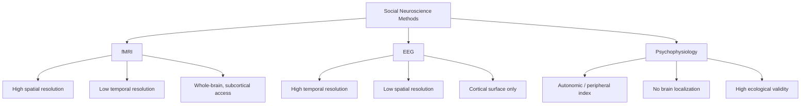

## Methods: fMRI, EEG, and Psychophysiology

### Overview

Social neuroscience relies on a toolkit of methods that measure neural and physiological activity to test hypotheses about the biological substrates of social cognition and behavior. The three dominant method families — functional magnetic resonance imaging (fMRI), electroencephalography (EEG), and peripheral psychophysiology — offer complementary tradeoffs in spatial resolution, temporal resolution, invasiveness, cost, and ecological validity. No single method is sufficient on its own; methodological triangulation across techniques is standard practice in the field.

### Functional Magnetic Resonance Imaging (fMRI)

#### Basic Principle

fMRI measures the blood-oxygen-level-dependent (BOLD) signal, an indirect proxy for neural activity based on the relationship between local neural firing, metabolic demand, and compensatory increases in oxygenated blood flow to active brain regions.

**Key Points**

- Neural activation increases local metabolic demand, which triggers a disproportionate local increase in oxygenated blood flow (the hemodynamic response), altering the ratio of oxygenated to deoxygenated hemoglobin.
- Oxygenated and deoxygenated hemoglobin have different magnetic properties (diamagnetic vs. paramagnetic respectively), which the MRI scanner detects as a signal change.
- The hemodynamic response is slow relative to actual neural firing, peaking approximately 4 to 6 seconds after stimulus onset and returning to baseline over roughly 10 to 12 seconds, which fundamentally limits fMRI's temporal resolution.

#### Strengths and Limitations

**Key Points**

- Strength: High spatial resolution, typically on the order of 1 to 3 millimeters with standard field-strength scanners (3 Tesla), allowing localization of activity to specific cortical and subcortical structures.
- Strength: Whole-brain coverage in a single session, enabling identification of distributed networks rather than single regions.
- Limitation: Poor temporal resolution relative to the millisecond timescale of neural processing, since the BOLD response is a delayed and smoothed proxy for underlying neural events.
- Limitation: Correlational by default; activation in a region during a task does not establish that the region is necessary for the process, which is why fMRI findings are often paired with lesion studies or non-invasive stimulation (TMS, tDCS) to test necessity.
- Limitation: Reverse inference risk — inferring a specific psychological state from activation in a region (e.g., "the amygdala activated, therefore fear was present") is logically problematic because most brain regions are not exclusively dedicated to a single psychological function.
- Limitation: Confined, supine, noisy scanner environment constrains ecological validity for genuinely interactive social behavior, though hyperscanning and naturalistic stimulus designs partially address this.

#### Common Social Neuroscience fMRI Paradigms

**Key Points**

- **Social exclusion paradigms** (e.g., Cyberball, a virtual ball-tossing game) used to study neural correlates of social pain and rejection, commonly implicating regions such as the anterior insula and dorsal anterior cingulate cortex.
- **Theory of mind / mentalizing tasks** used to probe regions including the medial prefrontal cortex, temporoparietal junction, and precuneus.
- **Person perception and face processing tasks** used to study the fusiform face area, amygdala, and superior temporal sulcus.
- **Economic exchange games** (e.g., Trust Game, Ultimatum Game, Dictator Game) used to study reward, fairness, and cooperation-related activity in regions such as the ventral striatum, insula, and prefrontal cortex.
- **Hyperscanning**, wherein two or more participants are scanned simultaneously (in separate scanners, synchronized) during live interaction, used to study inter-brain synchrony during cooperation or communication.

#### Analysis Considerations

**Key Points**

- Preprocessing typically includes motion correction, slice-timing correction, spatial normalization to a standard template (e.g., MNI space), and spatial smoothing.
- General Linear Model (GLM) approaches remain the dominant statistical framework for estimating condition-related activation at the individual and group level.
- Multivariate pattern analysis (MVPA) and representational similarity analysis (RSA) are increasingly used to decode distributed activation patterns rather than relying solely on univariate region-of-interest activation.
- [Unverified] The well-publicized 2016 cluster-inference software bug controversy (concerning inflated false-positive rates in some older fMRI cluster-correction pipelines) prompted substantial methodological reform in the field; the precise scope of affected prior literature remains debated, and current best practice strongly favors more conservative statistical thresholding and pre-registration.

### Electroencephalography (EEG)

#### Basic Principle

EEG measures electrical activity generated by synchronized postsynaptic potentials in populations of cortical pyramidal neurons, recorded via electrodes placed on the scalp.

**Key Points**

- The signal reflects summed electrical activity from large populations of similarly oriented neurons (primarily in cortical layers close to the scalp), not activity from single neurons or deep subcortical structures.
- Temporal resolution is on the order of milliseconds, making EEG well-suited to tracking the fast unfolding of cognitive and social processes in real time.
- Spatial resolution is comparatively poor (centimeters, not millimeters), because the skull and scalp disperse electrical signals before they reach the electrodes, a phenomenon referred to as volume conduction.

#### Event-Related Potentials (ERPs)

ERPs are voltage fluctuations time-locked to a specific stimulus or response event, extracted by averaging EEG signal across many trials to isolate the consistent, stimulus-related signal from background neural noise.

**Key Points**

- **N170**: A negative deflection around 170 milliseconds post-stimulus, strongly associated with face processing and used to study rapid face detection and configural processing in social cognition research.
- **P300 (P3)**: A positive deflection around 300 milliseconds, associated with attention allocation and stimulus evaluation, used in social categorization and social salience research.
- **Error-Related Negativity (ERN)**: A negative deflection following an erroneous response, linked to performance monitoring and studied in relation to social evaluation sensitivity.
- **Late Positive Potential (LPP)**: A sustained positive deflection reflecting elaborated emotional or motivational processing of a stimulus, commonly used in studies of emotional and social stimulus evaluation.

**Example**

In an ostracism study, an ERP researcher might time-lock EEG recordings to the moment a participant is excluded from a virtual game, examining LPP amplitude as an index of the emotional salience of the exclusion event.

#### Time-Frequency and Oscillatory Analysis

**Key Points**

- Beyond ERPs, EEG signals are decomposed into oscillatory frequency bands: delta (0.5 to 4 Hz), theta (4 to 8 Hz), alpha (8 to 12 Hz), beta (12 to 30 Hz), and gamma (30+ Hz).
- Frontal alpha asymmetry (relative left versus right frontal alpha power) has been used as an index of approach versus avoidance motivational states in social and emotional contexts, though [Unverified] the reliability and specificity of this measure as a trait-level individual difference marker has been questioned in more recent methodological reviews.
- Mu rhythm suppression (in the alpha-range over sensorimotor cortex) is used as a putative index of the human mirror neuron system's engagement during action observation and imitation, though [Inference] the direct mapping between mu suppression and "mirror neuron" activity specifically, as opposed to broader sensorimotor engagement, remains a matter of interpretive debate rather than settled consensus.

#### Strengths and Limitations

**Key Points**

- Strength: Millisecond-level temporal precision allows fine-grained tracking of rapid social-cognitive processes (e.g., automatic versus controlled evaluation stages).
- Strength: Relatively low cost, high portability, and greater tolerance of participant movement compared to fMRI, enabling more naturalistic or field-based data collection.
- Limitation: Poor spatial localization; source localization techniques (e.g., dipole modeling, beamforming) can estimate underlying generators but with substantially more uncertainty than fMRI.
- Limitation: Susceptible to muscle and eye-movement artifacts, requiring careful artifact rejection or correction (e.g., independent component analysis, or ICA).
- Limitation: Limited sensitivity to deep subcortical structures (e.g., amygdala, striatum) that are of central interest to many social neuroscience questions.

### Peripheral Psychophysiology

#### Overview

Psychophysiological measures record activity in the autonomic nervous system and peripheral musculature as indices of emotional, attentional, and motivational states relevant to social behavior, without directly measuring central nervous system activity.

#### Common Measures

**Key Points**

- **Electrodermal activity (EDA)**, also called skin conductance response (SCR) or galvanic skin response (GSR), measures sympathetic nervous system arousal via changes in sweat gland activity, used as a general index of physiological arousal or emotional intensity (not valence).
- **Heart rate (HR) and heart rate variability (HRV)** reflect combined sympathetic and parasympathetic nervous system activity; HRV in particular is used as an index of self-regulatory capacity and parasympathetic ("vagal") tone relevant to social stress and emotion regulation research.
- **Facial electromyography (fEMG)** measures electrical activity in facial muscles (commonly the zygomaticus major, associated with smiling, and corrugator supercilii, associated with frowning) to index affective valence, including responses too subtle for visible observation.
- **Cortisol** (typically assayed from saliva) serves as a biomarker of hypothalamic-pituitary-adrenal (HPA) axis activation, used as an index of physiological stress response in social stressor paradigms.
- **Pupillometry** measures pupil dilation as an index of cognitive load, arousal, and attentional engagement, increasingly used in social attention and person-perception research.
- **Startle eyeblink reflex modulation** (typically measured via EMG at the orbicularis oculi in response to a sudden acoustic probe) is used to index affective valence, since the reflex is potentiated during negative affective states and attenuated during positive ones.

#### Standardized Social Stress Paradigm

The Trier Social Stress Test (TSST), involving a public speaking and mental arithmetic task performed in front of evaluative judges, is the most widely used standardized paradigm for inducing measurable social-evaluative stress, commonly paired with cortisol, HR, and HRV measurement.

**Key Points**

- The TSST reliably elicits significant cortisol and cardiovascular reactivity in the majority of studied samples, making it a benchmark paradigm for social stress research.
- [Inference] Individual differences in TSST reactivity are frequently used as markers of stress vulnerability or resilience, though the stability of these individual differences across repeated administrations and contexts is an area of continued methodological investigation.

#### Strengths and Limitations

**Key Points**

- Strength: Low cost, high portability, and strong ecological validity, since measures can be taken in naturalistic or field settings outside the laboratory.
- Strength: Directly captures autonomic and peripheral processes relevant to embodied emotional and social responses that neuroimaging cannot directly access.
- Limitation: Cannot localize activity to specific brain structures, offering only indirect and non-specific inference about central nervous system processes.
- Limitation: Autonomic measures are influenced by numerous non-social confounds (physical activity, caffeine, medication, circadian timing, respiration), requiring careful experimental control.

### Comparative Summary

### Diagram: Spatial vs. Temporal Resolution Tradeoff (svg_diagram)

<svg xmlns="http://www.w3.org/2000/svg" viewBox="0 0 700 420">
<text x="350" y="30" text-anchor="middle" font-size="18" font-weight="bold" fill="#222">Spatial vs. Temporal Resolution (svg_diagram)</text>
<line x1="80" y1="360" x2="650" y2="360" stroke="#333" stroke-width="2" />
<line x1="80" y1="360" x2="80" y2="60" stroke="#333" stroke-width="2" />

<text x="365" y="395" text-anchor="middle" font-size="13" fill="#333">Temporal Resolution (fast → slow)</text>

<text x="35" y="210" text-anchor="middle" font-size="13" fill="#333" transform="rotate(-90 35 210)">Spatial Resolution (coarse → fine)</text>

<text x="90" y="378" font-size="11" fill="#555">ms</text>

<text x="620" y="378" font-size="11" fill="#555">sec</text>

<text x="65" y="355" font-size="11" fill="#555" text-anchor="end">cm</text>

<text x="65" y="75" font-size="11" fill="#555" text-anchor="end">mm</text>

<circle cx="150" cy="300" r="45" fill="#f9e79f" stroke="#b7950b" stroke-width="2" opacity="0.85" />
<text x="150" y="305" text-anchor="middle" font-size="14" font-weight="bold" fill="#7d6608">EEG</text>
<circle cx="500" cy="110" r="55" fill="#aed6f1" stroke="#2471a3" stroke-width="2" opacity="0.85" />
<text x="500" y="115" text-anchor="middle" font-size="14" font-weight="bold" fill="#1a5276">fMRI</text>
<circle cx="280" cy="330" r="40" fill="#a9dfbf" stroke="#1e8449" stroke-width="2" opacity="0.85" />
<text x="280" y="328" text-anchor="middle" font-size="12" font-weight="bold" fill="#186a3b">Psycho-</text>
<text x="280" y="342" text-anchor="middle" font-size="12" font-weight="bold" fill="#186a3b">physiology</text>
</svg>

### Multimodal and Integrative Approaches

**Key Points**

- **Simultaneous EEG-fMRI** combines EEG's temporal precision with fMRI's spatial precision, though technically demanding due to MRI-induced artifacts in the EEG signal (gradient and ballistocardiogram artifacts) that require specialized correction.
- **fNIRS (functional near-infrared spectroscopy)**, while not explicitly named in the three core methods, is increasingly used as a complementary hemodynamic measure tolerant of movement, useful for hyperscanning and naturalistic social interaction studies.
- Combining central (fMRI, EEG) and peripheral (psychophysiology) measures within a single study allows researchers to link brain activity to bodily response, strengthening causal and mechanistic interpretation of social-affective processes.
- [Inference] The field's overall trajectory favors multimodal designs over single-method studies, since triangulating measures with complementary strengths mitigates the specific weaknesses of any one technique, though single-method studies remain common due to cost and logistical constraints.

### Conclusion

fMRI, EEG, and psychophysiological methods form the methodological backbone of social neuroscience, each offering a distinct window onto the neural and bodily processes underlying social cognition and behavior. fMRI provides precise spatial localization at the cost of temporal resolution; EEG provides millisecond-level temporal precision at the cost of spatial specificity; and psychophysiology provides accessible, ecologically valid indices of peripheral arousal and affect without direct access to brain activity. Rigorous social neuroscience research typically selects methods, or combinations of methods, based on the specific temporal or spatial grain of the process under investigation.

**Related Topics**

- Hyperscanning and inter-brain synchrony research
- Reverse inference problem in cognitive neuroimaging
- Transcranial magnetic stimulation (TMS) and transcranial direct current stimulation (tDCS)
- The Trier Social Stress Test and HPA axis research
- Mirror neuron system and action observation research
- Multivariate pattern analysis (MVPA) and representational similarity analysis (RSA)
- fNIRS in naturalistic and developmental social neuroscience
- Individual differences in autonomic reactivity and social stress vulnerability
- Preregistration and reproducibility in neuroimaging research
- Lesion and neuropsychological approaches to social cognition