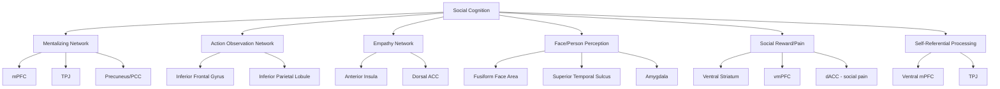

## Neural Correlates of Social Cognition

### Overview

Social cognition — the set of mental processes underlying the perception, interpretation, and response to social information — depends on a distributed network of brain regions rather than any single "social" module. Social neuroscience research has identified partially dissociable but interacting networks supporting mentalizing, empathy, face and person perception, social reward and pain, and self-referential processing. This topic surveys the primary neural systems implicated in each domain and the evidence supporting their functional roles.

### The Mentalizing (Theory of Mind) Network

#### Core Regions

Mentalizing, or theory of mind (ToM), refers to the capacity to attribute mental states — beliefs, desires, intentions — to oneself and others. A consistent network of regions is implicated across neuroimaging studies of this capacity.

**Key Points**

- **Medial prefrontal cortex (mPFC)**, particularly the dorsomedial portion, is consistently activated during tasks requiring explicit reasoning about others' mental states, including false-belief tasks and trait inference tasks.
- **Temporoparietal junction (TPJ)**, especially in the right hemisphere, shows selective engagement when reasoning about others' beliefs specifically, and has been proposed to compute belief attributions somewhat independently of general social attention.
- **Precuneus and posterior cingulate cortex** are implicated in perspective-taking and self-other distinction during mentalizing tasks.
- **Anterior temporal lobes** are implicated in retrieving semantic and social-conceptual knowledge used to support inferences about others' traits and intentions.

**Example**

In a classic false-belief neuroimaging paradigm, participants read a story in which a character holds a belief that the participant knows to be factually false (e.g., not knowing an object has been moved); right TPJ activity reliably increases when participants must track the character's false belief relative to control conditions.

#### Functional Distinctions Within the Network

**Key Points**

- [Inference] Some researchers propose a distinction between the TPJ's role in tracking specific propositional beliefs versus the mPFC's role in broader social-cognitive processes such as trait inference and self-referential thought, though the precise functional division of labor between these regions remains an area of active investigation rather than full consensus.
- The mentalizing network shows substantial overlap with the brain's default mode network (DMN), the set of regions more active during rest and internally directed cognition than during externally focused tasks, a finding that has prompted theoretical proposals linking spontaneous social cognition to default cognitive processing.

### The Mirror Neuron System and Action Observation Network

#### Core Regions and Proposed Function

The action observation network refers to regions that activate both when performing an action and when observing another individual perform the same action, originally identified via single-neuron recording in macaque premotor cortex.

**Key Points**

- Human homologues are proposed to include the **inferior frontal gyrus (IFG)** and **inferior parietal lobule (IPL)**, though [Unverified] direct single-neuron evidence for "mirror neurons" specifically in humans remains far more limited than in macaques, and much human evidence relies on indirect measures (fMRI overlap, EEG mu suppression) rather than direct single-cell recording.
- The proposed functional significance — that this system supports action understanding, imitation, and potentially empathy via a simulation mechanism — remains debated, with critics arguing that the evidence for a direct causal role in higher-order social cognition (such as full theory of mind) is weaker than early popular accounts suggested.
- [Speculation] Strong claims linking mirror neuron dysfunction directly to autism spectrum conditions have been substantially challenged by subsequent research and are not considered well-established within current cognitive neuroscience, despite continued popular circulation of this claim.

### The Empathy Network

#### Affective and Cognitive Empathy Distinction

Empathy research distinguishes affective empathy (sharing or resonating with another's emotional state) from cognitive empathy (understanding another's emotional state without necessarily sharing it), which show partially distinct neural correlates.

**Key Points**

- **Anterior insula (AI)** and **dorsal anterior cingulate cortex (dACC)** are consistently implicated in affective empathy, particularly for pain: these regions activate both when an individual experiences pain directly and when observing another person in pain, a pattern often described as neural "shared representation."
- Cognitive empathy draws more heavily on the mentalizing network described above (mPFC, TPJ), reflecting its conceptual overlap with theory of mind.
- **Empathy for pain paradigms**, in which participants view images or videos of others experiencing physical injury, are among the most widely used experimental methods for isolating affective empathy-related activation.

#### Distinguishing Empathy from Personal Distress

**Key Points**

- [Inference] Some researchers propose a further distinction between empathic concern (other-oriented, associated with motivation to help) and personal distress (self-oriented aversive arousal), which may implicate at least partially different neural and physiological signatures, though this dissociation is more clearly established at the behavioral and self-report level than at the neural level, where evidence remains more mixed.
- Individual differences in trait empathy (e.g., measured via self-report scales) have been correlated with the magnitude of insula and ACC activation during empathy-for-pain tasks in some, though not all, studies.

### Face and Person Perception Networks

#### The Core Face Processing System

**Key Points**

- **Fusiform face area (FFA)**, located in the fusiform gyrus, shows disproportionately strong and selective activation to faces relative to other object categories, and is considered central to structural face encoding.
- **Occipital face area (OFA)** is implicated in earlier, more part-based analysis of facial features, feeding forward into the FFA and other regions.
- **Superior temporal sulcus (STS)** is implicated in processing changeable facial aspects relevant to social communication, including eye gaze direction, facial expression, and lip movements, distinguishing it functionally from the FFA's role in more static identity-related processing.

#### Amygdala and Social-Emotional Salience

**Key Points**

- The **amygdala** is heavily implicated in detecting socially and emotionally salient stimuli, particularly (though not exclusively) threat-related and fear-related facial expressions.
- [Inference] Contrary to earlier characterizations of the amygdala as a dedicated "fear module," more recent work frames its function more broadly as detecting motivationally relevant or ambiguous stimuli requiring further evaluation, since it also responds to a range of other socially salient and even positively valenced stimuli, not fear exclusively.
- Amygdala activation is modulated by social context; for example, activation to an ambiguous facial expression can shift depending on accompanying contextual information, illustrating its role in integrated, context-sensitive social evaluation rather than pure stimulus-driven reactivity.

### Social Reward and Social Pain Networks

#### Social Reward

**Key Points**

- The **ventral striatum**, including the nucleus accumbens, and **ventromedial prefrontal cortex (vmPFC)** are implicated in processing social rewards, including positive social feedback, praise, and being viewed favorably by others, showing activation patterns that substantially overlap with non-social (e.g., monetary) reward processing.
- This overlap has been used to argue that social rewards are processed, at least partially, through a domain-general reward valuation system rather than a fully separate "social reward" system.

#### Social Pain and Exclusion

**Key Points**

- Social exclusion paradigms (notably Cyberball) reliably activate the **dorsal anterior cingulate cortex (dACC)** and **anterior insula**, regions also implicated in physical pain processing, motivating the influential "social pain overlap" hypothesis.
- [Unverified] The strong version of the social-physical pain overlap hypothesis, which proposes substantially shared neural mechanisms between social and physical pain (sometimes popularly summarized as "rejection hurts"), has faced methodological critique regarding the specificity of dACC activation, since this region is implicated in a broad range of conflict-monitoring and salience-detection processes beyond pain specifically, and more recent meta-analytic work urges caution about overinterpreting this overlap as evidence of a shared "pain" mechanism per se.

### Self-Referential Processing and the Self-Other Distinction

**Key Points**

- **Medial prefrontal cortex (mPFC)**, particularly ventral portions, is consistently implicated in self-referential processing, including judgments about one's own traits, preferences, and characteristics.
- Overlap between self-referential processing regions and mentalizing regions has led to theoretical proposals that understanding others may partly rely on simulating or projecting one's own mental states (a "self as reference point" account), though the degree to which self- and other-processing rely on shared versus distinct mechanisms remains actively debated.
- The **temporoparietal junction** is additionally implicated in maintaining self-other distinction more generally, including in bodily self-location and perspective-taking tasks beyond purely mentalistic reasoning.

### Integrative Network Perspective

### Diagram: Approximate Cortical Locations of Key Regions (svg_diagram)

<svg xmlns="http://www.w3.org/2000/svg" viewBox="0 0 700 420">
<text x="350" y="28" text-anchor="middle" font-size="17" font-weight="bold" fill="#222">Key Social Cognition Regions - Lateral View Schematic (svg_diagram)</text>

<path d="M120,340 C90,280 100,180 160,120 C220,60 320,55 400,80 C470,100 520,150 540,220 C555,270 540,320 500,350 C430,400 200,400 120,340 Z" fill="`#f4ecdc`" stroke="`#7b6a4f`" stroke-width="2" />

<circle cx="230" cy="150" r="22" fill="#f5b7b1" stroke="#c0392b" stroke-width="1.5" />
<text x="230" y="130" text-anchor="middle" font-size="11" fill="#922b21">mPFC (medial,</text>
<text x="230" y="118" text-anchor="middle" font-size="11" fill="#922b21">shown laterally)</text>
<circle cx="420" cy="180" r="22" fill="#aed6f1" stroke="#2471a3" stroke-width="1.5" />
<text x="420" y="215" text-anchor="middle" font-size="11" fill="#1a5276">TPJ</text>
<circle cx="350" cy="260" r="20" fill="#a9dfbf" stroke="#1e8449" stroke-width="1.5" />
<text x="350" y="295" text-anchor="middle" font-size="11" fill="#186a3b">STS</text>
<circle cx="290" cy="220" r="16" fill="#d7bde2" stroke="#76448a" stroke-width="1.5" />
<text x="290" y="245" text-anchor="middle" font-size="10" fill="#5b2c6f">Amygdala</text>
<text x="290" y="255" text-anchor="middle" font-size="9" fill="#5b2c6f">(subcortical,</text>
<text x="290" y="265" text-anchor="middle" font-size="9" fill="#5b2c6f">shown schematically)</text>
<circle cx="330" cy="140" r="18" fill="#fad7a0" stroke="#b9770e" stroke-width="1.5" />
<text x="330" y="120" text-anchor="middle" font-size="10" fill="#7e5109">IFG</text>
<circle cx="470" cy="300" r="18" fill="#f9e79f" stroke="#b7950b" stroke-width="1.5" />
<text x="470" y="330" text-anchor="middle" font-size="10" fill="#7d6608">Fusiform</text>
<text x="470" y="340" text-anchor="middle" font-size="9" fill="#7d6608">(ventral, shown</text>
<text x="470" y="350" text-anchor="middle" font-size="9" fill="#7d6608">schematically)</text>
</svg>

### Methodological Notes on Interpreting Neural Correlates

**Key Points**

- Activation-based evidence establishes correlation, not necessity; claims that a region is "required for" a social-cognitive function are strengthened substantially when converging evidence comes from lesion studies, non-invasive brain stimulation (TMS, tDCS), or clinical populations with focal damage to the relevant region.
- Regions identified above are rarely functionally specific to a single social process; most (e.g., dACC, amygdala, mPFC) are implicated across multiple cognitive and affective domains, reinforcing caution against simplistic one-region-one-function ("neo-phrenological") interpretations.
- Network-based and connectivity-based analyses (e.g., resting-state functional connectivity, dynamic causal modeling) are increasingly favored over single-region activation approaches, reflecting a broader theoretical shift toward understanding social cognition as an emergent property of interacting networks.

### Conclusion

Neural correlates of social cognition span multiple interacting networks: a mentalizing network centered on mPFC and TPJ supporting explicit mental-state reasoning; an action observation network supporting action understanding and potentially imitation; an empathy network centered on the insula and dACC supporting affective resonance; face and person perception regions including the FFA, STS, and amygdala; reward and pain networks that process social feedback and exclusion partly through domain-general mechanisms; and self-referential processing regions overlapping substantially with the mentalizing network. Current best practice in the field emphasizes network-level and causal (not merely correlational) evidence over isolated region-activation findings.

**Related Topics**

- Default mode network and its relationship to social cognition
- Autism spectrum conditions and atypical social brain networks
- Lesion studies and causal inference in social neuroscience
- Oxytocin, vasopressin, and neuroendocrine modulation of social cognition
- Developmental trajectories of the social brain (infancy through adolescence)
- Psychopathy and atypical empathy-related neural processing
- Social pain overlap hypothesis and its critiques
- Resting-state functional connectivity in social neuroscience
- Computational and predictive coding models of mentalizing
- Cross-species comparative neuroscience of social behavior