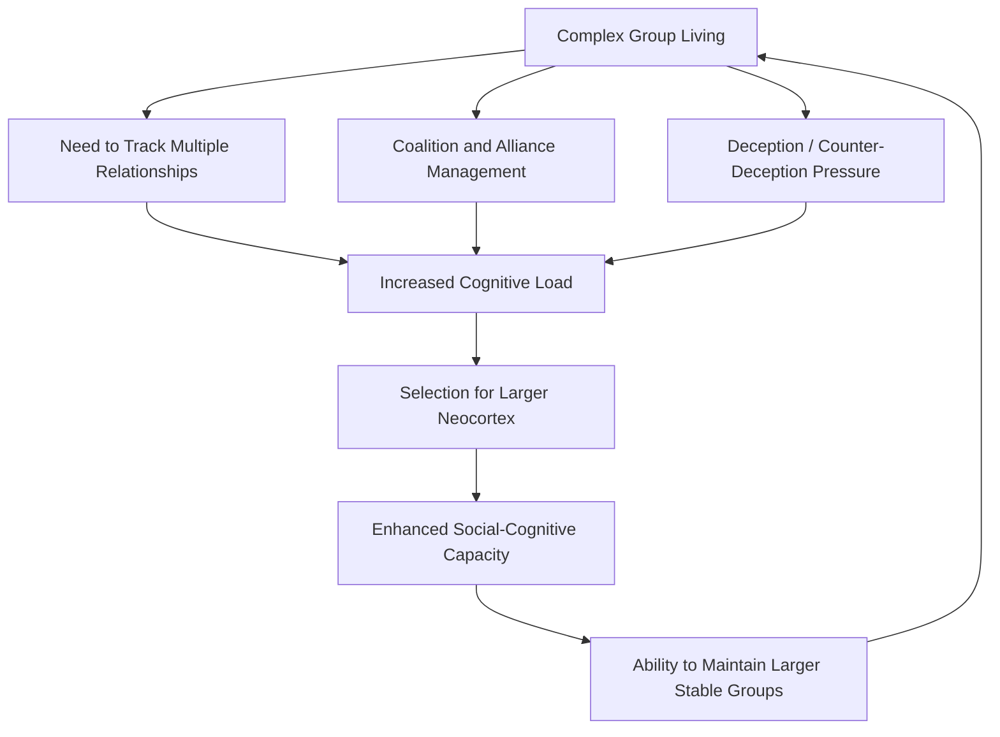

## The Social Brain Hypothesis

### Overview

The social brain hypothesis proposes that primate brain size, and particularly neocortical expansion, evolved primarily in response to the cognitive demands of navigating complex social environments rather than primarily in response to ecological problem-solving demands such as foraging or tool use. Originally developed within primatology and evolutionary anthropology, the hypothesis has become a foundational framework in social neuroscience for understanding why the human brain is disproportionately large relative to body size and why so much of its cortical territory appears dedicated to social information processing.

### Origins and Core Claim

#### Historical Development

The hypothesis is most closely associated with British anthropologist Robin Dunbar, building on earlier work by researchers including Nicholas Humphrey, who in the late 1970s proposed that primate intelligence evolved primarily to manage social complexity ("Machiavellian intelligence") rather than to solve physical or ecological problems.

**Key Points**

- Humphrey's early formulation argued that the cognitive demands of social life — predicting others' behavior, forming alliances, deceiving and detecting deception — presented a more persistent and escalating selection pressure than ecological problems, which tend to have more stable, learnable solutions.
- Dunbar's later quantitative work (from the 1990s onward) formalized this into a testable comparative hypothesis by correlating measures of brain structure with measures of social complexity across primate species.
- The term "Machiavellian intelligence hypothesis" is often used interchangeably with or as a precursor to "social brain hypothesis," though the latter term is now more standard in the literature.

#### The Neocortex Ratio Finding

Dunbar's central empirical contribution was a cross-species comparative analysis showing that neocortex ratio (neocortex volume relative to the rest of the brain) correlates with group size across primate species more strongly than with other candidate variables such as diet or home range size.

**Key Points**

- Across sampled primate species, average social group size showed a statistically significant positive relationship with relative neocortex size, a pattern not as strongly replicated for ecological variables tested in the same analyses.
- This comparative pattern was interpreted as evidence that neocortical expansion tracks social complexity specifically, rather than general ecological problem-solving demands.
- [Unverified] The relative explanatory strength of social versus ecological variables in predicting brain size has been challenged by subsequent reanalyses using different statistical methods and updated datasets, with some researchers arguing that ecological and dietary variables (e.g., fruit consumption, extractive foraging) show comparable or in some analyses stronger correlations than originally reported, making this an actively contested empirical question rather than a fully settled one.

### Dunbar's Number

#### The Proposed Cognitive Limit

Using the human neocortex ratio and extrapolating from the primate regression line relating neocortex ratio to group size, Dunbar proposed a predicted upper limit on the number of stable social relationships a human can cognitively maintain, commonly cited as approximately 150.

**Key Points**

- This figure, popularly termed "Dunbar's number," is proposed to represent a cognitive ceiling on the number of relationships an individual can track with sufficient detail to maintain stable, trust-based social bonds (as opposed to mere acquaintance or recognition).
- Dunbar additionally proposed a nested hierarchical structure of relationship circles of increasing size and decreasing intimacy, commonly cited in approximate multiples (e.g., roughly 5 for intimate support-clique relationships, roughly 15 for close friends, roughly 50 for a wider friendship circle, and roughly 150 for the outer meaningful-relationship boundary), though exact figures vary somewhat across Dunbar's own publications.
- [Unverified] Empirical support for Dunbar's number as a precise, fixed cognitive limit is mixed; some studies of real-world social network size (including studies of historical group sizes, military unit organization, and more recent social media network analyses) show considerable variability around this figure, and critics argue the number functions better as an illustrative order-of-magnitude estimate than a precise, universally fixed cognitive constant.
- [Speculation] The applicability of Dunbar's number to online social networks, where "friend" counts can vastly exceed 150, remains a debated extension of the original hypothesis, since online platforms may not require the same depth of tracked relationship information as offline stable alliances.

### Mechanisms Proposed to Link Social Complexity and Brain Size

#### Cognitive Demands of Group Living

**Key Points**

- Tracking third-party relationships (who is allied with whom, who has reciprocated favors, who has defected) requires substantially more computational and memory capacity than tracking only dyadic relationships with each individual in isolation.
- Deception and counter-deception detection are proposed as a specific escalating cognitive arms race: as individuals evolve better capacities to deceive, others face selection pressure to evolve correspondingly better capacities to detect deception, a dynamic that can drive continued cognitive escalation without an ecological ceiling.
- Coalition formation and status negotiation (as discussed in the evolutionary social psychology material on dominance and coalition psychology) require ongoing social-strategic computation, consistent with the general logic of the social brain hypothesis.

#### Grooming, Bonding, and the Social Bonding Hypothesis

Dunbar additionally proposed that grooming time in non-human primates, and language in humans, functions as a bonding mechanism whose time-cost scales with group size, further linking social group size to time-budget and cognitive constraints.

**Key Points**

- In non-human primates, the proportion of waking time spent in social grooming correlates with group size across species, consistent with grooming serving a bond-maintenance function that scales with the number of relationships requiring upkeep.
- Dunbar's "gossip hypothesis" proposes that human language evolved partly as a more time-efficient substitute for physical grooming, allowing bond maintenance and information exchange (including social/reputational information) across larger groups than manual grooming could support.
- [Speculation] The gossip hypothesis remains one of several competing accounts of language origins and is not universally accepted as the primary selective driver of language evolution; alternative accounts emphasize tool-use coordination, cooperative hunting, or theory-of-mind-linked communication needs.

### Neural Correlates Supporting the Hypothesis

#### Human Neuroimaging Evidence

More recent work has attempted to test the social brain hypothesis directly within humans by relating individual differences in social network size to brain structure, rather than relying solely on cross-species comparison.

**Key Points**

- Studies correlating self-reported or externally verified social network size with structural MRI measures have found positive associations between network size and gray matter volume in regions including the amygdala, orbitofrontal cortex, and regions overlapping with the mentalizing network (discussed in the preceding neural correlates topic).
- [Unverified] These correlational human neuroimaging findings are generally smaller in scale and less consistently replicated than the original cross-species comparative primate data, and causal directionality (whether larger relevant brain structures enable larger networks, or whether maintaining larger networks drives structural change through experience-dependent plasticity) cannot be established from cross-sectional correlational designs alone.
- Non-human primate studies using experimentally manipulated social group sizes (in captive settings) have shown some evidence of structural brain changes following altered social group size, offering partial support for a causal, experience-dependent component to the brain-social complexity relationship, [Inference] though generalizing captive experimental primate findings to wild ancestral human social evolution requires caution given differences in ecological context.

### Diagram: Conceptual Logic of the Social Brain Hypothesis

### Diagram: Dunbar's Layered Relationship Circles (svg_diagram)

<svg xmlns="http://www.w3.org/2000/svg" viewBox="0 0 500 500">
<text x="250" y="30" text-anchor="middle" font-size="17" font-weight="bold" fill="#222">Dunbar's Nested Relationship Circles (svg_diagram)</text>
<circle cx="250" cy="270" r="210" fill="#eaf3fb" stroke="#2471a3" stroke-width="2" />
<circle cx="250" cy="270" r="160" fill="#d4e9f7" stroke="#2471a3" stroke-width="2" />
<circle cx="250" cy="270" r="105" fill="#bde0f2" stroke="#2471a3" stroke-width="2" />
<circle cx="250" cy="270" r="55" fill="#a3d0ec" stroke="#2471a3" stroke-width="2" />
<circle cx="250" cy="270" r="20" fill="#7fb8de" stroke="#1a5276" stroke-width="2" />

<text x="250" y="270" text-anchor="middle" font-size="10" fill="`#1a5276`">~5</text>

<text x="250" y="235" text-anchor="middle" font-size="11" fill="`#1a5276`">~15 close friends</text>

<text x="250" y="185" text-anchor="middle" font-size="11" fill="`#1a5276`">~50 friendship circle</text>

<text x="250" y="130" text-anchor="middle" font-size="11" fill="`#1a5276`">~150 meaningful relationships</text>

<text x="250" y="480" text-anchor="middle" font-size="10" fill="#555">(approximate figures per Dunbar)</text>

</svg>

### Critiques of the Social Brain Hypothesis

#### The Ecological Brain Hypothesis Challenge

**Key Points**

- Alternative "ecological brain" or "ecological intelligence" hypotheses argue that variables such as diet quality (particularly fruit consumption, which requires more complex spatial-temporal memory for tracking scattered, seasonal food sources), extractive foraging techniques, and home range complexity better predict primate brain size in certain reanalyses than social group size does.
- Some researchers propose that social and ecological explanations are not mutually exclusive, and that the cognitive demands driving brain expansion likely reflect a combination of social and ecological pressures rather than a single dominant factor, [Inference] though the relative weighting of these factors remains genuinely unresolved in the comparative literature.

#### Methodological Critiques

**Key Points**

- Cross-species comparative brain-behavior correlations are vulnerable to confounds from shared evolutionary history (phylogenetic non-independence) unless appropriately controlled using phylogenetic comparative methods; not all early social brain hypothesis studies applied these corrections consistently.
- Measuring "group size" and "social complexity" consistently and meaningfully across highly diverse primate species (from solitary to highly gregarious) presents definitional challenges that can affect comparative results.
- The precise operationalization of Dunbar's number in modern human studies varies considerably across researchers (self-report surveys, communication network analysis, social media data), contributing to inconsistent replication figures reported in the literature.

### Extensions Beyond Primates

**Key Points**

- [Inference] Social brain hypothesis-style relationships between social complexity and relative brain size have been proposed, with varying degrees of support, in other social mammals and some birds (e.g., certain corvid and parrot species), suggesting the underlying logic may generalize beyond primates specifically, though the strength and consistency of this cross-taxa evidence varies considerably by species group and is less extensively studied than in primates.
- This broader comparative pattern is sometimes used to argue that social complexity represents a general driver of cognitive evolution across distantly related lineages facing convergent social living pressures, rather than a primate-specific phenomenon.

### Conclusion

The social brain hypothesis proposes that the disproportionate size and complexity of the primate, and especially human, neocortex evolved substantially in response to the cognitive demands of complex social living — tracking relationships, managing coalitions, and navigating deception — rather than primarily in response to non-social ecological problem-solving. While the hypothesis, and its associated concept of Dunbar's number, remains highly influential in social neuroscience and evolutionary anthropology, it faces ongoing empirical challenges from ecological brain alternatives and methodological critiques regarding phylogenetic control and the precise measurement of social complexity. Most contemporary researchers treat social and ecological pressures as plausibly complementary rather than strictly competing explanations for primate brain evolution.

**Related Topics**

- Machiavellian intelligence hypothesis and its historical development
- Neocortex ratio and comparative primate brain evolution
- Dunbar's number and modern applications to organizational and network science
- Ecological brain hypothesis and dietary complexity accounts of brain evolution
- Grooming, gossip, and the evolution of language
- Phylogenetic comparative methods in evolutionary biology
- Coalition and alliance psychology (evolutionary social psychology)
- Default mode network and its evolutionary significance
- Comparative cognition in corvids and other non-primate social species
- Social network analysis and human relationship structure