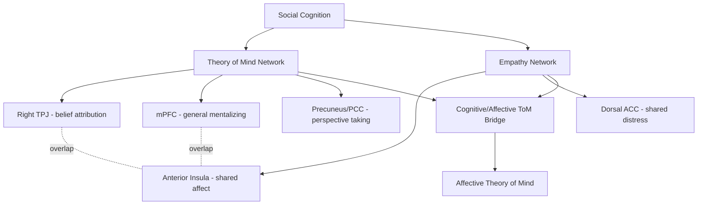

## Neuroscience of Empathy and Theory of Mind

### Overview

Empathy and theory of mind (ToM) are related but dissociable social-cognitive capacities: theory of mind refers to the ability to represent and reason about others' mental states (beliefs, desires, intentions), while empathy refers to the capacity to share and/or understand others' emotional states. Social neuroscience has made substantial progress in characterizing the partially overlapping and partially distinct neural systems supporting these capacities, using converging evidence from neuroimaging, lesion studies, and clinical populations.

### Conceptual Distinctions

#### Components of Theory of Mind

**Key Points**

- **Cognitive theory of mind**: reasoning about others' beliefs, intentions, and knowledge states, often assessed via false-belief tasks.
- **Affective theory of mind**: inferring others' emotional states, sometimes considered a bridge concept between pure ToM and empathy.
- ToM is frequently subdivided further into first-order ToM (what does person A believe) and second-order ToM (what does person A believe that person B believes), with second-order tasks imposing greater cognitive demand and showing later developmental onset.

#### Components of Empathy

**Key Points**

- **Affective empathy**: the vicarious sharing of another's emotional state, sometimes termed emotional contagion in its most automatic form.
- **Cognitive empathy**: understanding another's emotional state without necessarily experiencing it oneself, conceptually overlapping with affective theory of mind.
- **Empathic concern**: an other-oriented motivational response involving concern for another's welfare, distinguished from **personal distress**, a self-oriented aversive response to another's suffering.
- [Inference] This componential breakdown is widely used in the literature, though the precise boundaries between cognitive empathy and affective theory of mind are not always sharply distinguished across different research traditions, and terminology varies somewhat between researchers.

### Neural Systems Supporting Theory of Mind

#### The Core ToM Network

**Key Points**

- **Right temporoparietal junction (rTPJ)** shows selective and robust activation during belief-attribution tasks, more so than during tasks requiring reasoning about others' non-mental traits, supporting its proposed role as relatively specialized for mental-state representation.
- **Medial prefrontal cortex (mPFC)**, particularly dorsomedial portions, activates broadly across mentalizing tasks, including trait inference, and is theorized to support more general social-cognitive integration rather than belief-specific computation.
- **Precuneus/posterior cingulate cortex** contributes to perspective-taking and situating mental-state representations within an integrated self-other framework.
- **Anterior temporal lobes** support retrieval of social-conceptual and semantic knowledge that feeds into mentalizing inferences (e.g., knowledge of social scripts, trait concepts).

**Example**

In a standard false-belief fMRI paradigm, participants might watch an animation in which one character hides an object, then a second character moves it while the first is absent; rTPJ activity increases specifically when participants must predict the first character's behavior based on their outdated (false) belief, relative to conditions requiring only physical or non-mental reasoning.

#### Developmental Trajectory

**Key Points**

- Behavioral false-belief understanding typically emerges around age 4 in most studied populations, though implicit or anticipatory-looking measures suggest some sensitivity to others' false beliefs may be present in infancy, a finding that remains debated regarding its interpretation as genuine early ToM versus a simpler associative process.
- [Inference] Structural and functional maturation of the rTPJ and mPFC continues through childhood and adolescence, broadly paralleling the behavioral refinement of ToM abilities, though the precise causal relationship between specific maturational milestones and specific ToM behavioral gains is difficult to establish from correlational developmental neuroimaging data.

### Neural Systems Supporting Empathy

#### Shared Representation for Pain

**Key Points**

- **Anterior insula (AI)** and **dorsal anterior cingulate cortex (dACC)** are the most consistently implicated regions in empathy-for-pain paradigms, activating both when a participant experiences physical pain directly and when observing another person experiencing pain.
- This overlap has been interpreted as evidence for a "shared representation" or simulation-based account of empathy, in which understanding another's pain partly recruits the same neural systems involved in one's own first-person pain experience.
- [Unverified] The specificity of this overlap to pain versus general negative affect or salience detection has been questioned, since both the AI and dACC are implicated in a wide range of affective, interoceptive, and cognitive-conflict processes beyond pain specifically, making the precise interpretation of this overlap an area of ongoing methodological debate.

#### Modulating Factors in Empathic Response

**Key Points**

- Empathic neural responses are not fixed or automatic; they are modulated by perceived group membership, with several studies reporting attenuated AI/ACC responses to the pain of out-group members relative to in-group members, particularly along racial or arbitrary minimal-group lines.
- Perceived fairness of the target also modulates empathic response; some studies report reduced empathic neural response, and in some cases increased reward-related activation, when observing the pain of someone previously perceived as having behaved unfairly.
- [Inference] These modulation findings are generally interpreted as evidence that empathic neural responses reflect a motivated, context-sensitive appraisal process rather than a purely reflexive or automatic simulation mechanism, though the degree to which this generalizes across all social contexts and populations remains under continued investigation.

### Overlap and Dissociation Between Empathy and ToM Networks

#### Points of Convergence

**Key Points**

- Affective ToM tasks (inferring emotional states) show activation patterns that partially bridge the core ToM network (mPFC, TPJ) and the core empathy network (AI, dACC), consistent with their conceptual overlap.
- Both systems converge on shared self-other distinction processes, plausibly supported in part by the TPJ, which is implicated in both belief attribution and lower-level bodily self-other distinction tasks.

#### Points of Dissociation

**Key Points**

- Neuropsychological double dissociations support separability: some clinical populations show impaired cognitive ToM with relatively preserved affective empathy, while others show the reverse pattern, arguing against a single unified "social cognition" system.
- **Autism spectrum conditions** have frequently been associated with difficulties on explicit cognitive ToM tasks (e.g., false-belief tasks), while affective empathic responsiveness findings are considerably more mixed and heterogeneous across studies and individuals, cautioning against oversimplified characterizations of autism as involving a uniform empathy deficit.
- **Psychopathy** has been associated in several studies with relatively preserved cognitive ToM/perspective-taking ability alongside reduced affective empathic responsiveness (particularly to others' distress), a pattern that has been used to argue that intact cognitive perspective-taking can, in principle, be paired with (and in some accounts, may facilitate) instrumental or manipulative social behavior when affective empathic concern is reduced. [Inference] The precise neural mechanisms underlying this dissociation in psychopathy remain an active area of research, and findings vary across psychopathy subtypes and measurement approaches.

### Diagram: Empathy and Theory of Mind Network Overlap

### Diagram: Empathy Component Model (svg_diagram)

<svg xmlns="http://www.w3.org/2000/svg" viewBox="0 0 680 380">
<text x="340" y="28" text-anchor="middle" font-size="17" font-weight="bold" fill="#222">Components of Empathy (svg_diagram)</text>
<rect x="40" y="70" width="270" height="120" rx="10" fill="#fdebd0" stroke="#b9770e" stroke-width="2" />
<text x="175" y="100" text-anchor="middle" font-size="14" font-weight="bold" fill="#7e5109">Affective Empathy</text>
<text x="175" y="125" text-anchor="middle" font-size="12" fill="#333">Sharing/resonating with</text>
<text x="175" y="143" text-anchor="middle" font-size="12" fill="#333">another's emotional state</text>
<text x="175" y="168" text-anchor="middle" font-size="11" fill="#555">Key regions: AI, dACC</text>
<rect x="370" y="70" width="270" height="120" rx="10" fill="#d6eaf8" stroke="#2471a3" stroke-width="2" />
<text x="505" y="100" text-anchor="middle" font-size="14" font-weight="bold" fill="#1a5276">Cognitive Empathy</text>
<text x="505" y="125" text-anchor="middle" font-size="12" fill="#333">Understanding without</text>
<text x="505" y="143" text-anchor="middle" font-size="12" fill="#333">necessarily sharing</text>
<text x="505" y="168" text-anchor="middle" font-size="11" fill="#555">Key regions: mPFC, TPJ</text>
<rect x="130" y="240" width="200" height="90" rx="10" fill="#d5f5e3" stroke="#1e8449" stroke-width="2" />
<text x="230" y="270" text-anchor="middle" font-size="13" font-weight="bold" fill="#186a3b">Empathic Concern</text>
<text x="230" y="292" text-anchor="middle" font-size="11" fill="#333">Other-oriented,</text>
<text x="230" y="308" text-anchor="middle" font-size="11" fill="#333">motivates helping</text>
<rect x="350" y="240" width="200" height="90" rx="10" fill="#fadbd8" stroke="#943126" stroke-width="2" />
<text x="450" y="270" text-anchor="middle" font-size="13" font-weight="bold" fill="#78281f">Personal Distress</text>
<text x="450" y="292" text-anchor="middle" font-size="11" fill="#333">Self-oriented,</text>
<text x="450" y="308" text-anchor="middle" font-size="11" fill="#333">aversive arousal</text>
</svg>

### Clinical and Individual Differences Research

**Key Points**

- **Alexithymia**, a difficulty identifying and describing one's own emotions, is associated in several studies with reduced affective empathic responsiveness, supporting theoretical models proposing that accurate self-emotion representation supports accurate empathic inference about others (sometimes framed under simulation-based accounts of empathy).
- Individual differences in trait empathy, measured via self-report instruments such as the Interpersonal Reactivity Index, have shown correlations with AI/dACC activation magnitude during empathy-for-pain tasks in several studies, though [Unverified] correlation strength and consistency vary across specific study samples and empathy subscale used.
- Oxytocin administration studies have reported enhanced performance on some ToM-related tasks (e.g., the "Reading the Mind in the Eyes" test) in certain samples, though [Unverified] oxytocin research more broadly has faced substantial replication challenges, and effects appear context-dependent and are not consistently observed across all studies or populations.

### Methodological Considerations

**Key Points**

- Distinguishing genuine empathic/mentalizing processes from general attention, arousal, or task-difficulty confounds requires carefully matched control conditions (e.g., contrasting mental-state reasoning about a person with reasoning about a similarly complex non-mental physical scenario).
- Self-report measures of empathy (trait questionnaires) and performance-based/neural measures often show only modest correlations with one another, suggesting they may capture at least partially distinct aspects of the empathic response rather than being interchangeable indices of a single unified construct.
- As with other social neuroscience domains, causal claims about region necessity are strengthened by convergent lesion, stimulation, or clinical-population evidence rather than fMRI activation data alone.

### Conclusion

Theory of mind and empathy are supported by partially overlapping but dissociable neural systems: a core ToM network centered on the right TPJ and mPFC supporting belief and mental-state reasoning, and a core empathy network centered on the anterior insula and dACC supporting shared affective response, particularly to others' pain and distress. These systems converge in domains such as affective theory of mind and are both modulated by contextual factors including group membership and perceived fairness. Clinical dissociations, particularly contrasting patterns observed in autism spectrum conditions and psychopathy, provide converging evidence that cognitive mentalizing and affective empathic responsiveness are separable capacities rather than a single unified social-cognitive system.

**Related Topics**

- False-belief tasks and the development of theory of mind
- Autism spectrum conditions and social cognition research
- Psychopathy and callous-unemotional traits
- Oxytocin and neuroendocrine modulation of social bonding
- In-group/out-group bias in empathic neural response
- Alexithymia and interoceptive awareness
- Mirror neuron system and action observation network
- Simulation theory versus theory-theory accounts of mentalizing
- Perspective-taking and self-other distinction (TPJ function)
- Compassion training and neuroplasticity in empathy-related circuits