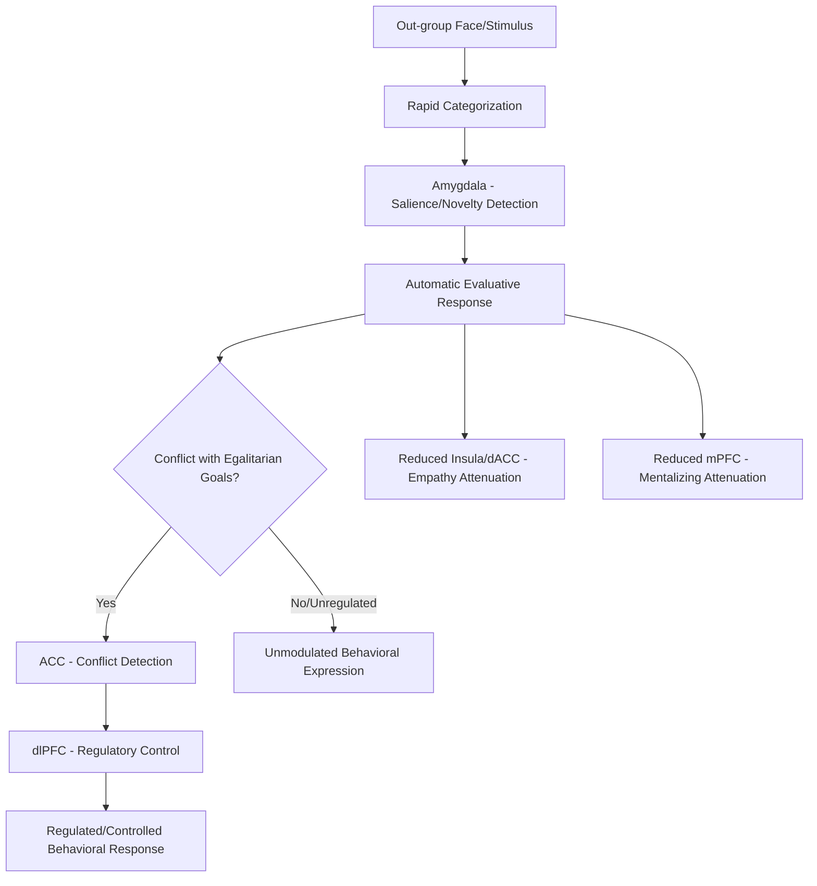

## Neuroscience of Prejudice and Intergroup Bias

### Overview

The neuroscience of prejudice and intergroup bias examines the neural systems engaged when perceiving, evaluating, and interacting with members of social out-groups, and how these systems differ from responses to in-group members. This research integrates social categorization processes, threat and salience detection, emotion regulation, and mentalizing systems to characterize both automatic and controlled components of intergroup bias, and has become a major application area for social neuroscience methods including fMRI, EEG, and psychophysiology.

### Rapid Social Categorization

#### Automaticity of Category Detection

**Key Points**

- Behavioral and electrophysiological evidence indicates that race, and other salient social categories, can be detected extremely rapidly, with some ERP studies reporting category-sensitive neural differentiation within roughly 100 to 200 milliseconds of face presentation, consistent with early, largely automatic perceptual categorization rather than slower, deliberative processing.
- As discussed in relation to coalition psychology, categorization along visible dimensions such as race can be attenuated or overridden when other cues (e.g., team membership, coalition markers) provide more socially predictive alliance information in a given context, suggesting rapid categorization is flexible rather than rigidly fixed to specific physical features.
- [Inference] This rapid categorization is generally interpreted as reflecting a broader, evolutionarily older system for detecting socially relevant group distinctions rather than a mechanism specifically dedicated to race, though the degree to which this system is best characterized as fully automatic versus modulated by early attentional and contextual factors remains debated.

### The Amygdala and Automatic Threat/Salience Response

#### Amygdala Activation to Out-Group Faces

**Key Points**

- A substantial body of fMRI research has reported greater amygdala activation to out-group (particularly other-race) faces relative to in-group faces, especially in initial or brief exposure trials, a pattern often interpreted within a threat- or novelty-detection framework.
- This amygdala response has shown correlations in several studies with indirect (implicit) measures of racial bias, such as performance on the Implicit Association Test (IAT), though correlations with explicit self-reported attitudes have generally been weaker and less consistent.
- [Unverified] The specific psychological interpretation of amygdala activation in this context is contested; because the amygdala responds broadly to novelty, ambiguity, and motivationally significant stimuli rather than fear or threat exclusively, some researchers caution against interpreting this activation as direct evidence of "fear" or hostility toward out-group members specifically, favoring a broader salience-detection interpretation instead.

#### Habituation and Familiarity Effects

**Key Points**

- Amygdala responses to out-group faces have been shown in some studies to habituate (decrease) with repeated exposure within an experimental session, and cross-sectional evidence suggests reduced differential amygdala response is associated with greater real-world interracial contact and familiarity in some populations.
- [Inference] These habituation findings are frequently cited as neural evidence consistent with intergroup contact theory, which proposes that increased positive contact between groups reduces prejudice, though causal, longitudinal neuroimaging evidence directly linking sustained contact interventions to lasting amygdala response change remains more limited than the cross-sectional correlational evidence.

### Prefrontal Regulation of Automatic Bias

#### Cognitive Control Regions

**Key Points**

- **Dorsolateral prefrontal cortex (dlPFC)** and **anterior cingulate cortex (ACC)**, regions broadly implicated in cognitive control and conflict monitoring, show increased activation during tasks requiring participants to regulate or override automatic race-based evaluative responses.
- This pattern is consistent with a dual-process framework in which an initial, relatively automatic evaluative or categorization response (potentially amygdala-linked) can be modulated by top-down, effortful control processes recruiting prefrontal and cingulate regions.
- [Inference] Individual differences in the magnitude and speed of this regulatory engagement are proposed to relate to individual differences in prejudice control motivation and behavioral bias expression, though the directness of this brain-behavior link and its generalizability across bias domains beyond race remains an area of ongoing study.

#### The ACC and Conflict Detection

**Key Points**

- Some studies report increased ACC (particularly dorsal ACC) activity when participants' automatic evaluative responses conflict with their explicitly endorsed egalitarian goals, consistent with the ACC's broader proposed role in detecting response conflict requiring adjustment.
- This conflict-detection signal is theorized to trigger subsequent recruitment of dlPFC-mediated regulatory control, though [Unverified] the precise temporal and causal sequencing of this proposed ACC-to-dlPFC regulatory cascade in the specific context of racial bias is inferred from broader cognitive control literature more than directly demonstrated within intergroup bias paradigms specifically.

### Dehumanization and Reduced Mentalizing

#### The Social Cognition Deficit Hypothesis

A notable and controversial line of research has examined whether out-group members, particularly members of extremely stigmatized or dehumanized out-groups, elicit reduced engagement of the mentalizing network (mPFC) relative to in-group members, interpreted as a potential neural marker of dehumanization.

**Key Points**

- Some studies using images of extremely stigmatized groups (e.g., people experiencing homelessness or drug addiction in certain study designs) have reported relatively reduced mPFC activation compared to viewing images of more socially typical individuals, interpreted by the original researchers as evidence consistent with reduced spontaneous mentalizing toward extremely dehumanized targets.
- [Unverified] This dehumanization-neuroscience literature is among the more contested areas within the neuroscience of prejudice: sample sizes in foundational studies were often small, the generalizability of findings from extreme stigma conditions to more typical intergroup bias (e.g., ordinary racial or ethnic out-group perception) is unclear, and subsequent replication and extension work has produced a more mixed picture than initial reports suggested.
- Critics caution against overinterpreting reduced mPFC activation as direct evidence of a discrete "dehumanization" psychological state, since mPFC engagement is influenced by numerous non-social factors (task engagement, stimulus complexity, attentional allocation) that complicate straightforward interpretation.

### Own-Race Bias in Face Processing

#### The Cross-Race Effect

**Key Points**

- Behaviorally, individuals typically show better recognition memory for own-race faces relative to other-race faces, a robust and long-documented phenomenon known as the cross-race effect or own-race bias.
- Neuroimaging evidence, including some fusiform face area (FFA) studies, suggests relatively reduced individuating (identity-specific) neural processing for other-race faces relative to own-race faces in some study samples, consistent with a perceptual expertise account in which differential lifetime exposure to own-race versus other-race faces shapes face-processing specialization.
- [Inference] This perceptual expertise account is generally favored over purely motivational accounts (e.g., simple lack of interest in out-group individuation) in current literature, given converging evidence that greater interracial contact and exposure is associated with reduced cross-race effect magnitude, though motivational and attentional factors are not considered fully excluded as contributing influences.

### Empathy and Intergroup Bias

#### Racial In-Group Bias in Pain Empathy

As introduced in the empathy and theory of mind material, several studies report attenuated anterior insula and dACC responses when observing the pain of racial out-group members relative to in-group members.

**Key Points**

- This attenuation has been reported using both direct physical pain observation paradigms and, in some studies, more abstract empathy-relevant tasks, though effect sizes and consistency vary across specific study designs and populations.
- [Unverified] Whether this reflects reduced automatic empathic simulation specifically, versus a downstream effect of reduced attention, perceived similarity, or motivated appraisal processes, remains debated, and dissecting these contributing mechanisms is an active area of methodological refinement in the field.
- Some studies have found this bias can be reduced by experimentally manipulating perceived group membership (e.g., using minimal group paradigms to create novel, non-race-based in-groups), consistent with the broader coalition psychology finding that alliance-relevant categorization can override or attenuate default categorization along more visible but less currently predictive social dimensions.

### Diagram: Dual-Process Model of Neural Intergroup Bias

### Diagram: Amygdala Habituation with Contact/Familiarity (svg_diagram)

<svg xmlns="http://www.w3.org/2000/svg" viewBox="0 0 620 360">
<text x="310" y="28" text-anchor="middle" font-size="16" font-weight="bold" fill="#222">Amygdala Response and Familiarity (svg_diagram)</text>
<line x1="70" y1="300" x2="580" y2="300" stroke="#333" stroke-width="2" />
<line x1="70" y1="300" x2="70" y2="60" stroke="#333" stroke-width="2" />
<text x="325" y="335" text-anchor="middle" font-size="12" fill="#333">Repeated Exposure / Contact →</text>
<text x="35" y="180" text-anchor="middle" font-size="12" fill="#333" transform="rotate(-90 35 180)">Amygdala Response</text>
<path d="M100,90 C200,110 300,220 550,270" fill="none" stroke="#c0392b" stroke-width="3" />
<circle cx="100" cy="90" r="5" fill="#c0392b" />
<circle cx="300" cy="180" r="5" fill="#c0392b" />
<circle cx="550" cy="270" r="5" fill="#c0392b" />

<text x="110" y="75" font-size="11" fill="`#922b21`">Initial exposure</text>

<text x="480" y="290" font-size="11" fill="`#922b21`">Sustained familiarity</text>

</svg>

### Individual Differences and Malleability

**Key Points**

- Individual differences in motivation to control prejudice (both internally and externally motivated) have been associated with differences in the magnitude and speed of prefrontal regulatory engagement in several studies, consistent with the broader dual-process framework.
- Perspective-taking instructions and empathy-induction manipulations have been shown in some studies to reduce both behavioral bias measures and associated differential neural responses (e.g., reduced amygdala differentiation), offering preliminary neural evidence for the malleability of these responses under certain experimental conditions.
- [Inference] These malleability findings are generally interpreted as evidence against a strictly fixed or hardwired account of intergroup neural bias, supporting models in which automatic categorization responses are present but substantially modifiable by context, motivation, and experience, though translating laboratory malleability findings into durable, real-world prejudice reduction remains a distinct and more difficult empirical question.

### Methodological and Interpretive Cautions

**Key Points**

- As with other social neuroscience domains, activation-based findings establish correlation with bias-relevant processes, not proof of a discrete "prejudice module"; most implicated regions (amygdala, ACC, dlPFC, mPFC, insula) serve multiple, domain-general functions beyond intergroup processing specifically.
- Reverse inference from a single region's activation to a specific psychological state (e.g., inferring "fear of out-group" purely from amygdala activation) is a recognized interpretive risk that the field increasingly addresses through multivariate and network-based analyses rather than single-region activation reporting alone.
- Stimulus selection (photographs used to represent "in-group" and "out-group") and sample characteristics (participant race, prior contact history, geographic and cultural context) substantially influence findings, and results from one population or bias domain (e.g., race) do not necessarily generalize to other intergroup contexts (e.g., religion, nationality, political affiliation) without direct empirical testing.

### Conclusion

The neuroscience of prejudice and intergroup bias reveals a distributed set of processes spanning rapid social categorization, amygdala-linked salience or threat detection, prefrontal regulatory control, and attenuated empathic and mentalizing responses toward out-group members. These processes are not fixed or uniform: they show habituation with familiarity, modulation by motivation and contact, and malleability under specific experimental interventions such as perspective-taking. The field continues to grapple with interpretive challenges around reverse inference and the generalizability of findings, particularly within the more contested dehumanization-neuroscience literature, underscoring the importance of converging behavioral, neural, and contextual evidence when drawing conclusions about the neural basis of intergroup bias.

**Related Topics**

- Implicit Association Test (IAT) and implicit bias measurement
- Intergroup contact theory and prejudice reduction interventions
- Minimal group paradigm and social identity theory
- Dehumanization theory and its critiques
- Cross-race effect and face recognition expertise
- Coalition and alliance detection psychology
- Empathy and pain-observation paradigms in social neuroscience
- Cognitive control and conflict monitoring (ACC/dlPFC function)
- Perspective-taking interventions and neural plasticity
- Political and ideological group bias as an extension beyond race