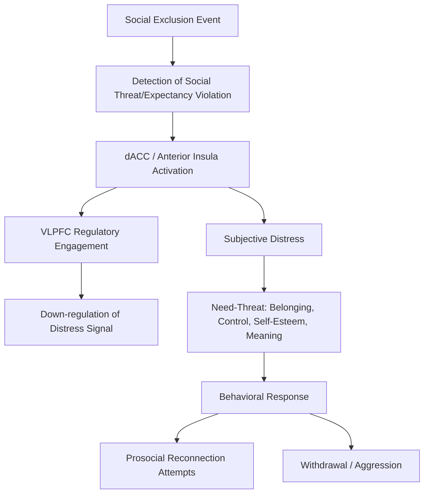

## Neuroscience of Social Rejection and Social Pain

### Overview

The neuroscience of social rejection and social pain examines the neural, physiological, and behavioral consequences of experiences such as exclusion, ostracism, and interpersonal loss. A central organizing theory in this area, the social pain overlap hypothesis, proposes that social and physical pain share overlapping neural substrates, an idea that has generated substantial research, experimental innovation, and subsequent critical reappraisal within social neuroscience.

### The Social Pain Overlap Hypothesis

#### Core Theoretical Claim

The social pain overlap hypothesis, most closely associated with researchers including Naomi Eisenberger and Matthew Lieberman, proposes that the distress of social rejection is processed, at least partially, through neural circuitry that evolved originally for physical pain processing, on the premise that social separation posed a survival threat for a highly interdependent species across evolutionary history.

**Key Points**

- The theory proposes an evolutionary rationale: because social connection was critical for survival and reproduction in ancestral environments (protection, resource sharing, cooperative offspring care), a repurposed alarm system that made social separation subjectively aversive would have been adaptively advantageous, motivating behavior to restore social bonds.
- The hypothesis draws on the observation that natural language across many cultures uses physical pain vocabulary to describe social rejection (e.g., "hurt feelings," "broken heart"), taken as suggestive, though not conclusive, behavioral evidence consistent with shared processing.
- [Inference] The strong version of this claim — that social and physical pain share a common, largely undifferentiated neural mechanism — is more contested in current literature than the more moderate claim that social and physical pain recruit overlapping but not identical neural systems, and researchers vary in which version of the hypothesis they endorse.

### The Cyberball Paradigm

#### Standard Experimental Design

Cyberball, a virtual ball-tossing game, is the most widely used experimental paradigm for inducing controlled, standardized social exclusion in laboratory settings, typically within an fMRI or EEG session.

**Key Points**

- Participants believe they are playing an online ball-tossing game with two or three other players (in reality computer-controlled); in the exclusion condition, other "players" stop including the participant after an initial inclusion period, while in the control condition inclusion continues throughout.
- Cyberball reliably produces self-reported distress, reduced feelings of belonging, control, self-esteem, and meaningful existence (the four needs specified by Williams' need-threat model of ostracism), even when participants are explicitly told the other players are not real, a finding used to argue that the response reflects a relatively automatic reaction to exclusion cues rather than one requiring belief in a genuine social threat.
- The paradigm's standardization has made it a benchmark for comparing findings across studies and populations, including clinical and developmental samples.

### Neural Correlates of Social Exclusion

#### Dorsal Anterior Cingulate Cortex and Anterior Insula

**Key Points**

- Cyberball-based fMRI studies consistently report increased activation in the **dorsal anterior cingulate cortex (dACC)** and **anterior insula (AI)** during exclusion relative to inclusion conditions, the same regions frequently implicated in first-person physical pain processing and in empathy-for-pain paradigms.
- In some influential early studies, the magnitude of dACC activation during exclusion correlated with self-reported social distress, offered as evidence linking the neural response directly to the subjective experience of social pain.
- [Unverified] Because the dACC and AI are implicated in a broad range of processes beyond pain specifically — including general salience detection, expectancy violation, and cognitive conflict monitoring — subsequent methodological critiques have questioned whether dACC/AI activation during exclusion necessarily reflects "pain" per se, as opposed to a more general response to the violation of social expectations, and this remains a genuinely unresolved interpretive debate rather than a settled matter.

#### Ventrolateral Prefrontal Cortex and Regulation

**Key Points**

- **Ventrolateral prefrontal cortex (VLPFC)** activation during exclusion has been reported to correlate negatively with dACC activation and with self-reported distress in some studies, interpreted as evidence of a regulatory function, in which VLPFC engagement helps down-regulate the distress signal associated with dACC/insula activity.
- This pattern is broadly consistent with dual-process models seen elsewhere in social neuroscience (e.g., prefrontal regulation of automatic amygdala responses in intergroup bias research), in which an initial affective/salience response can be modulated by top-down prefrontal control.

### Critiques of the Strong Overlap Hypothesis

#### The Specificity Problem

**Key Points**

- A central critique concerns reverse inference: dACC and AI activation are not selective markers of pain, having been implicated across studies in general arousal, task difficulty, error monitoring, and expectancy violation, making it difficult to conclude from activation overlap alone that social and physical pain share a specific, dedicated mechanism rather than a shared but non-specific salience-detection system.
- Some multivariate pattern analysis (MVPA) studies, which examine distributed activation patterns rather than mean regional activation, have reported that the specific neural patterns associated with physical pain and social/emotional distress are decodable as distinct from one another even within overlapping regions, suggesting that coarse regional overlap may mask finer-grained representational differences between social and physical pain.
- [Unverified] These MVPA-based dissociation findings complicate the strong overlap hypothesis, though the field has not reached full consensus on how to reconcile univariate overlap findings with multivariate dissociation findings, and this remains an active methodological and theoretical discussion.

#### Alternative Framings

**Key Points**

- Some researchers propose reframing dACC/AI activation during exclusion as reflecting a general-purpose alarm or salience system that responds to any motivationally significant, unexpected, or goal-relevant event, of which both physical pain and social rejection are specific instances, rather than proposing pain-specific shared circuitry.
- [Inference] Under this reframing, the practical and clinical implications of the original hypothesis (e.g., that analgesics might reduce social pain) would need reinterpretation as evidence of shared general distress-reduction mechanisms rather than literal shared "pain" circuitry specifically, though this distinction remains more of a theoretical refinement than a fully resolved empirical question.

### Behavioral and Cross-Method Evidence

#### Acetaminophen and Social Pain

A frequently cited line of evidence supporting some version of the overlap hypothesis involves studies examining whether over-the-counter analgesics reduce self-reported social pain.

**Key Points**

- Some studies have reported that daily acetaminophen administration over several weeks reduced self-reported social pain and, in at least one study, reduced dACC/AI neural response to social rejection stimuli relative to placebo.
- [Unverified] These findings have not been consistently replicated across all subsequent studies, effect sizes reported have generally been modest, and the broader analgesic-social pain literature has faced some of the same replication concerns affecting other areas of social psychology and social neuroscience, warranting caution in treating this as firmly established.

### Individual Differences and Clinical Relevance

#### Rejection Sensitivity

**Key Points**

- Individual differences in trait rejection sensitivity (a tendency to anxiously expect, readily perceive, and intensely react to rejection) have been associated in several studies with heightened dACC/AI response to Cyberball exclusion, consistent with a diathesis linking trait-level social threat sensitivity to state-level neural reactivity.
- Populations reporting chronic social pain or loneliness have shown, in some studies, altered baseline and exclusion-evoked neural responses in social pain-related regions, though [Inference] the causal direction of this relationship (whether altered neural reactivity contributes to chronic loneliness, results from it, or reflects a shared underlying vulnerability) cannot be established from cross-sectional designs alone.
- Borderline personality disorder and depression have both been associated with atypical neural and behavioral responses to social exclusion paradigms in various studies, though findings vary considerably by specific clinical population, symptom severity, and study design, and should not be overgeneralized as uniform across all individuals within a diagnostic category.

### Diagram: Social Pain Processing Pathway

### Diagram: Cyberball Paradigm Structure (svg_diagram)

<svg xmlns="http://www.w3.org/2000/svg" viewBox="0 0 640 340">
<text x="320" y="28" text-anchor="middle" font-size="17" font-weight="bold" fill="#222">Cyberball Paradigm Design (svg_diagram)</text>
<rect x="40" y="70" width="250" height="200" rx="10" fill="#d5f5e3" stroke="#1e8449" stroke-width="2" />
<text x="165" y="100" text-anchor="middle" font-size="14" font-weight="bold" fill="#186a3b">Inclusion Condition</text>
<circle cx="100" cy="150" r="18" fill="#a9dfbf" stroke="#186a3b" />
<circle cx="165" cy="180" r="18" fill="#a9dfbf" stroke="#186a3b" />
<circle cx="230" cy="150" r="18" fill="#a9dfbf" stroke="#186a3b" />
<line x1="100" y1="150" x2="165" y2="180" stroke="#186a3b" stroke-width="2" />
<line x1="165" y1="180" x2="230" y2="150" stroke="#186a3b" stroke-width="2" />
<line x1="230" y1="150" x2="100" y2="150" stroke="#186a3b" stroke-width="2" />
<text x="165" y="240" text-anchor="middle" font-size="11" fill="#333">Ball thrown equally</text>
<text x="165" y="258" text-anchor="middle" font-size="11" fill="#333">to all players throughout</text>
<rect x="350" y="70" width="250" height="200" rx="10" fill="#fadbd8" stroke="#943126" stroke-width="2" />
<text x="475" y="100" text-anchor="middle" font-size="14" font-weight="bold" fill="#78281f">Exclusion Condition</text>
<circle cx="410" cy="150" r="18" fill="#f5b7b1" stroke="#78281f" />
<circle cx="475" cy="180" r="18" fill="#e8e8e8" stroke="#999" stroke-dasharray="3,3" />
<circle cx="540" cy="150" r="18" fill="#f5b7b1" stroke="#78281f" />
<line x1="410" y1="150" x2="540" y2="150" stroke="#943126" stroke-width="2" />
<text x="475" y="240" text-anchor="middle" font-size="11" fill="#333">Participant (center, gray)</text>
<text x="475" y="258" text-anchor="middle" font-size="11" fill="#333">excluded after initial period</text>
</svg>

### Methodological and Interpretive Cautions

**Key Points**

- As with other pain-adjacent regions discussed elsewhere in social neuroscience (empathy, intergroup bias), dACC and AI activation should be interpreted cautiously given their well-documented domain-general involvement in salience and conflict detection, rather than treated as unambiguous "pain" markers.
- Cyberball, while methodologically standardized and widely validated, represents a relatively mild, brief, and artificial form of social exclusion; generalizing findings to more severe, chronic, or real-world rejection experiences (e.g., romantic breakup, long-term social isolation, bullying) requires caution, and some researchers have called for greater use of more ecologically varied exclusion paradigms.
- Self-report distress measures and neural activation measures do not always correlate strongly within or across studies, reflecting the broader methodological point that subjective experience and neural proxy measures capture related but not fully interchangeable aspects of the phenomenon under study.

### Conclusion

The neuroscience of social rejection has been shaped substantially by the social pain overlap hypothesis, supported by consistent dACC and anterior insula activation during experimentally induced exclusion (most commonly via the Cyberball paradigm) alongside regulatory prefrontal engagement. However, the strong interpretation of this overlap — that social and physical pain share a specific, dedicated neural mechanism — has faced significant critique regarding the non-specificity of implicated regions and has been complicated by multivariate pattern analysis findings suggesting finer-grained representational distinctions. Current best practice favors more cautious, general-purpose salience-based interpretations alongside continued investigation of individual differences, clinical relevance, and the mixed evidence regarding analgesic modulation of social pain.

**Related Topics**

- Williams' need-threat model of ostracism
- Rejection sensitivity and attachment-related individual differences
- Loneliness and its neural and health correlates
- Multivariate pattern analysis (MVPA) in pain and affect research
- Borderline personality disorder and social-emotional neural processing
- Empathy for pain and shared representation accounts
- Reverse inference problem in cognitive neuroimaging
- Acetaminophen and analgesic modulation of emotional distress
- Prefrontal emotion regulation circuitry (VLPFC function)
- Real-world versus laboratory ecological validity in exclusion research