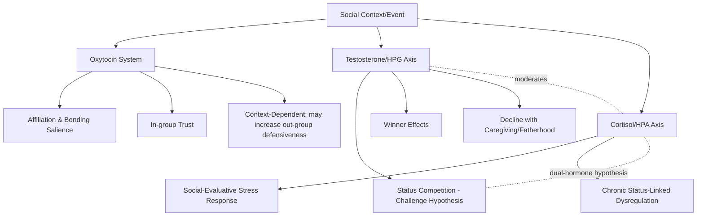

## Hormones and Social Behavior: Oxytocin, Testosterone, Cortisol

### Overview

Social neuroendocrinology examines how hormones influence, and are influenced by, social behavior and social context. Three hormones — oxytocin, testosterone, and cortisol — have received the most sustained attention in social neuroscience due to their proposed roles in bonding, status competition, and stress response respectively. Research in this area emphasizes bidirectional relationships between hormones and behavior: hormones shape social behavior, and social experiences in turn alter hormone levels.

### Oxytocin

#### Basic Physiology

Oxytocin is a neuropeptide synthesized primarily in the hypothalamus (paraventricular and supraoptic nuclei) and released both into the bloodstream via the posterior pituitary and directly within the brain, where it acts on oxytocin receptors distributed across regions including the amygdala, striatum, and prefrontal cortex.

**Key Points**

- Peripherally, oxytocin is well established as playing a role in childbirth (uterine contraction) and lactation (milk let-down), its most robustly documented physiological functions.
- Centrally, oxytocin is proposed to modulate social-affiliative behavior, though the precise mechanisms and generalizability of its effects across social contexts remain an active area of research rather than fully settled.
- Administration studies in humans typically use intranasal oxytocin, based on the assumption that intranasal delivery allows the peptide to reach central nervous system targets; [Unverified] the extent to which intranasally administered oxytocin actually crosses the blood-brain barrier in physiologically meaningful concentrations, versus acting primarily through peripheral or trigeminal/olfactory pathways, remains a genuinely debated methodological question in the field.

#### Proposed Social Effects

**Key Points**

- Oxytocin has been associated with increased trust in some studies, most notably in an influential trust-game paradigm in which intranasal oxytocin administration increased monetary transfers to a trustee relative to placebo, interpreted as increased trusting behavior.
- Oxytocin has been studied in relation to parent-infant bonding, with some studies reporting correlations between plasma oxytocin levels and parental bonding behaviors (e.g., gaze, affectionate touch, synchronized interaction) in both mothers and fathers.
- Some studies report oxytocin-associated improvements on certain theory-of-mind-related tasks (e.g., emotion recognition from the eye region), consistent with a proposed role in enhancing social-cognitive processing, though this specific finding has shown inconsistent replication.
- Oxytocin's amygdala-related effects have been reported to include reduced amygdala reactivity to threatening or fearful social stimuli in some studies, consistent with an anxiolytic (anxiety-reducing) social effect in certain contexts.

#### The "Tend and Befriend" and Context-Dependence

**Key Points**

- [Inference] Contrary to earlier popular framings of oxytocin as a simple, unconditional "love hormone" or "trust hormone," a substantial body of subsequent research indicates its effects are highly context-dependent and can, in some studies, increase in-group favoritism, envy, or defensive aggression toward out-group members rather than producing indiscriminately prosocial effects, suggesting a role in enhancing the salience of social bonds and group affiliation generally rather than producing universal prosociality.
- The tend-and-befriend model, proposed by Shelley Taylor and colleagues, suggests oxytocin (along with other mechanisms) may support an alternative to fight-or-flight stress responding, particularly relevant to caregiving and affiliative-seeking responses to stress, [Unverified] though the degree to which this pattern is sex-differentiated (originally proposed as more characteristic of female stress responses) remains debated and is not considered a fully settled claim within current behavioral endocrinology.

#### Replication Concerns

**Key Points**

- The broader intranasal oxytocin literature has faced substantial replication difficulties: numerous influential early findings, including some trust-game results, have shown inconsistent replication in subsequent, often better-powered studies.
- Methodological critiques include small original sample sizes, inconsistent dosing protocols, uncertainty regarding actual central nervous system bioavailability following intranasal administration, and publication bias favoring positive findings in the earlier literature.
- [Unverified] Given these concerns, current best practice in the field treats many specific oxytocin-behavior claims from the earlier literature with caution pending more rigorous, adequately powered, and pre-registered replication, while treating oxytocin's peripheral reproductive and lactation-related functions as comparatively well established.

### Testosterone

#### Basic Physiology

Testosterone is a steroid hormone produced primarily in the testes in males and in smaller amounts in the ovaries and adrenal glands in females, with well-documented roles in sexual differentiation, secondary sex characteristics, and reproductive physiology.

**Key Points**

- Testosterone acts both through relatively slow genomic pathways (via androgen receptors affecting gene transcription) and faster non-genomic pathways affecting neural excitability more rapidly.
- Basal testosterone levels vary considerably by age, sex, time of day (typically higher in the morning), and individual factors, requiring careful measurement protocols in research.

#### The Challenge Hypothesis and Status Competition

As introduced in the evolutionary social psychology material on status and dominance, the challenge hypothesis proposes that testosterone rises in anticipation of and following competitive status-relevant encounters, particularly wins, facilitating continued competitive and status-seeking behavior.

**Key Points**

- "Winner effects," in which testosterone rises further following competitive victory relative to defeat, have been documented across numerous studies of sports competition, laboratory competitive games, and some naturalistic status-relevant contexts.
- Testosterone administration studies have reported increased status-seeking and dominance-related behaviors in some experimental paradigms, though [Unverified] effects on more complex social behaviors (e.g., fairness, generosity, aggression) are considerably more mixed across the literature than the relatively more consistent competition-related winner-effect findings.
- Baseline testosterone has been associated in various studies with reduced empathic accuracy and increased self-reported dominance motivation, though effect sizes are generally modest and moderated by contextual and individual factors.

#### Testosterone and Fatherhood

**Key Points**

- Cross-sectional and some longitudinal studies report that testosterone levels decline following the transition to fatherhood and active caregiving involvement in many, though not all, studied populations, interpreted within a life-history theory framework proposing a tradeoff between mating effort (associated with higher testosterone) and parenting effort (associated with lower testosterone).
- [Inference] This finding is generally interpreted as consistent with a broader evolutionary hypothesis regarding hormonal tradeoffs between mating and parenting investment, though the degree of cross-cultural generalizability, given variation in caregiving norms and family structures across societies, remains a topic requiring further comparative research.

### Cortisol

#### Basic Physiology and the HPA Axis

Cortisol is a glucocorticoid hormone released as the end product of hypothalamic-pituitary-adrenal (HPA) axis activation, following a well-characterized signaling cascade: hypothalamic corticotropin-releasing hormone (CRH) triggers pituitary adrenocorticotropic hormone (ACTH) release, which in turn triggers adrenal cortisol release.

**Key Points**

- Cortisol follows a robust diurnal rhythm, typically peaking shortly after waking (the cortisol awakening response) and declining across the day, requiring standardized sampling timing in research designs.
- Cortisol is commonly assayed non-invasively from saliva, offering a practical measure of HPA axis activation in social stress research.

#### Social Stress and the Trier Social Stress Test

As introduced in the social neuroscience methods material, the Trier Social Stress Test (TSST), involving evaluative public speaking and mental arithmetic before judges, is the standard laboratory paradigm for inducing measurable social-evaluative stress.

**Key Points**

- The TSST reliably elicits significant cortisol reactivity in most studied samples, making social-evaluative threat (rather than purely physical or cognitive challenge alone) a particularly potent trigger of HPA axis activation, consistent with theoretical models proposing that social-evaluative threat is a especially salient stressor for humans.
- Individual differences in cortisol reactivity to social stressors have been studied extensively as markers of stress vulnerability, with both blunted and exaggerated reactivity patterns associated with different forms of psychopathology risk across various studies.

#### Cortisol and Social Status

**Key Points**

- Some studies report associations between chronic low social status or subordinate social position and elevated basal or chronically dysregulated cortisol patterns, consistent with a broader literature on socioeconomic status and health disparities linking perceived low control and status to chronic physiological stress burden.
- [Inference] These associations are generally interpreted within an allostatic load framework, in which chronic activation of stress-response systems across the lifespan contributes to cumulative physiological wear, though establishing direct causal pathways from social status to cortisol dysregulation to health outcomes in humans relies substantially on longitudinal and quasi-experimental rather than fully controlled experimental designs, given ethical and practical constraints on manipulating chronic social status.

### Hormonal Interactions and the Dual-Hormone Hypothesis

**Key Points**

- The dual-hormone hypothesis proposes that testosterone's association with status-seeking and dominance behavior is moderated by cortisol levels, such that testosterone's behavioral effects are more strongly expressed under conditions of low cortisol, while elevated cortisol may suppress or attenuate testosterone's status-seeking influence.
- [Unverified] Replication of the dual-hormone hypothesis has been mixed across subsequent studies, with some large-scale replication attempts failing to reproduce the originally reported interaction effects, leading to substantial ongoing debate about the robustness and boundary conditions of this specific hypothesis.
- This hormonal interaction research reflects a broader methodological shift in social neuroendocrinology toward examining hormone interactions and context-dependence rather than single-hormone, single-behavior relationships, given the recognized complexity of endocrine-behavior links.

### Diagram: Hormone-Behavior Relationships Overview

### Diagram: HPA Axis Cascade (svg_diagram)

<svg xmlns="http://www.w3.org/2000/svg" viewBox="0 0 640 300">
<text x="320" y="26" text-anchor="middle" font-size="16" font-weight="bold" fill="#222">HPA Axis Cascade (svg_diagram)</text>
<rect x="30" y="80" width="140" height="70" rx="8" fill="#d6eaf8" stroke="#2471a3" stroke-width="2" />
<text x="100" y="110" text-anchor="middle" font-size="12" font-weight="bold" fill="#1a5276">Hypothalamus</text>
<text x="100" y="128" text-anchor="middle" font-size="11" fill="#333">releases CRH</text>
<path d="M170,115 L235,115" stroke="#333" stroke-width="2" marker-end="url(#arrowh)" />
<rect x="240" y="80" width="140" height="70" rx="8" fill="#d5f5e3" stroke="#1e8449" stroke-width="2" />
<text x="310" y="110" text-anchor="middle" font-size="12" font-weight="bold" fill="#186a3b">Pituitary</text>
<text x="310" y="128" text-anchor="middle" font-size="11" fill="#333">releases ACTH</text>
<path d="M380,115 L445,115" stroke="#333" stroke-width="2" marker-end="url(#arrowh)" />
<rect x="450" y="80" width="140" height="70" rx="8" fill="#fdebd0" stroke="#b9770e" stroke-width="2" />
<text x="520" y="110" text-anchor="middle" font-size="12" font-weight="bold" fill="#7e5109">Adrenal Cortex</text>
<text x="520" y="128" text-anchor="middle" font-size="11" fill="#333">releases Cortisol</text>
<path d="M520,150 C520,220 200,240 100,150" stroke="#943126" stroke-width="2" stroke-dasharray="5,4" marker-end="url(#arrowh2)" fill="none" />
<text x="310" y="235" text-anchor="middle" font-size="11" fill="#943126">Negative feedback to hypothalamus/pituitary</text>
</svg>

### Methodological Considerations Across Hormone Research

**Key Points**

- Hormone measurement timing matters substantially given diurnal rhythms (especially for cortisol) and situational reactivity (especially for testosterone and cortisol in response to competition or stress), requiring standardized collection protocols.
- Baseline versus reactivity measures capture different constructs: baseline (trait-like) hormone levels and stimulus-evoked (state) hormonal reactivity are not interchangeable and can show different, sometimes divergent, relationships with behavior.
- Sex differences in baseline levels and in behavioral associations are common across all three hormones, and many landmark studies have used single-sex samples, limiting generalizability across sexes without direct replication in mixed or sex-stratified samples.
- As with other social neuroscience subfields, the broader replication crisis has particularly affected the oxytocin and dual-hormone hypothesis literatures, warranting appropriately cautious interpretation of specific effect claims pending more robust replication.

### Conclusion

Oxytocin, testosterone, and cortisol represent three of the most extensively studied hormones in social neuroendocrinology, implicated respectively in affiliative bonding, status competition, and stress response. While each hormone shows some well-established physiological functions (oxytocin in childbirth/lactation, testosterone in status-related winner effects, cortisol in the HPA stress cascade), many specific social-behavioral claims — particularly oxytocin's role as a general prosocial or trust hormone and the dual-hormone hypothesis interaction — have faced significant replication challenges and require more cautious interpretation than earlier popularized accounts suggested. Current best practice in the field emphasizes context-dependence, hormone interactions, and rigorous, adequately powered replication over single-hormone, single-behavior causal narratives.

**Related Topics**

- Challenge hypothesis and status competition (evolutionary social psychology)
- Trier Social Stress Test and HPA axis reactivity research
- Tend-and-befriend model of stress response
- Allostatic load and socioeconomic status health disparities
- Replication crisis in behavioral endocrinology
- Parental caregiving and hormonal change across the transition to parenthood
- Dual-hormone hypothesis and testosterone-cortisol interaction
- Oxytocin receptor genetics and individual differences
- Attachment theory and neuroendocrine bonding mechanisms
- Life history theory and mating-parenting tradeoffs