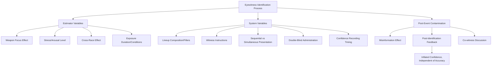

## Eyewitness Testimony and Memory Accuracy

### Overview

Eyewitness testimony has historically carried substantial weight in criminal justice proceedings despite decades of psychological research demonstrating that human memory is reconstructive rather than reproductive, and consequently vulnerable to distortion, contamination, and confidently held error. Applied social psychology in this domain examines the cognitive mechanisms underlying eyewitness error, the procedural factors that increase or decrease accuracy, and the reforms proposed to improve the reliability of eyewitness evidence within the legal system.

### The Reconstructive Nature of Memory

#### Memory as Reconstruction, Not Recording

**Key Points**

- Human memory does not function as a passive recording device; encoding, storage, and retrieval each involve active, constructive processes susceptible to distortion from expectation, subsequent information, and social influence.
- Elizabeth Loftus's foundational work on the misinformation effect demonstrated that post-event information, including subtly leading questions, can alter subsequent memory reports for a witnessed event, with participants sometimes confidently reporting details that were never actually present in the original event.
- [Inference] This reconstructive quality of memory is now considered well established within cognitive psychology broadly, though the precise boundary conditions determining when memory is most versus least susceptible to distortion continue to be refined through ongoing research.

#### The Misinformation Effect

**Key Points**

- In Loftus's classic paradigm, participants who view an event (e.g., a simulated car accident) and are subsequently exposed to misleading post-event information (e.g., a leading question using the word "smashed" rather than "hit") show measurably altered memory reports, including increased likelihood of falsely recalling details consistent with the misleading suggestion (e.g., broken glass that was not actually present).
- The magnitude of the misinformation effect has been shown to be sensitive to factors including the delay between the event and the misleading information, the perceived credibility or authority of the source providing the misinformation, and the degree of overlap between the misinformation and any true peripheral event details.
- [Unverified] The precise underlying mechanism of the misinformation effect (whether it reflects genuine memory trace alteration, source-monitoring confusion between what was witnessed versus what was suggested, or retrieval-based interference) remains a topic of theoretical debate within memory research, though all proposed mechanisms converge on the practical conclusion that post-event information can measurably distort eyewitness reports.

### Estimator Variables

#### Definition and Scope

Estimator variables are factors related to the witness, perpetrator, or environmental conditions at the time of the crime that influence memory accuracy but cannot be controlled by the criminal justice system after the fact.

**Key Points**

- **Weapon focus effect**: attention narrows toward a visible weapon during a crime, reducing encoding of other details including perpetrator facial features, consistently documented across numerous studies as reducing subsequent identification accuracy.
- **Stress and arousal**: extreme stress during an event has been associated with impaired memory encoding in several studies, contrary to lay intuition that highly stressful or emotionally significant events are remembered with greater accuracy; [Inference] the relationship is not perfectly linear, with some evidence suggesting a curvilinear (inverted-U) relationship between arousal and memory accuracy, though extreme stress specifically during violent crime witnessing tends to be associated with reduced identification accuracy across the literature.
- **Own-race bias / cross-race effect**: as introduced in the intergroup bias neuroscience material, witnesses show reliably poorer identification accuracy for perpetrators of a race different from their own, a robust and well-replicated finding with substantial real-world legal significance.
- **Exposure duration and viewing conditions**: shorter exposure time, poor lighting, greater distance, and disguises all reliably reduce identification accuracy, consistent with basic principles of perceptual encoding.
- **Witness age**: both young children and older adults show, on average, somewhat reduced identification accuracy and increased suggestibility relative to younger and middle-aged adults in various studies, though individual variability within age groups is considerable.

### System Variables

#### Definition and Scope

System variables are factors under the control of the criminal justice system, and are therefore the primary target of eyewitness identification reform efforts, since they can in principle be modified to reduce error.

**Key Points**

- **Lineup composition**: lineups (including photo arrays) should use fillers (known-innocent members) who resemble the general description of the suspect, to prevent the suspect from simply "standing out," a practice supported by extensive research on lineup fairness.
- **Instructions to witnesses**: explicitly informing witnesses that the actual perpetrator may or may not be present in the lineup has been shown to reduce false identification rates relative to lineups lacking this instruction, since without it witnesses may assume the perpetrator must be present and feel pressure to select someone.
- **Sequential versus simultaneous presentation**: presenting lineup members one at a time (sequential) rather than all at once (simultaneous) has been proposed to reduce witnesses' tendency toward relative judgment (comparing lineup members to each other and selecting the "best match" even when the true perpetrator is absent), though [Unverified] the relative superiority of sequential over simultaneous presentation has been debated in more recent research, with some large-scale studies suggesting the accuracy advantage is smaller, more context-dependent, or involves a tradeoff between reduced false identifications and reduced correct identifications, rather than being an unambiguous improvement.
- **Double-blind administration**: having the lineup administrator be unaware of which lineup member is the actual suspect is recommended to prevent both deliberate and unintentional cueing of the witness toward the suspect.
- **Confidence statements at time of identification**: recording witness confidence immediately at the time of identification (rather than later, after potential feedback) is recommended because initial confidence, under proper procedures, has been shown in some studies to correlate more meaningfully with accuracy than confidence expressed after subsequent confirming feedback, which can artificially inflate confidence independent of actual accuracy.

### The Confidence-Accuracy Relationship

#### Post-Identification Feedback Effect

**Key Points**

- Confirming feedback given to a witness after making an identification (e.g., "Good, you identified the suspect") has been shown in numerous studies to substantially inflate the witness's subsequent reported confidence, as well as retrospective reports of viewing conditions (e.g., how good their view was, how much attention they paid), independent of the identification's actual accuracy.
- This post-identification feedback effect is considered a major legal concern because jurors tend to weight witness confidence heavily as an indicator of accuracy, meaning feedback-inflated confidence can mislead legal fact-finders even when the underlying identification was inaccurate.
- [Inference] The confidence-accuracy relationship under pristine, uncontaminated conditions (no feedback, no repeated identification attempts, no discussion with other witnesses) has been argued in more recent research to be stronger than earlier literature suggested, leading some researchers to propose that confidence expressed at the time of an initial, uncontaminated identification can be a meaningfully informative indicator, in contrast with the weaker confidence-accuracy correlations found when feedback or contamination is present.

### Diagram: Sources of Eyewitness Error

### Diagram: Sequential vs. Simultaneous Lineup Logic (svg_diagram)

<svg xmlns="http://www.w3.org/2000/svg" viewBox="0 0 700 340">
<text x="350" y="26" text-anchor="middle" font-size="16" font-weight="bold" fill="#222">Simultaneous vs. Sequential Lineups (svg_diagram)</text>
<rect x="30" y="60" width="300" height="240" rx="10" fill="#fdebd0" stroke="#b9770e" stroke-width="2" />
<text x="180" y="90" text-anchor="middle" font-size="14" font-weight="bold" fill="#7e5109">Simultaneous</text>
<circle cx="90" cy="140" r="22" fill="#f9e79f" stroke="#7e5109" />
<circle cx="150" cy="140" r="22" fill="#f9e79f" stroke="#7e5109" />
<circle cx="210" cy="140" r="22" fill="#f9e79f" stroke="#7e5109" />
<circle cx="270" cy="140" r="22" fill="#f9e79f" stroke="#7e5109" />
<text x="180" y="200" text-anchor="middle" font-size="11" fill="#333">All members viewed at once</text>
<text x="180" y="220" text-anchor="middle" font-size="11" fill="#333">→ encourages relative</text>
<text x="180" y="238" text-anchor="middle" font-size="11" fill="#333">judgment comparison</text>
<rect x="370" y="60" width="300" height="240" rx="10" fill="#d6eaf8" stroke="#2471a3" stroke-width="2" />
<text x="520" y="90" text-anchor="middle" font-size="14" font-weight="bold" fill="#1a5276">Sequential</text>
<circle cx="420" cy="140" r="22" fill="#aed6f1" stroke="#1a5276" />
<text x="460" y="145" font-size="14" fill="#1a5276">→</text>
<circle cx="500" cy="140" r="22" fill="#e8e8e8" stroke="#999" stroke-dasharray="3,3" />
<text x="540" y="145" font-size="14" fill="#999">→</text>
<circle cx="600" cy="140" r="22" fill="#e8e8e8" stroke="#999" stroke-dasharray="3,3" />
<text x="520" y="200" text-anchor="middle" font-size="11" fill="#333">One member viewed at a time</text>
<text x="520" y="220" text-anchor="middle" font-size="11" fill="#333">→ encourages absolute</text>
<text x="520" y="238" text-anchor="middle" font-size="11" fill="#333">judgment per member</text>
</svg>

### Children's Eyewitness Testimony

**Key Points**

- Young children's memory reports have been shown in extensive research to be particularly susceptible to suggestive interviewing techniques, including repeated leading questions and social pressure to conform to an interviewer's expectations, findings with significant implications for child abuse investigation protocols.
- This research has driven the development of structured, non-suggestive forensic interview protocols (e.g., open-ended questioning approaches) specifically designed to minimize contamination while still eliciting accurate information from child witnesses.
- [Inference] Despite heightened suggestibility risk, properly conducted forensic interviews using non-leading, developmentally appropriate techniques can still elicit accurate and forensically useful information from children, indicating that suggestibility concerns argue for interview protocol reform rather than wholesale dismissal of children's testimony.

### Legal and Policy Impact

**Key Points**

- DNA exoneration data (notably compiled by organizations such as the Innocence Project) has repeatedly identified mistaken eyewitness identification as among the most common contributing factors in wrongful conviction cases, providing powerful real-world validation of laboratory-based eyewitness memory research.
- Several jurisdictions have adopted reformed lineup procedures (double-blind administration, proper witness instructions, confidence recording) informed directly by this research base, though [Unverified] adoption remains inconsistent across jurisdictions, and implementation quality varies, meaning laboratory-supported best practices are not uniformly applied in real-world criminal justice settings.
- Expert testimony on eyewitness memory limitations has become increasingly accepted in many courts as a mechanism for informing juries about factors (cross-race bias, weapon focus, confidence-accuracy dissociation under contaminated conditions) that are often counterintuitive to lay jurors' assumptions about memory reliability.

### Conclusion

Eyewitness testimony research demonstrates that human memory, while often functionally useful, is a reconstructive process vulnerable to systematic distortion from estimator variables (situational and witness characteristics outside system control) and system variables (procedural factors under criminal justice system control). The misinformation effect, cross-race bias, weapon focus effect, and post-identification feedback effect collectively explain much of the gap between eyewitness confidence and eyewitness accuracy that has contributed to documented wrongful convictions. Reformed procedures — including double-blind administration, proper witness instructions, and immediate confidence recording — represent evidence-based interventions designed to reduce this gap, though the relative merits of specific reforms (such as sequential versus simultaneous lineup presentation) remain subjects of ongoing empirical refinement.

**Related Topics**

- Misinformation effect and false memory research (Loftus)
- Cross-race effect and its neural correlates
- Wrongful conviction and DNA exoneration research (Innocence Project data)
- Forensic interviewing protocols for child witnesses
- Confidence-accuracy relationship in eyewitness identification
- Weapon focus effect and attentional narrowing under stress
- Double-blind lineup administration procedures
- Jury decision-making and perception of witness credibility
- False memory implantation studies (e.g., "lost in the mall" paradigm)
- Repressed memory controversy and recovered memory debates