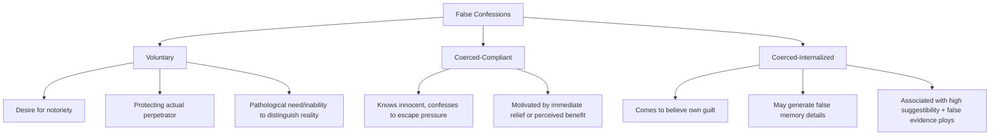

## False Confessions and Interrogation Psychology

### Overview

False confessions represent one of the most counterintuitive phenomena documented in applied social psychology: individuals sometimes confess to crimes they did not commit, occasionally in convincing detail. Interrogation psychology examines the situational and psychological pressures embedded in standard interrogation techniques that can produce false confessions, the classification systems used to understand different false confession types, and the individual vulnerabilities that heighten susceptibility to this outcome.

### Why False Confessions Occur: Foundational Puzzle

#### Counterintuitive Nature

**Key Points**

- Lay intuition, and historically much of the legal system, has treated confession as among the most powerful forms of evidence, on the assumption that no innocent person would confess to a crime they did not commit.
- DNA exoneration data has repeatedly identified false confession as a contributing factor in a substantial proportion of wrongful conviction cases, providing strong real-world evidence that the phenomenon, while counterintuitive, is neither rare nor trivial in its legal consequences.
- [Inference] The persistence of false confession despite its apparent irrationality is generally explained by researchers as resulting from the convergence of powerful situational pressures (interrogation tactics) with individual vulnerabilities, rather than reflecting simple confusion or unusual character on the part of those who falsely confess.

### The Reid Technique and Standard Interrogation Practice

#### Structure and Rationale

The Reid Technique, historically one of the most widely used structured interrogation methods in North American law enforcement, is built around a presumption-of-guilt framework applied once investigators have decided, often based on a preliminary behavioral analysis interview, that a suspect is likely guilty.

**Key Points**

- The technique traditionally involves two phases: a non-accusatory behavioral analysis interview intended to assess deception (though the specific behavioral cues traditionally relied upon, such as gaze aversion or fidgeting, have been extensively challenged by subsequent deception-detection research as unreliable indicators), followed by an accusatory, guilt-presumptive interrogation phase for suspects judged deceptive.
- The accusatory phase employs a structured sequence of techniques including confrontation with (sometimes fabricated) evidence of guilt, minimization of the moral seriousness of the offense to make confession feel more psychologically acceptable, and systematic blocking of denials.
- [Unverified] The reliability of the initial behavioral-cue-based deception judgment has been substantially challenged by decades of subsequent deception-detection research, which generally finds that humans, including trained interviewers, perform only marginally better than chance at distinguishing truth from deception based on behavioral cues alone, raising concern about interrogations proceeding from an unreliable initial guilt determination.

#### Psychologically Coercive Elements

**Key Points**

- **Maximization**: exaggerating the strength of evidence against the suspect and the severity of likely consequences if they do not cooperate, intended to increase perceived pressure to confess.
- **Minimization**: offering face-saving moral justifications or downplaying the seriousness of the alleged act, intended to make confession feel like a less consequential or more understandable choice, sometimes implicitly suggesting leniency without an explicit, legally required promise.
- **False evidence ploys**: presenting fabricated evidence (e.g., a false claim that DNA or a codefendant's statement implicates the suspect), a practice legal in most U.S. jurisdictions but heavily criticized by psychological researchers as substantially increasing false confession risk, particularly interacting with certain individual vulnerabilities.
- [Inference] The cumulative effect of prolonged, high-pressure, guilt-presumptive interrogation combined with these specific tactics is generally understood by researchers to create a situation where confessing, even falsely, can come to seem like the most immediately advantageous or least aversive available option to a suspect under extreme psychological pressure, though the precise weighting of each individual tactic's contribution to false confession risk varies across cases and is difficult to isolate experimentally with full ecological validity.

### Kassin and Wrightsman's Classification of False Confessions

#### Voluntary False Confessions

**Key Points**

- Confessions offered without significant external pressure from interrogators, sometimes motivated by a desire for notoriety, a pathological need for self-punishment, an inability to distinguish reality from fantasy, or a desire to protect the actual perpetrator (commonly a family member).
- This category is considered the least directly attributable to interrogation tactics, since by definition it does not primarily result from coercive interrogation pressure, though it remains a documented category within the broader false confession literature.

#### Coerced-Compliant False Confessions

**Key Points**

- The suspect confesses despite knowing they are innocent, as a strategic response to the immediate pressures of interrogation, motivated by a desire to escape an aversive interrogation situation, avoid an explicit or implied threat, or obtain a promised or implied benefit (e.g., ability to go home, avoidance of a harsher outcome).
- This is generally considered the most common documented type of false confession in the applied research literature, directly implicating the coercive potential of standard high-pressure interrogation techniques.
- [Inference] Suspects providing coerced-compliant confessions typically retain accurate knowledge that they did not commit the crime, distinguishing this category from coerced-internalized confessions, though the psychological experience of extreme distress during the interrogation itself can complicate this distinction in practice.

#### Coerced-Internalized False Confessions

**Key Points**

- The suspect, as a result of highly suggestive and prolonged interrogation techniques, comes to genuinely believe they may have committed the crime, despite actual innocence, sometimes including the generation of vivid, though false, "memories" of the crime.
- This category is considered the most psychologically striking and is associated with specific risk factors including suspect vulnerability (youth, cognitive impairment, sleep deprivation, intoxication) combined with highly suggestive interrogation involving confidently presented false evidence.
- [Unverified] The precise mechanisms by which internalized false confessions and associated false memories form remain an active area of research, drawing on broader memory and suggestibility research (including the misinformation effect discussed in the eyewitness testimony material), though the phenomenon itself is well documented through case analysis and laboratory analog studies.

### Individual Vulnerability Factors

**Key Points**

- **Youth**: adolescents and juveniles show elevated false confession risk in documented cases, attributed to less developed capacity to resist authority pressure, weigh long-term consequences, and understand the legal implications of confession relative to adults.
- **Cognitive impairment and intellectual disability**: individuals with intellectual disabilities are disproportionately represented among documented false confession cases, plausibly reflecting heightened suggestibility, difficulty understanding legal rights and interrogation dynamics, and a documented tendency toward acquiescence (agreeing with authority figures) in some studies.
- **Mental illness**: certain psychiatric conditions have been associated with elevated false confession risk in case analyses, plausibly related to factors including impaired reality testing, heightened suggestibility, or difficulty coping with interrogation stress, though this relationship varies considerably by specific condition and is not uniform across all forms of mental illness.
- **Sleep deprivation and interrogation duration**: prolonged interrogations, sometimes lasting many hours, have been associated with increased false confession risk in both case analyses and laboratory analog research, consistent with broader research on sleep deprivation's effects on decision-making, self-control, and susceptibility to suggestion.
- **Dispositional suggestibility**: individual differences in interrogative suggestibility, sometimes measured using standardized psychological instruments, have been associated with differential vulnerability to leading questions and pressure within interrogation-like contexts.

### Laboratory Analog Research

#### The Kassin and Kiechel Paradigm

A frequently cited laboratory analog study by Kassin and Kiechel demonstrated that innocent participants falsely accused of causing a computer error could be induced to sign a false confession, and in some cases internalize false belief and generate false confabulated details, particularly when presented with fabricated "witness" evidence.

**Key Points**

- This and related paradigms allow researchers to study false confession dynamics under controlled, ethical laboratory conditions, complementing case-based analysis of real-world false confessions which cannot ethically be studied experimentally in their full form.
- [Inference] While laboratory analog studies necessarily involve lower stakes than real criminal interrogations, researchers argue they provide valuable experimental evidence for the underlying psychological mechanisms (pressure, false evidence, suggestibility) that plausibly generalize, at least in direction if not necessarily in magnitude, to higher-stakes real-world interrogation contexts.

### Diagram: Kassin-Wrightsman False Confession Typology

### Diagram: Interrogation Pressure Funnel (svg_diagram)

<svg xmlns="http://www.w3.org/2000/svg" viewBox="0 0 640 380">
<text x="320" y="26" text-anchor="middle" font-size="16" font-weight="bold" fill="#222">Interrogation Pressure Funnel (svg_diagram)</text>
<rect x="80" y="60" width="480" height="60" fill="#d6eaf8" stroke="#2471a3" stroke-width="2" />
<text x="320" y="95" text-anchor="middle" font-size="13" fill="#1a5276">Guilt-Presumptive Framing + Behavioral Analysis</text>
<polygon points="110,130 530,130 470,190 170,190" fill="#aed6f1" stroke="#2471a3" stroke-width="2" />
<text x="320" y="165" text-anchor="middle" font-size="13" fill="#1a5276">Confrontation + False Evidence Ploys</text>
<polygon points="170,200 470,200 410,260 230,260" fill="#85c1e9" stroke="#1a5276" stroke-width="2" />
<text x="320" y="235" text-anchor="middle" font-size="12" fill="#0e3e5c">Maximization / Minimization</text>
<polygon points="230,270 410,270 370,330 270,330" fill="#5dade2" stroke="#0e3e5c" stroke-width="2" />
<text x="320" y="305" text-anchor="middle" font-size="11" fill="#fff">Blocked Denials,</text>
<text x="320" y="320" text-anchor="middle" font-size="11" fill="#fff">Prolonged Duration</text>
<rect x="270" y="340" width="100" height="30" fill="#943126" stroke="#5c1e15" stroke-width="2" />
<text x="320" y="360" text-anchor="middle" font-size="11" fill="#fff">Confession</text>
</svg>

### Legal Reforms and Safeguards

**Key Points**

- **Mandatory electronic recording of interrogations** (audio and/or video, ideally from the start of an interrogation rather than only the final confession statement) has been widely recommended by researchers and adopted in various jurisdictions, allowing after-the-fact review of the techniques used and reducing disputes about what occurred during questioning.
- **Restrictions or prohibitions on false evidence ploys**, particularly with vulnerable populations such as juveniles, have been proposed and adopted in some jurisdictions, informed directly by research on the elevated false confession risk this tactic introduces.
- **Time limits on interrogation duration** have been proposed as a safeguard given the documented association between prolonged interrogation and false confession risk, though [Unverified] specific time-limit policies vary considerably across jurisdictions and are not uniformly adopted.
- **Alternative interviewing models**, such as investigative interviewing approaches developed and adopted in some countries (e.g., the PEACE model used in the United Kingdom), emphasize information-gathering over guilt-presumptive confrontation, and have been proposed by researchers as evidence-based alternatives to confrontational interrogation techniques, though [Unverified] direct comparative research on false confession rates between these differing interrogation models across varied real-world contexts remains more limited than laboratory analog and case-based evidence for the risks of confrontational techniques specifically.
- Expert testimony on false confession psychology has become increasingly accepted in various courts as a way to inform juries about the counterintuitive nature and situational determinants of false confession, given its conflict with strong lay intuitions about confession reliability.

### Conclusion

False confession research demonstrates that standard confrontational interrogation techniques, particularly guilt-presumptive framing, false evidence ploys, and prolonged high-pressure questioning, can under certain conditions induce innocent individuals to confess falsely, whether compliantly (while knowing their innocence) or, in more psychologically striking cases, through internalized false belief in their own guilt. Vulnerability factors including youth, cognitive impairment, mental illness, sleep deprivation, and dispositional suggestibility substantially heighten this risk. This body of research, strongly corroborated by DNA exoneration case data, has driven significant reform efforts including mandatory interrogation recording, restrictions on false evidence tactics, and adoption of less confrontational, information-gathering-oriented interviewing models in various jurisdictions.

**Related Topics**

- Reid Technique and its critiques
- PEACE model of investigative interviewing
- DNA exoneration research and wrongful conviction analysis (Innocence Project)
- Deception detection accuracy and behavioral cue research
- Interrogative suggestibility (Gudjonsson Suggestibility Scale)
- Juvenile competency and Miranda rights comprehension
- Misinformation effect and false memory formation (eyewitness testimony)
- Sleep deprivation and decision-making under duress
- Jury perceptions of confession evidence
- Electronic recording policy reform across jurisdictions