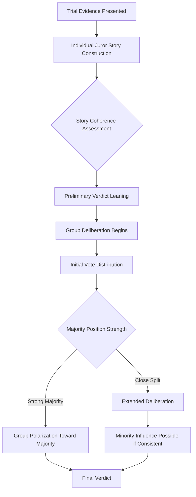

## Jury Decision-Making

### Overview

Jury decision-making examines how groups of laypeople process trial evidence, form individual judgments, and reach collective verdicts, integrating research on individual juror cognition, small-group dynamics, and systemic factors such as jury selection and instruction comprehension. This applied research area draws heavily on core social psychological findings regarding persuasion, group polarization, conformity, and heuristic-based judgment, while accounting for the distinctive institutional context of the courtroom.

### Models of Individual Juror Decision-Making

#### The Story Model

The story model, developed primarily by Pennington and Hastie, proposes that jurors do not evaluate trial evidence as a simple accumulation of discrete facts, but instead actively construct a coherent narrative or "story" that organizes and makes sense of the evidence presented.

**Key Points**

- Under this model, jurors compare the plausibility and completeness of competing narratives (e.g., prosecution's story versus defense's story) and are more likely to render a verdict consistent with whichever narrative they find more coherent, plausible, and complete, relatively independent of the strict logical weight of individual evidence items considered in isolation.
- Evidence presented in a story-consistent chronological order has been shown in some studies to be processed and recalled more effectively, and associated with different verdict patterns, than the same evidence presented in a more disorganized or witness-order sequence, consistent with the model's emphasis on narrative coherence.
- [Inference] The story model is generally treated as one of the more empirically supported frameworks for understanding juror cognition, though it is not considered a complete account, since other cognitive factors (heuristic use, pretrial bias, emotional response) also demonstrably influence verdict outcomes independent of narrative coherence alone.

#### Heuristics and Biases in Juror Judgment

**Key Points**

- **Confirmation bias**: jurors, once forming an initial impression (sometimes as early as opening statements), have been shown in various studies to subsequently interpret ambiguous evidence in ways that confirm their initial leaning, consistent with broader confirmation bias research outside the legal context.
- **Anchoring effects**: numeric requests, such as damage award amounts suggested by attorneys, have been shown to influence subsequent juror numeric judgments even when jurors are explicitly informed the anchor figure is not evidence, consistent with the broader anchoring-and-adjustment literature in judgment and decision-making research.
- **Hindsight bias**: jurors evaluating whether a defendant's actions were reasonable or foreseeable have been shown in some studies to be influenced by knowledge of the actual outcome, tending to view outcomes as having been more predictable in advance than they plausibly were, relevant particularly in negligence and foreseeability determinations.
- **Pretrial publicity effects**: exposure to negative pretrial media coverage has been associated in various studies with increased likelihood of pre-formed guilt judgments prior to trial evidence presentation, a well-documented concern underlying legal mechanisms such as venue change requests and extended voir dire.

### Group Dynamics in Jury Deliberation

#### Group Polarization

**Key Points**

- Group polarization, the broader social psychological finding that group discussion tends to shift the group's collective judgment toward a more extreme version of the individual members' initial leaning, has been documented in jury deliberation research, particularly regarding punitive damage awards, where post-deliberation awards have been shown in some studies to exceed the median of pre-deliberation individual juror preferences.
- [Inference] This polarization effect is generally explained using the same mechanisms proposed for group polarization broadly (persuasive arguments theory and social comparison theory), though the specific institutional context of jury deliberation (formal procedural constraints, requirement for consensus or supermajority, presence of instructions) may moderate the magnitude of polarization relative to less structured group discussion contexts.

#### The Leniency Bias and Verdict-Driven Deliberation

**Key Points**

- Jury simulation research has documented what is sometimes termed a "leniency bias," wherein deliberating juries are, in some studies, somewhat more likely to acquit than the median individual pre-deliberation juror preference would predict, particularly in cases with initially closely divided jury sentiment.
- Two contrasting deliberation styles have been described in jury research: "verdict-driven" deliberation, in which jurors take an early vote and organize discussion around justifying predetermined positions, versus "evidence-driven" deliberation, in which jurors review and discuss the evidence more thoroughly before taking a formal vote; [Unverified] the relative prevalence and outcome consequences of these two deliberation styles across varied real jury contexts (as opposed to mock jury studies) is difficult to establish given the practical and, in most U.S. jurisdictions, legal barriers to directly observing real jury deliberations.
- Initial jury vote distribution (the split at the first informal or formal vote) has been shown in various studies to be strongly predictive of eventual verdict outcome, consistent with the broader finding that deliberation more often clarifies and consolidates majority sentiment than fundamentally reverses it, though genuine minority-driven verdict shifts do occur and have been studied specifically for their distinctive dynamics.

#### Minority Influence in Deliberation

**Key Points**

- Consistent with Moscovici's broader minority influence research, a minority faction within a jury that maintains a consistent, confident position has been shown in some jury simulation studies to be more persuasive in shifting majority opinion than a minority whose position appears inconsistent or wavering.
- [Inference] This finding connects jury deliberation research to the broader social influence literature on minority influence more generally, suggesting the same behavioral consistency principles documented in laboratory small-group studies plausibly extend to the jury deliberation context, though direct empirical confirmation specifically within real jury settings remains limited by the practical constraints on observing genuine jury deliberations noted above.

### Jury Selection and Voir Dire

#### Scientific Jury Selection

**Key Points**

- Scientific jury selection refers to the use of psychological and demographic research, surveys, and sometimes trial consultants, to inform attorney decisions during voir dire (the jury selection process) regarding which potential jurors to challenge or retain.
- [Unverified] The actual predictive validity of scientific jury selection techniques in improving trial outcomes for the retaining party is debated within the research literature; some studies suggest demographic and personality-based prediction of individual juror verdict preferences is considerably weaker and less reliable than the trial consulting industry's marketing claims might suggest, with case-specific attitudinal questions (attitudes directly relevant to the specific facts or legal issues in the case) generally showing somewhat better predictive validity than broad demographic characteristics alone.
- Death-qualification procedures (excluding jurors unwilling to impose the death penalty in capital cases) have been studied specifically for their effects on jury composition and verdict tendencies; some research has associated death-qualified juries with somewhat greater conviction-proneness relative to jurors excluded through this process, a finding with significant legal and ethical implications given its structural role in capital case jury composition.

### Jury Instructions and Comprehension

#### The Comprehension Problem

**Key Points**

- A substantial body of research has documented that jurors frequently struggle to accurately understand and apply standard legal jury instructions, particularly regarding technical legal concepts such as reasonable doubt, burden of proof, and the specific elements of complex charges.
- Comprehension difficulties have been attributed in various studies to instructions' dense legal language, complex syntactic structure, and instructions being delivered orally, often only once, without accompanying written materials in many traditional courtroom procedures.
- **Instruction reform efforts**, including plain-language rewriting of standard jury instructions and provision of written instructions for jurors to reference during deliberation, have been shown in various studies to improve comprehension relative to traditional legal-language, oral-only instruction delivery, informing ongoing court reform efforts in various jurisdictions.

### Diagram: Juror Cognitive Process Model

### Diagram: Verdict-Driven vs. Evidence-Driven Deliberation Styles (svg_diagram)

<svg xmlns="http://www.w3.org/2000/svg" viewBox="0 0 680 340">
<text x="340" y="26" text-anchor="middle" font-size="16" font-weight="bold" fill="#222">Deliberation Style Comparison (svg_diagram)</text>
<rect x="30" y="60" width="290" height="240" rx="10" fill="#fdebd0" stroke="#b9770e" stroke-width="2" />
<text x="175" y="90" text-anchor="middle" font-size="14" font-weight="bold" fill="#7e5109">Verdict-Driven</text>
<text x="175" y="120" text-anchor="middle" font-size="11" fill="#333">1. Early informal vote</text>
<text x="175" y="145" text-anchor="middle" font-size="11" fill="#333">2. Discussion organized around</text>
<text x="175" y="163" text-anchor="middle" font-size="11" fill="#333">defending existing positions</text>
<text x="175" y="195" text-anchor="middle" font-size="11" fill="#333">3. Evidence reviewed selectively</text>
<text x="175" y="213" text-anchor="middle" font-size="11" fill="#333">to support prior stance</text>
<text x="175" y="255" text-anchor="middle" font-size="11" fill="#943126">Risk: premature closure,</text>
<text x="175" y="273" text-anchor="middle" font-size="11" fill="#943126">confirmation bias</text>
<rect x="360" y="60" width="290" height="240" rx="10" fill="#d5f5e3" stroke="#1e8449" stroke-width="2" />
<text x="505" y="90" text-anchor="middle" font-size="14" font-weight="bold" fill="#186a3b">Evidence-Driven</text>
<text x="505" y="120" text-anchor="middle" font-size="11" fill="#333">1. Evidence reviewed first</text>
<text x="505" y="145" text-anchor="middle" font-size="11" fill="#333">2. Open discussion of</text>
<text x="505" y="163" text-anchor="middle" font-size="11" fill="#333">narrative coherence</text>
<text x="505" y="195" text-anchor="middle" font-size="11" fill="#333">3. Formal vote taken</text>
<text x="505" y="213" text-anchor="middle" font-size="11" fill="#333">after full discussion</text>
<text x="505" y="255" text-anchor="middle" font-size="11" fill="#186a3b">Associated with more</text>
<text x="505" y="273" text-anchor="middle" font-size="11" fill="#186a3b">thorough evidence review</text>
</svg>

### Special Topics: Damages, Complex Evidence, and Expert Testimony

**Key Points**

- Jurors' handling of complex scientific or statistical evidence (e.g., DNA statistics, epidemiological evidence) has been documented in various studies as a persistent comprehension challenge, with jurors sometimes over-relying on expert witness credibility and communication style as a heuristic substitute for genuine evaluation of complex technical content.
- Damage award research has documented substantial variability and limited within-case consistency in juror-assigned monetary values for pain and suffering and punitive damages, attributed in various studies to the absence of a natural, intuitively anchored numeric scale for translating harm into dollar amounts, in contrast to more straightforward economic damage calculations.
- [Inference] These findings have motivated ongoing legal and psychological research into improved methods for presenting complex or statistical evidence to jurors (e.g., visual aids, simplified statistical framing) intended to improve comprehension and reduce reliance on non-evidentiary heuristics, though the comparative effectiveness of specific presentation reforms across varied case types remains an active area of applied research rather than fully settled practice.

### Conclusion

Jury decision-making integrates individual cognitive processes, most prominently narrative-based story construction and susceptibility to common judgment heuristics and biases, with small-group dynamics including polarization, leniency effects, and minority influence during deliberation. Systemic factors, including the effectiveness (and limits) of scientific jury selection and persistent challenges in juror comprehension of legal instructions and complex evidence, further shape verdict outcomes. This body of applied social psychological research has informed ongoing legal reform efforts, including plain-language jury instructions and structured deliberation guidance, aimed at improving the accuracy and fairness of jury-based legal decision-making.

**Related Topics**

- Story model of juror decision-making (Pennington and Hastie)
- Group polarization and persuasive arguments theory
- Minority influence research (Moscovici)
- Scientific jury selection and trial consulting
- Death qualification and capital jury composition research
- Plain-language jury instruction reform
- Pretrial publicity and change of venue research
- Hindsight bias and foreseeability judgments
- Eyewitness testimony and memory accuracy (related applied topic)
- False confessions and interrogation psychology (related applied topic)