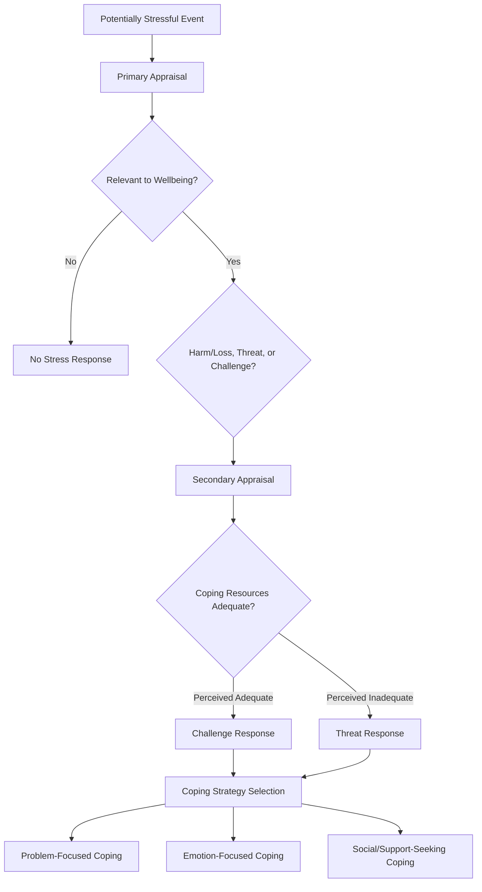

## Social Psychological Approaches to Stress and Coping

### Overview

Social psychological approaches to stress and coping examine how appraisal processes, social relationships, and identity-related factors shape the experience of stress and the strategies individuals use to manage it. Unlike purely biological stress models, this tradition emphasizes the subjective, socially embedded, and interpersonally regulated nature of stress, integrating cognitive appraisal theory, social support research, and coping strategy classification.

### The Transactional Model of Stress

#### Lazarus and Folkman's Cognitive Appraisal Framework

The transactional model, developed by Richard Lazarus and Susan Folkman, proposes that stress is not a direct property of external events themselves, but arises from the transaction between a person and their environment, mediated by cognitive appraisal processes.

**Key Points**

- **Primary appraisal**: an initial evaluation of whether an event is relevant to one's wellbeing, and if so, whether it represents a harm/loss, threat, or challenge.
- **Secondary appraisal**: an evaluation of one's perceived resources and capacity to cope with the demands posed by the event, including assessment of available coping options and their likely effectiveness.
- The subjective experience of stress, under this model, results from the interaction between primary appraisal (perceived demand) and secondary appraisal (perceived coping resources), such that the same objective event can be experienced as highly stressful by one person and as a manageable challenge by another, depending on their appraisal process.
- [Inference] This model is widely regarded as foundational within social and health psychological stress research, though it has been critiqued for placing primary emphasis on individual cognitive appraisal in ways that some researchers argue underweight structural and chronic social-contextual stressors that operate somewhat independently of moment-to-moment individual appraisal.

#### Reappraisal and Emotion Regulation

**Key Points**

- Cognitive reappraisal, the deliberate reinterpretation of a stressor's meaning to alter its emotional impact, has been extensively studied as an emotion regulation strategy, with substantial research associating habitual reappraisal use with more favorable emotional and, in some studies, physiological outcomes relative to habitual suppression-based regulation strategies.
- Challenge versus threat appraisal distinctions have been linked in various studies to differing physiological stress response profiles, with challenge appraisals (where perceived resources are judged adequate to meet demands) associated with more adaptive cardiovascular response patterns than threat appraisals (where demands are judged to exceed resources) in several studies using the Biopsychosocial Model of challenge and threat.

### Coping Strategy Classification

#### Problem-Focused Versus Emotion-Focused Coping

**Key Points**

- **Problem-focused coping**: strategies directed at directly addressing or altering the source of stress itself, such as active problem-solving, information-seeking, or direct confrontation of the stressor.
- **Emotion-focused coping**: strategies directed at managing the emotional response to a stressor rather than the stressor itself, including strategies such as reappraisal, acceptance, distraction, or emotional expression.
- Research broadly suggests problem-focused coping is more adaptive for controllable stressors, while emotion-focused coping may be more adaptive for uncontrollable stressors, consistent with a goodness-of-fit hypothesis proposing that coping effectiveness depends on matching strategy type to the objective controllability of the stressor rather than either strategy being universally superior.
- [Unverified] While this goodness-of-fit framework is influential, empirical support for its precise predictive claims has been somewhat mixed across specific studies and stressor types, and some researchers argue the problem-focused/emotion-focused distinction oversimplifies a more multidimensional coping strategy space.

#### Additional Coping Dimensions

**Key Points**

- **Approach versus avoidance coping**: a related but distinct dimension concerning whether coping efforts are directed toward engaging with the stressor and associated emotions (approach) or toward distancing from and avoiding them (avoidance), with avoidance coping generally, though not universally, associated with poorer long-term adjustment outcomes in chronic stress contexts.
- **Meaning-focused coping**: strategies involving drawing on beliefs, values, and goals to find or sustain a sense of meaning and positive significance despite adversity, particularly studied in the context of chronic illness and bereavement.
- **Social coping**: seeking emotional or instrumental support from others as a coping strategy, conceptually bridging individual coping strategy research and the broader social support literature discussed below.

### Social Support and Stress Buffering

#### Types of Social Support

**Key Points**

- **Emotional support**: expressions of empathy, care, and validation from others.
- **Instrumental support**: tangible assistance, such as material aid or direct help with tasks.
- **Informational support**: advice, guidance, or information relevant to managing the stressor.
- **Appraisal support**: feedback relevant to self-evaluation, helping an individual assess their own coping efforts or situation.

#### The Stress-Buffering and Main Effect Models

**Key Points**

- The **stress-buffering model** proposes that social support is particularly protective specifically under conditions of high stress, moderating (buffering) the relationship between stress exposure and negative outcomes, with weaker or negligible protective effects under low-stress conditions.
- The **main effect model** proposes that social support confers benefits on wellbeing and health broadly, regardless of current stress level, through mechanisms such as promoting a general sense of stability, self-esteem, and integration into a supportive social network.
- [Inference] Empirical support has been found for both models depending on the specific type of social support measure used (structural measures such as network size versus functional measures such as perceived support quality) and the specific outcome studied, suggesting these models may not be mutually exclusive but rather applicable under different measurement and outcome conditions.

#### The Complexity of Support Provision

**Key Points**

- Received social support (support objectively provided) and perceived social support (support the individual believes is available) are only modestly correlated in various studies, with perceived support generally showing stronger and more consistent associations with wellbeing outcomes than received support, a counterintuitive finding with significant implications for how support interventions are designed and evaluated.
- **Invisible support**, support provided in ways the recipient does not consciously register as support (e.g., a partner subtly handling a stressor without drawing attention to their assistance), has been associated in some studies with more favorable outcomes than more visible support provision, plausibly because visible support can sometimes carry costs such as implied incompetence or threat to self-esteem.
- Poorly matched support (e.g., unsolicited advice when emotional validation was desired, or emotional comfort when practical problem-solving assistance was needed) has been documented in various studies as potentially ineffective or even counterproductive, underscoring that support quantity alone is an incomplete predictor of support effectiveness.

### Social Identity and Stress

#### Group Membership as a Coping Resource

**Key Points**

- Consistent with the social identity approach to health (sometimes termed the "social cure" perspective), membership in valued social groups has been associated in various studies with enhanced coping capacity, plausibly through mechanisms including increased access to group-based social support, a sense of shared identity-based meaning, and collective efficacy in addressing shared stressors.
- Multiple group memberships have been associated in some studies with greater resilience during stressful life transitions (e.g., retirement, relocation, bereavement), consistent with a proposed "social identity mapping" framework in which retaining or gaining valued group memberships helps buffer identity disruption associated with major life stressors.
- [Inference] This social identity-based framework represents a more recent theoretical development relative to earlier, more individually focused stress and coping models, and is generally presented by its proponents as complementary to, rather than a replacement for, the transactional and social support models described above.

### Diagram: Transactional Model of Stress

### Diagram: Stress-Buffering vs. Main Effect Models of Social Support (svg_diagram)

<svg xmlns="http://www.w3.org/2000/svg" viewBox="0 0 680 360">
<text x="340" y="26" text-anchor="middle" font-size="16" font-weight="bold" fill="#222">Social Support Models (svg_diagram)</text>

<text x="200" y="55" text-anchor="middle" font-size="13" font-weight="bold" fill="`#1a5276`">Stress-Buffering Model</text>

<line x1="60" y1="200" x2="360" y2="200" stroke="#333" stroke-width="1.5" />

<line x1="60" y1="200" x2="60" y2="80" stroke="#333" stroke-width="1.5" />

<text x="210" y="220" text-anchor="middle" font-size="10" fill="#555">Stress Level →</text>

<text x="30" y="140" text-anchor="middle" font-size="10" fill="#555" transform="rotate(-90 30 140)">Negative Outcome</text>

<path d="M60,90 L360,190" stroke="#c0392b" stroke-width="2.5" />
<path d="M60,90 L360,110" stroke="#1e8449" stroke-width="2.5" />
<text x="365" y="192" font-size="10" fill="#943126">Low support</text>
<text x="365" y="112" font-size="10" fill="#186a3b">High support</text>
<text x="210" y="245" text-anchor="middle" font-size="10" fill="#555">Support matters more as stress rises</text>

<text x="530" y="55" text-anchor="middle" font-size="13" font-weight="bold" fill="`#1a5276`">Main Effect Model</text>

<line x1="410" y1="200" x2="650" y2="200" stroke="#333" stroke-width="1.5" />

<line x1="410" y1="200" x2="410" y2="80" stroke="#333" stroke-width="1.5" />

<text x="530" y="220" text-anchor="middle" font-size="10" fill="#555">Stress Level →</text>

<path d="M410,150 L650,150" stroke="#1e8449" stroke-width="2.5" />
<path d="M410,190 L650,190" stroke="#c0392b" stroke-width="2.5" />
<text x="530" y="245" text-anchor="middle" font-size="10" fill="#555">Support benefits constant across stress levels</text>
</svg>

### Clinical and Real-World Applications

**Key Points**

- Stress and coping frameworks have informed the design of psychosocial interventions across numerous applied domains, including chronic illness management, caregiver support programs, workplace stress reduction, and disaster and trauma response, typically drawing on some combination of reappraisal training, coping skills instruction, and social support facilitation.
- Workplace stress research applying these frameworks has examined job demand-control-support models, proposing that job strain is highest when demands are high, individual control is low, and workplace social support is limited, extending the general stress-buffering logic into organizational contexts.
- [Inference] Given the substantial individual variability documented in appraisal processes and coping preferences, current applied practice generally favors individualized or flexible intervention approaches over uniform, one-size-fits-all coping skills programs, consistent with the goodness-of-fit principle discussed above, though the practical implementation of fully individualized intervention at scale remains resource-intensive and is not universally achieved in applied settings.

### Conclusion

Social psychological approaches to stress and coping center on the transactional model's emphasis on cognitive appraisal as the mediating process linking objective events to subjective stress experience, complemented by extensive research on coping strategy classification (problem-focused, emotion-focused, and related dimensions) and the complex, sometimes counterintuitive dynamics of social support provision and receipt. More recent social identity-based frameworks extend this tradition by emphasizing group membership itself as a coping resource. Collectively, this research base underscores that stress and coping are not purely individual, biological phenomena but are substantially shaped by appraisal processes, interpersonal relationships, and social identity, informing applied intervention design across health, workplace, and clinical contexts.

**Related Topics**

- Lazarus and Folkman's transactional model of stress and coping
- Biopsychosocial model of challenge and threat appraisal
- Social identity approach to health (the "social cure")
- Job demand-control-support model in occupational health psychology
- Emotion regulation strategies (reappraisal versus suppression)
- Loneliness and social isolation as chronic stressors
- Hormones and social behavior: cortisol and the HPA axis (related neuroscience topic)
- Resilience and post-traumatic growth research
- Caregiver burden and psychosocial intervention design
- Allostatic load and chronic stress health outcomes